# 使用 Draw.io 创建交互式讲述故事的技术图表

> 原文：<https://betterprogramming.pub/creating-story-telling-interactive-diagrams-with-draw-io-f7e57ae32621>

## 写更多吸引人的技术文章


约翰·施诺布里奇在 [Unsplash](https://unsplash.com?utm_source=medium&utm_medium=referral) 上的照片

故事和图片是简单而强大的工具，可以帮助人类大脑更全面地吸收新知识，并记忆更久。在技术写作的上下文中，利用这两种工具来创建深刻的解释性图表，以传达软件架构和业务逻辑的复杂技术方面，不是很好吗？

最受欢迎的图形工具之一——[draw . io](https://drawio-app.com/)——提供了创建交互式图表的功能，允许你讲述关于软件架构的故事，而不会用过多的信息使它们超载。

# 从文章中可以期待什么？

在本文中，我们将考虑一个假设的处理用户简档的微服务— *简档服务*。

在服务实现的所有场景(故事)中，我们将涵盖三个基本场景，即:

1.  当用户在网站上创建简档时，将简档保存到数据库；
2.  在搜索和分析引擎中索引简档；
3.  按特定标准搜索个人资料(使用上述搜索和分析引擎)。

尽管前缀为“-micro”，但该服务包含几个模块，这些模块的交互使其性能得以实现。这些组成部分是:

*   配置文件服务 API(以下简称 *API* )
*   配置文件服务索引器(以下简称*索引器*
*   简介服务接待员(以下简称*接待员*

对于该服务，我们将创建一个交互式模式，在其业务目的(其实现的场景)的上下文中解释其架构(其组件之间的关系)。为此，我们将使用 [draw.io](https://drawio-app.com/) 及其[分层功能](https://drawio-app.com/draw-io-training-exercise-7-create-a-diagram-with-layers-and-images/)。

所以，如果这听起来像是你想参与的事情，让我们开始吧。

# 设置背景

交互式图表是一个分层的图表——在同一个图表上，有几个视图(层),每个视图将逻辑上相关的组件分组。

背景层是核心层，应该描绘那些将成为其他层一部分的元素。无论其他图层是否打开，背景图层都会一直显示。

配置文件服务方案的背景图层将表示服务的内部组织。它将只包含配置文件服务的组件(模块),它们之间没有任何关系:

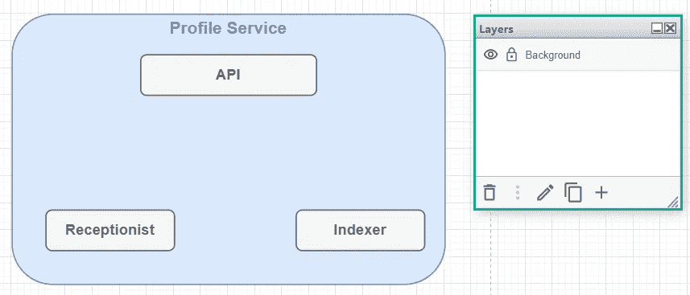

尽管该服务与其他软件交互——用户创建个人资料的网站、搜索和分析引擎、数据库等。—我们故意不在背景层显示它们。它们将出现在相应的场景层中，因为它们是逻辑的一部分，而不是 Profile Service 的内部组织。

模式的控制面板也应该放在背景层上。控制面板由显示和隐藏场景的按钮组成。按钮中的彩色箭头有助于区分方案中的故事。此外，您可以添加一个区域来显示场景描述:

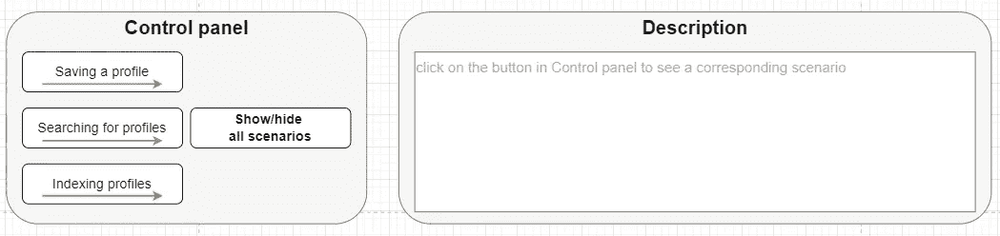

在此阶段，图表如下所示:

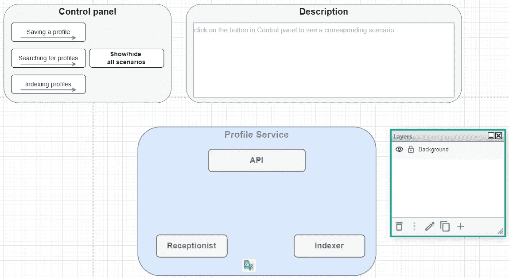

## **重要提示**

*   配置文件服务的组件现在显示为灰色。通过这种方式，我们强调他们现在是不活跃的。稍后，当它们出现在特定的场景中时，我们会适当地改变它们的颜色。
*   描述区将包含场景的算法，这样当读者打开其中一个时，他们可以立即阅读相应的故事。但是，有一个限制—该区域中只能显示一个场景。我们将在*添加交互性*一节中回到这个限制。

# 场景 1。将配置文件保存到数据库

为了创建*将概要文件保存到数据库*的层，我们需要从技术角度理解场景中发生了什么。

## **工作原理**

用户在网站上提交个人资料后:

1.  网站向相应的[消息队列](https://www.cloudamqp.com/blog/what-is-message-queuing.html#:~:text=A%20message%20queue%20is%20a,are%20waiting%20to%20be%20processed.&text=Another%20application%2C%20called%20a%20consumer,until%20the%20consumer%20retrieves%20them.)发送带有该简档的消息。消息队列存储概要文件的数据，直到负责的软件(消费者)有足够的资源来处理它。
2.  *接待员* —配置文件存储端队列的消费者—“监听”消息队列。当它有足够的容量时，它从队列中取出带有配置文件的消息。
3.  然后，接待员根据一组特定的规则验证该配置文件，并将该配置文件保存到数据库中。
4.  接待员还将带有配置文件 ID 的消息发送到另一个消息队列，该队列存储要索引的配置文件的 ID。

在图中，我们将在名为' *S1 的单独层上描述这个逻辑。将* *配置文件保存到数据库*。因此，在添加任何新元素之前，我们

1.  在*图层*面板中添加相应名称的新图层；
2.  锁定背景层(通过点击锁定标志，使其变成深灰色)，这样新元素就不会出现在它们不属于的地方；
3.  通过单击将焦点切换到新创建的级别:

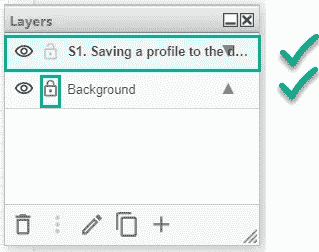

让我们看看要添加到该层的组件:

*   新元素—网站、数据库、两个消息队列
*   涉及的个人资料服务模块—接待员

现在，我们准备描绘“它是如何工作的”一节中描述的流程:

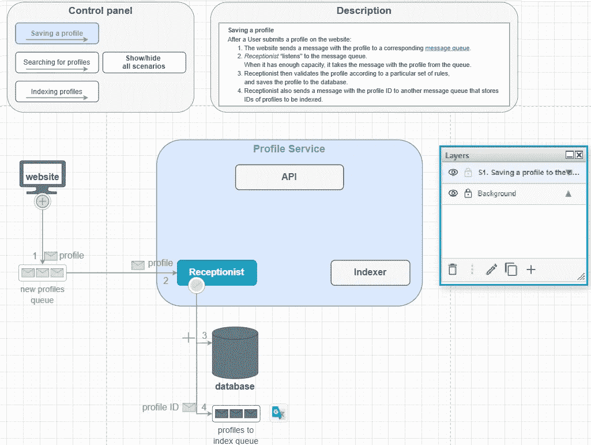

**重要提示**

*   不属于配置文件存储但与逻辑相关的元素为深灰色。
*   在这种情况下，接待员是配置文件存储的唯一活动模块；因此我们把它的颜色从灰色改成了蓝色。
*   在描述区，我们把算法放在场景中，这样读者就可以把图片上的箭头和它们的含义匹配起来。
*   控制面板上的按钮`Saving a profile`在该层为蓝色，表示该场景当前被选中显示。我们不能改变属于另一层(背景)的元素的颜色。我们需要从元素最初所属的层复制元素，将其粘贴到当前层，更改其颜色(样式)，并将其移动到原始按钮的顶部:

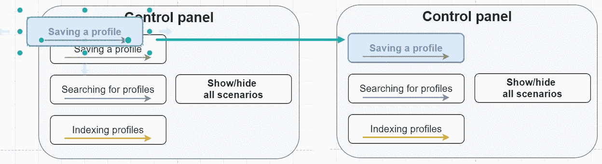

*   通常，一个微服务模块不能执行两个不同的活动——这与[单一责任原则](https://en.wikipedia.org/wiki/Single-responsibility_principle)相矛盾。在我们的例子中，接待员不从队列中获取消息，而是将数据保存到数据库中。对于第二个操作，它使用其他类别的配置文件服务。如果您需要一个更详细的图表，您可以在模式上描述所有的配置文件服务的类。但是对于我们的例子，我们将省略这些细节。
*   另一个技术场景隐藏在单词“*网站发送*”的后面。在这个场景中，至少有两个站点组件——客户端(前端)和 API(后端)——参与其中。但我们将这些元素合并成一个实体——“网站”——因为它们与业务逻辑或 Profile Service 的架构没有直接关系。

在这个阶段，为图表添加交互性还为时过早。首先，我们需要创建所有的层。然后我们可以在它们之间切换。

# 场景 2。索引配置文件

应用我们在第一个场景中使用的方法，我们将为第二个场景创建一个层—在搜索&分析引擎中*索引配置文件。*

如果您对这个概念不熟悉，那么数据索引是一种将数据存储在一个特殊位置的方法(*索引*),以便根据需要快速查找和检索。您可以将索引想象成具有复杂搜索机制的数据库。 [ElasticSearch](https://www.elastic.co/blog/what-is-an-elasticsearch-index) 是一个*搜索&分析引擎*，通常用于创建广泛的数据指数。

## **轮廓索引的工作原理**

1.  *索引器* —配置文件服务的模块，负责配置文件的索引—从索引队列中获取带有配置文件 ID 的消息。
2.  然后索引器向 *API* 发送一个请求，通过配置文件 ID 获取配置文件数据。
3.  API 从数据库中获取必要的数据。
    同样，API 使用其他 Profile Service 的类来实现，但我们不在这个规范级别。
4.  API 将配置文件数据返回给索引器。
5.  Indexer 将配置文件数据转换为适合索引的格式(例如 JSON ),并将格式化的配置文件保存到搜索和分析引擎(SAE)中的相应索引中。

在图上，我们将在一个名为' *S2 '的单独层上描述这个逻辑。索引轮廓*。因此，在添加任何新元素之前，我们

1.  在*图层*面板中添加相应名称的新图层；
2.  锁定背景和 S1。将 *剖面保存到数据库的*层(点击锁状标志，使其变成深灰色)；
3.  通过单击将焦点切换到新创建的级别:

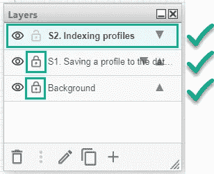

在该层上，我们有:

*   **新元素**—SAE 中的配置文件索引
*   **现有元素** —数据库，索引消息队列
*   **配置文件服务涉及的模块** — API、索引器

让我们把“概要文件的索引是如何工作的”一节中描述的流程放在图表上:

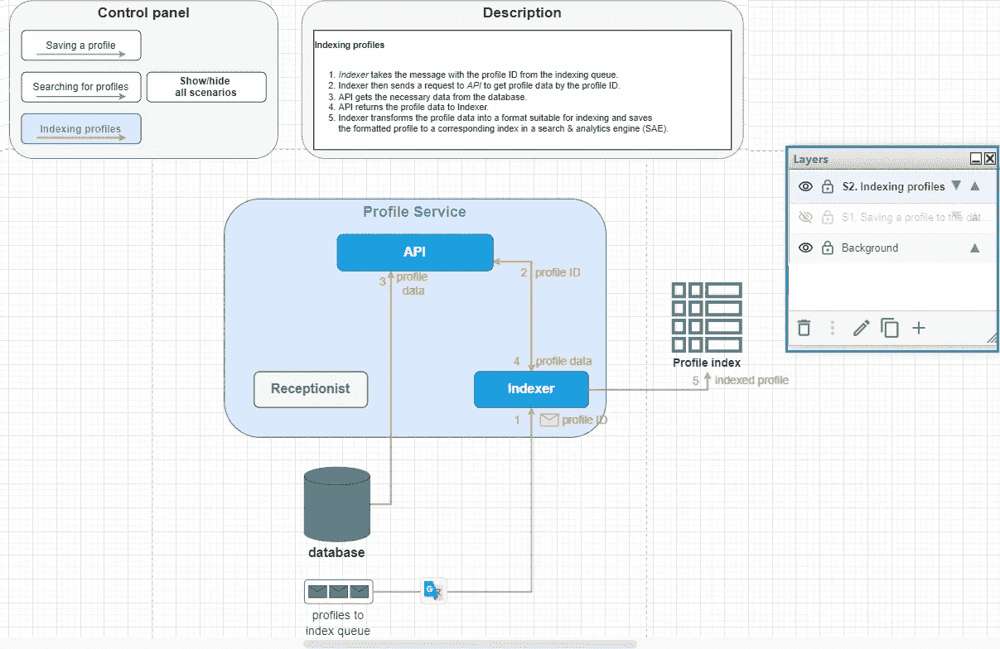

# 场景 3。搜索配置文件

对于剩下的场景，我们不会详细描述整个过程。方法是相同的，所以解释一下**它是如何工作的**并展示图表层的最终视图就足够了。

## **如何搜索个人资料**

搜索简档意味着用户只想得到那些满足特定标准的简档。为此，他们在网站上指定过滤器，并点击按钮**搜索档案**。然后

1.  网站向 *API* 发送请求，以根据指定的标准获取个人资料。
2.  API 从 SAE 中的概要文件索引中获取合适的概要文件。
3.  对于检索到的概要文件，API 从数据库中获取附加数据。
    如果配置文件索引存储了每个配置文件所需的所有参数，则可以省略该步骤。但是，例如，如果用户手动添加到概要文件中的技能信息没有存储在索引中，那么在这一步将从数据库中检索这些信息。
4.  API 向网站(向用户)返回结果配置文件集以及所有需要的信息。

在图表中，场景 3 如下所示:

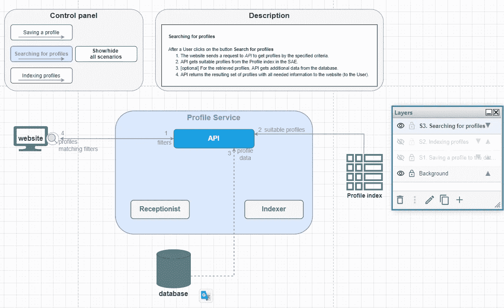

## **重要提示**

1.  可选步骤用虚线箭头表示。

# 添加交互性

至此，我们已经为模式创建了所有的层，读者已经可以使用层面板在它们之间切换了。那么，我们真的需要添加任何交互性吗？

如果一个图表被嵌入到一个 CMS 平台(例如 Confluence)的页面中，那么在这个模式的顶部隐藏菜单中找到图层面板是非常棘手的。使用交互式按钮来显示和隐藏某些场景似乎更加用户友好。此外，当它可点击时，一切都变得更好。

背景层是读者看到的第一层。因此，背景层的控制面板中的按钮应该响应点击并显示相应的场景。让我们为`Saving a profile` 按钮添加交互性。

1.  在图层面板中，点击 *S1。将配置文件保存到数据库*层；
2.  在图层面板的底部菜单中，点击钢笔图标打开图层进行编辑；
3.  复制层的 ID:

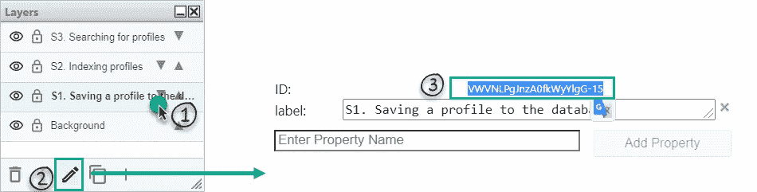

4.切换到图表的背景层:

*   锁定并隐藏所有其他图层( *S1* 、 *S2* 、*S3*)；
*   显示和解锁背景层；
*   将焦点设置在背景层上。

5.右击`Saving a profile` 按钮，在弹出菜单中选择**编辑链接…** :

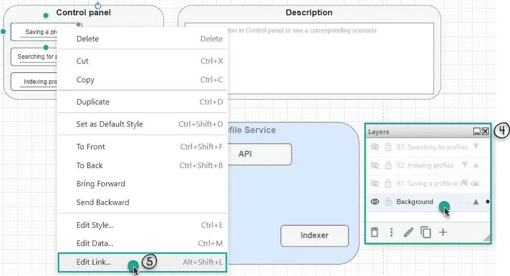

6.在第一个文本区域中，粘贴以下代码:

```
data:action/json,{“actions”:[{“toggle”: {“cells”: [“{layer_ID}”]}}]}
```

*   `{layer_ID}`就是 *S1。将配置文件保存到步骤 3 中复制的数据库*层的 ID。

7.点击按钮**应用**:

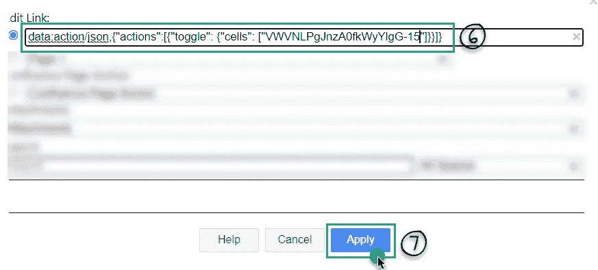

这段代码将显示读者点击背景层上的`Saving a profile` 按钮时的场景。

我们对其余场景使用相同的方法。将**切换**动作添加到所有三个场景按钮后，我们得到以下结果:

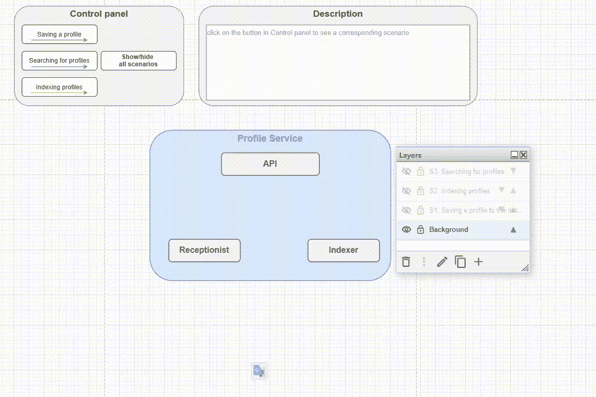

**重要提示**

1.  正如我们之前所说的，描述区域一次只能容纳一个场景。因此，将只显示所选算法中顶层的算法。

现在，读者可以打开特定的图层，但他们不能关闭图层。为了使读者能够隐藏场景，我们将在相应的按钮上添加隐藏动作。与在背景层添加的显示动作不同，隐藏动作应该在场景层添加。

我们来看一下`Saving a profile` 按钮。为了隐藏相应的场景，我们

1.  切换到 *S1。将概要文件保存到图表的数据库*层:

*   锁定并隐藏除背景和 *S1 以外的所有图层。将配置文件保存到数据库*；
*   显示并锁定背景层；
*   展示并解锁 *S1。将配置文件保存到数据库*层；
*   将焦点设置在背景层上:

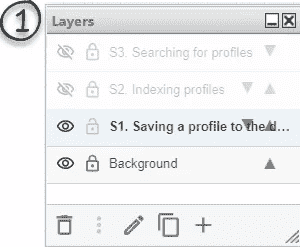

2.右击`Saving a profile` 按钮，在弹出菜单中选择**编辑链接…** 。

3.在第一个文本区域中，粘贴以下代码:

```
data:action/json,{“actions”:[{“hide”: {“cells”: [“{layer_ID}”]}}]}
```

*   `{layer_ID}`是 S1 的*。将配置文件保存到数据库*层的 ID。

4.点击**按钮应用**:

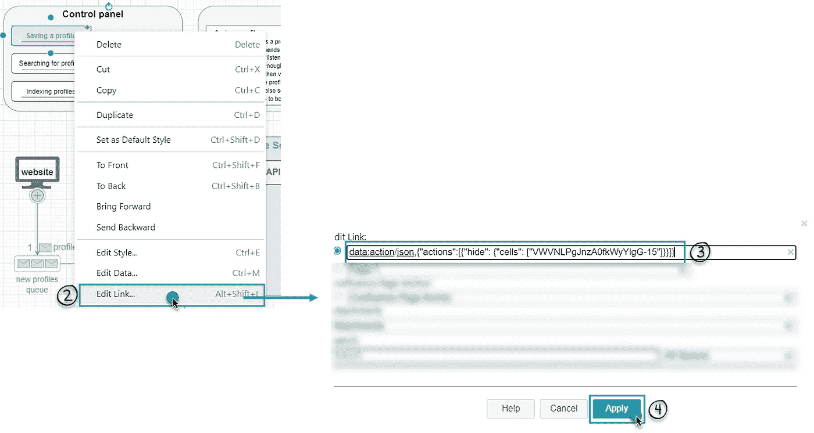

这段代码将隐藏读者点击 *S1 上的`Saving a profile` 按钮时的场景。将配置文件保存到数据库*层。

我们对其余场景使用相同的方法。将`hide` 动作添加到所有三个场景按钮后，我们得到以下结果:

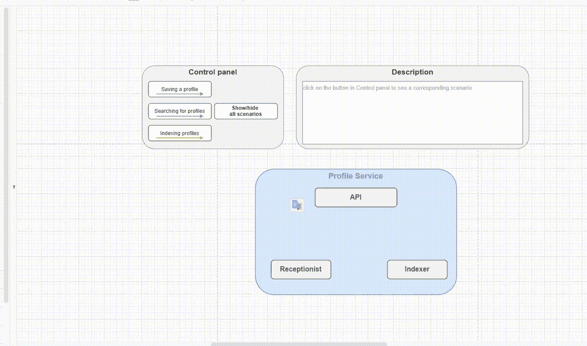

现在唯一的静态按钮是`Show/hide all scenarios`按钮。

为了给这个按钮添加交互性，我们

1.  切换到背景层；
2.  复制`Show/hide all scenarios` 按钮，将副本粘贴到原按钮附近。更改复制的按钮的颜色和字体，使其看起来像被单击过一样。
3.  右键点击复制按钮，在弹出菜单中选择**编辑数据…** ，复制按钮 ID:

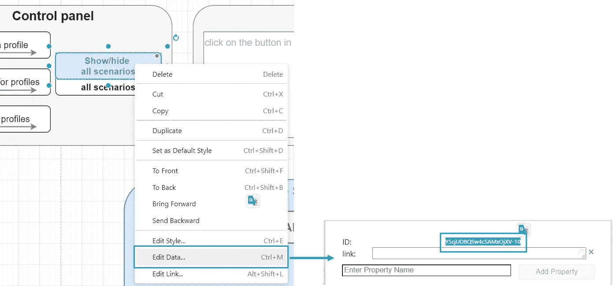

4.转到原始按钮，并向其添加以下切换操作:

```
data:action/json,{“actions”:[{“toggle”: 
{“cells”: [“{layer1_ID}”, “{layer2_ID}”, “layer3_ID”, “copiedButton_ID”]}}]}
```

*   `layer1_ID`*—*S1 的 ID。将配置文件保存到数据库*层*
*   *`layer2_ID`—*S2 的 ID。索引轮廓*层*
*   *`layer3_ID`*—*S3 的 ID。搜索轮廓*层**
*   **`copiedButton_ID` —步骤 3 中复制的按钮的 ID。**

**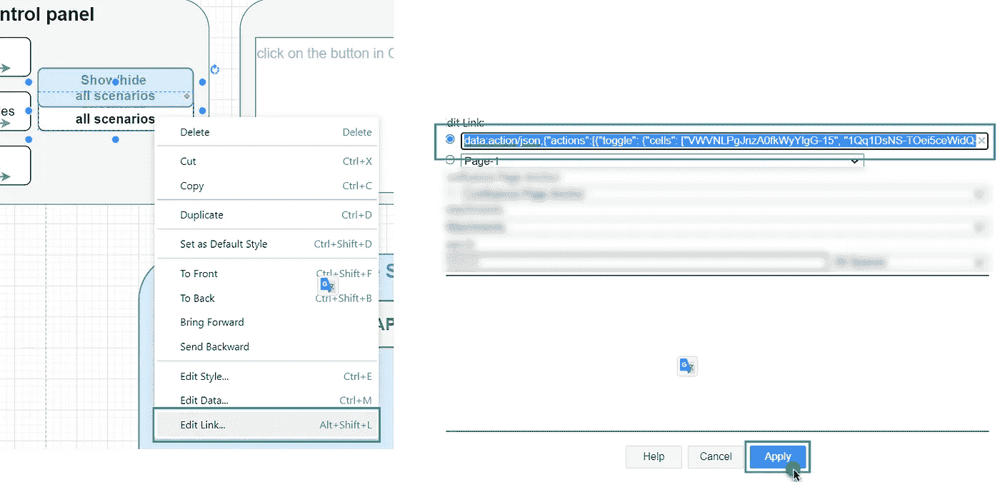**

**5.将相同的动作添加到复制的按钮中(**切换**动作根据元素的当前状态显示和隐藏元素——如果它们被显示，它将隐藏它们，反之亦然)。**

**6.将复制的按钮移动到原始按钮之上。**

**我们完成了——交互图准备好了:**

**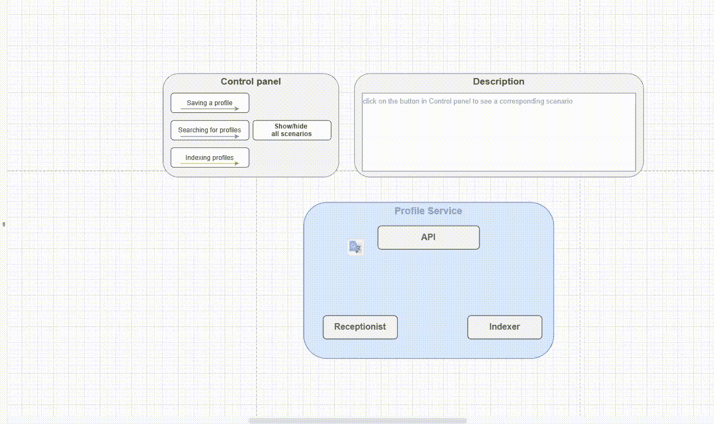**

# **最终建议**

**作为一个结论，我想补充一些建议，当你创建你自己的图时，这些建议可能会有所帮助。**

1.  ****仅描述模式上的基本场景**——为了向读者介绍新服务，选择那些覆盖服务主要组件并揭示服务主要目的的场景。如果您想描述更多的场景或者更深入地了解技术实现，您可以创建一个直升机视图模式和具有更深刻规范的附加图表。**
2.  **在箭头上标上**数字——箭头上的**数字有助于读者理解你想要讲述的故事。他们不会混淆找到一个场景的起点和终点。**

## ****有用的资源****

*   **[带有自定义链接和动作的交互图](https://drawio-app.com/interactive-diagrams-with-custom-links-and-actions/)**
*   **[使用自定义链接](https://drawio.freshdesk.com/support/solutions/articles/16000080137-work-with-custom-links)**

**在这个[要点](https://gist.github.com/rinagreen0902/8af72021ec48efc247b00c2f8daad856)中可以找到`ProfileService`文件的 XML 代码。**