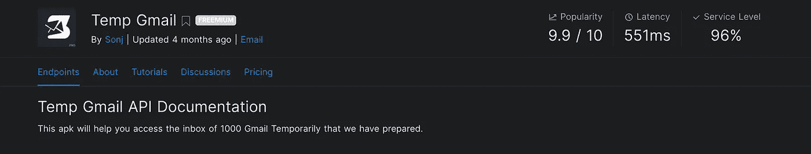

# 使用 Python 创建临时 Gmails 帐户

> 原文：<https://betterprogramming.pub/creating-temporary-gmails-accounts-with-python-9c200c52ebb7>

## 生成帐户—查看收件箱—阅读邮件—恢复 Gmail


作者图片

有时你会遇到一些广告和网站，你需要注册，但不完全信任。在这种情况下，临时邮件是最有效的解决方案。这些一次性电子邮件地址会取代您原来的电子邮件地址，并在一定的时间限制后过期。

有许多在线网站和服务可以帮助你创建一个临时电子邮件地址，但是，在本教程中，我将教你如何创建自己的临时 Gmail 地址，并使用 Python 在该地址接收电子邮件。

# 导入库

对于本教程，我们将只使用两个 python 库，分别是`re` 和`request`。如果您尚未安装它们，请使用以下命令进行安装:

```
pip3 install request
pip3 install re
```

然后导入它们:

```
import request
import re
```

# 生成 Gmail

第一步是通过 [Rapid API](https://rapidapi.com/mrsonj/api/temp-gmail/) 订阅`Temp-Gmail` API(完全免费)。



[**临时 Gmail API**](https://rapidapi.com/mrsonj/api/temp-gmail/)

订阅后，您将获得一个私钥，用于访问 API(通过`request`库)并生成新的 Gmail 地址。

下面的函数显示了如何生成一个新的 Gmail 地址，并打印出其地址和密码。

```
**Input Example**generate_gmail(ID=3)**Output Example**Gmail address: [lauraburm.rs.131.9.8.8@gmail.com](mailto:lauraburm.rs.131.9.8.8@gmail.com) 
Password: ***********R094ngJVIKMdXhfVCiMEEElE82Es
```

注意，输入“ID”只是一个整数，对应于 API 数据集中的一个特定 Gmail 地址(包含 1000 个 Gmail)。如果您更改“ID”的值，该功能将生成不同的 Gmail 地址。

# 检查收件箱

好了，现在我们已经创建了一个临时的 Gmail 地址，我们可以检查它的收件箱了。`check_inbox(gmail: str, password: str)`功能扫描新收到的邮件。

如果没有，它将返回收件箱为空的消息。

否则，打印出邮件`message_id`、发件人姓名、日期、时间和主题。我们将需要下一节中的`message_id`来读取邮件的正文。

```
**Input Example**MyGmail = "lauraburmr.s13198.8@gmail.com"
MyPassword = "***********QEQfM4cFqy2aie6sA6kPpxEMKGFNSQl4"check_inbox(gmail=MyGmail, password=MyPassword)**Output Example**Message ID: 17e5dd60676eed04 
From: Amir Ali Hashemi 
Date: 2022–01–15 20:03:22 
Subject: TEST EMAIL
```

# 阅读收件箱邮件

为了阅读邮件内容，我们应该有 Gmail 地址和`message_id`。如果我们向提供这两个值的 API 发送一个请求，API 将返回 HTML 格式的正文消息，并附上所有这些 HTML 标记。参见下面的例子

```
<div dir=”ltr”><div>This is a test mail sent by amir-tech</div><div><br></div></div>
```

因此，我们可以使用`re` 库来删除 HTML 标签并打印清理后的正文消息。

```
**Input Example**MyGmail = 'lauraburmr.s13198.8@gmail.com'
MessageID = '17e5dd60676eed04'read_message(gmail=MyGmail, message_id=MessageID)**Output Example**Body message: This is a test mail sent by amir-tech
```

# 恢复 Gmail

正如本教程开始时提到的，临时电子邮件在一定时间限制后过期(通常在 10 分钟后)。

这意味着密码将被重置！因此，如果您创建了一个 Gmail 地址，并希望在一段时间后重新访问它，您需要恢复它。

`restore_gmail(gmail: str)`功能获取您已经生成的 Gmail 地址，并为其设置新密码，以便重复使用。

```
**Input Example**restore_gmail(‘lauraburm.rs.131.9.8.8@gmail.com’)**Output Example**Gmail address: [lauraburm.rs.131.9.8.8@gmail.com](mailto:lauraburm.rs.131.9.8.8@gmail.com) 
Password: *******************m7qLnoGbR094ngJVIKMdXhfVCiMEEElE82Es
```

# 结论

总之，临时邮件不仅可以用于个人目的，还可以集成到编程项目中，带来更多的功能。

我个人使用这个 API 创建了一个临时 Gmail 电报机器人，并在日常生活中使用它来注册不可信的网站。

如果你对如何创建一个电报机器人感兴趣，我写了一篇关于它的文章。请随意查看:

[](https://amir-tech.medium.com/how-i-made-my-first-advanced-telegram-bot-using-python-72f1210c0900) [## 我如何用 python 制作我的第一个高级电报机器人

### 在这篇博客中，我将向你展示我如何用 python 构建了我的第一个高级电报机器人，并将其部署在 Heroku 上…

amir-tech.medium.com](https://amir-tech.medium.com/how-i-made-my-first-advanced-telegram-bot-using-python-72f1210c0900)