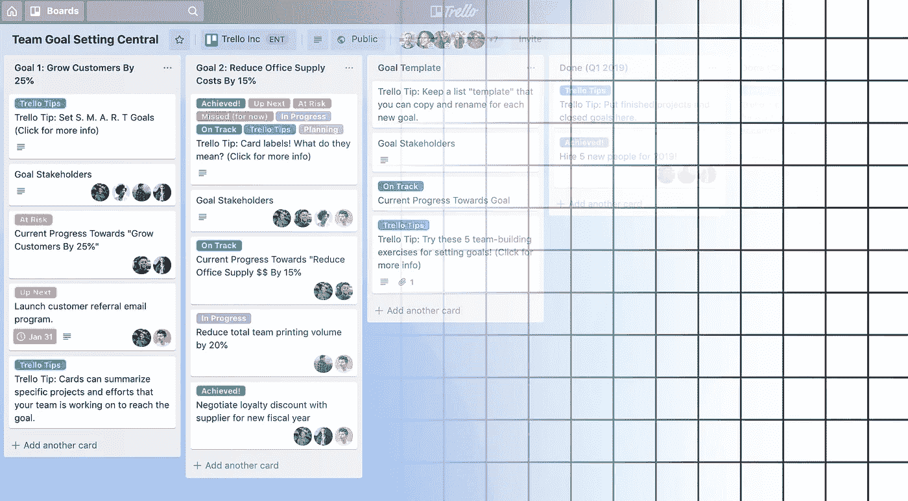
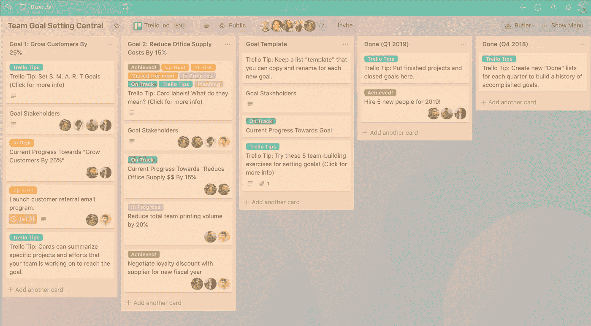
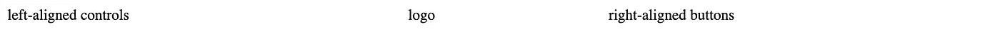
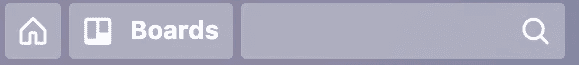
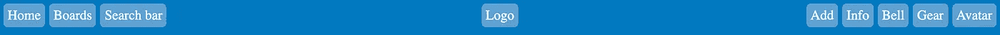
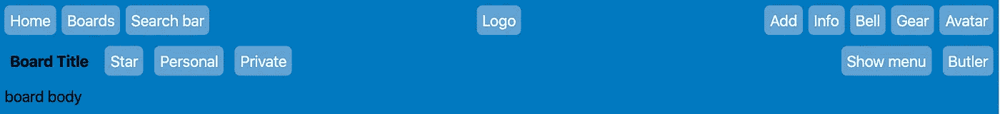
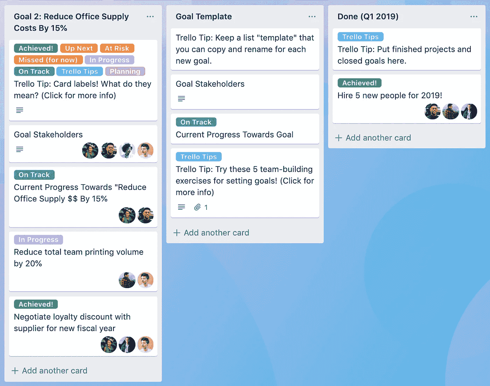
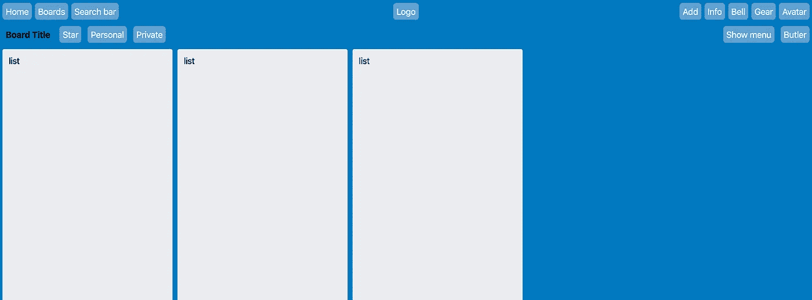
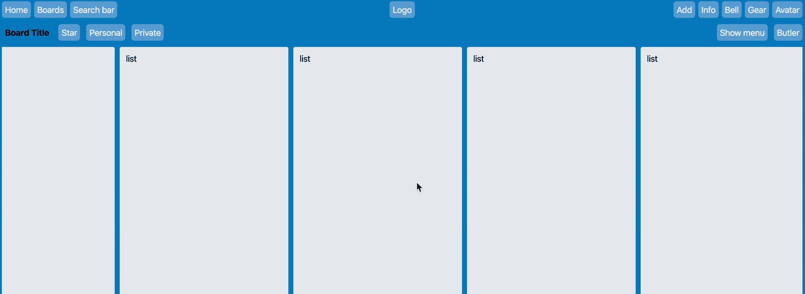
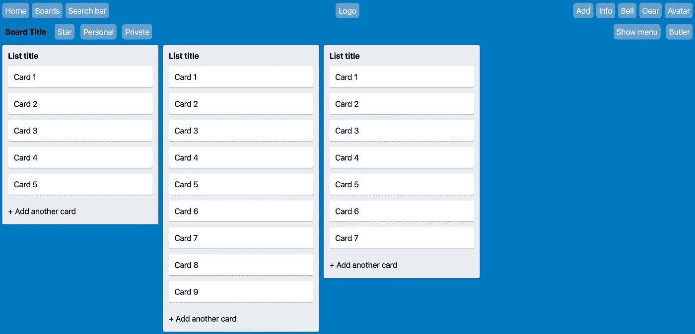

# 用 CSS 网格创建 Trello 的用户界面

> 原文：<https://betterprogramming.pub/creating-trellos-ui-with-css-grid-ed1fbfcd9448>

## 离开 flex 和 margins——让我们只使用 CSS Grid 来重建 Trello 的 UI



我喜欢 [CSS 网格](https://developer.mozilla.org/en-US/docs/Web/CSS/CSS_Grid_Layout)——你可以用它构建几乎任何你能想到的布局！今天我想解构 Trello 的主用户界面，并使用 CSS Grid 作为主要的基础组件来重建它。

通常，我使用 React 和[样式化组件](https://www.styled-components.com/)进行开发，但是为了使本指南尽可能的可移植，我将只使用普通的 div 和 CSS 类！

# 分解界面

首先，让我们将主用户界面的截图分解成构成整体结构的主要部分。让我们从占据整个视口的`div`开始:

在最高级别，我们有两个主要部分:顶层标题*和板部分*。**

**

*标题部分以绿色突出显示，电路板部分以橙色突出显示。*

# *标题*

*让我们从标题开始。它有三个不同的部分:左对齐的控件、中间的徽标和右边的右对齐按钮。*

**

*为了设置这个`div`，我们将使用以下属性:*

```
*.header {
  display: grid;
  grid-template-columns: 2fr 1fr 2fr;
}*
```

*首先，要使用 CSS 网格，我们需要使用`display: grid;`——这允许所有其他与网格相关的 CSS 属性生效。*

*我们正在使用的下一个属性是`grid-template-columns`。该属性允许我们列出将用作网格列定义的值。因为我们已经提供了三个值，所以将有三列。*

*一个棘手的问题是，我们试图让标志总是在中心。我们将通过使用`fr`单元来完成这个任务。代表*小数单位*，表示剩余空间。*

*因此，因为我们有三列，一列在 2fr，另一列在 1fr，另一列在 2fr，所以总共有五个部分，其中第一列占 2/5，第二列占 1/5，第三列占 2/5。*

*为什么这有助于我们将徽标放在中间，是因为左半部分将始终等于右半部分。我们也可以很容易地使所有三列的宽度相同，但标志很小，所以我们会给侧面部分更多的空间。*

*看起来是这样的:*

**

*差不多了，但是徽标没有居中，右对齐的按钮也没有完全右对齐。我们将添加以下内容:*

```
*.header .logo {
  justify-self: center;
}.header .right-aligned {
  justify-self: flex-end;
}*
```

*在 CSS 网格中，`justify-items`和`justify-self`属性指的是水平对齐，`align-items`和`align-self`属性指的是垂直对齐。*

*加入一些颜色来帮助可视化块元素的位置，我们现在有:*

**

*越来越近了！接下来是按钮。*

# *标题按钮*

*页眉中左对齐的控件如下所示:*

**

*一个主页按钮，一个打开所有面板的按钮，和一个搜索栏。*

*要使用 CSS Grid 实现这一点，我们将使用以下代码:*

```
*.header .left-aligned {
  display: grid;
  grid-gap: 5px;
  grid-template-columns: repeat(3, auto);
}*
```

*同样，我们使用`grid-template-columns`来定义三列——三个控件各一列。*

*然而这一次，因为我只是希望它们是`auto`，所以我可以只使用`repeat(3, auto)`来生成三个设置为`auto`的列。为了分隔网格项目，我们将使用`grid-gap`，而不是使用边距。*

*为了更好地测量，我们还将标题文本颜色改为白色，并为这些`div`添加圆角:*

**

*这主要是一个布局练习，所以我们将只使用一个文本占位符。*

*不需要边距！我们将对徽标和右对齐按钮使用类似的方法:*

**

*页眉布局完成！*

# *板子的头部*

*我们需要解决的下一个问题是董事会。它有一个 header 和一个“body”部分，所以让我们把这个`div`分成两行:*

```
*.board {
  display: grid;
  grid-template-rows: max-content auto;
}*
```

*我们想在第一行使用`max-content`,因为我们不需要它比其内容的高度更大，我们将在 body 部分使用`auto`,让它占据剩余的空间。*

*主标题是一种类似的方法，所以让我们切入正题，把纸板标题放在一起(让我们也开始使用 Trello 的字体！):*

**

*这一次的主要区别是我们不必担心将徽标居中，所以我们使用了以下内容:*

```
*.board-header {
  display: grid;
  grid-template-columns: repeat(2, auto);
}.board-header .left {
  display: grid;
  grid-template-columns: repeat(4, max-content);
  grid-gap: 10px;
  justify-self: left;
}.board-header .right {
  display: grid;
  grid-template-columns: repeat(2, max-content);
  grid-gap: 10px;
  justify-self: right;
}*
```

*整个表头一分为二，左段左对齐，右段右对齐。*

# *董事会*

*白板是整个用户界面中最有趣的部分。它由不确定数量的列组成，由一个小间隙隔开。*

**

*每个列表都是 272px 宽，它们之间的差距是 8px。我们将使用以下内容来布置列表:*

```
*.board-lists {
  display: grid;
  grid-auto-columns: 272px;
  grid-auto-flow: column;
  grid-gap: 8px;
}*
```

*尽管这似乎是用户界面中最复杂的部分，但使用 CSS Grid 非常简单！`grid-auto-columns`自动创建相同宽度的列，传递的值是 272px。*

*`grid-auto-flow = column`强制网格保持为列，从不环绕形成二维网格。最后，`grid-gap`代替边距或填充来分隔列。*

**

*快到终点了！*

*我们的原型中还没有的另一件事是列表的水平滚动。我们将使用`overflow: scroll;`:*

**

*如果没有这个，网格会延伸到屏幕的右侧。*

# *名单*

*列表是一系列垂直堆叠的卡片块，顶部是标题，底部是“+添加另一张卡片”点击区域。为此，我们将使用以下内容:*

```
*.board-list {
  display: grid;
  grid-auto-rows: max-content;
  grid-gap: 10px;
  padding: 10px;
}*
```

*很像`grid-auto-columns`，`grid-auto-rows`用特定高度的行组成网格。选择`max-content`将行设置为与其内容一样大。卡片之间有 10 像素的差距——同样，不需要边距！*

**

*就这样(在卡片上加上一点阴影和填充，在列表标题上加粗)，我们完成了整个布局！*

# *最终结果比较*