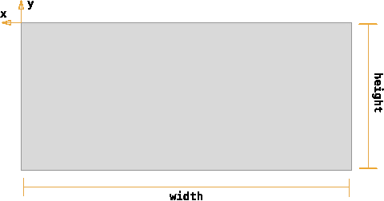
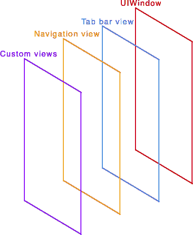
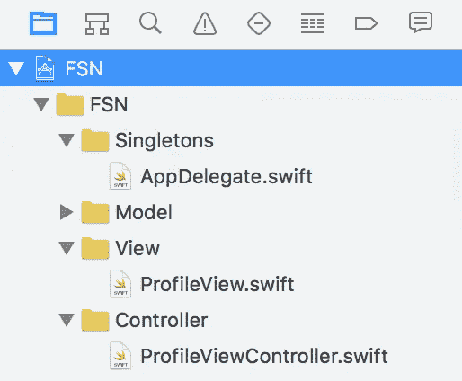
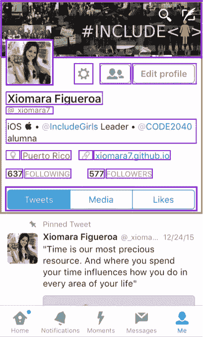
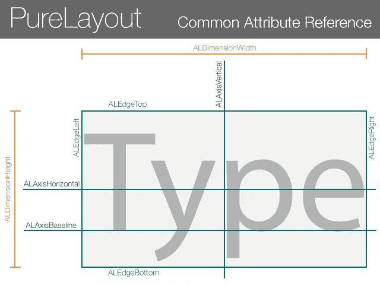
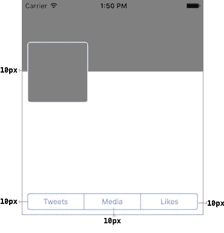

# 在 Swift 中以编程方式创建 UIViews

> 原文：<https://betterprogramming.pub/creating-uiviews-programmatically-in-swift-55f5d14502ae>

## 使用视图约束，使用 PureLayout


哈尔·盖特伍德在 [Unsplash](https://unsplash.com/) 上拍摄的照片

# 期待什么

*   了解 iOS 屏幕
*   视图层次结构
*   何时以编程方式构建视图
*   如何组织你的代码(MVC 模式)
*   构建自定义类(UIView)
*   一个例子是 Twitter iOS 应用程序
*   ！海量视图控制器
*   设置我们的约束(PureLayout)

# 了解 iOS 屏幕

任何 iOS 应用都有很多视图。这些视图需要指定四个值来显示: **x，y，宽度，高度**。



构建这些视图有三种不同的方式: [**故事板**](https://developer.apple.com/library/ios/recipes/xcode_help-IB_storyboard/Chapters/AboutStoryboards.html) ， [**笔尖** **文件**](https://developer.apple.com/library/ios/documentation/Cocoa/Conceptual/LoadingResources/CocoaNibs/CocoaNibs.html) 和**程序化**。

iOS sdk (UIKit)中有一个框架，包括一组标准子类，从简单的按钮到复杂的表格，还有许多其他视图对象。例如， [UILabel](https://developer.apple.com/library/ios/documentation/UIKit/Reference/UILabel_Class/index.html#//apple_ref/occ/cl/UILabel) 对象绘制文本字符串，而 [UIImageView](https://developer.apple.com/library/ios/documentation/UIKit/Reference/UIImageView_Class/index.html#//apple_ref/occ/cl/UIImageView) 对象绘制图像。

视图可以嵌入其他视图，并创建复杂的可视化层次结构。这在被嵌入的视图(称为**子视图**)和进行嵌入的父视图(称为**超级视图**)之间创建了父子关系。



视图层次结构

# 视图层次结构

视图的组织既影响应用程序的视觉外观，也影响应用程序如何响应变化和事件。例如，视图层次结构中的父子关系决定了哪些对象可以处理特定的触摸事件。类似地，父子关系定义了每个视图如何响应界面方向的变化。

# 何时以编程方式构建视图

## 当您有以下情况时，使用自定义代码通常是个好主意:

*   动态布局
*   具有效果、圆角、阴影等的视图。
*   任何使用故事板很复杂的情况。

# 如何组织你的代码(MVC 模式)

模型-视图-控制器可能是最常用的设计模式。当开始 iOS 开发时，经常会遇到*大量视图控制器问题*:视图控制器经常变得太大，包含各种功能，变得很难修改或重构。

通过遵循这种模式，我们可以确保项目中每个类都是控制器、模型或视图。这将使我们更容易以编程方式创建所有视图，而不会创建一个意大利面条怪物。显然，我们可以有其他组和类，但应用程序的核心包含在这三个类别中。



## 入门指南

当开始一个新项目时，Xcode 用故事板初始化它。为了创建我们的自定义视图，我们需要放弃故事板。

接下来，创建两个文件: *ProfileView* 作为 **View** 类别下的 **UIView** 类，以及 *ProfileViewController* 作为 **UIViewController** 类在 **Controller** 类别下。

# 自动布局

自动布局将确定屏幕中每个视图的**框架**，因此每个视图都应该有一个**约束**来帮助确定其**宽度**、**高度**、 **x** 和 **y** 位置。从头开始编写自动布局代码并不容易——pure Layout 为自动布局提供了一个功能齐全且开发人员友好的界面。

在我们继续之前，让我们将 PureLayout 添加到我们的项目中。将 PureLayout 添加到您的 Swift 项目中有多种方式。我使用的是 [cocoapods](https://cocoapods.org) ，一个用于 Swift 和 Objective-C 项目的依赖管理器。它需要一个名为 Podfile 的文件，如下所示:

接下来运行下面的命令来安装依赖项，在本例中是 PureLayout:

```
pod install
```

该命令将创建一个以 **.xcworkspace 结尾的新项目文件。**现在，这是我们将在 Xcode 中打开的文件，以继续开发应用程序。

# 构建自定义类

在我们的 *ProfileView.swift* 文件中，您将看到 UIView 类实现的模板，如下所示:

```
import UIKitclass ProfileView: UIView {}
```

我们需要初始化我们的类。初始化器在 Swift 中很重要，如果你愿意，你可以在这里读到更多。现在你需要知道的是有主初始化器，它们负责初始化一个类的所有属性。下面是一个典型实施的示例:

由于我们是在 **UIView** 子类中添加约束，我们应该覆盖***update constraints****方法。在对象的生存期内，可以多次调用此方法。为了避免重复的约束，你应该保留一个标志(***shouldsetuptraints***)，让你知道你已经完成了初始约束设置。我们必须在实施结束时调用**超级**。(如果在更改约束之前调用 super，可能会崩溃)*

## *例子*

*假设我们想要重新创建 Twitter iOS 应用程序的侧面视图。在下图中，你可以看到一个标题视图，有横幅图像，个人资料图像，用户信息等。屏幕底部是包含所有推文的表格和一个标签栏。所有标有紫色的元素都是 UIView 的子类(UIButtons、UILabels、UIImageViews 等)。我们将重点放在标题视图上，在下图中用橙色框起来。*

**

*更具体地说，我们将取出下图中的这三个元素来说明我们的示例。横幅和个人资料图像为`UIImageViews` **、**，按钮部分为`UISegmentedControl`。*

**

*首先，我们需要在我们的`ProfileView` 类中声明三个对象:`bannerView`、`profileView` 和`segmentedControl`。*

*然后，在 ***init*** :方法中，我们为每个对象设置属性:背景颜色、边框颜色，以及基本上整个外观设置。每个对象都需要首先初始化。用等于零的帧初始化它们—自动布局稍后会处理它。*

*为了将每个对象的子视图添加到我们的视图(ProfileView)中，我们使用了`addSubview:`方法。这将指定的视图放在其他视图的顶部。整个事情看起来会是这样的:*

# *设置我们的约束(PureLayout)*

## *布局约束*

*布局约束是对视图之间的属性和关系的描述。`**NSLayoutConstraint**` 类用于创建约束。*

*有几种类型的约束:*

*   *尺寸限制— *图像宽度应为 200 像素**
*   *对齐限制— *标签应在屏幕上垂直居中**
*   *间距约束— *两个对象之间的间距**

## *属性*

*PureLayout 定义了用于创建自动布局约束的视图属性。其中一些如下图所示:*

**

*来自[https://github.com/PureLayout/PureLayout](https://github.com/PureLayout/PureLayout)*

## *开始钉东西！*

*我们基本上在屏幕上扔了三个矩形。现在我们需要将它们排列成我们的 Twitter 个人资料:*

**

# *！海量视图控制器*

*我们已经完成了我们的 ProfileView，现在我们从我们的控制器(`ProfileViewController`)调用它。Xcode 已经用`viewDidLoad:`方法创建了一个控制器模板。这是在呈现控制器之前被调用一次的方法。此时，我们创建了一个`profileView,`的实例，如下所示。应该就是这样！*

*(*免责声明* : *此处显示的代码主要用于说明自动布局的目的。您可能需要在其他地方添加其他行来完成一个全功能项目)**

*   *[*全栈之夜*](http://www.fullstacknights.com/fsn/videos/2016/03/29/fullstack-nights-v3-videos/) *西班牙语视频。**