# 使用 Truffle for VS 代码扩展创建 Web3 项目

> 原文：<https://betterprogramming.pub/creating-web3-projects-with-the-truffle-for-vs-code-extension-6e784070a5f3>

## 深入探究项目成功的优秀工具

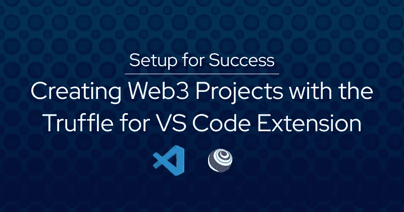

作者图片

# 介绍

使用任何新技术都可能是既令人兴奋又令人恐惧的经历。一方面，你可能对使用一套新工具进行构建感到兴奋。但是，知道如何在所有可用的工具中选择正确的工具也是非常困难的。

无论你是刚开始学习 Web3 还是有经验的构建者，你都会很好地理解这种令人生畏的体验。开发人员需要了解特定于 Web3 的概念，如区块链和智能合约，以及开发这些概念的全新工具。然而，开发人员可以通过正确的步骤和适当的工具相对快速有效地构建 Web3 技术。

本文将简要概述创建 Web3 智能合约所需的步骤。与此同时，我们将了解如何通过使用您已经知道的工具(Visual Studio Code (VS Code))和 VS 代码扩展的 [Truffle 来编写、部署和测试智能合约，从而成功地导航这些步骤。](https://trufflesuite.com/docs/vscode-ext/)

# 选择正确的工具

在学习了区块链和以太坊的基础之后，你可能会受到启发，开始应用你的知识来构建你自己的 Web3 项目。在这个过程中，您可能已经从各种项目和教程中收集了一长串工具。不要迷失在这个列表中，让我们专注于探索通过使用这些工具之一(用于 VS 代码扩展的 Truffle)来启动新的智能合约项目所需的步骤，并探索它如何帮助您的智能合约的创建、调试、部署、安全性和其他开发领域。

# 项目创建

首先，让我们看看如何创建您的初始项目。

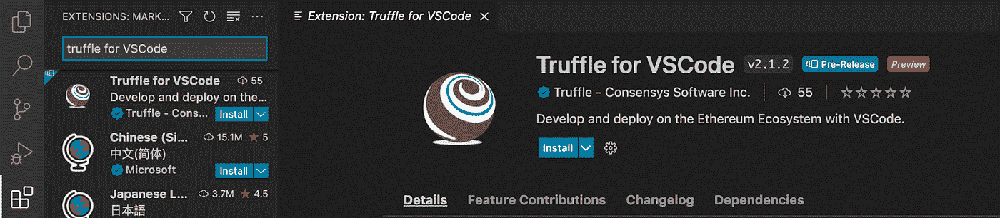

VS 代码扩展的块菌

## VS 代码扩展的块菌

一个成功的项目通常从良好的设置和文件结构开始。由于没有正确设置项目会导致许多问题，因此确保文件结构在命名上一致且直观是至关重要的。

使用 Truffle for VS 代码扩展的一个很好的好处是，你可以从头开始快速构建一个具有正确结构的新项目，要么通过创建一个具有模板化文件结构和起始文件的新文件夹，要么通过简单地从 [Truffle Box](https://trufflesuite.com/boxes/) 创建一个项目。

让我们开始一个新项目，看看一个合适的文件结构是什么样的。首先，你需要安装 VS 代码扩展的块菌。为了获得详细的安装说明和更多关于它的功能的信息，[看看这篇文章](https://trufflesuite.com/blog/build-on-web3-with-truffle-vs-code-extension/#installing-the-vs-code-extension-for-truffle)。

一旦安装了扩展，按`SHIFT + CTRL` / `CMD + P`键打开命令面板。接下来，输入命令`Truffle New Solidity Project`并选择选项“创建基本项目”选择项目路径后，将创建一个具有正确文件结构的新项目。

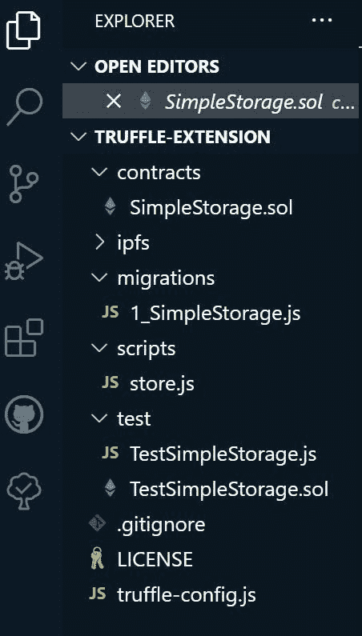

正确的文件结构

如您所见，模板项目有一个包含智能合同的文件夹，另一个用于迁移到区块链环境，第三个用于脚本，还有一个用于测试的文件夹。该项目还包括一个`.gitignore`，用于存储您不想推送到存储库的信息、一个开源许可协议和一个`truffle-config.js`文件。

这种文件结构保持一切整洁有序，因此从一个文件导入到另一个文件或运行 [Truffle 命令](https://trufflesuite.com/docs/truffle/reference/truffle-commands/)很简单，不容易出错。

# 调试您的合同

不幸的是，我们并不是生活在一个代码没有错误的完美世界里。并且在构建您的智能合约时，您会遇到以前可能没有见过的错误消息。如果您总是需要参考像 [Etherscan](https://etherscan.io/) 这样的区块链资源管理器来获取信息，调试这些事务可能会很棘手。

一个解决方案是通过 Truffle for VS 代码扩展使用[调试事务](https://trufflesuite.com/docs/vscode-ext/debugging-smart-contracts/)特性。要使用调试器，请再次打开命令面板并键入 Truffle Debug Transaction。从那里，您可以查看事务消息并一步一步地处理它们。这对开发人员很重要，因为某个交易中的错误通常会导致下一个交易尝试失败(就像特定钱包中的资金不可用)。

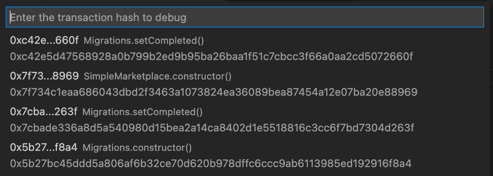

在键入以下命令后，选择要调试的事务:Truffle 处女作事务

选择事务后，调试器将变为可用。在这里，您可以执行典型的调试功能，如单步执行/单步执行/单步执行、查看调用堆栈、监视窗口等。

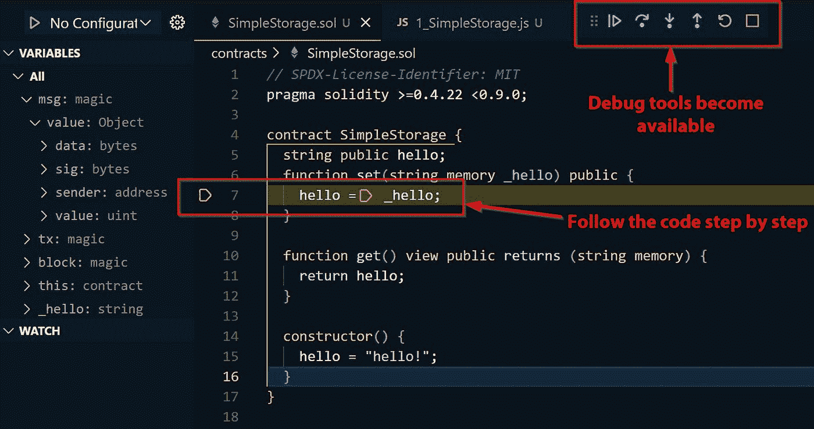

选择事务后，调试工具变得可用

# 部署您的合同

有了有效的智能合同后，就该部署了。这里有三种方法。最佳实践是首先部署到本地区块链实例进行测试，比如 [Ganache](https://trufflesuite.com/docs/ganache/) 。之后，您会希望将它部署到一个 testnet 中，以验证它在真实环境中是否正常工作。然后，只有在所有测试完成之后，您才能将您的项目发布到 mainnet。所有这些测试将帮助您在智能合约中避免代价高昂且有时不可逆转的错误。

在 Truffle 扩展中，您可以部署到所有三种类型的网络，而不需要离开 VS 代码。您可以通过右键单击。SOL 文件并选择“部署合同”

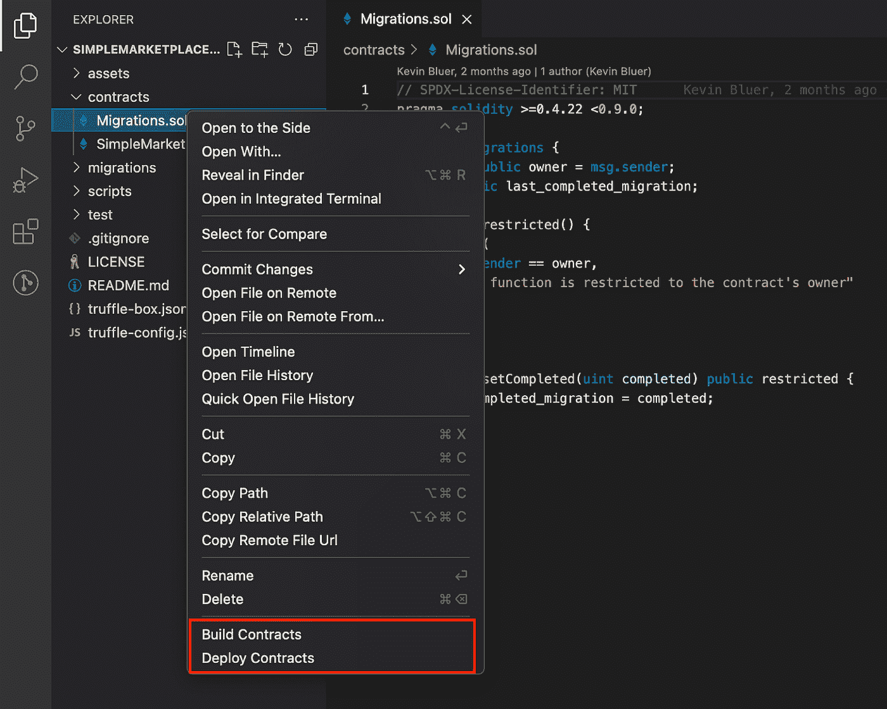

右键单击. sol 文件后，轻松构建或部署智能合约

本地区块链:使用 Ganache 服务是一种简单的方法，可以创建一个具有多个钱包地址的本地区块链，并测试您可以用来与智能合约交互的 Eth。您可以在扩展的 VS 代码中的 Truffle-Networks 窗格下创建一个新的 Ganache 网络。创建网络后，您可以根据需要启动/停止和重启服务器。

轻松创建或连接到现有网络

测试网 **:** 测试网被设计成以类似以太坊主网的方式工作，但是它们没有直接部署到主网的财务成本和风险。使用 testnet 是一个很好的方法，可以更好地理解一旦部署到 mainnet 上，您的契约将如何工作。

有几个以太坊测试网可供选择，它们都可以通过使用一个节点提供者服务来连接，比如 [Infura](https://infura.io/) 。在扩展中设置您的 Infura 帐户后，您可以访问您现有的 Infura 项目，或者您可以轻松地创建新的项目。

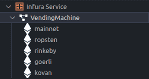

要部署到的网络选项

Mainnet **:** 如果测试网就像是智能合同代码的登台服务器，那么部署到 Mainnet 就像是将代码推向生产。测试智能合约代码的重要性怎么强调都不为过。如果有任何错误或漏洞，它们都可能并且将会被攻击者利用。这些错误对组织和用户来说都是昂贵的。

让我们看看在部署到 mainnet 之前，如何使用正确的工具和最佳实践来保护我们的合同。

# 保护您的合同

在开发智能合约时，安全性应该始终是一个主要的优先事项。[黑客似乎定期损失数百万美元。作为一名 Web3 开发人员，你需要不断了解最新的](https://www.washingtonpost.com/business/expensive-crypto-hacks-are-becoming-part-of-web3-life/2022/04/01/4491fff0-b185-11ec-9dbd-0d4609d44c1c_story.html)[安全最佳实践](https://consensys.github.io/smart-contract-best-practices/)。

通过像 [Diligence Fuzzing](https://consensys.net/diligence/fuzzing/) 或它们的开源替代品 [Scribble](https://consensys.net/diligence/scribble/) 这样的工具运行你的智能合约，可以帮助你发现许多常见的安全漏洞。然而，如果您的项目旨在处理数百万用户的资金，最好的做法是专业地审核您的智能合同。

尽管如此，开发人员在构建他们的项目时应该意识到常见的漏洞。Web3 中一个常见的攻击媒介是黑客使用机器人扫描部署的合同，寻找潜在的漏洞和秘密信息，如测试代码中留下的钱包私钥。使用像 [Truffle Dashboard](https://trufflesuite.com/docs/truffle/getting-started/using-the-truffle-dashboard/) 这样的工具是避免因开发错误而损失资金和资产的一种方法。

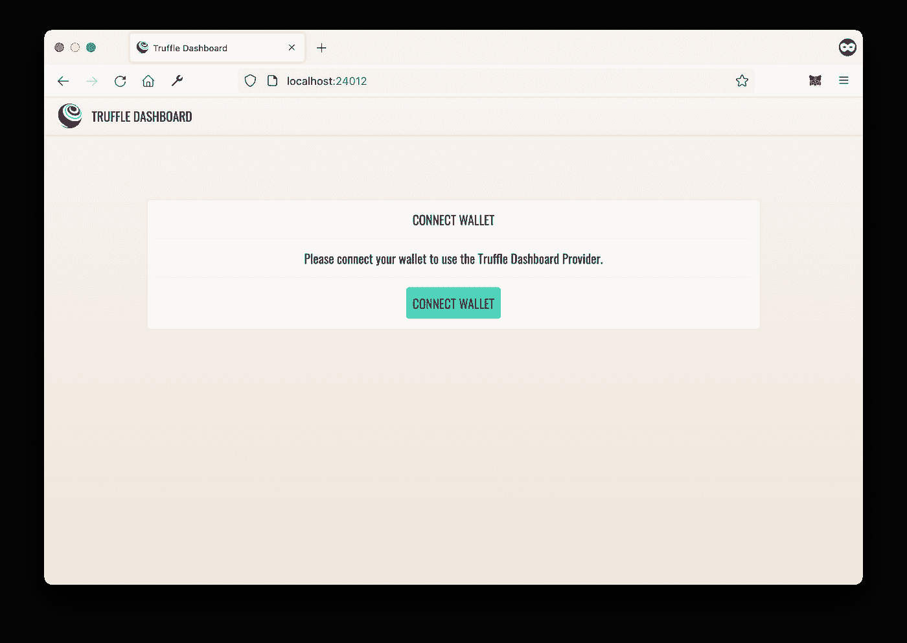

将您的 MetaMask 钱包直接连接到 Truffle 仪表板

Truffle 仪表板消除了开发人员在 Solidity 项目的配置文件中存储私钥的需要。开发人员可以进行一次性设置，将他们的元掩码钱包连接到浏览器上本地托管的仪表板。完成这些之后，使用 dashboard 关键字而不是将键复制并粘贴到配置文件中就足够了。它也兼容其他开发框架，比如 Hardhat。

要使用 Truffle 仪表板，请安装最新版本的 Truffle[并在您的终端中输入命令`truffle dashboard`。现在，任何需要您的私钥的操作都可以通过仪表板进行。例如，要部署您的合同，确保在您的`truffle-config.js`文件中指定了正确的端口，然后右键单击您的合同以部署它并选择`dashboard: 24012`。默认为`24012`。](https://trufflesuite.com/docs/truffle/quickstart/)

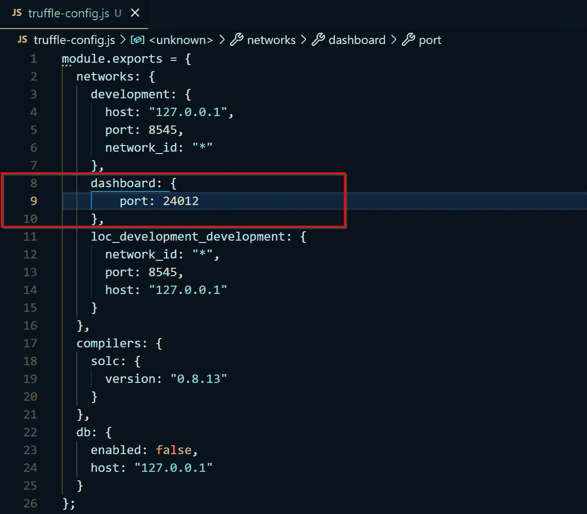

确保在 truffle-config.js 文件中选择了正确的端口

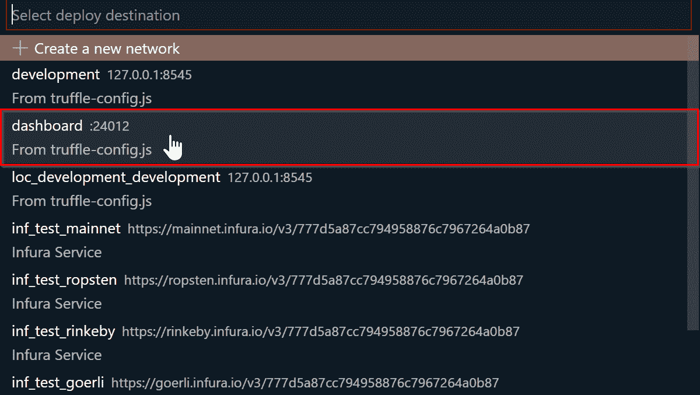

部署合同时选择仪表板选项

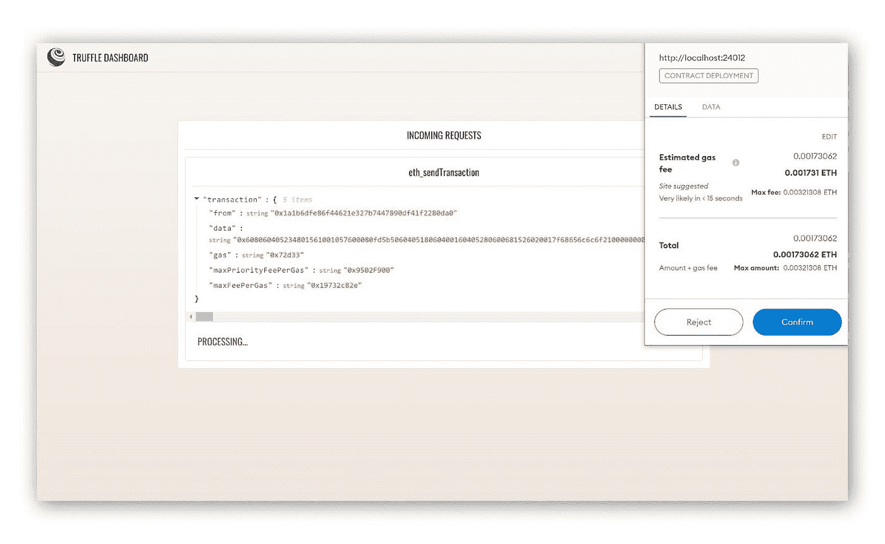

所有交易都通过 Truffle Dashboard 进行，因此您不再需要共享您的私钥！

# 正确的工具，正确的前进方向

构建一个 Web3 项目并不复杂。有了正确的工具，前进的道路变得清晰。有许多方法可以改进您的工作流程，但是让 Truffle for VS 代码扩展为您所用将有助于您在您可能已经熟悉的环境中高效地工作。这个领域发展非常快，新的工具一直在被创造出来。因此，希望这篇文章能让你在浏览 Web3 工具栈时，有一种简单的方法来简化开发过程。