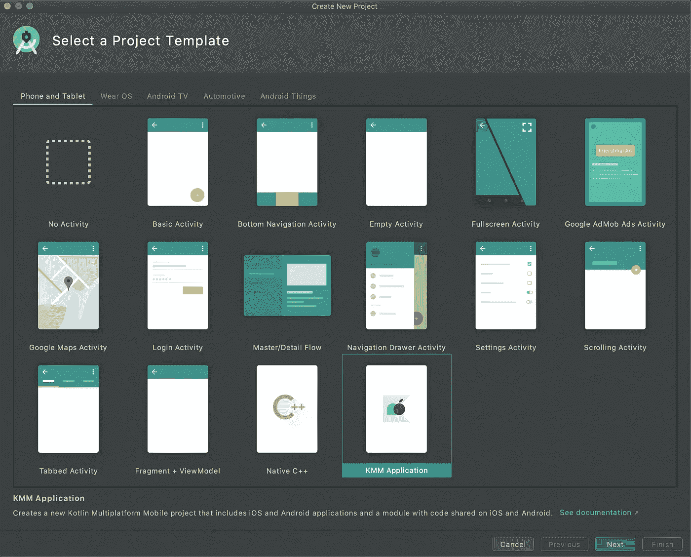
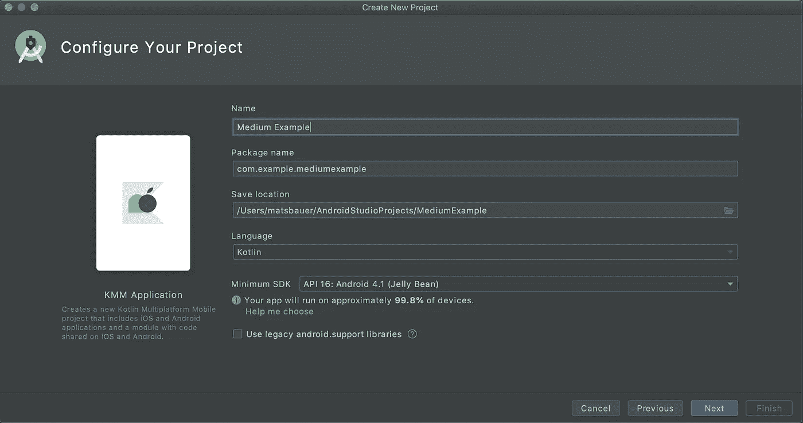
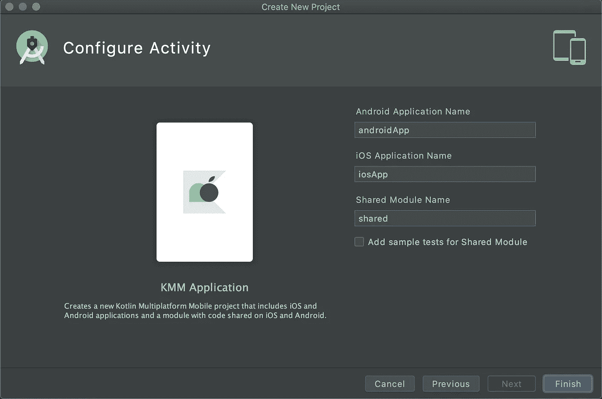
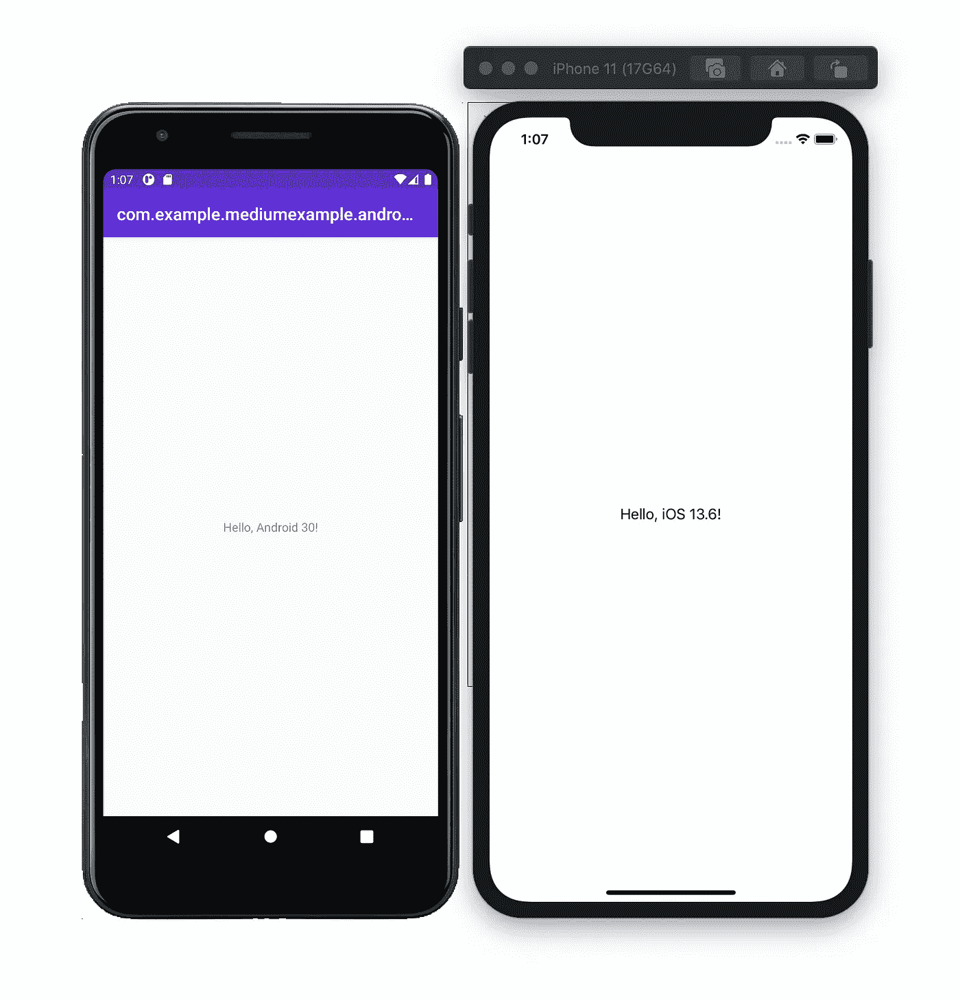

# 在 10 分钟内创建您的第一个 Kotlin 多平台移动应用

> 原文：<https://betterprogramming.pub/creating-your-first-kotlin-multiplatform-mobile-application-in-10-minutes-5e99b1c4ef6e>

## iOS 上的 Kotlin？让我们来看看

由[罗恩·麦克伦尼](https://unsplash.com/@ronmcclenny?utm_source=medium&utm_medium=referral)在 [Unsplash](https://unsplash.com?utm_source=medium&utm_medium=referral) 上拍摄的照片。

你接到过多少以“iOS 和 Android 开发的一致性”为主题的工程电话？有多少错误是因为在两个平台上意外地进行了不同的计算或分析而产生的？

我从来不太喜欢由 Android 团队的算法专家解释基础知识的电话和会议，这样我们 iOS 团队就可以复制准确的过程。算法专家花两个小时解释他们的意图和逻辑，另外两个小时通读 Java 代码，三个小时将 Java 逻辑翻译成 Swift。不要忘记适应调用，算法改变，两个团队都必须做出改变！

# 科特林多平台移动(KMM)救援！

进入今日英雄——一种一次性编写所有共享逻辑、算法和计算并在 Android 和 iOS 之间共享的方法:科特林和 KMM。让我们开始着手我们的第一份 KMM 申请吧！

# 安装和项目初始化

首先，我们需要确保 Android Studio 中安装了 [Kotlin](https://plugins.jetbrains.com/plugin/6954-kotlin) 和插件[kot Lin multi platform Mobile](https://plugins.jetbrains.com/plugin/14936-kotlin-multiplatform-mobile)。在撰写本文时，我在 macOS 10.15 上使用的是 Android Studio 4.1 Kotlin 1.4.10 和 KMM 0.1.3。通过首选项、插件、市场和搜索 KMM 安装 KMM。一旦完成，我们就创建一个项目。Go 文件>新建>新建项目。这将要求您选择一个项目模板。我们希望向下滚动并选择 KMM 应用程序模板:

单击下一步。这将要求我们配置我们的项目。我们现在只更改名称，其余的保持不变:

对于配置活动，您可以保持一切不变，然后点击 Finish！

现在，你的 Android 工作室会为你运行一些类似 Gradle 的操作。给它一些时间让你的申请出现在左边。

# 创建一个酷的第一应用程序

所以我们的 KMM 应用程序现在已经初始化了。让我们在 Finder 或 Explorer 中看看插件为我们创建了什么。我们看到四个文件夹:

1.  `androidApp` —包含 Android 的实际应用程序。它的格式和我们知道的完全一样。
2.  `gradle` —包含所有渐变填充(与此点无关)。
3.  `iosApp` —包括 iOS 应用程序和`.xcodeproj`文件。我们一会儿就来看看这个。
4.  `shared` —存放所有 Kotlin 类型的共享代码文件(。kt)。

让我们回到 Android Studio，打开`androidApp`的`MainActivity.kt`。此活动已经包含一个基本的视觉设置，即设置带有问候语的文本视图:

但是问候的实际文本来自哪里呢？它来自共享组件！打开左边的共享包，导航到 common main > kot Lin > com . example . medium example . shared，你会发现那里有两个类:`Greeting`和`Platform`。

查看`Greeting`类，我们发现它返回一个使用`Platform`类构建的字符串。这是我们了解该平台独特组件的地方。因为我们想要返回平台的名称，我们将需要访问不同的功能，无论是通过使用 Android 还是 iOS 设备。因此，共享文件夹包含名为`iosMain`和`androidMain`的包。两个包以不同的方式构造了`Platform`类:

# 构建在 Android 和 iOS 上运行

首先，我们想在 Android 模拟器上运行我们的应用程序。为此，我们按下顶部的运行按钮，让奇迹发生。

接下来，我们想在 iOS 上运行应用程序。重要的是，我们首先构建共享组件的最新版本。在 Android Studio 中选择构建>重建项目。进入 Finder，回到项目目录，进入 iosApp，打开`iosApp.xcodeproj`。iOS 的 app 已经完全设置好了，可以开始使用了，但是让我们快速浏览一下`ContentView.swift` 文件。

我们可以看到访问`greeting`字符串的类似方式，如上面的 Kotlin。我们导入共享包，然后能够访问`Greeting`类。和 Android Studio 一样，我们必须等待构建完成。完成后，按 CMD + R 并等待模拟器打开。

啊，我们完成了！

祝贺你第一次申请 KMM 大学！请随时留下您的评论、问题或任何反馈。