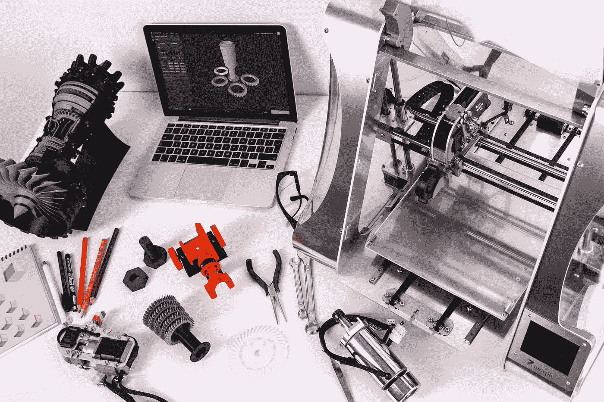
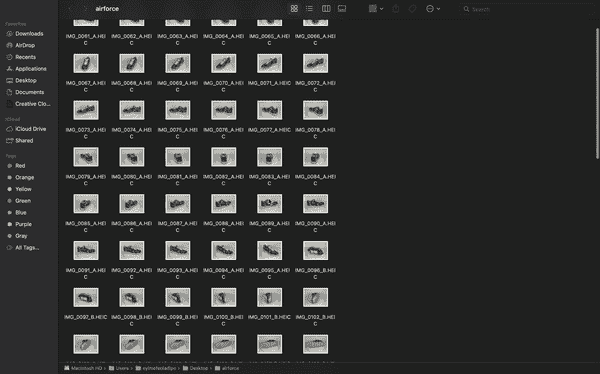
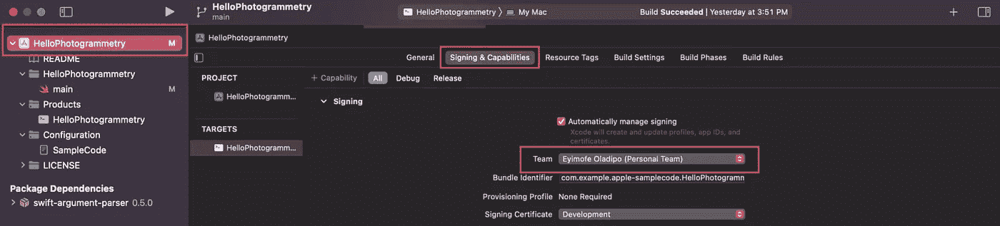
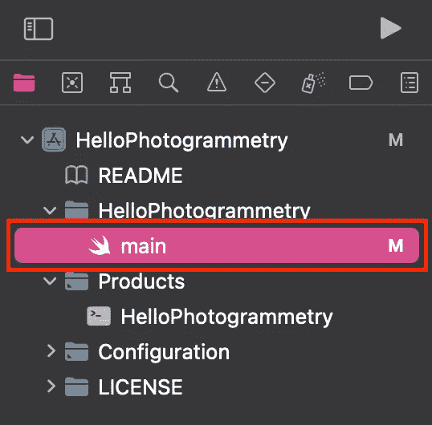
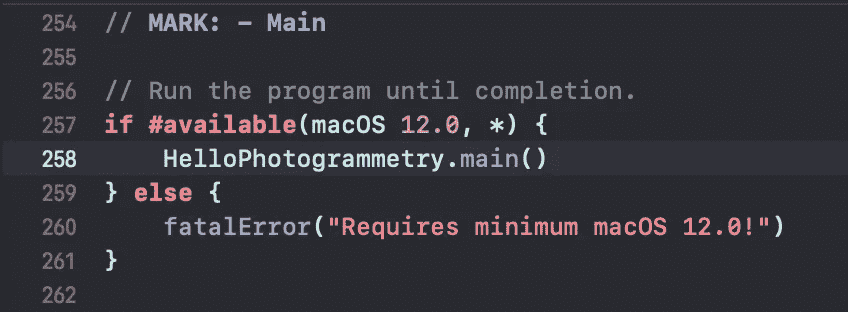
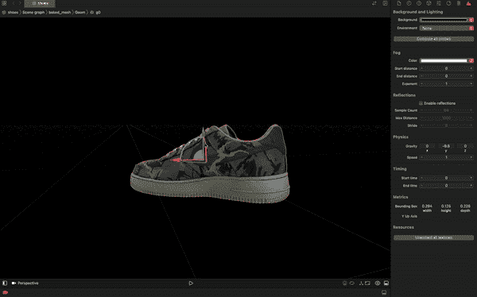

# 在 MacOS 上创建自己的 3D 模型

> 原文：<https://betterprogramming.pub/creating-your-own-3d-model-on-macos-c2867cb8cfad>

## 使用苹果的摄影测量和对象捕捉 API

由 [Unsplash](https://unsplash.com?utm_source=medium&utm_medium=referral) 上的 [ZMorph 多功能 3D 打印机](https://unsplash.com/@zmorph3d?utm_source=medium&utm_medium=referral)拍摄的照片

构建一个允许你从现实世界的物体中制作 3D 模型的程序似乎是一个很难解决的问题。

幸运的是，对于我们 iOS 开发者来说，苹果已经让它变得非常简单了！在这篇文章中，我将通过在苹果的 [*WWDC21*](https://developer.apple.com/videos/play/wwdc2021/10076) 发布的对象捕捉和摄影测量 API，来完成将你选择的任何现实世界对象转换成 3D 模型所需的步骤。

# 要求

要获得良好的 3D 模型，您必须具备以下条件:

*   必须拥有苹果硅 MacBook 或配备 4GB AMD 和 16GB RAM 的英特尔 MacBook(苹果硅 MacBook 运行速度更快)。这些设备是唯一支持对象捕获 API 的设备。
*   必须使用 Xcode 13 或更高版本运行 macOS Monterey。
*   必须有捕捉图像的方法，无论是用 iPhone、iPad、DSLR 还是无人机。
*   几乎没有反射面并且不改变形状的物理对象。
*   放置物体的深色布料或整洁的背景。

# 需要示例应用程序

*   这个[示例应用](https://developer.apple.com/documentation/realitykit/taking_pictures_for_3d_object_capture)将允许我们使用 iOS 设备捕捉带有深度和重力数据的高质量图像。
*   这个[样本 HelloPhotogrammetry 应用程序](https://developer.apple.com/documentation/realitykit/creating_a_photogrammetry_command-line_app)将允许我们从提供的图像中生成一个 3D 对象。

# 其工作原理概述

要创建一个 3D 模型，你需要从各个角度拍摄真实世界物体的照片。这些照片然后被复制到支持对象捕捉 API 的 MacBook 上，2D 图像的堆栈使用一种叫做“摄影测量”的计算机视觉技术转换成 3D 模型更详细的工作原理在 [*WWDC 21*](https://developer.apple.com/videos/play/wwdc2021/10076?time=19) *中。*

# 履行

在我们开始之前，苹果已经提供了一些 [*样本图片*](https://developer.apple.com/augmented-reality/object-capture/) 来帮助我们快速开始创建我们的 3D 模型*。我们也可以用这些图片作为指导，来理解我们的图片应该是什么样子。*

如果你想从自己拍照开始，你可以使用**下面的部分来阅读*。***

对于这篇文章，我将使用苹果提供的 [*耐克空军 1*](https://devimages-cdn.apple.com/ar/photogrammetry/AirForceImages.zip) 图片。你可以随意使用任何你喜欢的图像。

# 使用 CaptureSample 应用程序

现在我们已经从上面的链接下载了示例代码，我们现在可以在我们的 iPhone 上运行 CaptureSample 应用程序(如果你很难弄清楚，请查看这个 [*视频*](https://www.youtube.com/watch?v=Fo1A36RsoCI) )。

这个示例代码应用程序将帮助我们拍摄清晰的图像，这些图像通过总结一些最佳实践建议来传达我们的对象在 3D 模型中的深度和重力，从而获得体面的捕捉并批准带有绿色勾号的照片。

根据物体的不同，20 到 200 张图片应该足够得到一个好的 3D 模型。您也可以使用 iPhone 上的内置相机应用程序来拍摄图像。你所需要做的就是确保你的物体暴露在足够的光线下，并且被放置在一块深色的布上或者整洁的背景上。更多关于拍摄好图像的信息，可以阅读这篇苹果 的 [*文章。*](https://developer.apple.com/documentation/realitykit/capturing_photographs_for_realitykit_object_capture/)

既然我们已经拍摄了物体各个角度的照片，现在我们需要把照片传到我们的 MacBook 上，神奇的事情就发生了。要访问从 CaptureSample 应用程序拍摄的照片，请导航到您 iPhone 上的文件应用程序，确保您在“我的 iPhone”上，单击`CaptureSample`文件夹，然后单击`Captures`文件夹，您应该会看到刚才拍摄的照片所在的文件夹。

# 使用 HelloPhotogrammetry 应用程序

现在，我们已经在 MacBook 上有了包含图片的文件夹，是时候将它们带入 HelloPhotogrammetry 应用程序来制作 3D 模型了。

当您启动该程序时，您需要做的第一件事是单击顶层项目，并确保您的团队已设置好，否则当您试图执行该程序时会出现错误。

现在你已经完成了，你现在可以进入文件“main”

滚动到文件`main`的底部，您应该会看到这几行代码

在 HelloPhotogrammetry.main()函数内部，您将传入一个字符串数组，该数组包含成功运行程序所需的参数。我们将传入的字符串参数是:

1.  输入文件夹:您要转换的图像的本地输入文件夹。
2.  输出文件夹:3D 模型的 USDZ 输出文件的完整路径。
3.  细节:输出模型在网格大小和纹理大小方面的细节。可用的细节选项包括预览、缩小、中等、完整和原始。
4.  样本排序:如果以空间顺序模式捕获图像，设置为顺序可能会加快计算速度。可用的样品订购选项包括无序和有序。
5.  特征敏感度:如果扫描对象不包含大量可识别的结构、边缘或纹理，则设置为高。可用的特征灵敏度选项包括正常和高。

理解了什么是字符串参数之后，现在就可以完成这个函数了。

> 注意:程序会自动创建提供的输出文件夹。

我们现在可以运行该程序，将您的图像转换为 3D 模型的魔法就要开始了。这可能需要几分钟时间，具体取决于 MacBook 的规格、您拍摄的图像数量以及您放置的指定细节。

完成后，您应该会在输出终端看到一个文本，内容如下:

# 最后一步

现在，您可以在“HelloPhotogrammetry.main”功能中指定的输出文件夹中访问您的 3D 模型。在我的例子中，我将在“`/Users/eyimofeoladipo/Desktop/airforce_medium`”中找到我的 3D 模型。

这是我的美妙的 3D 模型的 gif。

现在，您已经学会了如何在 MacBook 上使用摄影测量和对象捕捉 API 创建 3D 模型，现在您可以将示例代码应用程序与您自己的个人应用程序集成在一起。玩得开心！