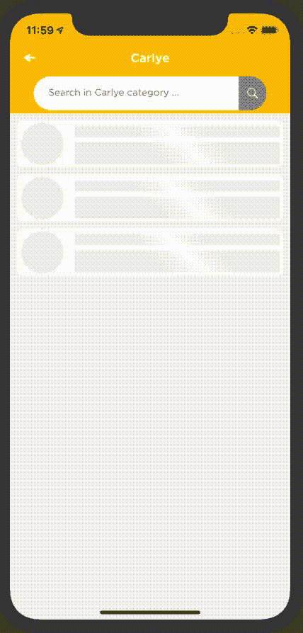

# 在 Swift for iOS 中创建您自己的自定义 UIRefreshControl

> 原文：<https://betterprogramming.pub/creating-your-own-custom-uirefreshcontrol-in-swift-for-ios-78a34f525d9d>

## 为您的应用的更新功能增添一些活力


[Ravi Roshan](https://unsplash.com/@ravi_roshan_inc?utm_source=unsplash&utm_medium=referral&utm_content=creditCopyText) 在 [Unsplash](https://unsplash.com/s/photos/life?utm_source=unsplash&utm_medium=referral&utm_content=creditCopyText) 上拍摄的照片

和其他人一样，当谈到在 Swift 中使用默认的`UIRefreshControl`时，我发现这很无聊。不能定制太多。所以，我想用一些很酷的动画创建一个自定义的`UIRefreshControl`(至少比我默认的要好)。

在看了很多关于创建自定义`UIRefreshControl`的文章后，我做了一个非常容易实现的，这样每个人都能很容易理解。我不想走极端。

所以，如果你知道 RxSwift 和核心显卡的基础知识，我想你实现这个方法不会有任何问题。如果你想得到更酷的动画，你可以用`CGPaths`来做得更花哨一些。

这是它最终的样子:



这个想法来自[这个帖子](https://medium.com/@topLayoutGuide/so-i-wanted-to-animate-a-uirefreshcontrol-34bd8ff65d8f)。也看看吧。

# 我们开始吧

## 1.创建一个包含所有必需属性的 UIView 子类

嗯，我说过我不会走极端，但相信我，所有这些属性都将是有用的。所有的`CGPoints`都在评论中有据可查。

*   `shapeLayer`我们将在这里绘制刷新控件的主路径，结合所有的点。
*   `circleLayer`是我们画刷新圈的地方。
*   `enum RefreshCircleSize`将在以后使用，以便我们可以动态提供刷新周期的大小。
*   `thresholdDrag`是用户拖动内容视图或滚动视图触发刷新所需的 y 偏移量。
*   我们不希望我们的刷新控件一直被拖到底部，因此我们使用了`maxHeightOfRefreshControl`。
*   最后，对于我们根据`Scroll`视图上`panGesture`的移动来移动中间底部点的动画，我们将在`xPositionOfPan` *中存储触摸的 x 位置。*
*   而你最后想知道的是，刷新状态为假时，中底点的 y 偏移略大于`edgeBottom`点。即刷新尚未被触发，因此`middleBottomPointYOffset`和`edgeBottomPointYOffset`。

## 2.是我们使用 Rx 的时候了

覆盖`didMoveToSuperView`并将下面的函数粘贴到您的类中。

哇哦。这是怎么回事？

*   我们正在覆盖`didMoveToSuperView`，因为我们将创建这个类的一个实例，并将其添加到滚动视图的`backgroundView`中。(这就是我们如何实现我们的刷新控制。)
*   在`addObserver`函数中，我们使用 [RxCocoa](https://github.com/ReactiveX/RxSwift/tree/master/RxCocoa) 来监听滚动视图的 y 内容偏移量和`scrollView`的`panGesture`的变化，我们得到的值存储在我们之前声明的属性中。
*   当用户在`panGesture`之后将手指抬离屏幕时，任何`.cancelled`、`.failed`、`.ended`状态都可能被触发，因此我们切换这些情况，并检查用户是否已经拖动到我们在属性中指定的`thresholdDrag`之上。
*   如果它大于阈值，那么我们将制作圆形旋转的动画，将`refreshingStatus`设置为`true`并调用`onRefreshing`函数。

## 3.核心图形时间——画线和制作动画

在您的类中添加以下函数。

我知道要看的东西很多。但是让我再解释一次。

在`commonInit`里面，我们将一劳永逸地设置`shapeLayer`和`circleLayer`。我们不需要每次重画都做`layer.addSublayer`。因此，不在`draw( _ rect:)`中。

内部`draw(_ rect: )`:

1.  向所有点分配新的 CGPoint。
2.  为`shapeLayer`绘制路径。
3.  使用`bezierPath`画圆。
4.  我们不想要一个完整的圆形，因此它在贝塞尔路径参数中。

```
startAngle: getStartAngle(draggedFractionCompleted), endAngle: getStartAngle(draggedFractionCompleted + 0.85)
```

我们只画圆周的 0.85 部分，改变`startAngle`开始根据`draggedFractionComplete`画圆。

# 有用的东西，如果你喜欢使用核心图形旋转的东西

你想知道为什么我们提供一个高度和宽度为零，原点在圆心的框架吗？

因为默认情况下围绕 z 轴设置层动画会围绕其锚点旋转该层的整个帧。

所以，设置圆圈层的框架的原点为圆心，高度和宽度为零(基本上是一个大头针点，然后应用绕 z 轴旋转将按照所需的方式旋转我们的圆圈。如果你被困在这些旋转的东西里，你想要使用的那种黑客。

最后，`animateRefreshCircle`函数被用来使我们的刷新圈一圈又一圈地活动起来。

注意:不要忘记在你的初始化器中调用`commonInit`函数。

## 4.终于，它要结束了

将此函数粘贴到您的类中。在完成了触发刷新时启动的任务之后，您可以调用这个函数。

您可以根据需要调整该功能，使动画中的`shapeLayer`和`circleLayer`消失，并将滚动视图中的`contentInset.top`重置为 0。

你在哪里设置内容插页？

在`calculate`功能内部。

```
containerScrollView?.contentInset.top = middleBottomPointYOffset
```

为什么？

以便当刷新被触发时`refreshControl`停留在滚动视图的顶部。

最后，结束…

下面是完整的代码组合。

## **5。现在为了使用这个类**

触发刷新时调用函数。

```
refreshControl.setOnRefreshing = {[**weak** **self**] **in**//call your function here//and don’ forget to call “***refreshControl.endRefreshing()”*** at end of that task you perform inside that function}
```

恭喜你！

你一直跟到最后。这是我在媒体上的第一篇文章。评论和补充将不胜感激。谢谢大家！