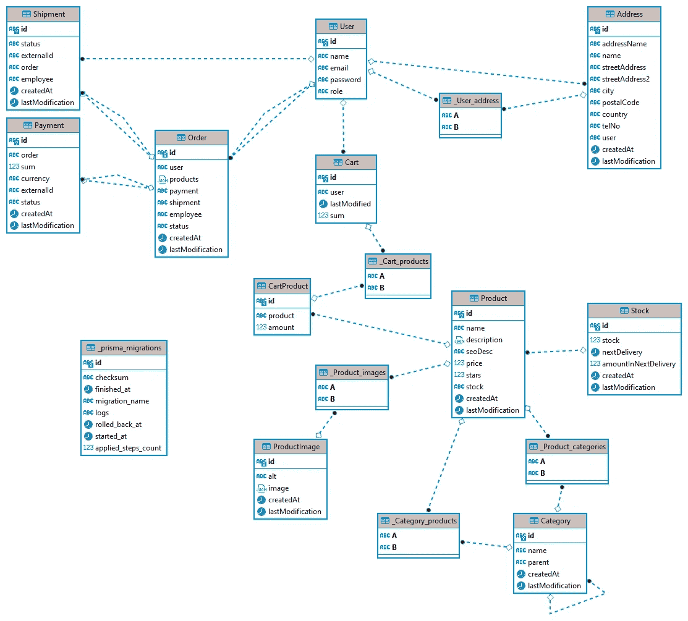

# 创建您自己的基于 Keystone.js 的电子商务系统——构建购物车

> 原文：<https://betterprogramming.pub/creating-your-own-e-commerce-keystone-js-based-system-build-a-cart-8c433ccf5443>

## 我们创建自己的电子商务系统的下一步


肯尼·埃利亚松在 [Unsplash](https://unsplash.com?utm_source=medium&utm_medium=referral) 上的照片

# 介绍

前一段时间，我有一个大胆的想法，用 Kesytone.js 来建立一个电子商务系统。这一旅程始于几周前，到目前为止，我们已经讨论了[系统需求](/build-your-own-e-commerce-keystone-js-based-system-requirements-and-architecture-3d639241b963)、[环境设置和基本模型](/build-your-own-e-commerce-keystone-js-based-system-environment-setup-and-base-models-2c02a3e3a70b)，以及[访问控制](/building-your-own-e-commerce-keystone-js-based-system-access-control-1a366ed7e064)。在本文中，让我们集中讨论购物车的主要功能。此外，本文的完成代码可以在我的 [GitHub](https://github.com/eabald/keystone-e-commerce/tree/Cart) 上获得。

# 推车流量

在本系列的前几部分中，当我们设置基本模式时，我们决定每个用户只有一个购物车，它将包含所有添加的产品，直到用户从该购物车创建订单。基于此，用户可以在他们的购物车上执行三种操作。首先，可以向购物车中添加一个商品，然后删除它并改变它的数量。

此外，还有一个主要问题需要考虑，这与其说是技术问题，不如说是业务问题。我们是否应该允许用户向购物车中添加比当前可用产品更多的产品？我的意思是，在产品有库存的情况下，例如，四件商品可用，但是用户试图添加到购物车五，在这种情况下应该发生什么？

当然，这个问题应该在 UI 中得到解决，但是在某些情况下，它还是会发生。使用 SSR 和 Next.js 有一些缺点，在最基本的情况下，只在页面渲染上检查可用产品的数量。这可能会导致产品可用性在渲染和将产品添加到购物车之间的时间内发生变化的情况。

有两个主要的解决方案:首先，在这种情况下阻止添加到购物车，或者将这个验证步骤向前移动，并阻止创建缺货产品的订单。尽管我们做出了决定，但从安全角度来看，这一步骤是必要的。

我相信这个问题还有第三种解决方案——介于前面提到的两种方案之间。模式包括关于下一次送货的信息，所以如果库存中没有足够的商品，但加在一起足够了，那么用户可以将它添加到购物车中。但是订单会因此而延迟。

另一方面，如果没有下一个交货信息，它将被阻止。这个解决方案应该确保更好的用户保留，更重要的是实施起来更有趣。

这样一来，我们就可以专注于这三个操作了。首先，将产品添加到购物车中。基本上有两个步骤。验证库存并更新购物车中的产品。这同样适用于更新数量。删除产品只是对购物车模型的更新，对吗？不完全是。让我们看看我们的`Cart`模式:

有与`Product`相关的列表，但是没有办法存储关于添加产品数量的信息。因此，我们必须创建一个中间列表(在 SQL 术语中称为数据透视表)来处理多对多关系并存储数量信息。

# 购物车商品列表

该列表的主要目的是存储`Cart`和`Product`实体之间的关系和数量信息。基本上应该只是从`Cart`开始作为关系请求。直接要求是没有意义的。让我们创建`cart-product.schema.ts`:

但是等等，只有两个字段？很简单，这个列表不需要了解任何关于`Cart`或者这些产品属于什么。但是另一方面，`Cart`模型需要这个信息，所以我们必须更新这个列表，并将关系从`Product`更改为`CartProduct`。此外，不再需要隐藏从管理用户界面创建这个实体的可能性。

```
products: relationship({
  ref: 'CartProduct',
  many: true,
}),
```

好了，现在我们可以更新我们的流程了:

*   添加到购物车:
    1。验证库存
    2。创建`CartProduct`实体
    3。更新`Cart`型号
*   从购物车中取出产品:
    1。移除`CartProduct`实体
    2。更新`Cart`
*   改变购物车中的数量:
    1。验证库存
    2。更新`CartProduct`实体
    3。更新`Cart`

# 简单介绍一下框架抽象及其局限性

但是为什么这么麻烦呢？让我们看一下我们数据库的当前 ER 图:



我们有自己的`Cart`、`CartProduct`和`Product`表，但也有`_Cart_products`表。我们没有创造最后一个，对吗？取消延期 Prisma 为我们做到了。这就是为什么对我们使用的工具有一个基本的了解是有好处的。

Prisma 有两种创建多对多关系的方法([更多信息可在文档](https://www.prisma.io/docs/concepts/components/prisma-schema/relations/many-to-many-relations#relational-databases)中获得)，显式或隐式。在第一个例子中，我们负责在我们的`schema.prisma`文件中创建透视表和其他表上的关系。在第二个例子中，我们跳过数据透视表，由 ORM 为我们创建。

但是在我们的例子中，我们不能直接控制`schema.prisma`文件；Keystone 解决了这个问题，并使用了隐式方法。在大多数情况下，这是非常好的，但有时它可能有一些缺点，就像这个不必要的表。

框架通常会在厚厚的抽象层下隐藏很多实现细节，这在大多数情况下是一件好事。它允许开发人员专注于`business`逻辑，工作更快更有效。但在某些情况下，我们不得不接受一些问题。

# 挂钩和验证流

为了执行每个 cart 操作中涉及的所有步骤，我们需要一个允许我们执行一些副作用的工具，包括更新`Cart`模式时的额外验证。幸运的是，Keystone 拥有完美的工具。

还有`Hooks API`，它对整个模式或其中的特定字段执行同样的操作。他们有五个人:

*   `resolveInput`允许我们在验证创建或更新操作之前修改输入数据。
*   `validateInput`和`validateDelete`分别为我们提供了在创建/更新和删除操作中返回额外验证错误的可能性。
*   `beforeOperation`在数据库操作之前处理副作用
*   `afterOperation`操作后情况相同。

在[文档](https://keystonejs.com/docs/guides/hooks)中阅读更多关于钩子的内容。

好了，让我们回到我们的系统。整个流程比看起来要简单；我们只需要用两个钩子(第三个是奖金)。首先，让我们假设每个`updateCart`突变都必须包含当前购物车中的所有产品(之前也添加了)。这样，当我们提交产品列表时，购物车内容就被设置到这个列表中。当有空列表时，购物车内容被清除，当没有产品列表时，购物车内容不变。例如，一个突变应该是这样的:

为了处理这个问题，我们必须删除所有的`CartProduct`实体，并在每次更新时添加一个新的实体。为此，我们需要使用`Cart`模式中的`beforeOperation`钩子:

这很简单——当更新突变中有产品时，我们查询并删除所有当前添加的产品。之后，当前操作用新的/更新的库存添加回所有适当的产品。此外，当数据解析后出现一个空的产品列表时，购物车内容将被清除。

好了，这就是关于更新购物车内容的部分，但是股票验证呢？不应该是在那之前发生的吗？是的，但是它应该发生在`CartProduct`模式中，而不是直接发生在购物车中。我们将添加`validateInput`挂钩:

在这里，它检查每个产品的库存，并将请求的数量与下一次交货中的组合库存和数量进行比较。如果还不够，我们调用`addValidationError`函数来创建一个验证错误。这个方法近乎完美。只有一个问题:`CartProduct`实体是在购物车更新之前创建的，当出现验证错误时，`Cart`实体不会被更新。

但是第一个模式中的一些行可能已经被创建了，这可能会在`CartProduct`表中留下孤立条目。这是一个应该使用事务的完美例子，但是现在，Keystone 中没有这样的选项。根据[这个](https://github.com/keystonejs/keystone/issues/7217)问题，在不久的将来可能会改变。

最后一个奖金挂钩呢？在`Cart`中，有一个`sum`字段包含整个购物车的价值信息，我们需要一种方法来计算它。`resolveInput`挂钩效果最好:

它获取与此购物车相关联的所有产品，并对它们的金额和价格求和。之后，要保存到数据库中的数据被更新。

# 摘要

现在，我们已经完成了电子商务系统的购物车部分。老实说，应用程序的这一部分比我最初预期的要难开发。而且，实现起来也没那么难。大部分工作都在思考解决问题的最佳方式，而不是问题本身。

由于各种原因，它比我计划的时间长，我希望你喜欢它。如果您有任何问题或意见，请随时提问。

兼职项目有一个令人讨厌的特点:起初，它们令人兴奋和有趣，但在一些工作之后，我们不再有那种感觉。我相信这就是为什么写这部分花了我这么长时间。

不要误解我的意思，我仍然计划完成这个系列并构建这个系统，但是为了不失去其中的乐趣——并防止它在下一篇文章中成为一个苦差事——我将休息一下，写一些其他的东西。

那里见！