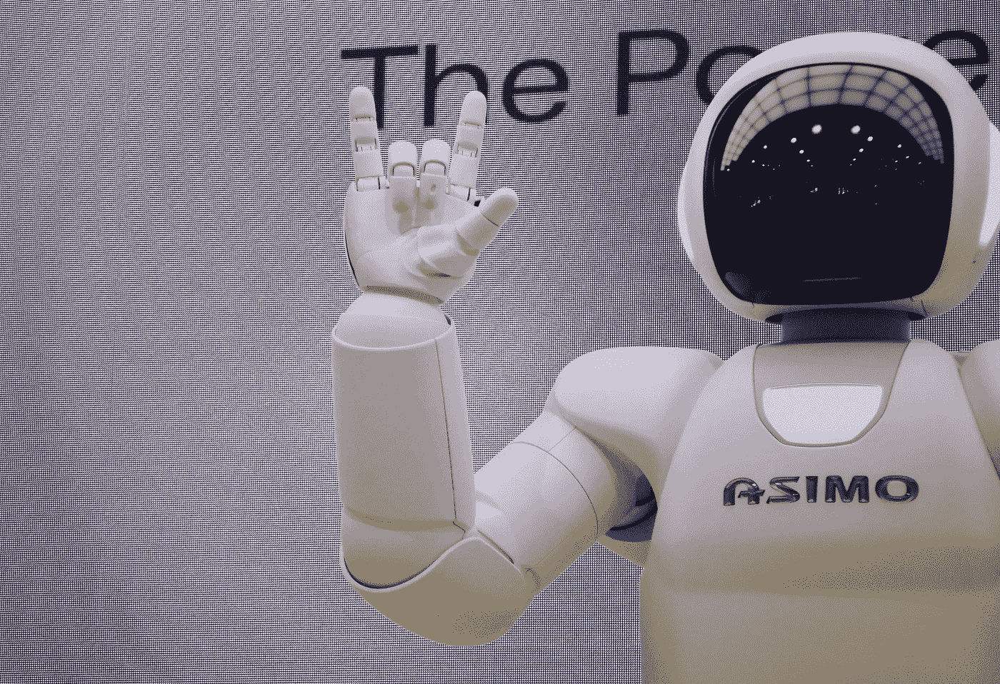

# 创造性的计算机已经出现了

> 原文：<https://betterprogramming.pub/creative-computers-are-already-around-the-corner-23e94cdf017b>

## 随着 GPT 3 的崛起，人工智能能做创造性的工作吗？

在 [Unsplash](http://unsplash.com/) 上由 [Franck V.](https://unsplash.com/photos/g29arbbvPjo) 拍摄的照片。

在人工智能的帮助下实现日常流程的自动化在今天是极其普通的。

当人工智能程序开始出现时，专家们常说，智能计算机和机器人将解放我们的时间，让我们从事创造性的工作。最后，人们将有更多的时间去研究、写文章、编写创造性的程序和进行艺术创作。

> “机器人不会取代人类，它们会让自己的工作更加人性化。困难、贬低、苛求、危险、枯燥——这些都是机器人将要从事的工作。’——[Robohub.org 的联合创始人萨宾·豪特](https://analyticsindiamag.com/ten-famous-quotes-about-artificial-intelligence/)

然而，没有人预料到编程比人类更快更好的机器人已经出现。

# 什么是 GPT-3？

GPT-3 是由 OpenAI 开发的人工智能应用程序，open AI 是一家来自三藩市的研发公司，已经用他们的解决方案震撼了世界。

2017 年，他们建造了一个 [Dota bot](https://openai.com/blog/dota-2/) ，可以打败人类玩家，包括排名前 99.95 百分位的 *Dota* 玩家。该程序通过自我游戏从零开始学习游戏，这对 AI 来说是一个巨大的成就。计算机能够在快速变化、不可预测的条件下做出成功的决策。

一年后，他们训练了一只名为 Dactyl 的类似人类的机器人手，以前所未有的敏捷操纵物体。

最后，今年每个人都在谈论 GPT 3 号。使用这个开放的 AI API，您可以向 GPT-3 提供文本输入并接收输出。你可以用它来[生成博客文章、故事](https://medium.com/towards-artificial-intelligence/crazy-gpt-3-use-cases-232c22142044)，甚至从头开始开发一个应用程序。没错。使用 GPT-3 编写代码是一个有趣的转折。这是使用语言的强大工具，代码也是一种语言。

# GPT 3 号能做什么

以下是 GPT 3 号目前能做的事情:

*   写短篇小说、歌曲、新闻稿、技术文献。你可以读一篇由 GPT 3 号自己写的关于 GPT 3 号的非常合理的文章。
*   只要给出某个作家的头衔和名字，它就能[模仿他们的风格](https://arr.am/2020/07/09/gpt-3-an-ai-thats-eerily-good-at-writing-almost-anything/)。
*   用 Python、React Native 和其他编程语言构建 web 应用程序和软件组件。
*   [用 HTML 和 CSS 写一个网站或登陆页面](https://twitter.com/sharifshameem/status/1282676454690451457)。

# GPT-3 会抢走你的工作吗？这是你的未来

一些人已经声称 [GPT-3 将会是我们所知的就业市场](https://analyticsindiamag.com/5-jobs-that-gpt-3-might-challenge/)的终结。他们说，软件开发人员、记者和作家正在过着他们最后的好日子。

然而，由于拖放工具和各种在线应用程序构建器，很久以前就发生了让编码和 web 开发更容易被广泛人群使用的转变。帮助翻译和编辑文本的工具，如 Google Translate 或 Grammarly，也已经存在了一段时间。

诚然，GPT-3 可以生成几乎任何主题的尚可的文本，甚至比一些人做得更好。它涵盖了各种各样的任务，并且比任何其他人工智能软件系统更好地处理这些任务。

尽管看起来非常令人印象深刻，但专家认为该算法目前还不能完全取代人类。

它的产出是汇编和在线研究的结果，而不是真正的创造力。通常，他们缺乏常识，如果你仔细观察他们，他们会“崩溃”。甚至 OpenAI 的创始人 Sam Altman 也承认，算法仍然会犯愚蠢的错误，离真正的智能还很远。

所以不要担心，GPT-3 不会马上来接替你的工作。