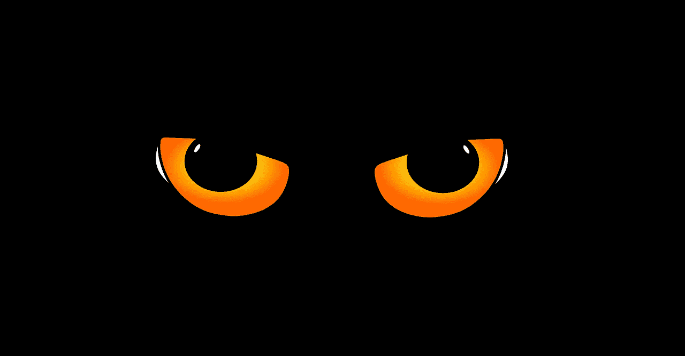
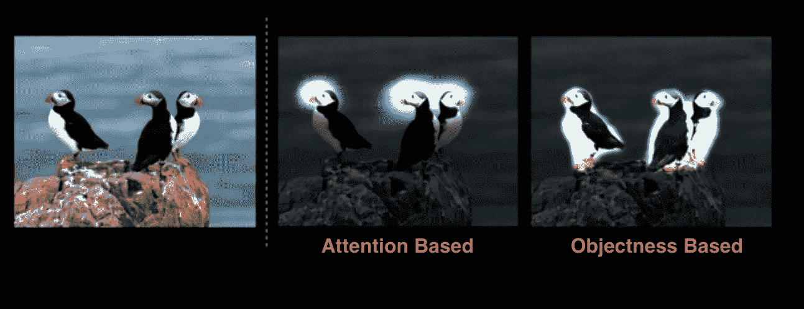
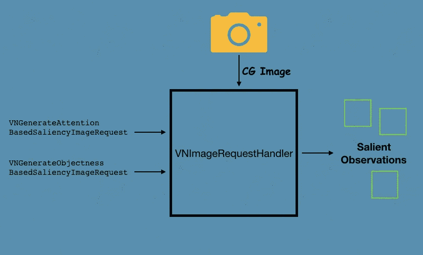

# 在 iOS 中使用 Vision 裁剪感兴趣的区域

> 原文：<https://betterprogramming.pub/cropping-areas-of-interest-using-vision-in-ios-e83b5e53440b>

## 使用升级后的视觉框架提取显著特征



图片来自 [kropekk_pl](https://pixabay.com/users/kropekk_pl-114936/?utm_source=link-attribution&utm_medium=referral&utm_campaign=image&utm_content=285825) 来自 [Pixabay](https://pixabay.com/?utm_source=link-attribution&utm_medium=referral&utm_campaign=image&utm_content=285825)

苹果在 WWDC 2019 期间在愿景框架中引入了大量新功能。除了提供内置的图像分类模型来识别宠物并改进面部特征跟踪，突出的特征之一是显著性。

显著性在计算机视觉和图像处理中有许多应用。从突出显示感兴趣的区域，到模糊检测、异常检测、自动图像裁剪和图像后处理，这样的例子不胜枚举。

# 什么是显著性？

简单来说，显著性意味着最显著或最重要的特征。显著性主要分为两种类型:

**基于注意力的显著性** —这种算法提供了一眼就能抓住人眼的图像特征。该算法的模型是基于当人们看到一批图像时他们在图像中的位置来训练的。

**基于对象的显著性** —这是在对象分割上训练的，以便突出图像中存在的突出对象。

基于注意力的显著性是一个更棘手的问题，因为它依赖于许多因素，如图像中的人脸、对比度和光照，来确定引人注目的部分。

这些显著性类型中的每一种都返回一个热图，它实际上是 68X68 像素的缓冲区，用于保存图像每个区域的显著性值。



[来自苹果文档](https://developer.apple.com/videos/play/wwdc19/222/)

# 我们的目标

我们将开发一个 iOS 应用程序，自动裁剪图像，只显示突出区域。我们将使用两种显著性类型，并将比较结果。

# 履行

为了简单起见，UI 由一个图像和一个按钮组成，两者都是在我们的 ViewController 中以编程方式创建的。按钮选择器负责使用 ImagePickerController 选择图像，如下所示:

```
@objc func onButtonClick(sender: UIButton){let imagePicker = UIImagePickerController()imagePicker.sourceType = .photoLibraryimagePicker.delegate = selfpresent(imagePicker, animated: true, completion: nil)}
```

为了按预期工作，请确保您已经实现了`UIImagePickerControllerDelegate`、`UINavigationControllerDelegate`协议，并且在您的`info.plist`文件中添加了照片库的隐私使用权限。

```
func imagePickerController(_ picker: UIImagePickerController, didFinishPickingMediaWithInfo info: [UIImagePickerController.InfoKey : Any]) {
        dismiss(animated: true) {
            if let image = info[UIImagePickerController.InfoKey.originalImage] as? UIImage {
                self.imageView?.image = image
                self.processImage(image)

            }
        }
}
```

在`processImage`函数中，我们的视觉 API 处理显著性请求。我们将在下一节中讨论这一点。

# 设置我们的愿景请求



我们将使用标准的`VNImageRequestHandler`来处理我们的图像，并在视觉请求处理器中传递算法类型，如下所示:

```
let requestHandler = VNImageRequestHandler(cgImage: originalImage, options: [:])let saliencyRequest = VNGenerateAttentionBasedSaliencyImageRequest(completionHandler: nil)try requestHandler.perform([self.saliencyRequest])
guard let results = self.saliencyRequest.results?.first else{return}let observations = results as? VNSaliencyImageObservationlet salientObjects = observation.salientObjects
```

在上面的代码中有一些非常新的术语。让我们看看它们是什么:

*   `salientObjects`属性是算法检测到的所有显著特征的`VNRectangleObservation`数组。它保存每个特征的`boundingBox`和置信度阈值。为了裁剪图像以仅显示突出的特征，我们将合并所有突出的边界框区域。
*   由视觉框架返回的边界框使用归一化的坐标系，使得左下角点是原点。因此，我们将把边界框联合传递给一个`VNImageRectForNormalizedRect`来将显著区域投影到 UIKit 坐标系中。
*   在图像没有高亮显示的情况下，返回的`salientObjects`为空。

以下代码包含基于显著特征裁剪图像的视觉请求的完整实现:

```
private let workQueue = DispatchQueue(label: "VisionRequest", qos: .userInitiated, attributes: [], autoreleaseFrequency: .workItem)

private func processImage(_ image: UIImage) {

        guard let originalImage = image.cgImage else { return }

        workQueue.async {
            let requestHandler = VNImageRequestHandler(cgImage: originalImage, options: [:])
            do {
                try requestHandler.perform([self.saliencyRequest])
                guard let results = self.saliencyRequest.results?.first
                    else{return}

                if let observation = results as? VNSaliencyImageObservation
                {
                    var unionOfSalientRegions = CGRect(x: 0, y: 0, width: 0, height: 0)
                    let salientObjects = observation.salientObjects

                    let showAlert = (salientObjects?.isEmpty ?? false)

                    for salientObject in salientObjects ?? [] {
                        unionOfSalientRegions = unionOfSalientRegions.union(salientObject.boundingBox)
                    }

                    if let ciimage = CIImage(image: image)
                    {
                        let salientRect = VNImageRectForNormalizedRect(unionOfSalientRegions,
                                                                       Int(ciimage.extent.size.width),
                                                                       Int(ciimage.extent.size.height))
                        let croppedImage = ciimage.cropped(to: salientRect)
                        let thumbnail =  UIImage(ciImage:croppedImage)
                        DispatchQueue.main.async {

                            if showAlert{
                                let alertController = UIAlertController(title: "Oops!", message: "No highlights were found", preferredStyle: .alert)

                                alertController.addAction(UIAlertAction(title: "Dismiss", style: .default, handler: { _ in
                                }))
                                self.present(alertController, animated: false, completion: nil)
                            }

                            self.imageView?.image = thumbnail
                        }
                    }
                }

            } catch {
                print(error)
            }
        }
    }
```

基于注意力的显著性类型只返回一个包围盒，而基于对象的算法可以返回多达三个包围盒。

下面给出了实际应用程序的输出:


现在，让我们比较一下风景图片上基于客体和注意力的类型，如下所示:


基于注意力的算法对风景图像没有太大的影响。根据用例，您可以使用任何一种显著性请求类型。为了在缩略图中显示感兴趣的部分，通常使用基于注意力的显著性。

# 结论

我们已经很好地研究了视觉的显著性特征，并比较了基于注意力和基于客体的类型。Vision framework 今年将有更多改进，如图像相似性、人脸捕捉质量等——很快会有更多改进！上述示例的完整源代码可以在 [Github 资源库](https://github.com/anupamchugh/iowncode/tree/master/iOSVisionCroppingSalientFeatures)中找到。

这一次到此为止。我希望你喜欢阅读。