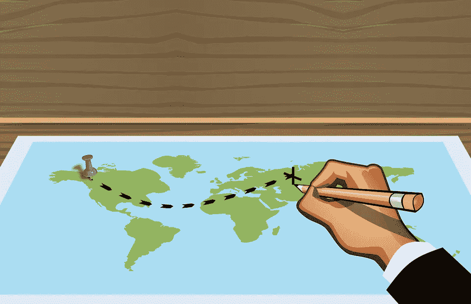
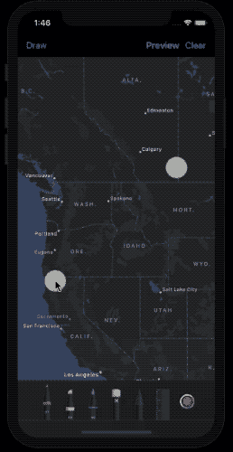

# 使用 PencilKit 裁剪 iOS 地图

> 原文：<https://betterprogramming.pub/cropping-ios-maps-with-pencilkit-da7f7dd7ec52>

## 铅笔工具包和地图工具包出去约会



图片由[穆罕默德·哈桑](https://pixabay.com/users/mohamed_hassan-5229782/)在[皮克斯拜](https://pixabay.com)拍摄

[PencilKit](https://developer.apple.com/documentation/pencilkit) 亮相 WWDC 2019，最终与 iOS 13 一同发布。在前一篇[文章](https://medium.com/better-programming/an-introduction-to-pencilkit-in-ios-4d40aa62ba5b)中已经介绍了它的基础知识，现在是时候在地图上实现和使用铅笔了。

让我们看看当 PencilKit 邀请 MapKit 约会时会发生什么！

# 介绍

## 目标

*   使用 PencilKit 在地图上绘图；
*   在动作表中显示来自绘图区域的封闭地图图像；
*   将图像保存在照片库中。

## 快速回顾

MapKit 框架用于在视图和窗口中嵌入地图。我们可以用 MapKit 框架做很多事情，比如添加注释和折线，标记目的地和兴趣点等。

`MKMapView`用于在我们的应用程序中显示和嵌入地图。

PencilKit 是城里的新框架。随着 iOS 13 推出，它允许我们在应用程序中创建自己的涂鸦和面条。

`PKCanvasView`班级是我们的绘画竞技场。

## 最后结果

到本文结束时，我们将实现以下目标:



来自 iOS 模拟器的屏幕截图

是时候深入研究实现了！

# 铅笔下的地图

首先在 Xcode 中启动一个新的单视图应用程序。

我们的第一步将是把我们的`MKMapView`放在`PKCanvasView`下面，这样我们就可以越过它了！

## 设置 MKMapView

很简单！你只需要在你的视图控制器中添加`import MapKit`和`MKMapView`。下面的代码不用故事板就能做到。

```
var mapView = MKMapView(frame: CGRect(x: 0, y: 60, width: view.frame.size.width, height: view.frame.size.height - 60)) self.view.addSubview(mapView)
```

## 设置 PKCanvasView

```
let canvasView = PKCanvasView(frame: .zero)
canvasView.translatesAutoresizingMaskIntoConstraints = false
canvasView.isOpaque = false
view.addSubview(canvasView)

canvasView.backgroundColor = .clear

NSLayoutConstraint.activate([
canvasView.topAnchor.constraint(equalTo: self.view.safeAreaLayoutGuide.topAnchor, constant: 40),
canvasView.bottomAnchor.constraint(equalTo: view.bottomAnchor),
canvasView.leadingAnchor.constraint(equalTo: view.leadingAnchor),
canvasView.trailingAnchor.constraint(equalTo: view.trailingAnchor),
])
```

我们将画布的背景颜色设置为透明，这样它下面的地图就可见了。

## 设置 PKToolPicker

以下代码为您添加了 PencilKit ToolPicker。

```
override func viewDidAppear(_ animated: Bool) {
        super.viewDidAppear(animated)guard let window = view.window,
let toolPicker = PKToolPicker.shared(for: window) else { return }toolPicker.setVisible(true, forFirstResponder: canvasView)
        toolPicker.addObserver(canvasView)
        canvasView.becomeFirstResponder()
}
```

当地图在画布下面时拖动它并不是一个复杂的场景。我们所需要做的就是允许从 CanvasView 到下面的视图传递接触。

因此，我们将保留一个切换按钮，允许交替拖动和绘图。在第一种情况下，我们传递来自 CanvasView 的触摸，而在第二种情况下，我们不传递！

我们在下面的扩展中覆盖了出现在`PKCanvasView`类中的 point 函数:

```
extension PKCanvasView{
    override open func point(inside point: CGPoint, with event: UIEvent?) -> Bool {
        return DragOrDraw.disableDrawing
    }
}class DragOrDraw{
    static var disableDrawing = true
}
```

`disableDrawing`是一个布尔标志，可以从`NavigationBar`切换地图拖动和铅笔绘图，因为两者不能同时共存。

## 设置导航栏

```
var toggleDrawItem : UIBarButtonItem!

var disableDraw : Bool = false

func setNavigationBar() {let previewItem = UIBarButtonItem(title: "Preview", style: .done, target: self, action: #selector(preview))

let clearItem = UIBarButtonItem(title: "Clear", style: .plain, target: self, action: #selector(clear))toggleDrawItem = UIBarButtonItem(title: "Drag", style: .plain, target: self, action: #selector(dragDrawToggler))let navigationItem = UINavigationItem(title: "")
navigationItem.rightBarButtonItems = [clearItem,previewItem]
navigationItem.leftBarButtonItem = toggleDrawItem
navigationBar = UINavigationBar(frame: .zero)
navigationBar?.isTranslucent = false

navigationBar!.setItems([navigationItem], animated: false)navigationBar!.translatesAutoresizingMaskIntoConstraints = false
view.addSubview(navigationBar!)navigationBar!.backgroundColor = .clearNSLayoutConstraint.activate([
navigationBar!.topAnchor.constraint(equalTo: self.view.safeAreaLayoutGuide.topAnchor),
navigationBar!.heightAnchor.constraint(equalToConstant: 60),
navigationBar!.leadingAnchor.constraint(equalTo: view.leadingAnchor),
navigationBar!.trailingAnchor.constraint(equalTo: view.trailingAnchor),
])}
```

既然 UI 组件已经部分化了，现在是将 PencilKit 绘图转换为地图图像的时候了。

# 将 PencilKit 绘图转换为地图图像

为了从绘制的区域获取地图图像，我们需要获取绘图的边界，并裁剪包含在该矩形中的 MapView:

```
[@objc](http://twitter.com/objc) func preview() {
        let bounds = canvasView.drawing.bounds
        if let image = clippedImageForRect(clipRect: bounds, inView: mapView!){
            showPreviewImage(image: image)
        }
    }
```

下面是函数`clipImageForRect`的实现，我们将传递 PencilKit 边界和 Map 实例:

```
func clippedImageForRect(clipRect: CGRect, inView view: UIView) -> UIImage? {
        UIGraphicsBeginImageContextWithOptions(clipRect.size, true, UIScreen.main.scale)
        if let ctx = UIGraphicsGetCurrentContext(){
            ctx.translateBy(x: -clipRect.origin.x, y: -clipRect.origin.y);
            view.layer.render(in: ctx)
            let img = UIGraphicsGetImageFromCurrentImageContext()
            UIGraphicsEndImageContext()
            return img
        } return nil
}
```

现在我们有了图像，我们可以在一个`UIAlertController`中显示它，并选择将其添加到照片库中:

```
func showPreviewImage(image: UIImage)
    {
        let alert = UIAlertController(title: "Preview", message: "", preferredStyle: .actionSheet)
        alert.addPreviewImage(image: image)alert.addAction(UIAlertAction(title: "Add To Photos", style: .default){
            action in
            UIImageWriteToSavedPhotosAlbum(image, self, nil, nil)
        })
        alert.addAction(UIAlertAction(title: "Cancel", style: .destructive, handler: nil))

        present(alert,
                    animated: true,
                    completion: nil)
    }
```

注意:不要忘记在`info.plist`中设置照片库的隐私使用权限。

对于 iPadOS，您需要使用`popoverPresentationController`来显示动作表，如下面的代码片段所示。

```
if let popoverPresentationController = actionSheet.popoverPresentationController {popoverPresentationController.sourceView = self.viewpopoverPresentationController.sourceRect = CGRect(x: self.view.bounds.midX, y: self.view.bounds.midY, width: 0, height: 0)popoverPresentationController.permittedArrowDirections = []}
```

`addPreviewImage`是我们通过使用另一个 ViewController 在 Alert 控制器的内容视图中嵌入图像的地方。

```
extension UIAlertController {
    func addPreviewImage(image: UIImage) {
        let vc = PreviewVC(image: image)
        setValue(vc, forKey: "contentViewController")
    }
}
```

`PreviewVC`的代码可以在下一节获得完整的源代码。

# 结论

我们用地图工具包和铅笔工具包的约会到此结束。当您需要与他人共享地图的一部分而不需要截图时，上面的示例非常方便。源代码可以在[这个 Github 库](https://github.com/anupamchugh/iowncode/tree/master/iOSMapAndPencilKit)中找到。

这是这篇文章的总结。如果你喜欢它，这里有另一篇你可能喜欢的文章:

[](https://medium.com/better-programming/pencilkit-meets-core-ml-aefe3cde6a96) [## PencilKit 遇上 Core ML

### 从图形中识别数字

medium.com](https://medium.com/better-programming/pencilkit-meets-core-ml-aefe3cde6a96)