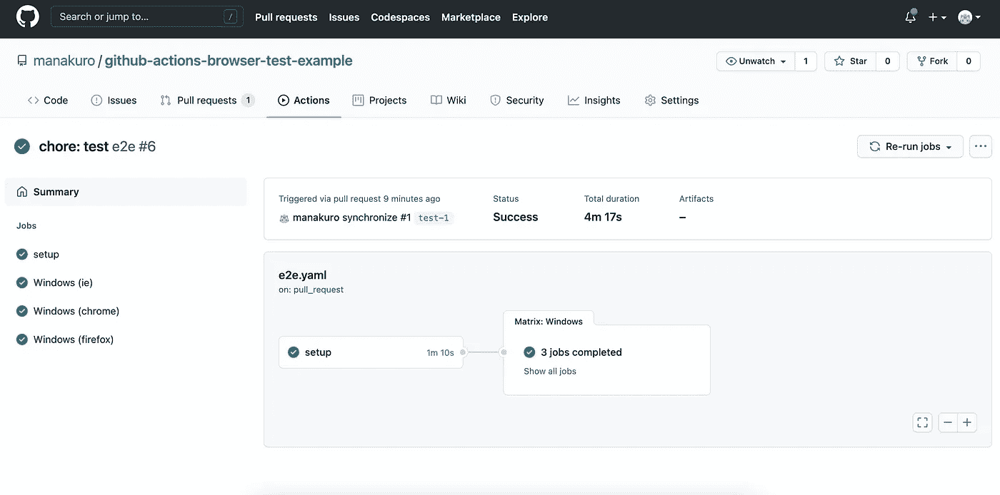
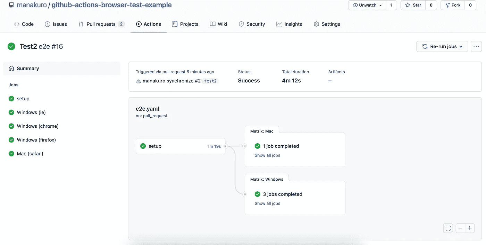

# 在 GitHub Actions 上使用 TestCafe 进行跨浏览器测试

> 原文：<https://betterprogramming.pub/cross-browser-testing-with-testcafe-on-github-actions-49ec58ac855c>

## 引入基于 GitHub 动作的跨浏览器测试


micha Parzuchowski 在 [Unsplash](https://unsplash.com/s/photos/cafe?utm_source=unsplash&utm_medium=referral&utm_content=creditCopyText) 上拍摄的照片

[TestCafe](https://devexpress.github.io/testcafe/) 是基于 Node.js 的自动化 E2E 测试工具，支持跨浏览器平台。

在本文中，我将向您展示如何在 GitHub Actions 上使用 TestCafe 进行跨浏览器测试。

# 示例存储库

以下是 GitHub 的最终代码:

[](https://github.com/manakuro/github-actions-browser-test-example) [## manakuro/github-操作-浏览器-测试-示例

### 在项目目录中，可以运行:在开发模式下运行应用程序。打开 http://localhost:3000 在…

github.com](https://github.com/manakuro/github-actions-browser-test-example) 

# 内容

*   [设置 React App](#ccb2)
*   [设置 TestCafe](#1887)
*   [设置 GitHub 动作](#568b)
*   【MacOS 怎么样？
*   [结论](#5b93)

# 设置 React 应用程序

首先，我们使用`[create-react-app](https://github.com/facebook/create-react-app)`来设置 React 应用程序:

```
npx create-react-app testcafe-app --template typescript
```

安装后，通过运行以下命令运行开发服务器:

```
yarn start
```

您将看到欢迎页面:


欢迎页面

为了在 TestCafe 上测试这个应用程序，我们需要运行`build`命令，并用一个静态服务器为它提供服务。

为此，我们使用了`serve`包:

```
yarn add -D serve
```

并在`package.json`中添加脚本:

```
"scripts": {
    "start": "react-scripts start",
    "build": "react-scripts build",
    "test": "react-scripts test",
    "eject": "react-scripts eject",
 **"serve": "serve -s build"**
},
```

让我们来建造它:

```
yarn build
```

然后端上来:

```
yarn serve
```

所以，现在你可以看到`[http://localhost:5000](http://localhost:5000:)`的第一页 [:](http://localhost:5000:)


欢迎页面

# 设置 TestCafe

接下来，我们将在本地机器上设置 TestCafe。

安装:

```
yarn add -D testcafe
```

接下来，我们添加一个测试来寻找一个链接并检查它是否存在。

添加`e2e/App.spec.tsx`:

让我们看看 TestCafe 在本地机器上是如何工作的。

首先，我们需要启动我们的服务器:

```
yarn serve
```

现在服务器在`http://localhost:5000`上运行，运行测试:

```
npx testcafe chrome "e2e/**/*.spec.{js,ts}" --hostname localhost
```

你应该可以在你的机器上对 Chrome 进行测试，就像这样。


测试咖啡馆

为了简化整个过程，我们将创建一个文件来构建、服务和运行测试。

在此之前，我们安装一些依赖项:

```
yarn add -D consola ts-node cross-spawn
```

添加`e2e/runner.ts`:

该文件运行以下命令:

*   `yarn build`
*   `yarn serve`
*   `npx testcafe chrome “e2e/**/*.spec.{js,ts}” — hostname localhost`

它还支持 Windows 环境。

接下来，将`test:e2e`脚本添加到`package.json`:

不要忘记添加`type: module`，因为`ts-node`在模块分辨率方面有一些问题:

[](https://github.com/TypeStrong/ts-node/issues/935) [## 当 ES 模块在 Node.js 13+问题#935 中的依赖关系图中时,“ts-node”失败…

### trusktr 更改了标题“ts-node”现在不起作用了，因为 ES 模块在 Node.js 13+…的依赖图中

github.com](https://github.com/TypeStrong/ts-node/issues/935) 

现在，我们可以通过运行以下命令来执行测试:

```
BROWSER=chrome yarn test:e2e
```

# 设置 GitHub 操作

接下来，我们将设置 GitHub 动作工作流。

在存储库的`.github/workflows`目录中创建`e2e.yml`:

在本例中，当您创建存储库的 PR 时，工作流运行。

我不打算详细解释 GitHub Actions 配置是如何工作的，但这项工作包括以下步骤:

*   设置 Node.js 环境
*   通过`yarn install`安装 npm 包
*   通过`yarn test:e2e`运行测试

这将针对 Windows 操作系统中的`IE11`、`Chrome`和`Firefox`进行测试。

当您创建或推送 PR 时，工作流将运行测试并通过测试，如下所示:



GitHub 操作

好像挺好用的！

你可以在这里看到结果。

# MacOS 呢？

目前，GitHub Actions 使用 macOS `Catalina 10.15`虚拟环境。这不允许您启用屏幕录制权限，该权限无法通过编程方式获得。

但是，如果您远程连接浏览器，则可以运行测试。

其思想是 TestCafe 以远程模式在 CI 中运行测试，并通过浏览器导航到远程连接 URL。因此，创建`e2e/test_macos.sh`并添加以下内容:

这将执行 TestCafe 并打开 Safari 浏览器在 CI 中运行测试。

然后，编辑`package.json`这样:

编辑`e2e/runner.ts`中的命令:

按下后，您会看到以下结果:



工作流结果

好 macOS 上的 Safari 成功通过。

# 结论

就是这样！

自动测试可以提高你的 DX，并确保你的应用程序是可靠的，可跨浏览器执行。

希望对你有帮助。

[](https://github.com/manakuro/github-actions-browser-test-example) [## manakuro/github-操作-浏览器-测试-示例

### 在项目目录中，可以运行:在开发模式下运行应用程序。打开 http://localhost:3000 在…

github.com](https://github.com/manakuro/github-actions-browser-test-example)