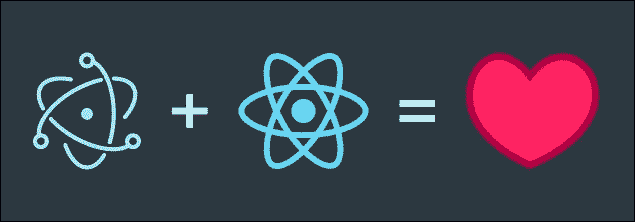
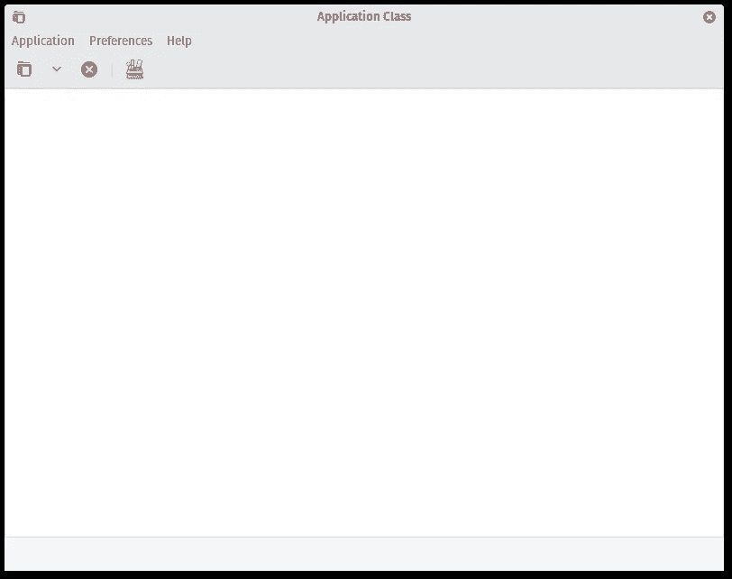
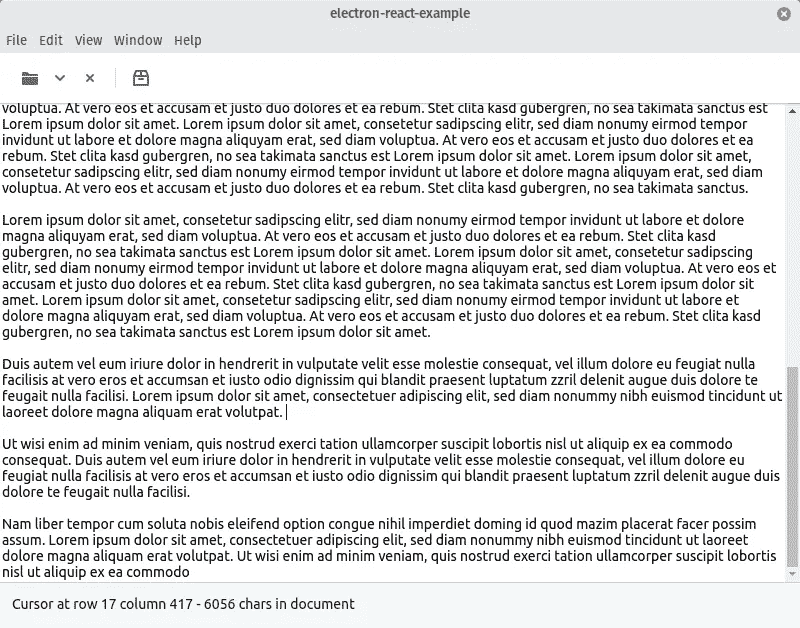

# 带有 Electron 和 React 的跨平台应用程序:第 1 部分

> 原文：<https://betterprogramming.pub/cross-platform-apps-with-electron-and-react-part-1-68d6b6be4c1b>

## 为不同的操作系统创建演示应用程序



*你想用 React 编写跨平台的应用？有了电子和几个 NPM 包，这不成问题。在本教程中，我将向您展示开发在 Windows、Mac 和 Linux 上看起来不错的跨平台应用程序的基础。*

[电子](https://electronjs.org/)和[反应](https://reactjs.org/)的结合使得为 Windows、Mac 和 Linux 编写桌面应用变得容易。Electron 和 React 的结合为您提供了一个熟悉的开发工作流程，这比原生的 [GUI 框架](https://en.wikipedia.org/wiki/Widget_toolkit)的工作流程要舒服得多。

用 React 和 electronic 开发的跨平台应用程序的一个很好的例子是 [Alva](https://meetalva.io/) 。Alva 是一个为 web 组件设计原型的应用程序。

# 什么是电子？

电子允许你用网络技术开发桌面应用程序。它基于 [Chromium](https://www.chromium.org/) 浏览器和 [Node.js](https://nodejs.org/en/) JavaScript 运行时。

通过 Chromium 和 Node.js 的结合，您可以使用您的 web 开发技能，同时通过您的主机系统访问硬件。

用 Electron 开发的流行应用包括文本编辑器 [Atom](https://atom.io/) 和 [Visual Studio Code](https://code.visualstudio.com/) ，桌面应用 [Skype](https://www.skype.com/) 和 [Slack](https://slack.com/) ，以及[更多的](https://electronjs.org/apps)。相当多来自湾区的创业公司似乎使用电子为他们的服务创建应用程序。

使用 Node.js 打开了第三方库的巨大资源——您可以使用 Node.js 生态系统中的几乎所有库。

# 什么是反应？

React 是一个用于用户界面开发的 JavaScript 库。React 是由脸书开发的，开发人员经常用它来开发单页面应用程序，这使得它特别适合用 electronic 进行开发。大部分电子 app 都是[单页 app](https://en.wikipedia.org/wiki/Single-page_application)。

React 的特别之处在于你可以开发你的用户界面[声明式](https://en.wikipedia.org/wiki/Declarative_programming)。这意味着，如果应用程序的状态发生变化，您不必自己更改组件。React 会根据应用程序的当前状态自动更改您的组件。

这种反应行为与 React 本身同名。此外，React 为您的状态管理提供了一些有趣的功能，如果需要，您可以使用第三方库来扩展这些功能。

# 为什么电子和反应？

React 和 Electron 的结合为您提供了一个 GUI 框架，它有很好的文档记录，对开发人员非常友好，并且可以利用一个巨大的生态系统。这是普通 GUI 框架所没有的特性组合——尤其是在 Linux 上。

## 第一步

*对于下面的步骤，我假设你已经掌握了基本的 JavaScript 知识和一些关于 Node.js 的基础知识*

我们的第一步是建立电子与反应。最简单的方法是使用[电子锻造](https://www.electronforge.io/)。Electron Forge 是一个命令行工具，可以轻松设置电子项目。它为不同的电子项目提供了几个模板。你也可以用它来建立一个[打字稿](https://www.typescriptlang.org/)或[角度](https://angular.io/)的电子项目。

这个过程需要一分钟，因为必须下载完整的电子运行时间。最后，您应该会在电子窗口中看到一个新的 React 应用程序。

```
npm install -g electron-forge
electron-forge init electron-react-example --template=react
cd electron-react-example
npm install
electron-forge start
```

用电子创建 React 应用程序的另一种流行方法是使用电子 React 样板文件。我已经决定使用电子锻造，因为它给你更多的选择来打包你的应用程序。Electron React 样板文件为 React 提供了许多缺省值，这些缺省值更多的是问题而不是帮助。


## *为什么不创建-反应-app？*

*关于 create-React-app 的一句话:Create-React-app 是来自脸书的官方工具，用于制作新的 React 应用。事实上，它是为真正的网络应用而不是电子应用设计的。*

*例如，create-React-app 禁止使用原生 Node.js 模块。这种方式将电子降级为一个简单的浏览器窗口，从而破坏了电子的原始想法。*

最后，您应该有以下目录树:

我们将只添加对`src`目录的更改。

# 演示应用程序

我们的演示应用程序将是`gtk3-demo-application`的复制品。



你在 GitHub 上找到这个教程的源代码:【https://github.com/rockiger/electron-react-example[。](https://github.com/rockiger/electron-react-example)

## 第一个修改

为了检查[热重装](https://facebook.github.io/react-native/blog/2016/03/24/introducing-hot-reloading)是否工作，我们将在开始演示应用程序之前进行一个小的修改。

打开文件`app.jsx`并更改占位符文本。

```
...
<h2>Demo Application</h2>
...
```

保存更改后，应用程序中的文本也应随之更改。

为了创建一个真正的 GUI 框架，我们需要一些用户界面组件。为此，我们使用另一个库:Blueprint。

Blueprint 是 React 的 UI 工具包。它为您提供了许多用户界面组件，我们可以用它们来构建我们的用户界面。为了安装 Blueprint，我们将以下代码添加到命令行中:

```
npm i @blueprintjs/core --save
```

之后，我们需要将 Blueprint 的 CSS 文件添加到我们的`index.htm`中。我们在结束的`</head>`标签前添加以下代码:

当你现在重新加载你的应用程序，你应该看到一个不同的字体。

为了重新构建我们的演示应用程序，我们将采取以下步骤:创建工具栏，集成一个 textarea，最后实现状态栏。

为了简化，我们将在一个文件中构建所有内容。在一个真实的应用程序中，为了更好地组织代码，我们会将组件拆分到不同的文件中。

# 工具栏

工具栏组件在蓝图中被称为 [Navbar](https://blueprintjs.com/docs/#core/components/navbar) 。一个 Navbar 至少有一个 NavbarGroup 作为子级。这些 NavbarGroup 组可以将按钮和分隔线作为其子组。

为了重新创建演示应用程序，我们将在导航栏中添加五个元素:四个按钮和一个分隔线。带有向下箭头的按钮将包含在一个弹出窗口中，用来表示菜单。

我们的应用程序代码现在看起来像这样:

首先我们导入必要的模块，然后我们扩展 app 组件。每个 React 组件类都需要一个 render 方法。render 方法的特别之处在于，你可以在其中混合 HTML 和 JavaScript。(还有其他类型的组件。对于本教程来说，讨论它们太过分了。这就是为什么我把你放到 React 文档中的原因。)

为了重新创建工具栏的行为，我们需要为不同的按钮添加`onclick`-处理程序。

因为电子区别于主进程和渲染进程，所以我们需要将电子从主进程导入到渲染进程中，以访问像警告对话框这样的系统功能。

我们已经在第一行中完成了:我们导入了`remote`模块，然后在两个辅音常量中重新分配了`ShowMessageBox`方法和`app`对象。

`onclick`-处理程序很简单。他们只称之为进口电子法。文件夹符号没有 onclick-handler，因为在最初的演示应用程序中它也没有这样做。话虽如此，如果用户单击文件夹符号，显示一个对话框可能是一个很好的练习。

# 文本区域

接下来，我们将添加一个简单的文本区。我们只是使用了一个 [HTML-textarea](https://www.w3schools.com/tags/tag_textarea.asp) 元素。

这不是一个完整的文本编辑器，它只有一个非常基本的 API。市场上有许多库可以在 Electron 和 React 中创建强大的编辑器。

与 React 配合良好的流行文本编辑器有 [Draft.js](https://draftjs.org/) 和 [Slate](https://www.slatejs.org) 。根据这个 [Github-Issue](https://github.com/palantir/blueprint/search?q=richtext&unscoped_q=richtext) 的消息，Blueprint 将会增加一个基于 Draft.js 的文本编辑解决方案，但是这个票已经相当旧了，不清楚他们什么时候推出解决方案。

为了与我们的演示应用程序具有相同的布局，我们将更改封闭 div 元素的 CSS。我们使用 flexbox 来确保 textarea 使用应用程序窗口的整个自由垂直区域。

# 状态栏

最后，我们创建状态栏。状态栏给我们带来了两个挑战:我们需要创建状态栏的布局，这很简单，我们需要在文本区域中显示光标位置和字符数。

我们可以很容易地创建布局。我们创建了一个高度为 50 像素的浅灰色背景的 div 元素。我们重用蓝图中预先定义的颜色，并将它们添加到状态栏的样式属性中。

文档统计稍微复杂一些。我们需要在 React 应用程序中添加状态。React 的伟大之处在于，如果组件的状态发生变化，它们就会更新。

这允许我们为应用程序起草一个简单的状态模型。任何没有 React 经验的人现在应该参考官方 React 文档[并稍后回到这里。](https://reactjs.org/docs/state-and-lifecycle.html)

首先，我们将添加并初始化一个新的状态变量`statistic`。然后我们将在状态栏中显示这些状态变量的内容。

我们来介绍一下状态变量。我们向应用程序组件添加一个构造函数。我们还将稍后创建的一个方法绑定到组件的`this`-对象。

接下来，我们向文本区域添加一个`onKeyDown`-属性。这样我们就可以捕捉到用户对文本区域的输入。为了在状态栏中显示文本区域的变化，我们将以下文本添加到状态栏元素中。

React 允许我们直接超越状态，如果我们把它放在花括号里。当状态改变时，状态栏会自动更新。

最后，我们为用户输入编写一个事件处理程序。这个事件处理程序将改变应用程序的状态。

现在我们来看看我们的演示应用程序，我们看到它看起来非常类似于`gtk3-demo-application`。



在这个作品的[下一部分](https://medium.com/@Rockiger/cross-platform-apps-with-electron-and-react-part-2-3307ae61014a)中，我们将改变应用程序的设计，让它看起来更本土。

[*用命令符*](https://www.dictandu.com/) 创建