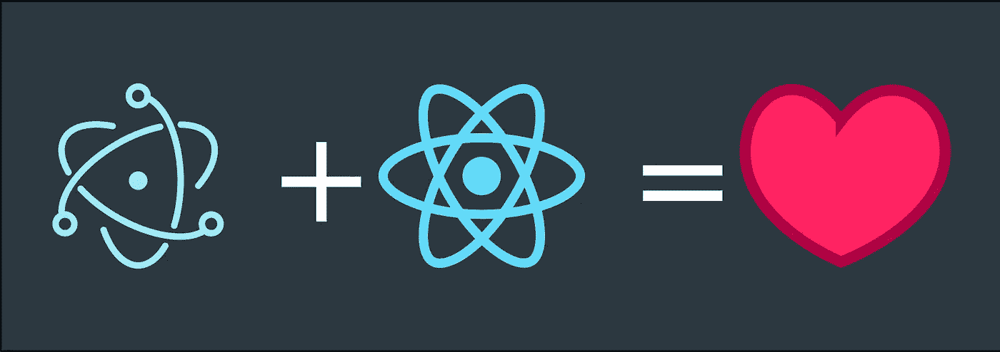
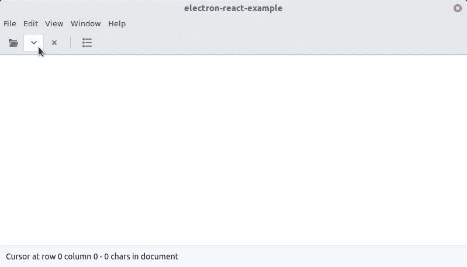
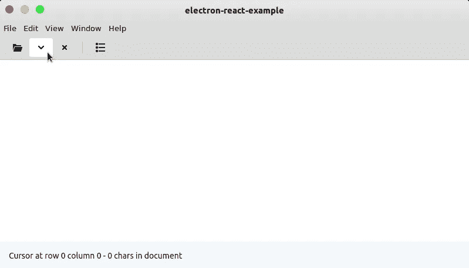
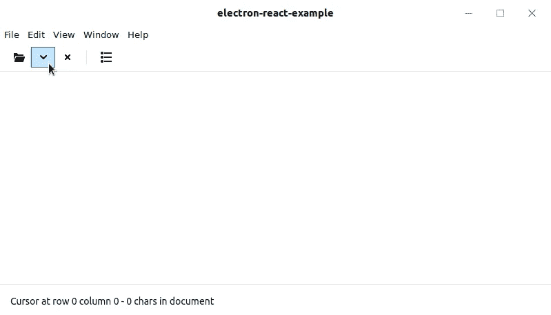

# 带有 Electron 和 React 的跨平台应用程序:第 2 部分

> 原文：<https://betterprogramming.pub/cross-platform-apps-with-electron-and-react-part-2-3307ae61014a>

## 桌面和跨平台风格

在[上一篇文章(第一部分)](https://medium.com/better-programming/cross-platform-apps-with-electron-and-react-part-1-68d6b6be4c1b)中，我们基于 [GTK 演示应用](https://developer.gnome.org/gtk3/stable/gtk3-demo-application.html)编写了一个[电子](https://electronjs.org/)应用。我们创建了应用程序的基本结构，并添加了应用程序提供的功能。

首先，我们只想相应地调整应用程序的外观。首先，我们将找出应用程序运行在哪个操作系统和哪个窗口管理器上。

有了这些信息之后，我们将加载适当的样式表，使应用程序看起来像本地的。

目标不是应用程序看起来 100%像用操作系统的窗口工具包编写的应用程序。我们的目标是通过合理的努力，使应用程序看起来合理，这样我们就不会将其视为异物。

# 应用程序的桌面环境

为了找出应用程序运行的环境，我们需要在启动应用程序时构建一个小的 JavaScript 查询。根据结果，我们将加载一个特定的样式表。

为此，我们打开`index.html`文件，为独立于平台的样式加载`style.css`,并添加以下 JavaScript:

我们使用 [Node.js](https://nodejs.org/) 的[进程](https://nodejs.org/api/process.html)库，我们将首先查看我们在哪个操作系统上。如果我们在 Mac 或 Windows 电脑上，我们使用 CSS 文件`mac.css`或`win.css`。

如果我们在一台 Linux 计算机上，我们已经构建了一个小的特殊功能——我们用 Node.js 运行一个命令行查询，它返回我们当前主题的名称。因此，我们使用适当的 CSS 文件。

主题的选择可以任意扩展。因为我个人用的是[弧主题](https://github.com/NicoHood/arc-theme)，我们就重点说一下。

在这一点上，每个人都必须自己决定要投入多少努力来支持 Linux 用户。我想 Ubuntu 用户的主题也会很有用。这可能是一个很好的练习。

# 跨平台风格

为了创建各个组件的平台兼容样式，我们必须创建各种 CSS 文件。我们从在`src`目录中创建文件夹样式开始。对于每个 CSS 文件，我们必须创建一个。

从组件中移除任何内联样式。否则，我们将很难覆盖它们。

在新创建的样式目录中，我们现在创建文件`style.css`。在这个文件中，我们把所有的样式信息，我们以前插入内联。我们为颜色定义 CSS 变量。

这样做的好处是，你可以通过交换颜色来创建不同的主题。到目前为止一切顺利。

要重新创建 Arc 主题，只需要几行 CSS。至少，对于我们的示例应用程序来说。

首先，我们覆盖所用颜色的 CSS 变量。然后我们修改单个组件的细节。

结果看起来像这样:

我们对 macOS 和 Windows 主题也是如此。我们只需要几行 CSS 代码。

公平地说，这三个主题都可以在没有渐变的情况下管理，因此只需要少量的修改。要重新创建 Gnome 标准主题， [Adwaita](https://gitlab.gnome.org/GNOME/gtk/tree/master/gtk/theme/Adwaita) ，我们必须更加努力。

# 结论

你可以在 Github 上找到这个教程的源代码:【https://github.com/rockiger/electron-react-example

在下一部分中，我们将重建 gtk3-demo-application 的菜单并做一些微调。