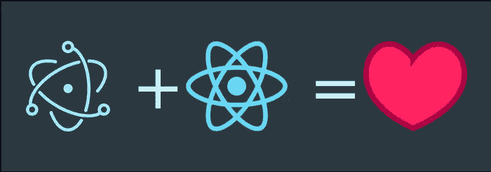
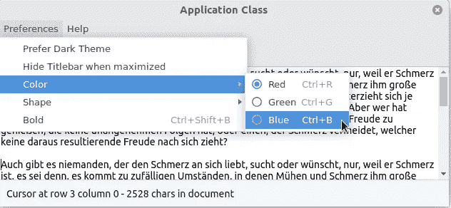
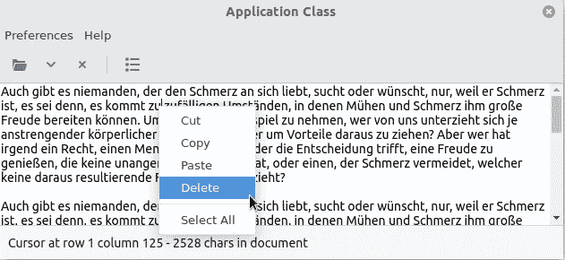
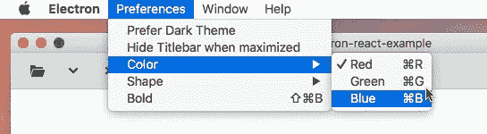

# 带有 Electron 和 React 的跨平台应用程序:第 3 部分

> 原文：<https://betterprogramming.pub/cross-platform-apps-with-electron-and-react-part-3-3992e358029f>

## 现在让我们重建菜单

在[第二部](https://medium.com/better-programming/cross-platform-apps-with-electron-and-react-part-2-3307ae61014a)中，我们给了我们的电子 app 一个适合各个操作系统的外观。根据平台的不同，我们为每个平台使用了额外的样式表，以确保应用程序能够很好地适应。

在这一部分，我们现在将重建`gtk3-demo-application`的菜单。为此，我们将首先构建应用程序的 app 菜单。我们在启动应用程序时定义了这一点。第二步，我们将创建一个在应用程序运行时组成的上下文菜单。

最后，我们会对 Mac OS 做一些优化。Mac 上的应用菜单与 Windows 和 Linux 下的菜单有着本质的不同。

# 应用程序菜单

app 菜单在文件`src/index`中创建。它在应用程序启动时加载。作为菜单的模板，我们使用 JavaScript 数组，其中包含 JavaScript 对象。JavaScript 对象对应于一个菜单项。

菜单模板具有以下结构:

每个菜单项又可以包含自己的子菜单。生成的树提供了应用程序菜单。

使用方法`buildFromTemplate`，我们创建菜单对象。

此外，我们给`src/index.js`添加了一个函数`showMessage`，作为一个虚拟回调函数。

之后，菜单应该是可见的。不再显示开发菜单。对于一个较大的项目，拥有一个在开发模式下显示并在生产时关闭的开发菜单可能是有用的。

# 上下文菜单

演示应用程序也有一个文本编辑的上下文菜单。为了复制这一点，我们进行了一点不同。我们不再从模板中创建它，而是在运行时组合它。

因此，我们不再在`src/index.js`中添加代码，而是在`src/app.jsx`中添加。

首先，我们在应用程序组件的构造函数中定义菜单。因为[菜单类](https://electronjs.org/docs/api/menu)只在主进程中可用，我们需要通过远程对象来访问它。

菜单本身比保留的 app 菜单简单多了。我们只是在上下文菜单中添加了一些标准函数和一个分隔符。我们广泛使用角色选项。这允许我们使用来自电子的[预定义标准菜单。](https://electronjs.org/docs/api/menu-item)

为了访问上下文菜单，我们为文本区域定义了一个`onContextMenu`处理程序。除了简单地打开上下文菜单并连接到主窗口之外，它什么也不做。

现在，您可以右键单击文本区域来打开上下文菜单。

# Mac 菜单

Mac OS 上的应用程序菜单与 Windows 和 Linux 下的应用程序菜单有很大不同。

在 Mac OS 中，每个应用程序都应该提供 3 个标准菜单:

*   `window`
*   `help`
*   `services`

为此，Electron 在 Mac OS 上提供了一组标准菜单。这些有助于菜单的结构。

首先，在`src/index.js`中，我们将应用程序菜单的模板保存在它自己的变量中。

然后，我们调整帮助菜单的角色。

接下来，如果我们在 Mac 上，我们将在应用程序菜单中添加另外两个子菜单。我们使用标准的 JavaScript 方法来扩展模板数组。

现在，当我们在 Mac 上启动示例应用程序时，该菜单将出现在 Mac OS 的全局菜单中。

# 结论

你可以在 GitHub 上找到这个教程的源代码:【https://github.com/rockiger/electron-react-example

在最后一部分，我们将处理电子伪造的包装。