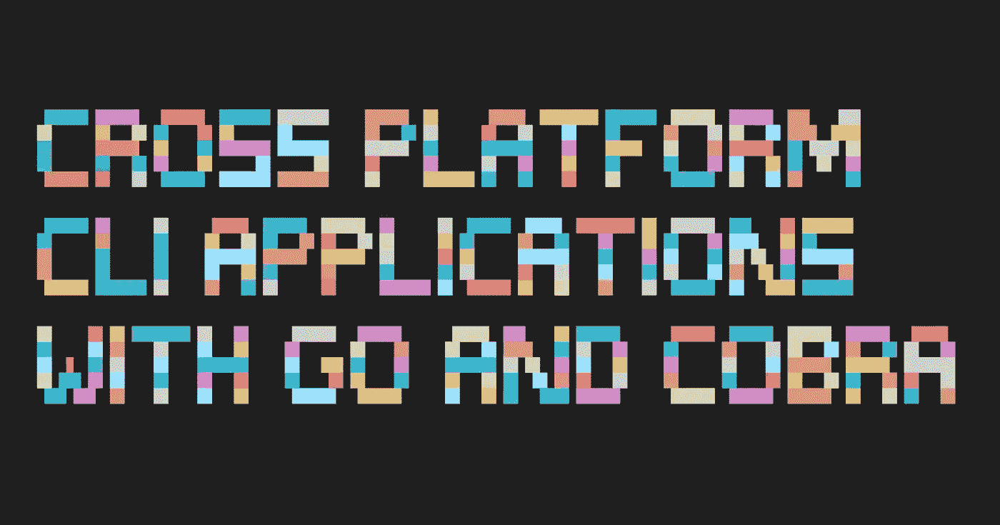

# 用 Go 和 Cobra 构建跨平台 CLI 应用程序

> 原文：<https://betterprogramming.pub/cross-platform-cli-application-with-go-and-cobra-35945894fe68>

## 为多个目标构建 Go 应用程序



本文将介绍使用 Go 编程语言构建一个[命令行界面(CLI)](https://en.wikipedia.org/wiki/Command-line_interface) [1]应用程序的过程和相关组件。我们将涵盖所需的库、目录结构、配置文件、测试和跨平台构建过程。

# **命令行解释器(CLI)**

CLI 代表[命令行界面](https://en.wikipedia.org/wiki/Command-line_interface)【1】。CLI 应用程序接收来自用户的输入，执行一些计算任务并生成输出。与[图形用户界面(GUI)](https://en.wikipedia.org/wiki/Graphical_user_interface)【2】相比，CLI 应用需要更少的系统资源，因为与它的交互不涉及图形。

CLI 应用程序的一个很酷的地方(至少在我看来)是，当设计时考虑到组合并有一个定义良好的输入/输出接口。这些应用程序可以组合在一起(类似于功能组合)作为一个解决方案。

例如，如果我们有两个 CLI 应用程序，A 和 B，我们可以创建一个 A.B 的组合解决方案，输入 A，输出 B。

# **跨平台**

跨平台[5]应用程序被设计成可以在多个计算平台上运行。例如，我们可以构建相同的软件，但在 Linux、Windows 和 Android 设备上运行。这些应用程序也被称为多平台、平台无关或平台独立的。

这是一个非常酷的概念。因为谁想维护比需要更多的软件呢？但在软件设计中也需要考虑。跨平台应用程序需要考虑任何操作系统(OS)细节。在下面几节中，我们将在处理本地文件系统时看到它的例子。

# **CLI 项目设置**

我们将使用[Cobra](https://cobra.dev/)【3】**CLI**框架。 **Cobra** 是一个非常强大的、可扩展的、令人愉快的框架。你不会后悔的，我保证！

使用的 Go 版本:

```
$ go version
go version go1.19 darwin/arm64
```

初始化我们的项目:

```
$ go mod init github.com/Pavel-Durov/cli-demo
go: creating new go.mod: module github.com/Pavel-Durov/cli-demo
```

安装`Cobra`和`CobraCLI`。`CobraCLI`将创建我们的应用程序并添加 CLI 命令。

```
$ go get -u github.com/spf13/cobra/cobra
$ go install github.com/spf13/cobra-cli@latest
```

现在我们可以使用`CobraCLI`来初始化我们的`CLI`应用程序:

```
$ cobra-cli init
```

就是这样。我们有一个可用的应用程序！它应该具有以下结构:

```
$ tree
├── cmd
│ └── root.go
├── go.mod
├── go.sum
└── main.go
```

我们有`main.go`文件，这是我们应用程序的主要入口点。一个叫做`root`的`CLI`命令是 Cobra 框架的主要入口点。将 Go 项目的应用程序入口点放在`cmd`目录中也是一种惯例。

运行我们全新的`CLI`应用程序:

```
$ go run ./main.go
A longer description that spans multiple lines and likely contains
examples and usage of using your application. For example:
Cobra is a CLI library for Go that empowers applications.
This application is a tool to generate the needed files
to quickly create a Cobra application.
```

还没有匹配的内容可看；我们得到默认消息。让我们添加一些功能。

对于这个演示，我们将构建一个计算器`CLI`应用程序。我知道，很刺激！

添加我们的第一个命令

```
//file: ./cmd/add.go
package cmd

import (
 "github.com/spf13/cobra"
)

var addCmd = &cobra.Command{
 Use:   "add",
 Short: "Add operator",
 Long:  `Add operator, adds two integers and prints the result.`,
 Run: func(cmd *cobra.Command, args []string) {
  num1, _ := cmd.Flags().GetInt32("n1")
  num2, _ := cmd.Flags().GetInt32("n2")
  cmd.Printf("%d + %d = %d\n", num1, num2, num1+num2)
 },
}

func init() {
 addCmd.Flags().Int32("n1", 0, "--n1 1")
 addCmd.Flags().Int32("n2", 0, "--n1 2")
 addCmd.MarkFlagRequired("n1")
 addCmd.MarkFlagRequired("n2")
}
```

我们也可以为此使用`CobraCLI`。但我决定手动操作。

注意，我们定义了**使用**属性，这意味着为了使用`add`命令，我们需要在我们的`CLI`参数中指定第一个`add`。

将`CLI`命令连接在一起:

```
//file: ./cmd/root.go
package cmd

import (
 "os"

 "github.com/spf13/cobra"
)

var rootCmd = &cobra.Command{
 Use:   "[command]",
 Short: "A CLI calculator",
 Long:  `A CLI calculator that can add and subtract two numbers.`,
}

func Execute() {
 err := rootCmd.Execute()
 if err != nil {
  os.Exit(1)
 }
}

func init() {
 rootCmd.AddCommand(addCmd) // adding add command to root
}
```

因为我们的命令是同一个包`cmd`的一部分，所以导入和配置非常简单。

重新运行我们的命令，这次使用`-h`标志:

```
$ go run ./main.go  -h
A CLI calculator that can add and subtractwo numbers.

Usage:
  calc [command]

Available Commands:
  add         Add operator
  completion  Generate the autocompletion script for the specified shell
  help        Help about any command

Flags:
  -h, --help   help for calc

Use "calc [command] --help" for more information about a command.
```

如您所见，cobra 为我们做了很多工作。它确实配置了如何解析标志、帮助消息等。

使用指定的参数运行实际命令:

```
$ go run ./main.go  add --n1=1 --n2=3
1 + 3 = 4
```

我们有一个成熟的`CLI`应用程序，可以将两个数字相加，并将结果打印到`stdout`。

让我们添加另一个命令！这次我们将添加替换。

这很简单:

```
//file: ./cmd/sub.go
package cmd

import (
 "github.com/spf13/cobra"
)

var subCmd = &cobra.Command{
 Use:   "sub",
 Short: "Sub operator",
 Long:  `Sub operator, subtracts two integers and prints the result.`,
 Run: func(cmd *cobra.Command, args []string) {
  num1, _ := cmd.Flags().GetInt32("n1")
  num2, _ := cmd.Flags().GetInt32("n2")
  cmd.Printf("%d - %d = %d\n", num1, num2, num1-num2)
 },
}

func init() {
 subCmd.Flags().Int32("n1", 0, "--n1 1")
 subCmd.Flags().Int32("n2", 0, "--n1 2")
 subCmd.MarkFlagRequired("n1")
 subCmd.MarkFlagRequired("n2")
}
```

同前，添加新命令到**根**:

```
...
rootCmd.AddCommand(subCmd)
...
```

试一试:

```
$ go run ./main.go sub - n1=10 - n2=4
10–4 = 6
```

它完全按照预期工作！您可以想象如何使用相同的过程来进一步扩展我们的 CLI 应用程序。

# 添加测试

我喜欢测试，我想你也应该喜欢。在 Go 中添加单元测试非常简单；然而，测试像 Cobra 这样的 CLI 命令可能有点棘手。这就是为什么我想演示如何做。

将测试添加到 root CLI 命令:

```
// file: cmd/root_test.go
func TestTypeLocal(t *testing.T) {
 buf := new(bytes.Buffer)
 rootCmd.SetOut(buf)
 rootCmd.SetArgs([]string{"sub", "--n1=10", "--n2=4"})

 err := rootCmd.Execute()
 if err != nil {
  fmt.Println(err)
 }
 if buf.String() != "10 - 4 = 6\n" {
  t.Errorf("Expected 10 - 4 = 6, got %s", buf.String())
 }
}
```

这里，我们为 cobra 命令设置了一个缓冲区作为输出流，并传递了 **CLI** 参数(也称为标志)，然后我们断言输出结果——没什么特别的。

运行测试:

```
$ go test ./…
ok github.com/Pavel-Durov/cli-demo/cmd 0.207s
```

# **添加配置文件/设置**

如果我们想要跨会话存储应用程序配置，或者我们想要在应用程序代码之外定义 API 密钥之类的秘密，我们该怎么做？不管什么原因，眼镜蛇会保护你的！实际上，[毒蛇](https://github.com/spf13/viper)【4】挺你。Viper 是一个用于 Go 应用程序的配置管理工具。毒蛇和眼镜蛇配合得很好。

安装*毒蛇:*

```
$ go get github.com/spf13/viper
```

在我们的 init 函数中配置 Viper，root cmd:

```
// file: cmd/root.go
func initConfig() {
    home, err := os.UserHomeDir()
 cobra.CheckErr(err)
 viper.AddConfigPath(home)
 viper.SetConfigType("yaml")
 viper.SetConfigName(".calc")
 viper.ReadInConfig()
}

func init() {
 cobra.OnInitialize(initConfig)
    ...
}
```

如果我们在我们的`$HOME`目录中创建一个名为`.calc`的本地`YAML`文件(因为这是我们配置的),其内容为:

```
$ cat ~/.calc
username: kimchi
```

我们现在可以在应用程序中读取这些值:

```
username := viper.Get("username")
if username != nil {
    fmt.Println("Hello", username)
}
```

我们不必使用`YAML`或`$HOME`目录；这种设置可以通过多种方式进行配置。

## **关于$HOME 目录的说明**

注意我们如何使用`os.UserHomeDir()`来获取用户的主目录。如果我们想要构建一个[跨平台](https://en.wikipedia.org/wiki/Cross-platform_software)【6】的应用程序，这是很重要的。我们可以硬编码文件的路径。但是我们为什么要这样做呢？Go 拥有强大的平台无关库支持— `os.UserHomeDir()`将返回特定于运行它的机器的`$HOME`目录的路径，而无需我们更改一行代码！

*   在 Unix(包括 macOS)上，它返回`$HOME`环境变量
*   在 Windows 上，它返回`%USERPROFILE%`
*   在计划 9 中，它返回环境变量`$HOME`

# **构建我们的 CLI 应用**

Go 有一个令人难以置信的构建系统，它提供了我们需要的一切。

我们可以轻松地为多种架构和操作系统(OS)构建我们的应用程序:

## **Linux 目标构建**

```
$ CGO_ENABLED=0 GOOS=linux GOARCH=arm64 go build -o out/linux-arm64-calc -ldflags="-extldflags=-static" # linux, arm64 arch
$ CGO_ENABLED=0 GOOS=linux GOARCH=amd64 go build -o out/linux-amd64-calc -ldflags="-extldflags=-static" # linux, amd64 arch
```

## **Mac(又名达尔文)目标构建**

```
$ CGO_ENABLED=0 GOOS=darwin GOARCH=arm64 go build -o out/darwin-arm64-calc -ldflags="-extldflags=-static" # mac, arm64 arch
$ CGO_ENABLED=0 GOOS=darwin GOARCH=amd64 go build -o out/darwin-amd64-calc -ldflags="-extldflags=-static" # mac, amd64 arch
```

## **Windows 目标版本**

```
$ CGO_ENABLED=0 GOOS=windows GOARCH=arm64 go build -o out/windows-arm64-calc -ldflags="-extldflags=-static" # windows, arm64 arch
$ CGO_ENABLED=0 GOOS=windows GOARCH=amd64 go build -o out/windows-amd64-calc -ldflags="-extldflags=-static" # windows, amd64 arch
```

如果我们运行所有这些构建命令，我们将得到这些二进制文件:

```
$ ls -l ./out/
-rwxr-xr-x  1 ... darwin-amd64-calc
-rwxr-xr-x  1 ... darwin-arm64-calc
-rwxr-xr-x  1 ... linux-amd64-calc
-rwxr-xr-x  1 ... linux-arm64-calc
-rwxr-xr-x  1 ... windows-amd64-calc
-rwxr-xr-x  1 ... windows-arm64-calc
```

## **环境变量**

**GOOS**

您可能已经注意到，构建目标之间唯一改变的是`GOOS`环境变量。这就是你使用 go-build 工具所需要改变的一切！它真的很容易使用！

`GOARCH`

这是我们指定我们的目标 **CPU** 架构的地方。

查看所有支持的`GOOS`和`GOARCH`组合:

```
$ go tool dist list
aix/ppc64
android/386
android/amd64
android/arm
android/arm64
darwin/amd64
....The list goes on
```

## **CGO _ 启用**

我们还使用了`CGO_ENABLED`环境变量。`CGO_ENABLED=1`带来更快更小的构建——它允许动态加载主机操作系统的本地库。但是，它依赖于主机操作系统，这是我们希望避免的依赖！否则，如果我们的代码依赖于主机库，我们的代码行为可能会因机器而异。

## **链接器标志— ldflags**

我们使用名为`ldflags` — `ld`的标志代表[链接器](https://pkg.go.dev/cmd/link) [6】，因此`ldflags`代表链接器标志。链接器是一个将编译后的源代码片段“链接”成二进制结果的程序。我们将`extldflags`传递给我们的链接器。根据链接工具文档，这些标志被传递给外部链接器。简而言之，我们使用这些标志来指示 Go build 工具将所有依赖项包含到二进制文件中，而不依赖于运行环境提供的依赖项。我们将标志设置为`-static`，表示二进制文件应该包含它的所有依赖项。如果没有指定，我们的二进制文件将被动态链接。出于与`CGO_ENABLED`相同的原因，我们想在这里避免它。

# **总结**

我们已经看到了如何从头开始设置基于 Cobra 的 CLI 应用程序。我们讨论了跨平台的应用程序属性，比如平台无关的文件系统路径。我们添加了测试，并简要概述了具有不同目标配置的链接器和 Go build 工具。

一旦掌握了基础知识，为多个目标构建 Go 应用程序就变得简单而有趣。

这篇文章是为了我自己理解和组织我的想法，因为它是关于知识分享的。我希望它对你有帮助

完整的源代码可以在[这里](https://github.com/Pavel-Durov/blog/tree/main/src/cross-platform-cli-apps-with-go-and-cobra/examples)找到。

# **参考文献**

[1][https://en.wikipedia.org/wiki/Command-line_interface](https://en.wikipedia.org/wiki/Command-line_interface)

[2][https://en.wikipedia.org/wiki/Graphical_user_interface](https://en.wikipedia.org/wiki/Graphical_user_interface)

[https://cobra.dev/](https://cobra.dev/)

[https://github.com/spf13/viper](https://github.com/spf13/viper)

[https://en.wikipedia.org/wiki/Cross-platform_software](https://en.wikipedia.org/wiki/Cross-platform_software)

[https://pkg.go.dev/cmd/link](https://pkg.go.dev/cmd/link)