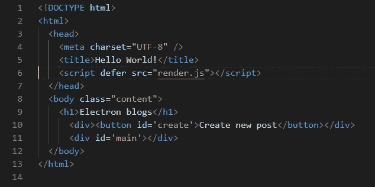
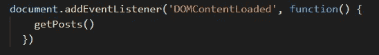
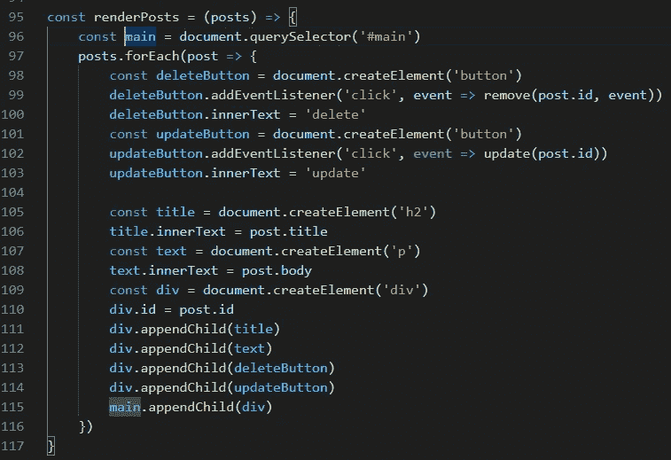
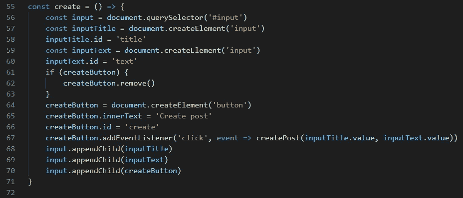
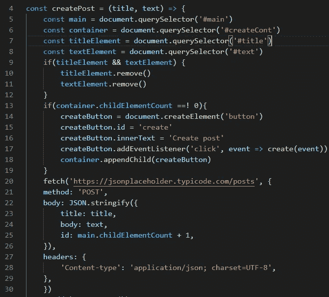
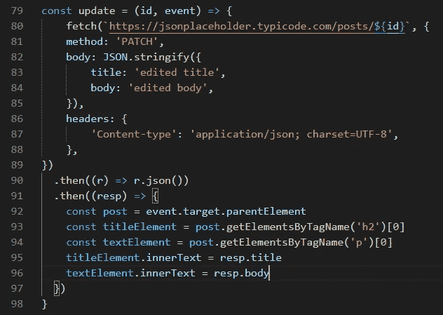
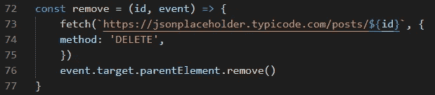

# 带有桌面电子应用程序的 CRUD

> 原文：<https://betterprogramming.pub/crud-with-a-desktop-electron-app-8ef0f121b047>

## 在我们的电子应用程序中执行操作

图片来源:[维基媒体](https://upload.wikimedia.org/wikipedia/commons/thumb/9/91/Electron_Software_Framework_Logo.svg/1200px-Electron_Software_Framework_Logo.svg.png)

上周我写了一篇关于[用 Electron](https://medium.com/better-programming/basic-desktop-application-with-electron-4f91922fb294) 创建基本桌面应用的文章。今天我们将讨论在我们的应用程序中执行 CRUD 操作。

仅供参考，CRUD 是*创建、读取、更新和删除*操作的缩写。

虽然我们没有真正的 API，但我们可以使用 [JSONPlaceholder](https://jsonplaceholder.typicode.com/) 假 API。所有发送到这个 API 的请求都将得到一个响应，就像我们在处理一个真实的数据库一样，但是在 JSONPlaceholder 端不会有任何变化。

让我们从一个 HTML 文件开始:

这里我们可以看到我们正在导入`render.js` 脚本，并为一些 HTML 元素分配一些 id。请记住这一点，因为我们接下来将使用这些 id。

# 阅读

我们的初始操作将是一个读操作。当我们的应用程序加载时，它通常会向数据库发送一个 GET 请求来检索数据，这样我们就可以在 DOM 上呈现一些东西。

因为这将是文档的初始加载，我们需要告诉浏览器在加载时调用一些函数。我们打算这样做:

您可能已经注意到，我们在加载事件中调用了函数`getPosts()`。这个函数将执行读取操作。它将向 API 发送 GET 请求，然后在 DOM 上呈现接收到的数据。看起来是这样的:

此外，我可以为我们超级博客中的每个帖子附加的所有后续操作播种种子(事件侦听器)。

# 创造

现在让我们执行创建操作。它将分两个阶段发生。

点击后，我们将为新帖子创建一个输入表单:

接下来，我们将向 API 发送一个 POST 请求:

当收到来自 API 的请求时，我们可以重新呈现 DOM。

# 更新

对于更新操作，这有点不同，因为我们必须在数据库中找到特定的记录来更新。但是我们知道我们在谈论一个 RESTful API，我们可以通过唯一 ID 找到特定的记录，这将是我们马上要访问的 URL 的一部分。

此外，在收到来自 API 的响应后，我们必须更新 DOM。

因此我们有一个`update` 函数，我们向它传递两个参数，即所选记录的 ID 和事件对象。ID 将被插入到获取的 URL 字符串中，事件对象将用于查找和更新所选文章的 HTML 元素。这是这样的:

# 删除

删除操作非常简单。与更新操作类似，我们将传递所选文章的 ID，并在 URL 中使用它来命中 API 中的正确记录。然后我们只需发送一个请求类型`DELETE`并重新呈现 DOM，而不需要等待响应——因为不会有响应:

这里是`render.js`文件的完整代码:

# 结论

今天，我们学习了如何用我们奇特的电子桌面应用程序进行基本的 CRUD 操作。接下来，我们将尝试优化渲染和重新渲染 DOM 的过程，并使数据管道更加有组织。

不断学习，不断成长！