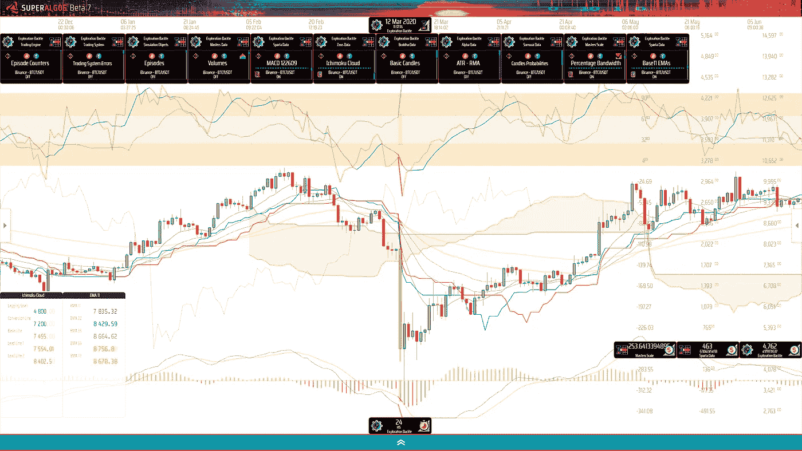
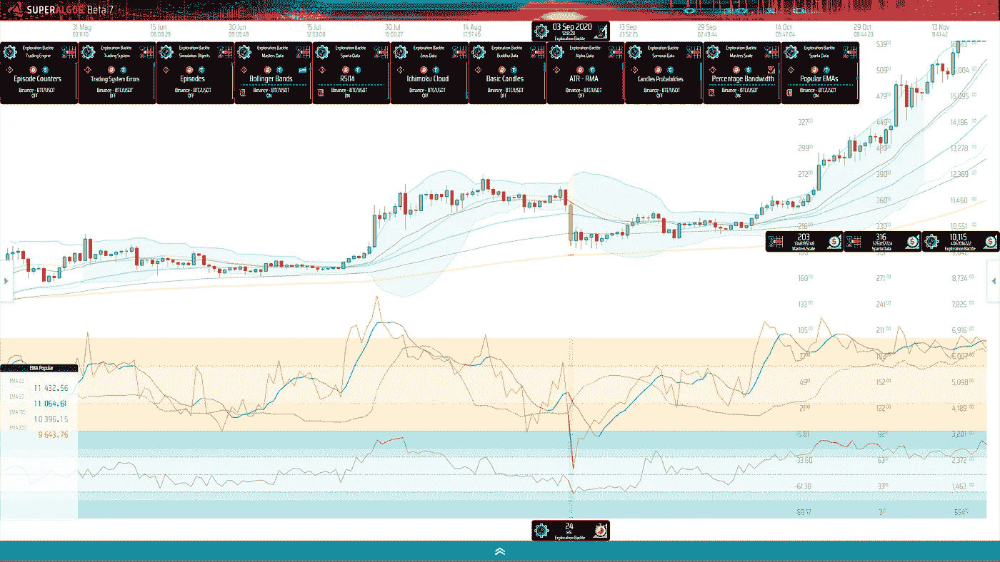
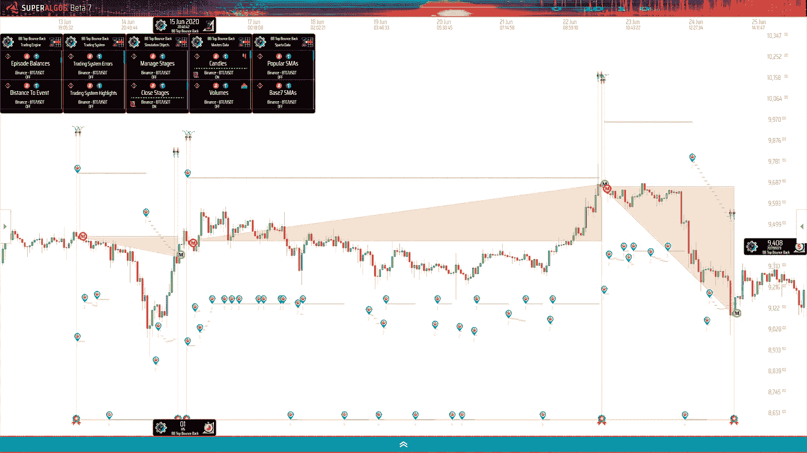
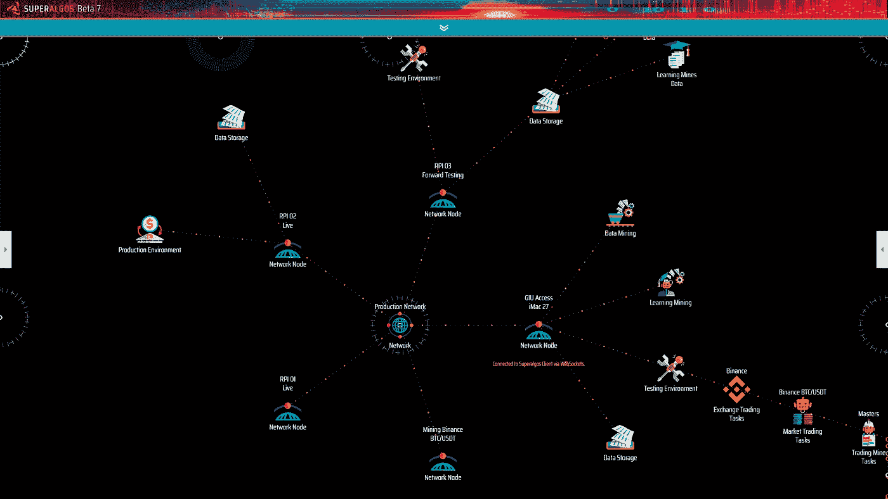

# 加密交易机器人和交易智能的出现

> 原文：<https://betterprogramming.pub/crypto-trading-bots-and-the-emergence-of-trading-intelligence-27104e7cbf84>

## 交易智能来自于利用多个复杂概念的相互作用。整体方法至关重要

2020 年 3 月 12 日比特币的崩盘。图片来源:作者

*编者按:本文仅供教育娱乐之用，并非理财建议。您在加密货币交易方面采取的行动完全是您自己的，更好的编程不以任何方式负责。*

算法交易是一种数据驱动的应用。最重要的是，从数据中获取智能的能力，使得系统交易中的数据科学方法比自主交易中的直觉方法更具优势。

然而，假设交易智能仅仅来自数据科学是错误的——过于简单。

交易智能来自利用多个复杂概念的相互作用，因此，一个整体的方法是必不可少的。

当开始一个交易自动化项目时，掌握交易中涉及的概念——以及它们的相互作用——应该是首要的要求。第二是有助于利用这些概念的软件基础设施。

这篇文章浓缩了一群深入研究自动加密交易的朋友三年的实地经验。它面向考虑进入算法交易领域的开发者、数据科学家和交易者。

在这篇文章中，我分析了交易智能出现的必要条件，以及从数千小时尝试不同方法中提炼出来的洞察力。我整理了在开发集团交易自动化基础设施的过程中所学到的经验教训，并揭示了在此过程中向社区开源的工具。

让我们首先就文献中经常使用的三个术语的含义达成一致，这三个术语容易引起混淆。

*   一个 ***交易系统*** 是一个处理低级逻辑的框架，用于构建用来实现和部署交易策略的过程和方法。
*   一个 ***交易策略*** 是分阶段运行的一组动作或事件的描述。事件是在描述特定市场情况的精确条件得到验证时触发的。交易策略旨在通过持仓和管理头寸，在交易系统的更广泛计划中实现特定目标。
*   ***交易机器人*** 是一种计算机程序，它基于可用的数据集，在运行交易会话时应用交易策略中定义的交易逻辑。这些会议可能是涉及模拟的测试会议，也可能是涉及在交易所下单和管理真实订单的现场交易会议。

# 鸟瞰图

一般来说，交易策略的特点是一套指令，其目标是根据市场数据分析做出交易决策。因此，交易逻辑的质量与数据分析能力密切相关。

让我们首先关注人类编程的交易逻辑，将 AI 实现留给未来的文章。

交易的想法来自于数据分析和数据可视化。

为了想出何时卖出或买入资产的规则，交易者需要根据交易想法制定假设。交易理念中最受欢迎的领域之一来自所谓的*技术分析*。

虽然有些人可能认为市场以随机的方式运行，但大多数交易者认为，人类做出交易决策的心理会影响市场的行为。因为人类倾向于被恐惧或贪婪等情绪驱动(或至少受其影响)，所以当暴露于环境刺激时，他们倾向于以某种可预测的方式做出反应。在某种程度上，交易员认为，这导致了原本混乱的(资产)价格运动中出现模式。

当然，还有其他影响价格的因素，这可能会导致不同时间尺度的模式出现，如影响特定市场、供求关系、与其他市场的互动、全球政治、资产基本面等的微观和宏观经济原则。正是影响市场的多组不受约束的变量使市场变得如此复杂和难以理解。

因为算法交易是一个数据驱动的应用程序，因为人类编程的交易逻辑主要来自对模式的观察，我们可以得出结论，数据可视化也是一个重要的组成部分。全权交易者花无数时间盯着市场图表是有原因的:根据他们看到的做出交易决定。作为一个算法交易者，你也花时间在图表上——这是传统交易者的一小部分——在你的情况下，想出交易的想法，然后在你的交易策略中作为规则执行。

交易策略来自于交易思想的实施、测试和调整。

一旦一个交易想法被描述为一套规则，你需要测试你的策略，看看它在历史数据(我们称之为*回溯测试*)和实时数据(我们称之为*纸上交易*)上的表现如何。

交易策略的测试是系统交易的一个重要方面，因为测试的精确度和可靠性直接影响测试与现实的对应。为了让您的测试具有预测实时交易性能的价值，它们需要考虑实时交易的工作方式以及影响实时交易会话的所有变量——例如，*交易所费用*和*滑点*，即下单率与交易所的订单匹配引擎实际完成订单率之间的差异。

实时交易表现来自自动化交易策略的优化部署。

在实时交易会话中部署自动化策略相当于处理真实资金的任务关键型金融应用程序。交易机器人必须是健壮的，必须经过大量的测试和质量保证才能被信任。

它还需要灵活，并具有跟踪策略活动的功能，比如记账、提供管理、移动或取消订单的能力，等等。

我们稍后会谈到其他考虑因素。目前，值得注意的是算法交易需要相当多的基础设施。

# 利用关键概念

从鸟瞰图部分可以看出，可靠地设计、测试和部署交易策略需要大量的软件基础设施。让我们简要回顾一下这种基础设施的最重要的特性，从现在开始我们将称之为*平台*。

## Exchange 连接

密码交易所总是在公众的青睐中来来去去。当我们第一次开始研究交易机器人时，Poloniex 处于食物链的顶端。几个月后，当我们的基础设施处于可用的 alpha 阶段时，Poloniex 已经不在交易所前 20 名的名单中了。

在受欢迎的交易所进行交易之所以重要，是因为只有受欢迎的交易所才能提供适当的流动性，也就是说，在订单簿中有足够的买盘(买入订单)和卖盘(卖出订单)，以保证没有单笔订单会显著影响价格。

你不想承诺任何特定的交换。至少，你的平台应该能够连接不止一个流行的交易所。如果你想利用交易所的低效率，这一点尤其重要，例如，确定某些交易所相对于其他交易所是否会导致重大的价格变动。

交换公开 API，API 可能会随着时间的推移而发展和变化。维护不同的连接器是一项长期挑战。

您的平台应该能够处理各种连接问题，并保证从交换中提取的数据以及交易的完整性。

对于任务关键型应用程序来说，通过互联网进行连接是很棘手的。在应用程序级别、网络级别、exchange 的 API 和内部系统级别以及两者之间的任何地方，经常会出现大量问题，可能会中断、延迟或破坏您与 exchange 的交互。

## 数据挖掘技术

你需要可靠的市场数据来测试交易理念的实施和做出交易决策。这意味着您需要处理历史数据集和来自交易所的实时数据。

交易所提供小块的原始交易或蜡烛线数据。你想获得完整的市场历史，这样你就可以应用统计研究和使用长期指标，如移动平均线。

数据集中的一个漏洞可能会以不可预测的方式扭曲您的数据分析，因此从交换中提取数据和构建数据集的过程必须是防弹的。

原始市场数据是你在寻找模式、相关性和交易机会时需要进行的大量转换的起点。

你的平台应该提供典型的技术分析研究，但也应该提供工具来建立你自己的。

这就是你能从普通交易者容易获得的数据中提取的信息的不同之处。

## 数据可视化

人类是视觉动物。虽然我们的大脑被封闭在黑匣子中，但它们已经进化出传感器来感知环境，并将有价值的数据发送给中枢神经系统进行解释。视觉是我们的主要传感器。

算法擅长处理数字，但作为一个人，你可以从可视化数据中受益匪浅。是你需要在数据中找到灵感，想出交易的点子。

可视化数据是发展交易理念的关键。

您的平台将受益于集成的图表系统，以充分利用数据。理想的情况是，计数功能允许在典型的市场图表上绘制各种数据，在这些图表中，您可以比较数据集，以找到算法会遗漏的视觉线索。

## 策略测试

您应该能够在历史数据集上无缝地回测您的算法。你还希望能够用实时数据测试远期策略，既不用在交易所下实际订单(称为纸上交易)，也不用用一小部分资金下实际订单(称为远期测试)。

回溯测试和前瞻测试的表现都不能准确预测未来的表现，但是如果你的策略在测试中表现不佳，那么你就没有理由信任它们，用你的资本进行实时交易。

交易机器人应该能够在回测和纸上交易时尽可能准确地模拟现场交易。它需要模拟交易事件，比如订单的填写，包括订单跟踪和管理的细微差别，这将在本文的订单管理部分中描述。模拟越接近现实，就越有可能预测真实的交易表现。

这是在你部署你的交易策略之前需要的基本测试功能。但是，还有一些更高级的平台特性可能会对您的策略性能产生巨大影响。其中一些在早期阶段，即策略设计和调整阶段非常有用。

例如，分析策略行为的能力不仅仅是在一个合并的回溯测试性能报告上，而是在每个交易的基础上直接在图表上进行图形模拟。这些特性使得对交易规则的精细分析成为可能，并将微调和优化提升到一个新的水平。

模拟三个连续的位置，描述进场和出场事件，以及动态止盈和止损目标。

类似地，使用健壮的策略调试解决方案进行计数也是非常可取的。最重要的是始终能够访问由交易机器人处理的运行时信息，以便容易地检测规则定义的潜在缺点。

## 订单管理

乍看之下，下订单似乎是一个简单的问题。然而，交易机器人也应该提供足够的智能来跟踪和管理订单。

订单可能以不同的速度完成，可能在一段时间内逐步完成，也可能根本没有完成。每次订单被部分执行时，交易所会对执行的部分收取费用，这些费用需要进行核算。由于多种原因，订单完成的速率可能不是您的算法预期的速率，包括滑动、小数位数的舍入等。所有这些事件都必须由交易机器人处理，以便交易会话与交易所发生的事情同步。

此外，交易机器人应该至少做一些基本的簿记工作来跟踪余额，以便交易会话可以正确地使用分配的资本。

## 可扩展部署

自动化交易相对于人工交易的一个主要优势是能够处理几乎无限多的策略。在发展阶段，你的操作可能包括在多个交易所的多个市场上运行的多个策略。为了实现这种能力，您需要软件基础设施来协调资源的使用。

资源的有效利用也构成了交易智能。

跨多台机器部署多个协调任务

您的平台应该能够协调跨不同机器的数据挖掘和交易任务的部署，以便操作可以随着策略的产生而扩展。协调需要有效，以便在相同市场和交易所运行的策略可以共享相同的数据源。

## 基础设施可扩展性

一个成功交易的交易自动化平台应该能够满足寻找和利用交易机会的不同方法。前面描述的关键概念构成了一个坚实的基础结构，适用于技术分析、统计分析、情感分析以及几乎任何基于数据挖掘的方法。

# 我从哪里开始？

有很多方法可以让你接近算法加密交易的前景。要解决的第一个问题与目标有关:你的目标是什么？

如果你想做的只是测试你的技能，试一试，看看效果如何，那么你可能不需要关心你在这篇文章中读到的任何东西。

如果你的目标是在算法交易中取得成功，认真对待这篇文章。成功意味着获得积极可靠的交易业绩。用外行人的话来说，成功意味着持续赚钱。

幸运的是，要利用促成交易智能出现的关键概念，你不需要自己构建整个基础设施。事实上，避免这种情况是合理的，甚至是可取的。

编码、调优和稳定如此庞大的基础设施可能需要一个高级开发人员数年的工作；这就是复杂的程度。相反，您可以使用开源工具或整个平台并为之做出贡献。

你的重点应该是产生数据挖掘，从而产生交易想法，并把这些想法应用到交易策略中。这不仅是算法交易的乐趣所在，也是决定你的努力是否会带来积极可靠的业绩的因素，所有其他事情都是理所当然的。

如果你希望专注于开发交易智能而不是基础设施，那么下一步就是调查现有的开源算法交易平台，寻找最适合你需求的平台。

> 请随意查看我们的主 [GitHub 库](https://github.com/Superalgos/Superalgos)，看看我们开发的内容是否对您有用。我们已经在 Apache License 2.0 下发布了我们所有的工作。

由于来自加密领域，我甚至不会考虑将我的策略托付给一个可能会随时改变其服务条款、商业政策、商业模式甚至拒绝访问的公司实体。这些都不是什么大问题。最糟糕的情况是，一家公司变得邪恶，利用你的战略知识抢先一步，甚至在你不知情的情况下卖掉它们。开源软件解决了所有这些问题。