# CryptoKitties:智能合同分解

> 原文：<https://betterprogramming.pub/cryptokitties-smart-contract-breakdown-2c3c250d33f6>

## 通过对代码行进行分组来解释其功能

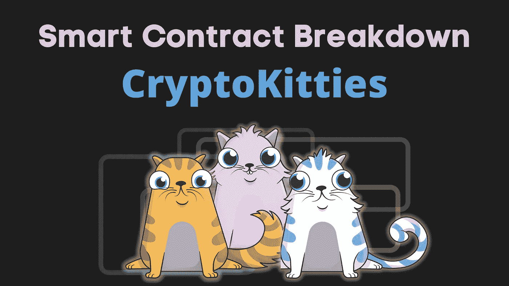

我对 CryptoKitties 项目一直很感兴趣。这是有史以来第一个流行的 NFT 游戏。但我不明白它的吸引力，为什么它会爆炸。我也从来没有完全理解游戏的动态。所以我决定最终了解这个游戏是关于什么的，以及它是如何在幕后实现的。

我很清楚 NFT 部分是作为 ERC-721 实现的。但我想了解繁殖是如何实现的。什么是保持链内和链外？随着我开始探索这个游戏，我了解到它有一个拍卖机制。这是如何实现的？

而人们实际上从这个东西中赚了多少？人们还在玩它吗？或者它已经被更成功的 Axie Infinity 完全取代了？

在本文中，我们将回答所有这些问题，并分解 CryptoKitties 背后的智能合约。下面是这篇文章的提纲:

*   什么是 CryptoKitties？
*   代码结构(核心、繁殖、拍卖)
*   密码猫的时间线
*   我对守则的看法

# 什么是 CryptoKitties——短游戏动力学

一开始我[想让](https://twitter.com/nazar_ilamanov/status/1499868504685694984?s=20&t=EKhVZEsy5AUsVoa_F0P6Hw)做一个 Axie Infinity(AI)的分解。但事实证明，人工智能并没有开源他们的大多数智能合同(SCs)。所以我转向 CryptoKitties(CK)(它的合同是公开的)。这是一个简化版的人工智能，具有类似的游戏动态:

*   基于区块链的游戏
*   人们收集和交易小猫
*   可以繁殖两只小猫来得到一只新的小猫
*   通过出售或出租猫咪来获得真正的 ETH
*   育种工作以“基因”为基础。小猫咪混合了父母的基因
*   小猫没有性别
*   CK 通过收取市场佣金(拍卖费)和铸造新猫咪来赚钱
*   要进入游戏，你需要购买一些小猫

如果你感兴趣，这里有一个 CK 游戏的视频。

> Axie Infinity 的灵感来自 CryptoKitties、Pokemon(用于战斗)和后来的 Clash of Clans(用于土地)。[更多关于 AI](https://www.notboring.co/p/infinity-revenue-infinity-possibilities?s=r) 的起源和商业方面。

# 代码结构

CK 有 3 个智能合同:核心，育种和拍卖。


源代码:

*   **核心与拍卖:** [以太扫描](https://etherscan.io/address/0x06012c8cf97bead5deae237070f9587f8e7a266d#code)，[要诀](https://gist.github.com/yogin/b88b105d9b2e332a5b59a3fd29cac962)
*   **育种:**以太扫描 [v1](https://etherscan.io/address/0xf97e0a5b616dffc913e72455fde9ea8bbe946a2b#code) 和 [v2](https://etherscan.io/address/0xb77feddb7e627a78140a2a32cac65a49ed1dba8e#code)

## 核心合同

核心合同被分解成许多子合同:`KittyBase`合同继承/扩展`KittyAccessControl`合同，`KittyOwnership`扩展`KittyBase`等。`KittyCore`什么都有。

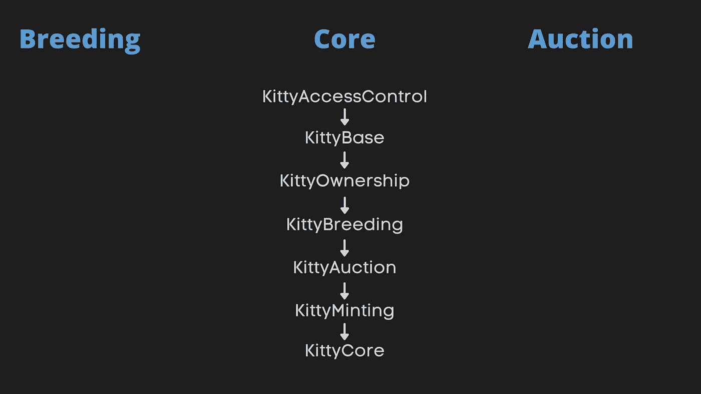

*   `KittyAccessControl`:创建 3 个角色:CEO、CFO、首席运营官，并限制这些角色对某些功能的访问。CEO 可以重新分配角色，更改指向兄弟合同的指针。CFO 可以提取资金。首席运营官可以铸造新的小猫。

*   `KittyBase`**:**kitties 的数据结构；存储所有小猫和所有权信息；所有权的转移。

*   `KittyOwnership`:ERC-721 接口的实现。我在我的 [BAYC smart 契约分解](https://ilamanov.medium.com/bored-ape-yacht-club-smart-contract-breakdown-6c254c774394)中解释了 ERC-721 的实现。有兴趣就去看看。

> 你知道 CryptoKitties [开创了](https://github.com/ethereum/EIPs/issues/721) ERC-721 标准并创造了术语 NFT 吗？

*   `KittyBreeding`:将在“育种”部分说明。
*   `KittyAuction`:将在“拍卖”部分解释。
*   `KittyMinting`:只能铸造 50K 只小猫——5K 为促销小猫，其余为常规 gen0 小猫。(区别:promo 可以在造币时转移到特定地址，常规 gen0 只能拍卖)。在铸造过程中可以指定任何基因。

*   `**KittyCore**` **:** 将一切联系在一起，添加支付/取款，并处理可升级性——将在本文后面讨论。

> 以太坊 101 中的支付:
> -要接受支付，只需使用您的功能`payable`。`msg.value`变量包含已发送的金额
> -要向某个地址发送付款，只需使用`address.send`。

# 饲养

育种逻辑在核心合同的`KittyBreeding`子合同中实现。

*   首先，有一堆助手函数，如`isReadyToBreed`、`isSiringPermitted`、`isValidMatingPair`等。
*   然后有两个功能实际上做育种。`breedWith`开始繁殖过程，`giveBirth`结束繁殖过程。`giveBirth`只有在孕育期结束后，呼叫才会成功。

## 助产士和自动分娩

我们可以假设`breedWith`是有人发起育种时从 CK 前端调用的。但是`giveBirth`是怎么叫的？Solidity 中没有回调或`cron`作业。所以以后需要有人叫`giveBirth`。

这就是助产士的用武之地。CK 有一个 autoBirth 守护进程网络，它在正确的时间调用`giveBirth`。任何人都可以建立一个守护进程。

但是打电话`giveBirth`费油。为什么恶魔会为别人付油钱？这就是`autoBirthFee`的用武之地。当玩家开始繁殖时，他需要向 CK 支付`autoBirthFee`(目前为 0.04 ETH)。CK 稍后会在调用`giveBirth`时补偿守护进程。

## 超秘密遗传组合算法

您可能注意到了`giveBirth`函数调用`mixGenes`函数来获取子基因。这个`mixGenes`函数实际上是一个名为`GeneScience`的兄弟契约的一部分(源代码: [v1](https://etherscan.io/address/0xf97e0a5b616dffc913e72455fde9ea8bbe946a2b#code) 和 [v2](https://etherscan.io/address/0xb77feddb7e627a78140a2a32cac65a49ed1dba8e#code) )。`KittyBreeding`只是存储一个指向`GeneScience`契约的指针。

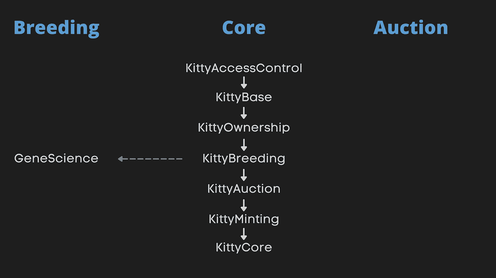

最初，`GeneScience`并没有开源到“[刻意围绕 CryptoKitties 基因组](https://www.cryptokitties.co/blog/post/learn-how-our-last-mystery-smart-contract-works/)培养神秘感和发现。但是社区建立了工具来逆向工程基因科学算法。CK 随后开源了它，甚至发布了稍加改进的第二个版本( [CK 博客帖子](https://www.cryptokitties.co/blog/post/learn-how-our-last-mystery-smart-contract-works/))。

> **`**GeneScience**`**合同时间表:**2017 年 11 月发布 v1，2019 年 1 月开源，2019 年 2 月发布 v 2(已经开源)。**

**我不会覆盖`GeneScience`代码，因为它太低级了。但我将强调几点。**

**`GeneScience`涉及大量的比特操作来混合母猫的基因。记住，基因是以 256 位数字的形式存储在`Kitty struct`中的。这些比特被映射到决定小猫外貌的特征(或者 CK 喜欢说的属性)。**

> ****随机性是如何产生的？** Solidity 没有随机数生成器，所以 CK 使用后代出生时的块号作为随机性的种子。这个块号很难操作，所以它应该有足够的随机性**

# **拍卖**

**CK 的最终合同是拍卖。CK 采用一种“ [**时钟拍卖**](https://en.wikipedia.org/wiki/Dutch_auction) ”:你设定起止价格和持续时间。然后价格从起始价格到结束价格线性变化。谁先出价，谁就赢。**

**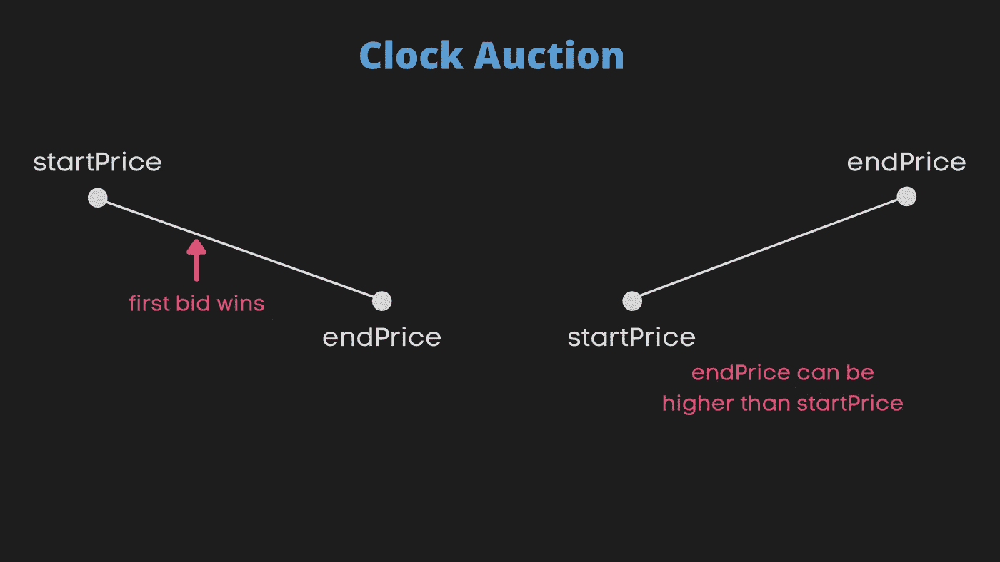**

**以下是拍卖合同的结构及其与其他合同的关系:**

**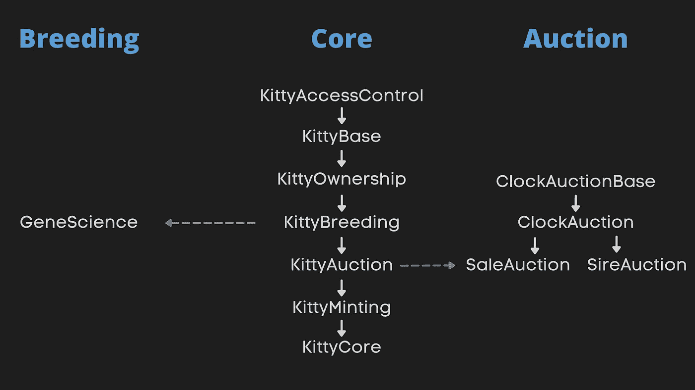**

*   ****ClockAuctionBase:** 跟踪现有的拍卖和出价功能**

*   ****clock action:**只是`ClockAuctionBase`上面的一个包装**

*   **`SiringClockAuction`和`SaleClockAuction`:分别是出租你的小猫用于繁殖的拍卖和出售你的小猫的拍卖。这些需要分开，因为在一个成功的投标后采取的行动是非常不同的。**
*   **`SaleClockAuction`除了跟踪最近 5 次拍卖的价格(用于为新生产的小猫设定最佳拍卖起始价格)之外，没有增加太多功能。**
*   **`SiringClockAuction`是`ClockAuction`合同的另一个包装器，只不过它将租来的小猫转让给主人，而不是投标人(投标人保留后代)。**

**它们与`KittyAuction`分包合同中的核心合同相关联:**

****总结拍卖:**你为你的小猫创建了一个拍卖，它被转移到拍卖合同，并且创建了一个新的拍卖。每当有人出价成功时，要么小猫被转让给出价人(当它是出售拍卖时)，要么小猫被转让给你，但出价人保留后代(当它是拍卖时)。**

# **密码猫的时间线**

**我们看到了代码。但是代码是静态的，它没有告诉我们动态的画面。部署合同后发生了什么？**

**您可以在 Etherscan 上查看该合同[的全部交易历史。如果我们回到起点:](https://etherscan.io/address/0x06012c8cf97bead5deae237070f9587f8e7a266d)**

**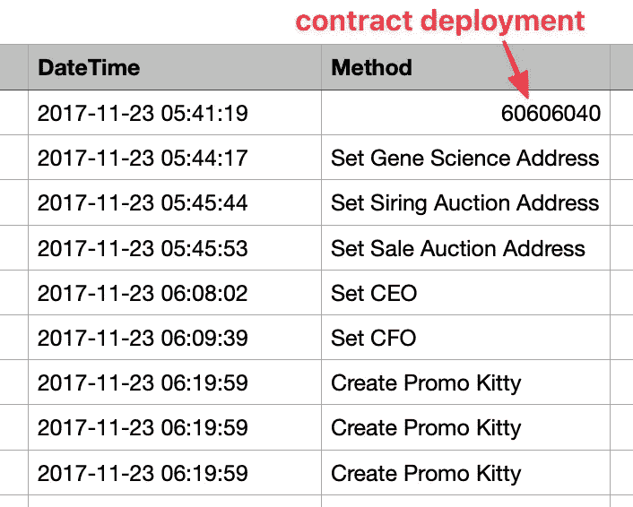**

**我们可以看到该合同是在 2017 年 11 月 23 日部署的。然后，他们设置兄弟合同的地址，并设置 CEO/CFO 角色。然后他们创造了一群宣传猫(确切地说是 3K)。**

**然后，他们解除合同(这意味着大多数功能现在都可用)，行动开始了:**

**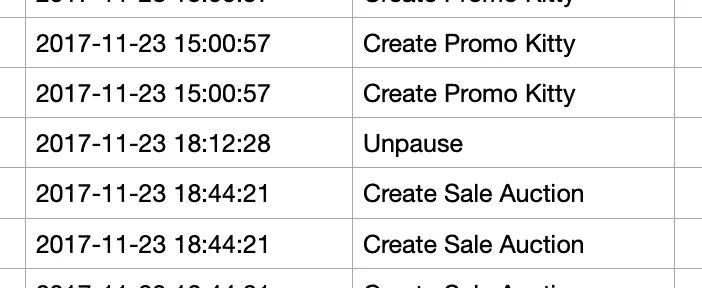**

**以下是一段时间内的合同余额(来自 [Etherscan analytics](https://etherscan.io/address/0x06012c8cf97bead5deae237070f9587f8e7a266d#analytics) ):**

**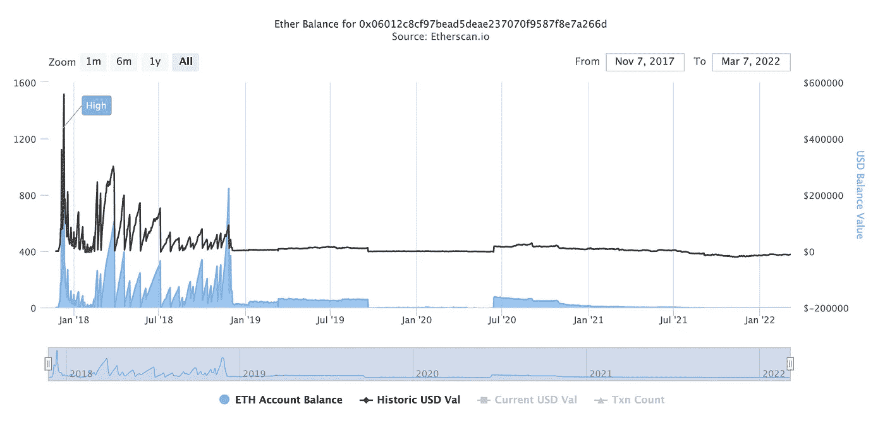**

**蓝色:ETH 天平(天平在左边)。黑色:美元余额(刻度在右侧)**

**急剧下降的是 CK 团队的退出。我们看到大多数行动发生在 2017 年 11 月至 2018 年 11 月。从 [CK 时间线网站](https://www.cryptokitties.co/Technical-details)来看，CK 在 2018 年 1 月峰值时有 25 万用户。同样在 2017 年 12 月，CK 占据了以太坊 25%的流量。**

**下面是交易频率图:**

**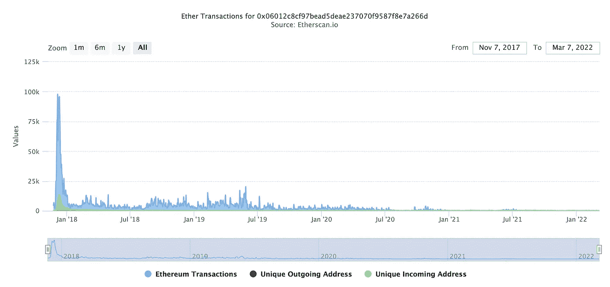**

**虽然从 2018 年 11 月到 2019 年 7 月仍有大量交易，但它们都是低价值的，因为该地区的余额相对持平。**

# **我对守则的看法**

*   **首先也是最重要的是，**艺术并不存在于链上**。基因保存在链上，但理想情况下，小猫的图像也将在链上生成(像艺术块)。**
*   ****CK 甚至没有把*链接*到作品链上**。他们可以使用`getMetadata`函数返回不可变图像的链接。相反，他们只是返回“你好，世界”🤷‍♂️.从`tokenIds`到图像的映射发生在前端。因此，如果 CK 关闭他们的网站，你只会留下一个毫无意义的 256 位数字。**

*   ****可升级性不理想**。可以通过在 KittyCore 合同中设置新地址来更新核心合同。在这种情况下，将会发出一个事件，由客户端决定是否监听该事件并切换到新的契约。旧的会永远停顿。**

**现在说积极的一面**

*   ****良好的关注点分离:**育种和拍卖与核心契约分离，以最大限度地减少 bug。你可以在不破坏核心**的情况下插入兄弟契约的更新版本。****
*   ****清晰的代码和对可靠性的深刻理解**。整个合同中有许多有用的注释。防范再入攻击并最大化气体效率:**

**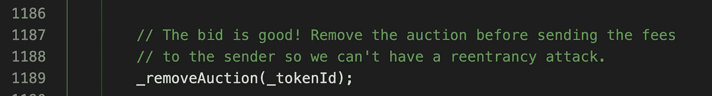****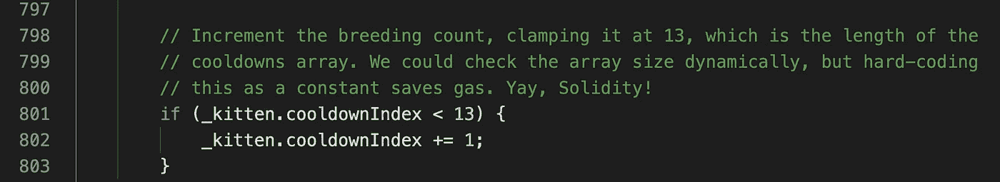**

*   ****良好的幽默感**:**

**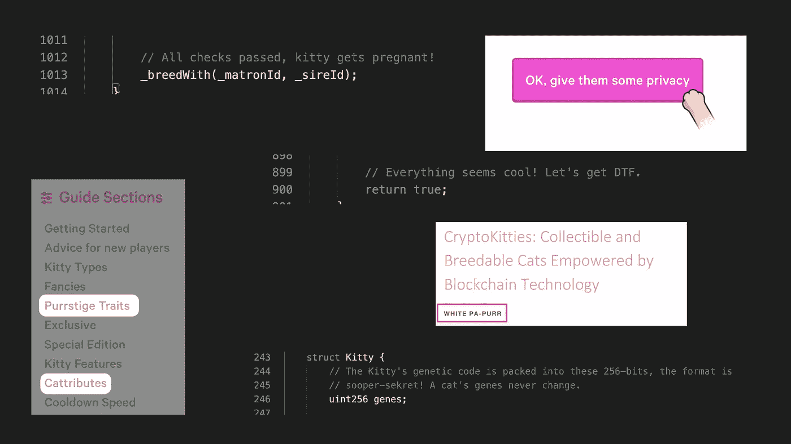**

**CryptoKittes 智能合约分解到此结束！我希望这有所帮助。如果你有任何问题，请在评论中告诉我。**

**我正计划对流行的智能合约进行更多的分解，如 **Aave** 和 **Art Blocks，**所以请在 Medium 或 Twitter 上关注我以获取更新。**

**你还可以在[solidnoob.com](https://www.solidnoob.com/)查看其他智能合同的细目表和更多 Solidity noobs 的资料。**

```
**Want to Connect?**Follow me on [Twitter](https://twitter.com/nazar_ilamanov).
```