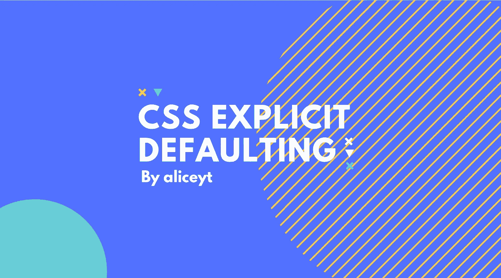
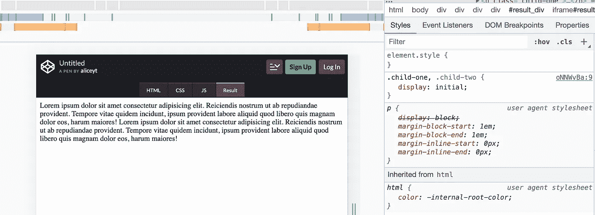
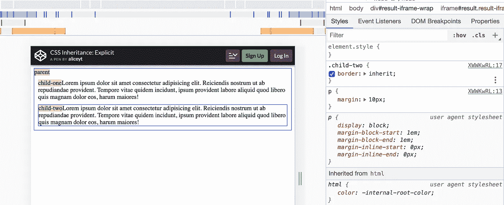
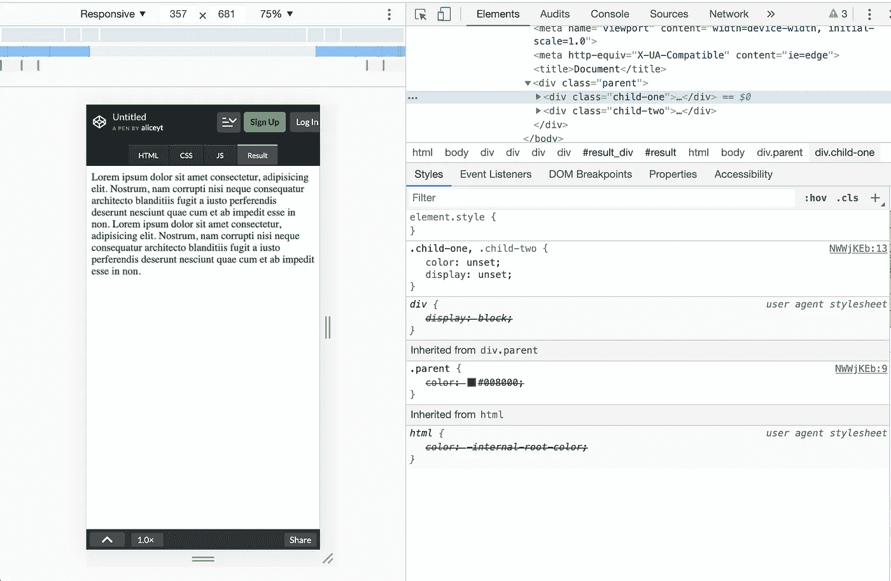
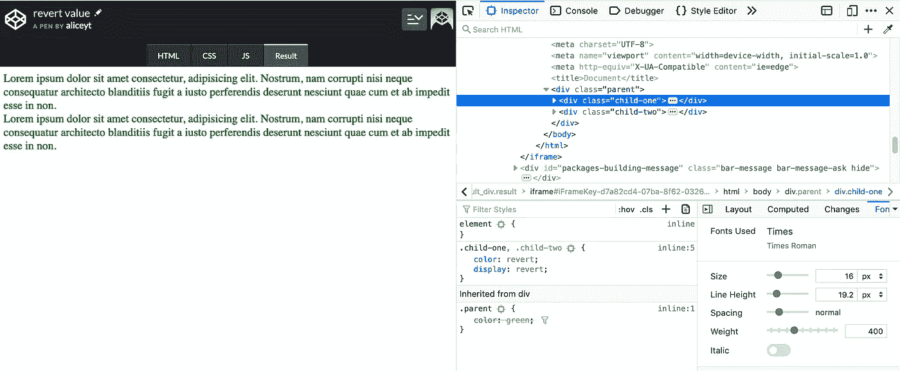
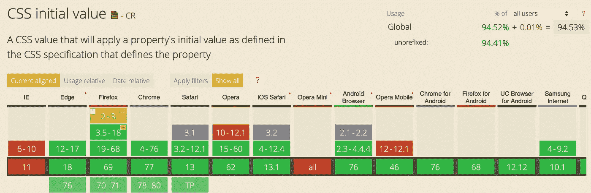
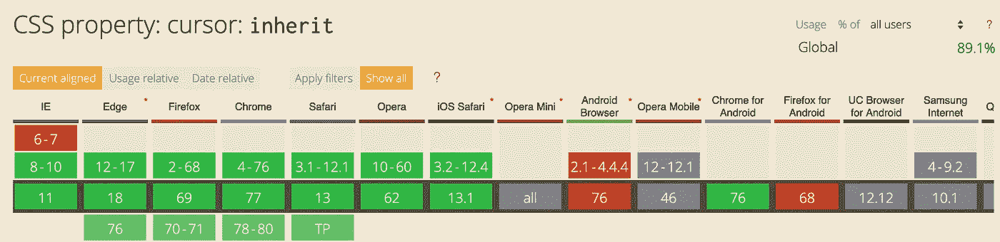
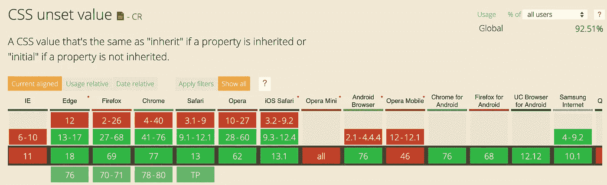
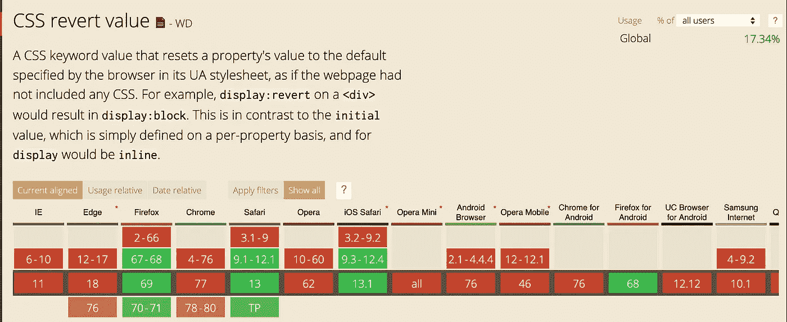

# CSS 显式默认:初始、继承、取消设置和恢复

> 原文：<https://betterprogramming.pub/css-explicit-defaulting-initial-inherit-unset-and-revert-9110647cdaa1>

## CSS 中使用的四个值

资料来源:aliceyt

`initial`、`inherit`、`unset`和`revert` 值用于设置属性的默认值。虽然它们可能看起来相似，但它们会导致不同的行为。让我们逐一查看，以便更好地理解。

# 1.重置属性:初始

每个属性都有一个 CSS 规范中的`initial`值，如[属性的定义](https://www.w3.org/TR/CSS/#properties)中所定义的。

## 使用

将元素的属性重置为其初始值。我们可以把它看成是它的原值。

## 例子

显示的`initial`值为`inline`。

当元素被声明为`display: initial`时，它们被显示为 inline。

**注意**inline 的值不是来自浏览器。在下面的例子中，我们可以看到用户代理样式表(浏览器的默认样式表)中的`display: block`已经被覆盖。

# 2.显式继承:继承

元素可以通过继承从其父元素继承 CSS 样式。一些属性(*继承属性*)是默认继承的(例如`font-family`)，而其他属性必须显式声明。

## **用法**

将属性值从父元素传递到子元素。

## 例子

边框不是继承的属性。

当我们在子元素上声明`border: inherit`时，它从父元素继承了边框样式。

# 3.清除所有声明:取消设置

元素属性的声明值可以用`unset`删除。

## 使用

移除元素属性的声明值。移除后，属性值将采用

*   `inherit`值(如果是继承的属性)或
*   符合规范的`initial`值。

## 例子

颜色是继承的属性，而显示不是。

当我们在父元素上应用`color: green`时，子元素将继承颜色。

如果我们在前面提到的子元素上应用`color: unset`，文本的颜色仍然是绿色，因为它现在采用了`inherit`值。

至于显示属性，当我们应用`display: unset`时，我们有效地将其值设置为`initial`，这是基于 CSS 规范的`inline`。

# 4.回滚级联:恢复

最后一个值是`revert`，我们可以用它将元素的属性值回滚到:

*   它的继承值(如果是继承的属性)或
*   浏览器的默认值。

## 例子

颜色是继承的属性，而显示不是。

和以前一样，当我们在父元素上设置`color: green`时，子元素继承颜色样式。当我们对上述子元素应用`color: revert`时，文本的颜色保持绿色，因为值现在回滚到`inherit`。这个类似于`color: unset`。

对于显示属性，应用`display: revert`会给我们一个与`display: unset`不同的结果。这些元素现在是块元素，而不是行内元素，因为我们回滚到浏览器样式表的默认值。

我希望现在你对这些价值观有了更好的理解。当您想要指定特定的默认行为时，它们会很有用。但是，在使用它们之前，请检查浏览器支持。

最后一个注意事项——如果您想重置除 direction、unicode-bidi 和自定义属性之外的所有 CSS 属性，最快的方法是使用速记属性`all`,例如 `all: initial.`

# 浏览器支持

# 资源

*   [W3C 的 CSS Cascade 4](https://www.w3.org/TR/css-cascade-4/)
*   [cani use 提供的浏览器支持](https://caniuse.com)
*   [CSS 按 MDN 还原](https://developer.mozilla.org/en-US/docs/Web/CSS/revert)
*   [我的 Codepen 集合，包含我在本文中使用的代码](https://codepen.io/collection/AxEWJe/)