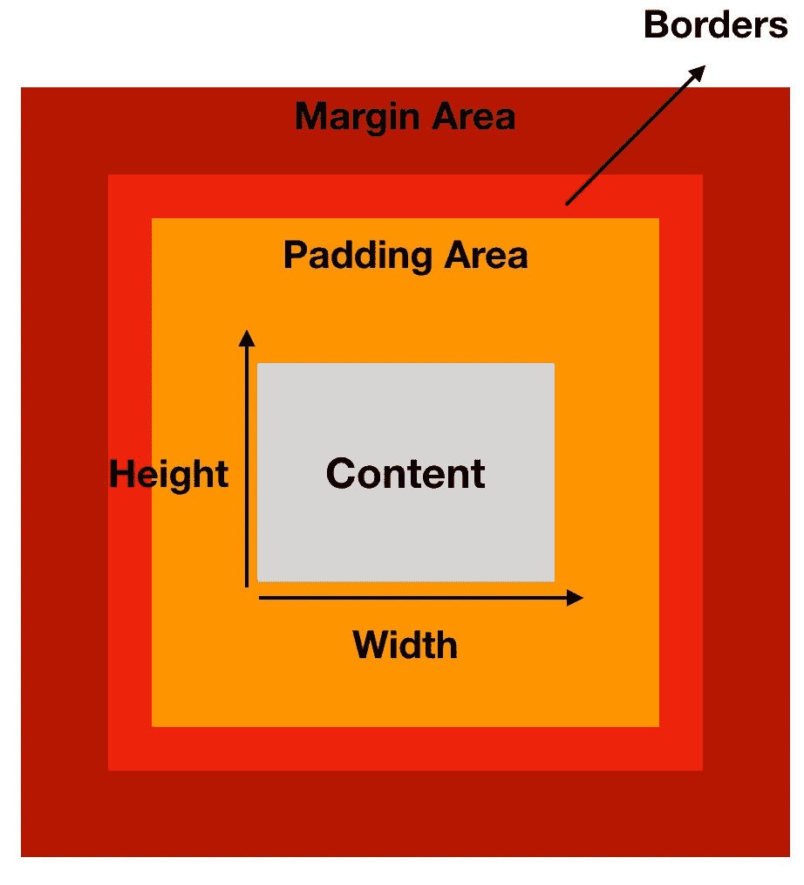
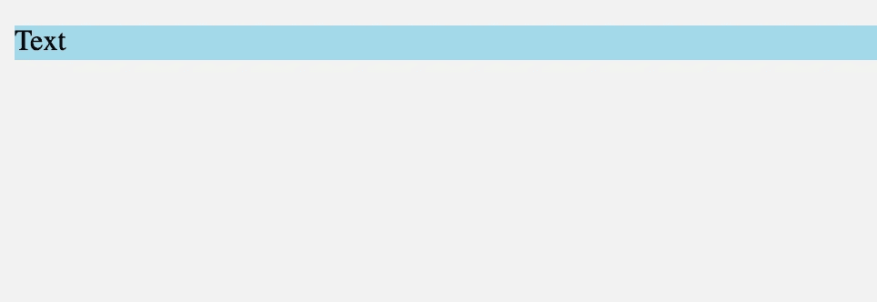
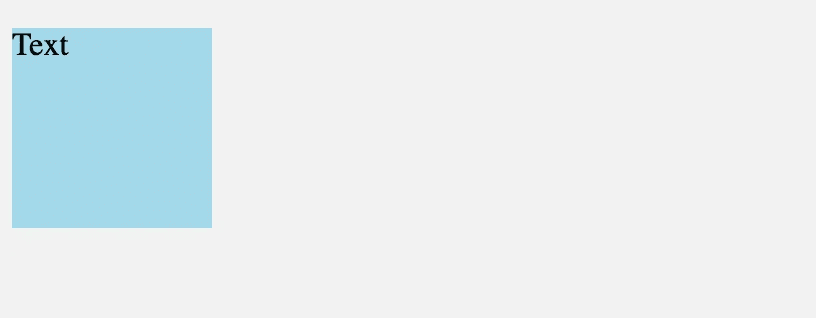
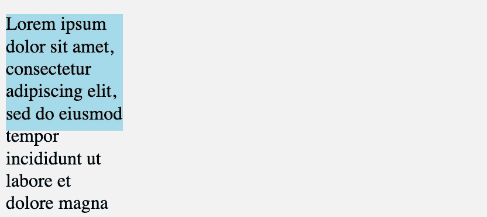
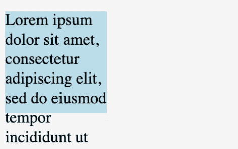
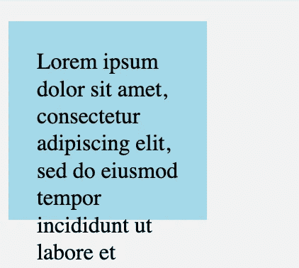
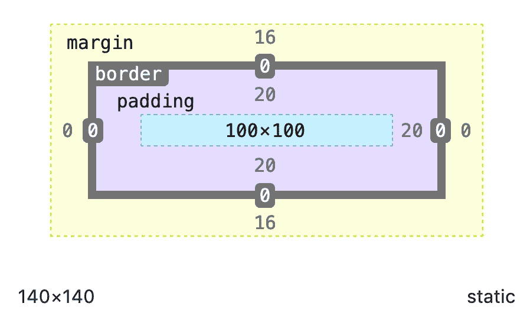
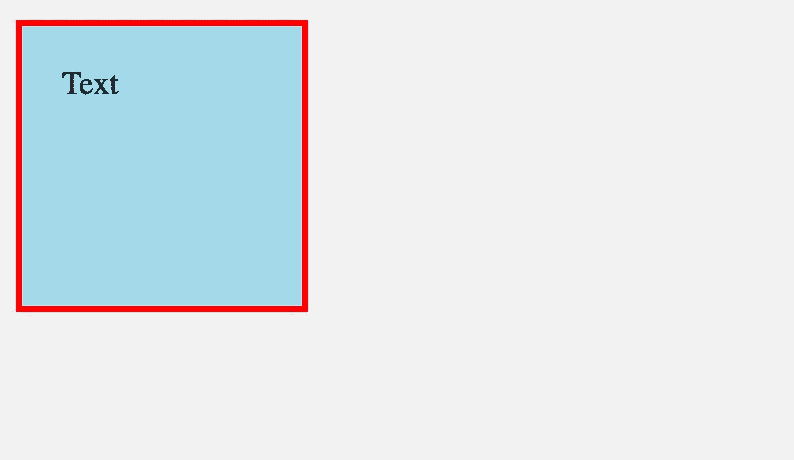
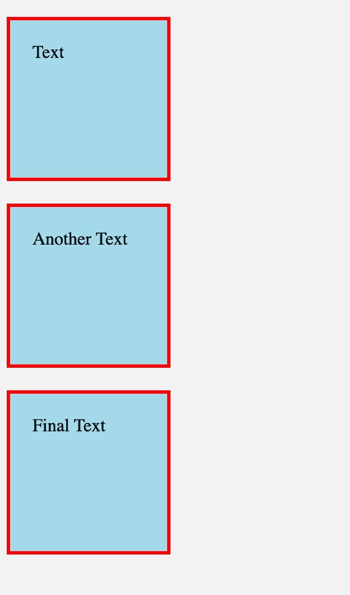
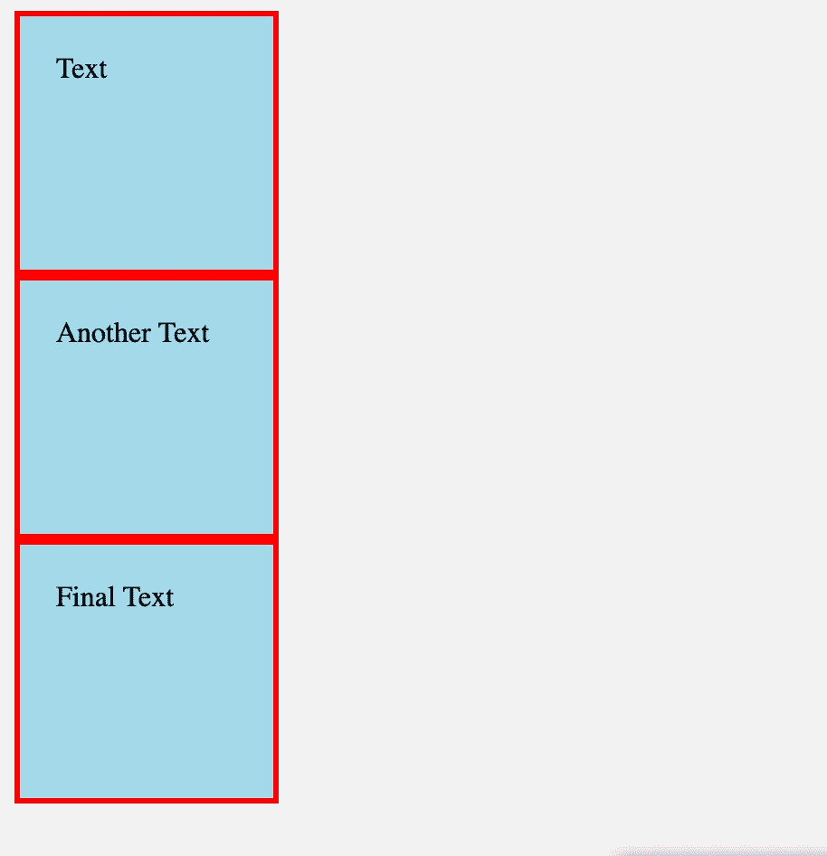

# 面向初学者的 CSS

> 原文：<https://betterprogramming.pub/css-for-beginners-af73426c6388>

## 盒子模型解释道


由[前进](https://unsplash.com/@headwayio?utm_source=medium&utm_medium=referral)在[前进](https://unsplash.com?utm_source=medium&utm_medium=referral)拍摄

网页上的每个 HTML 元素都可以被认为是一个盒子，在 web 开发中，我们使用 CSS 来设计它们的样式并对齐它们。理解这些盒子的概念对提高你的 CSS 技能很重要。

元素(框)由内容字段和附加属性(如填充、边框和边距)组成。这个结构被称为 CSS 盒子模型，在这篇文章中，你将学习盒子模型是如何工作的。

# 箱式模型的结构



盒子模型

从盒子模型的角度来看，这就是网页中元素的样子，盒子里的盒子。根据箱式模型，元素由四部分组成:

*   内容(元素本身)。
*   填充(内部空间)。
*   边框。
*   边距(外层空间)。

每个盒子有四个边:顶部、底部、左侧和右侧。因此，我们可以将填充、边框和边距分别或一起应用于每一侧:

```
padding: 10px;        // adds 10px to all sides
padding-right: 10px;  // adds 10px only to right
```

现在，让我们更详细地看看它们。

# 内容

内容区域是元素本身，没有任何填充、边框或边距。考虑到我们有一个包含一些文本的`<p>`标签:

```
<p class="article">Text</p><style>
  .article {
    background: lightblue;
  }
</style>
```



**< p >** 标签的内容区域(浅蓝色背景)

浅蓝色字段是元素的内容区域。由于`<p>`标签是一个[块级元素](https://medium.com/better-programming/understanding-css-display-none-block-inline-and-inline-block-63f6510df93)，它占据了页面的整个宽度。

该元素还有一个`width` 和一个`height` 属性。这些属性会根据内容的大小自动调整，除非我们定义它们:

```
.article {
  background: lightblue;
  width: 100px;
  height: 100px;
}
```



这里的宽度和高度是 100 像素

然而，如果内容变得太大，给元素一个固定的`height`会导致溢出问题:

```
<p class="article">Lorem ipsum dolor sit amet, consectetur adipiscing elit, sed do eiusmod tempor incididunt ut labore et dolore magna aliqua.</p>
```



提示:最好不要给元素赋予一个`height`属性，但是如果必须的话，我们可以用[溢出属性](https://medium.com/better-programming/a-guide-to-using-the-css-overflow-property-5fd5bbd038c9)来解决这个问题。

# 填充区域

内容之后的盒子模型的下一部分是`padding`区域。如果您再次查看本文开头的图片，您会看到填充区域是内容和元素边框之间的区域。

我们对元素进行填充，以在内容和边框之间创建一些空白空间。

无填充的元素:



具有 20px 填充的元素:

```
.article {
  background: lightblue;
  width: 100px;
  height: 100px;
  padding: 20px;  
}
```



填充增加了内容和边框之间的空间

# 宽度和高度的重新计算

这就是人们感到困惑的地方。我给了元素的宽度和高度 100px，但是在声明了`padding`属性之后，盒子变大了。

因此，当我们检查该元素时，我们看到内容的宽度和高度仍然是 100 像素，但是它的实际宽度和高度是 140 像素:



Firefox 开发工具截图

发生这种情况是因为，根据盒子模型，不仅内容，而且填充和边框都被算作元素的一部分。这就是为什么正确的计算应该是这样的:

实际宽度=边框-左侧+填充-左侧+宽度+填充-右侧+边框-右侧。

实际高度=边框顶部+填充顶部+高度+填充底部+边框底部

或者

您可以使用另一个 CSS 属性`[box-sizing](https://www.w3schools.com/css/css3_box-sizing.asp)`来代替。框大小为您提供了在计算时省略填充和边框的选项。(我也推荐你用。)

# 边界

正如我们从现实世界中所知，边界是某物或某处的结束线。盒子模型也一样。边框是元素的结束线。



`border`属性的常见用法是简写:

```
.article {
  border: 3px solid red;  
}
```

它同时包括以下属性:

*   `border-width`
*   `border-style`(必需)
*   `border-color`

定义`border-width`和`border-color`属性是可选的，但是没有`border-style`它们就不起作用。

关于边框的更多信息，请参见这里[。](https://www.w3schools.com/css/css_border.asp)

# 边缘区域

空白区域是盒子模型的最后和外部空间。我们使用边距在元素之间创建空间:

```
<p class="article">Text</p>
<p class="article">Another Text</p>
<p class="article">Final Text</p><style>
  .article {
    background: lightblue;
    margin-bottom: 20px;
  }
</style>
```



这是它们没有边距时的样子:



# 摘要

盒子模型是 CSS 的基本部分之一，开发人员迟早要学会它。

**如果你想了解更多关于 Web 开发的知识，欢迎在 Youtube 上关注我。**

感谢您的阅读。