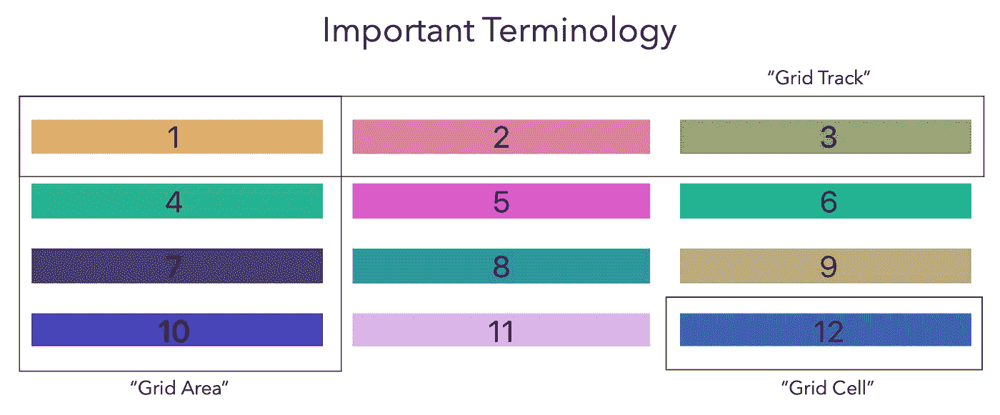

# CSS 网格—带 React

> 原文：<https://betterprogramming.pub/css-grid-in-react-f8323b521fab>

## 使用行和列创建二维网格系统的强大工具


丹尼尔·麦卡洛在 [Unsplash](https://unsplash.com/s/photos/grid?utm_source=unsplash&utm_medium=referral&utm_content=creditCopyText) 上的照片

最近我开始做一个需要 CSS 网格的项目。起初通读文档是令人生畏的，但我很快意识到只需几个简单的步骤就可以将 CSS Grid 添加到您的应用程序中。


首先，将以下代码添加到 React 应用程序中:

看看吧！您刚刚创建了一个 CSS 网格！为了干燥代码，还可以将 props 传递给网格组件，以确定所需的网格元素数量。

我添加了一个随机背景颜色生成器…只是为了好玩🌈

将网格渲染到 DOM 后，尝试在 CSS 文件中使用以下内容:

```
column-gap: 10px; //This adjusts the space between the columnsrow-gap: 10px; //This adjusts the space between the rowsgrid-template-columns: 60px; //This adjusts the width of the columnsgrid-template-rows: 60px; //This adjusts the width of the rows
```



CSS Grid 是使用行和列创建二维网格系统的强大工具。为了更深入地了解 CSS Grid，我强烈推荐以下一些资源:

*   [CSS 网格完全指南](https://css-tricks.com/snippets/css/complete-guide-grid/)
*   网格花园 —这是一个学习 CSS 网格的游戏！🤗