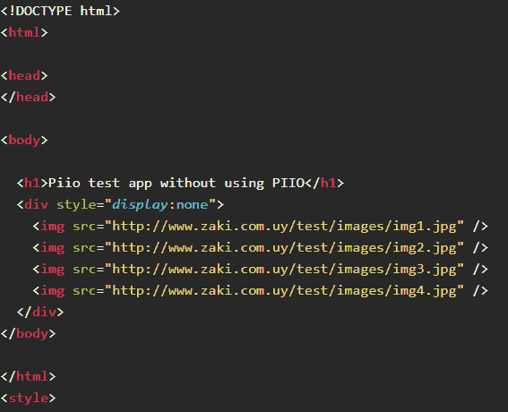
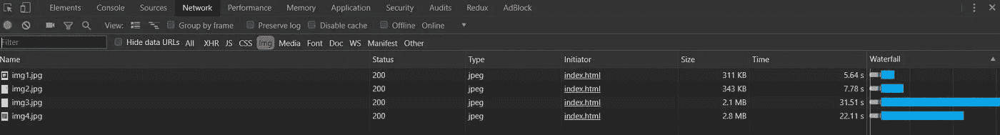

# CSS 如何显示:无影响页面加载时的图像

> 原文：<https://betterprogramming.pub/css-how-css-display-none-affects-images-on-page-load-dbdf1aaea820>

## 我们应该隐藏图片来加快页面加载时间吗？

我们一直在寻找方法来改善我们的客户如何管理他们的形象，我们已经把这作为我们的使命和文化的一部分。

在与我们的一个客户合作时，我们注意到他们在手机上的图片流量是类似网站的三倍。当我们开始调查时，我们意识到他们通过使用媒体查询将属性`display`设置为`none`来隐藏大量图像。

虽然隐藏图像的目标已经实现，但浏览器对隐藏图像的请求仍在发送，这对站点负载性能有直接的负面影响。

将`display:none`设置为图像或图像容器不会阻止浏览器请求图像。

# “显示:无”如何适用于图像

如您所料，当您将属性`display`设置为`none`时，图像的行为类似于任何其他元素，图像不会显示，也不会占用 DOM 上的任何空间。

问题是，由于脚本动态改变 DOM 元素的可能性，浏览器将加载 DOM 中存在的每个元素，如果图像是隐藏的，但在 DOM 中，那么它们将发送对该图像的网络请求。

这意味着，在图像的情况下，在大多数情况下，当您不打算使用它时，它无论如何都会被请求。

让我们来看一个例子:

在上面的代码中，我们将`display:none`设置为包含四张图片的`div`，以便在 DOM 中隐藏它们。

如果我们在加载这个 HTML 时查看一下网络，结果如下:

图像没有显示，但是请求被发出(如果我们对每个图像应用`display:none`，结果将是相同的)。

这不会影响浏览器对 DOM 的呈现，但会影响站点内容的加载。

如果你要切换图像的可见性，那么这不是一个大问题，如果它已经加载了，甚至可能会更好。

但是，如果您不打算显示这些图像，或者显示这些图像的可能性非常低，那么这种情况实际上是一个问题。

# 解决方法

1.  您可以防止包含图像的 HTML 被加载到 DOM 中，而不是使用`display:none`，如果需要的话，以后再添加它。如果你使用 Angular 或 React 这样的框架，这是非常容易实现的。例如，您只需避免使用`if`语句来呈现 HTML。如果您使用普通的 JavaScript，这也非常简单。
2.  使用你的图片，或者至少是你想要隐藏的图片，作为背景图片。如果元素被隐藏，背景图像不会被加载。

# 结论

即使图像的`display`属性设置为`none`，浏览器也会请求图像。

为了防止这种情况，您可以实现我之前提到的解决方案，但是如果您要过多地切换图像的可见性，那么在 HTML 中添加和删除图像可能是不必要的性能开销，您可以通过使用`display:none`属性来避免这种开销。

使用解决方案 2 要好得多，因为您可以只使用 CSS 而不必操作 DOM。

我希望这篇文章能帮助你理解当你想隐藏图片并避免请求它们时如何管理它们。

感谢阅读！