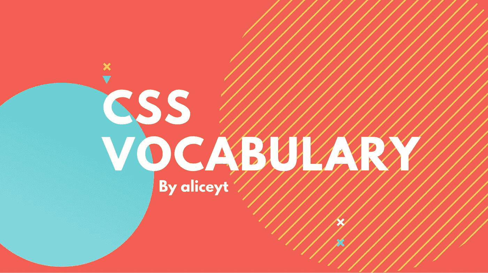
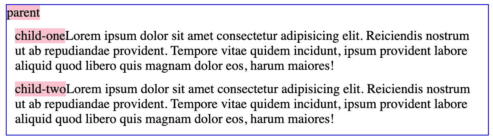
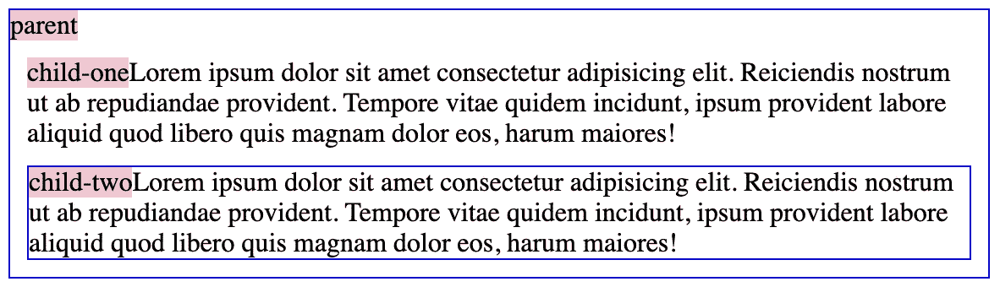
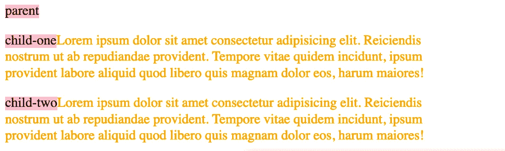
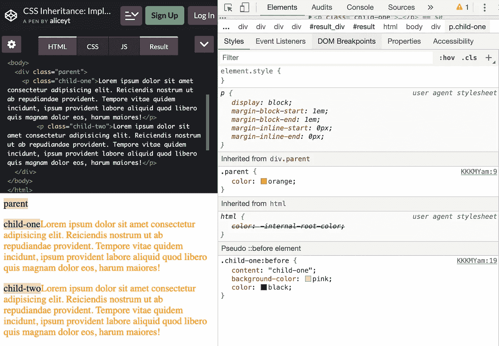
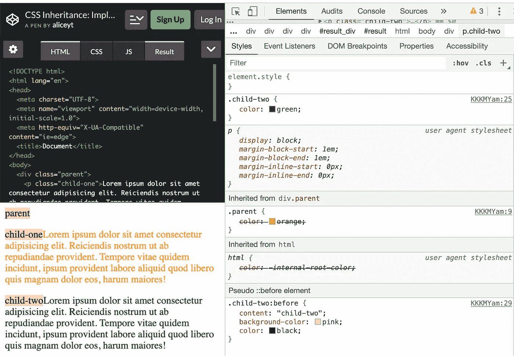

# CSS 继承:使用正确的术语

> 原文：<https://betterprogramming.pub/css-inheritance-using-the-right-terms-532468b46a05>

## 技术交流/词汇

## 如何添加可以在整个 CSS 文档中使用的字体

您可能知道如何添加可以在整个 CSS 文档中使用的字体:您向`body`选择器添加一个`font`属性。

但是你知道这叫做*继承*吗？当你需要谈论或写你的代码时，仅仅知道如何写 CSS 可能是不够的——也许你需要在一次面试中带某人浏览你的 CSS。不管是什么原因，知道正确的术语是有益的。

在本文中，我将讨论继承的使用，同时强调您应该注意的斜体术语。

# 什么是继承？

继承仅仅意味着将属性值从*父元素*传递给它们的*子元素*。*子元素* 继承属性有两种方式。

## 显式继承

当您将`inherit`的值设置为声明的属性时，一个属性可以被子元素*显式继承*。

让我们用一个使用`border`属性的例子来演示以上内容。

当我在父元素上声明`border: 1px solid blue`时，父元素的样式是一个细的蓝色边框。该样式不会被其子元素继承，因为 border 属性不是基于 W3C 的属性列表的继承属性。

但是，我可以通过在子元素上声明`border: inherit`来“强迫”子元素继承其父元素的边框样式。

下面是在`child-two`元素上声明`border: inherit`的结果:在它周围形成了第二个蓝色边框。

## **隐性继承**

另一种方式是通过隐式*继承*。当子元素从其父元素继承属性而不使用值`inherit`时，会发生这种情况。它只适用于 W3C 的属性列表中定义的继承属性。

注意:W3C 有一个[完整的属性表](https://www.w3.org/TR/CSS21/propidx.html)，它提供了对属性及其初始值和继承值的良好概述。但是，如果您打算使用它，您应该自己进行检查，因为有些部分已经过时了。

让我们用一个使用继承属性之一的例子来演示以上内容:`color`。

当我们在父元素上声明`color: orange`时，`color`属性被其子元素`child-one`和`child-two`隐式继承。您可以通过在浏览器的开发工具中查看 HTML 文件来了解这一点。

应用于 child-one 的样式的屏幕截图

我们可以通过在属性上声明一个值来覆盖子元素的继承属性。

在我们的例子中，当我在`child-two`元素上声明`color: green`时，它继承的颜色被绿色覆盖。通过检查 DevTools 中的元素可以看到这一点。继承的颜色`child-two`仍然显示在 Styles 标签下，但是现在用删除线表示它已经被覆盖。

适用于两个孩子的样式屏幕帽

继承帮助我们减少 CSS 中的重复，因为它使我们能够将应用于父元素的样式扩展到它们的子元素。想想如果我们没有 CSS 继承，你将不得不在你的样式表中声明多少次`font-family`属性，这将会给你更大的评价。

请注意，不管继承的类型是什么，来自其父元素的属性值可能不是子元素属性的实际值。实际值取决于[值处理](https://www.w3.org/TR/css-cascade-3/#value-stages) **。**

# 资源

*   [CSS 层叠和 W3.org 的继承](https://www.w3.org/TR/css-cascade-3/)
*   [MDN 的计算值](https://developer.mozilla.org/en-US/docs/Web/CSS/computed_value)