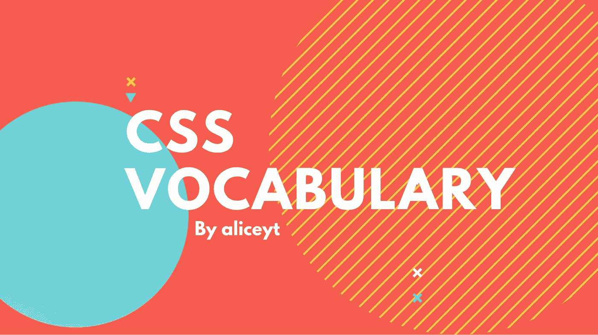
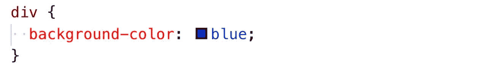
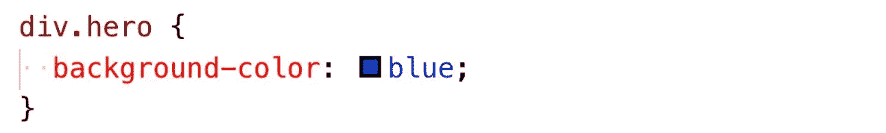
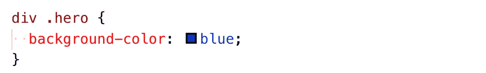
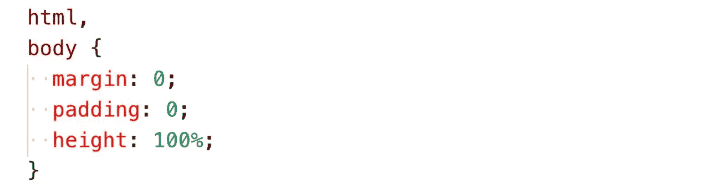
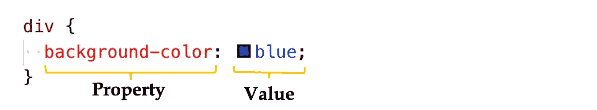
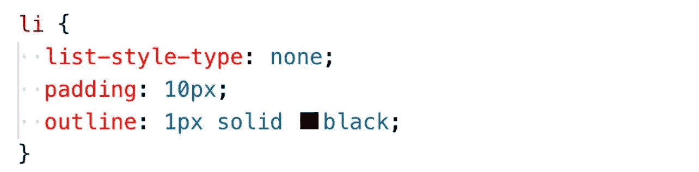
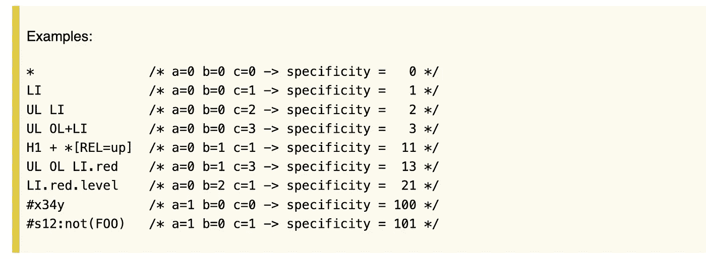

# CSS 样式规则:使用正确的术语

> 原文：<https://betterprogramming.pub/css-style-rules-using-the-right-terms-c8ddd82d4c47>

## 技术交流/词汇

## 和的专有名词是什么？



如果你点击了这篇文章，很可能你已经写了足够多的 CSS，知道了`<div>`和`<span>`的区别以及它们的用法。但是你知道它们叫什么吗？当我们在 HTML 环境中使用它们时，它们是**元素**。在 CSS 中，它们是选择器。如果我们想更具体一点，它们是**类型选择器**。

当你需要和某人谈论你的代码或者写关于它的东西时，知道如何写 CSS 可能是不够的。也许你需要在一次面试中向某人介绍你的 CSS 代码。不管是什么原因，知道使用正确的术语对我们都有好处。

在本文中，我将浏览 CSS 样式规则，同时强调用粗体表示的适当术语。

# 样式规则

**样式规则**决定应用于文档中元素的样式。每个样式规则由**一个选择器**和**一个声明组成。**

## 选择器

选择器定义了一组规则所适用的元素。它们可以是**简单选择器、复合选择器、复杂选择器或选择器列表**。

***简单选择器:元素上的单个条件。***



类型选择器的示例

简单的选择器包括:

*   **类型选择器**例如`<div>`
*   **通用选择器**例如`*`
*   **属性选择器**例如`[target=”_blank”]`
*   **类别选择器**:例如`.buttons`
*   **ID 选择器**:例如`#firstbutton`
*   **伪类**:例如`div:hover`

*复合选择器:包括使用一个以上简单选择器的选择器，不被组合子分开。*



由类型选择器和类选择器组成的复合选择器的例子

*复合选择器:由组合子分隔的一个或多个复合选择器的序列。*



一个复杂选择器的例子，由一个类型选择器和一个带有后代组合子的类选择器组成

复杂的选择器在由它的组合子描述的特定关系中的一组元素上表示一组同时的条件。它们包括:

*   :**后代组合符**(空白)，例如`div .background`
*   `>` : **子组合子** `div > p`
*   `+` : **下一兄弟组合子** `p + img`
*   `~` : **后继兄弟组合子**

*选择器列表:简单、复合或复杂选择器的逗号分隔列表*



由两个类型选择器组成的选择器列表示例

当一个给定的元素与选择器列表中的至少一个选择器匹配时，就说它与该选择器列表匹配。它允许我们在不同的选择器上应用相同的样式而不会重复。

# 申报

最后，我们来谈谈风格规则的另一半:声明。

声明写在花括号内。它有一个**属性**，一个由组件值列表组成的**值**，以及一个初始未设置的**重要标志**。每个声明都以分号结束。



所有`<div>`元素的背景将为蓝色。

声明也可以保存多个属性。



所有的`<li>`元素不会以列表格式显示，每个元素周围会有 10px 的填充和 1 px 的黑色轮廓。

# 冲突的样式规则

有时，我们对同一个元素应用了相互冲突的样式规则。在这种情况下，顺序和**特异性**将开始决定哪个样式规则优先。

## 最后一条规则

当我们有相同的选择器时，稍后放在样式表中的样式将优先。

```
div { 
     background-color: red;
    }div { 
     background-color: blue;
    }
```

在这种情况下，`<div>`的背景颜色将是蓝色。

## 特征

如果一个选择器比另一个具有更高的特异性，它将优先于另一个。一般来说，ID 选择器优先于类选择器、属性选择器和伪类。后者优先于类型选择器和伪元素。

```
#firstdiv { 
          background-color: green;
         }div { 
     background-color: blue;
    }.mydiv {   
        background-color: blue;
       }
```

在上面的例子中，带有类别`mydiv`和 id `firstdiv`的`<div>`的背景色将是绿色。三个选择器的位置无关紧要，因为 ID 选择器优先。

如果你需要深入细节，[w3.org](https://www.w3.org/TR/2018/REC-selectors-3-20181106/#ref-CSS21)提供了一种计算选择器特异性的方法:

*   计算选择器中 ID 选择器的数量(= a)
*   计算选择器(= b)中的类选择器、属性选择器和伪类的数量
*   计算类型选择器和选择器中伪元素的数量(= c)
*   忽略通用选择器

将 a-b-c 这三个数字串联起来(在一个基数很大的数字系统中)给出了特异性。



来自 w3.org

## 重要标志

最后，当一个`important`规则被用在一个样式声明上时，这个声明覆盖任何其他的声明。根据 MDN，应该避免使用`!important`,因为它会破坏样式表中自然的[层叠](https://developer.mozilla.org/en-US/docs/Web/CSS/Cascade),从而使调试更加困难。

# 资源:

*   [CSS 语法模块 3](https://www.w3.org/TR/css-syntax-3/)
*   [MDN 的语法](https://developer.mozilla.org/en-US/docs/Web/CSS/Syntax)
*   HTML & CSS:设计和建立网站

如果您认为我应该在本文中涵盖任何遗漏的术语，请留言！