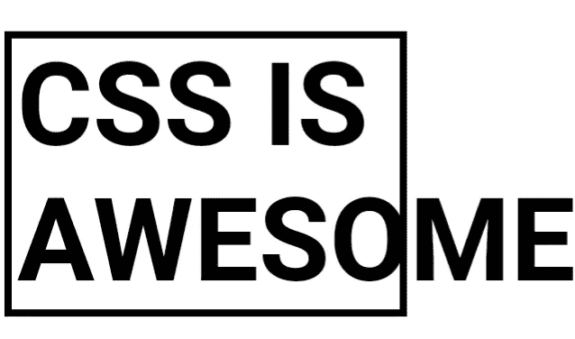
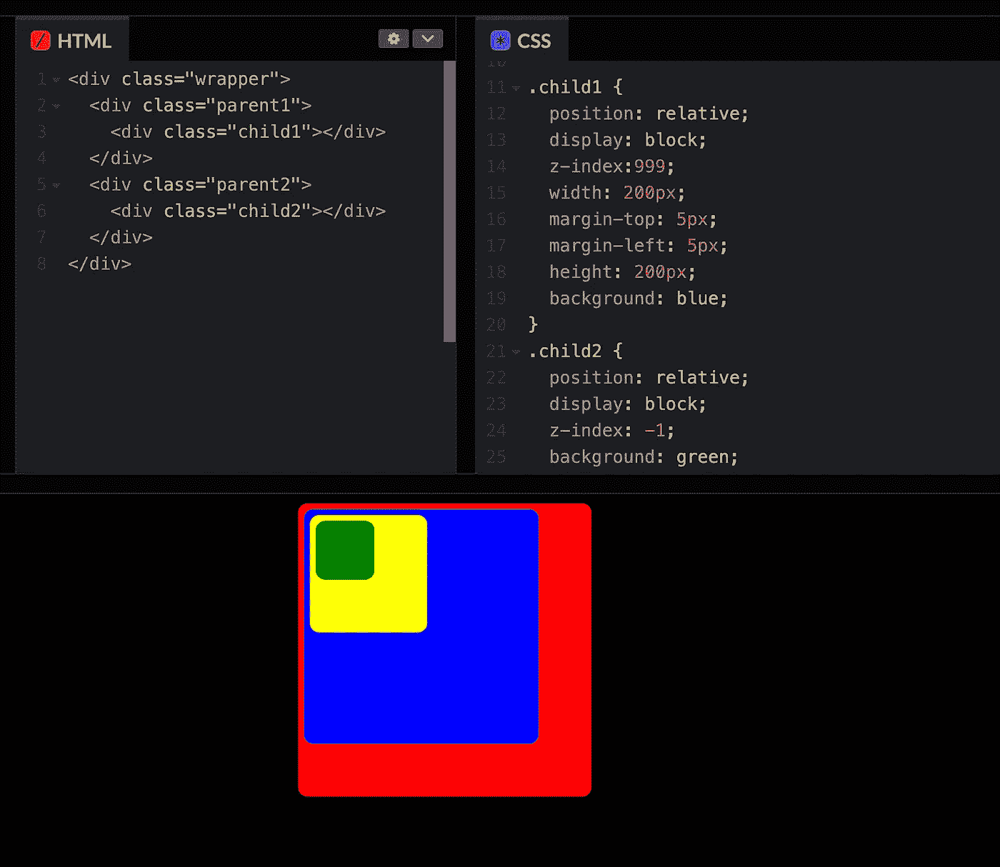
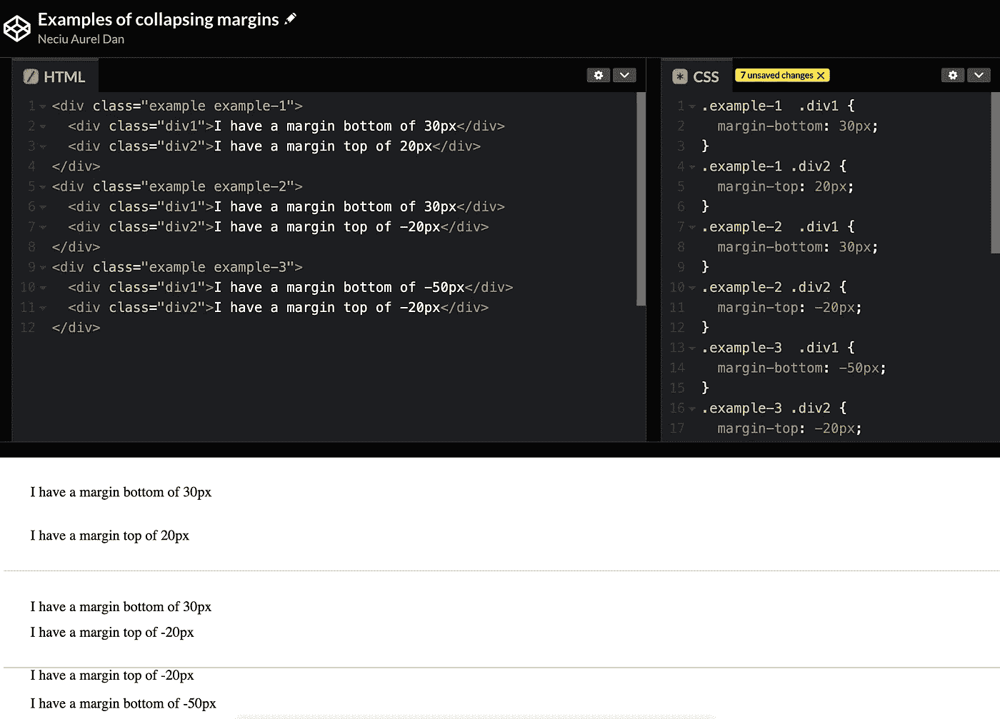
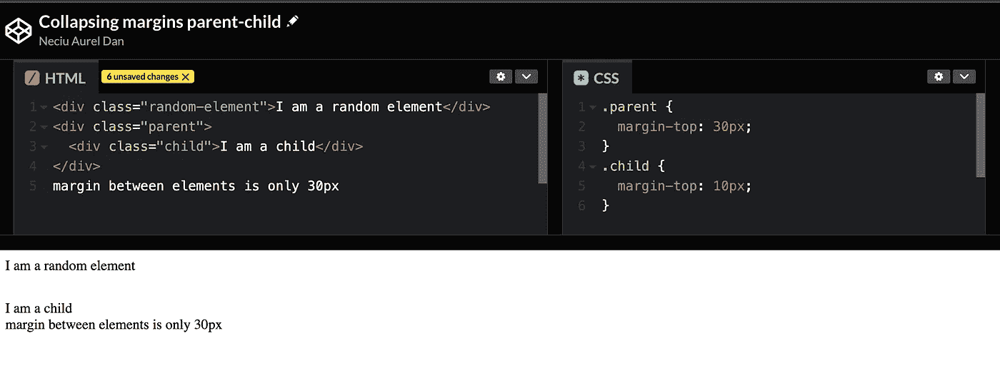

# CSS:的！重要部件

> 原文：<https://betterprogramming.pub/css-the-important-parts-75132f78116>

## CSS 基础知识

## 与 CSS 斗争是一种常见的做法，这里我们解释它是如何工作的，以及在你的代码中可能出现的常见问题。



CSS(层叠样式表)是一种用于描述文档外观布局的语言。更具体地说，它与 HTML 一起用来创建漂亮和用户友好的网站或应用程序。

但是自从 1996 年 CSS 的第一个版本问世以来，这种语言已经发展成为一种用来创造非常棒的东西的工具。像《辛普森一家》的全部演员只用 CSS 或者只用 CSS 的游戏男孩等等。

很神奇，对吧？

在本文中，我们将重点介绍 CSS 如何工作，CSS 用来评估代码块的规则是什么，以及一些可以帮助您在掌握 CSS 的旅程中达到下一个级别的提示和技巧。

# CSS 实际上是如何工作的？

当你开始编写 HTML，没有添加 CSS，浏览器会在*正常布局流程*中呈现你的元素。即使在你的元素中添加了一些 CSS，如果你不改变 display 或 position 属性，它们仍然会在*正常流程*中呈现。

这到底是什么意思？

**布局模型**规定了你的元素在默认情况下的行为，以及你的元素可以访问的 CSS 属性。

以下是可用的布局模型:

*   正常流量
*   定位布局(绝对、块)
*   弯曲
*   格子
*   桌子

您是否注意到，如果不对元素应用 position 属性，`z-index`就不起作用了？嗯，就是这个原因。该属性在正常流中不可用，在其他一些布局中也不可用。

添加`position:absolute`会将你的元素从普通布局模块切换到定位模块。在这个布局模型中，你可以访问额外的属性，比如`z-index`。

例如，`z-index`决定了元素的布局顺序。如果你有两个元素在同一个位置，你想堆叠它们，具有较高`z-index`值的一个将在顶部。

如果你想将一个元素放到堆栈的底部，只需将它的`z-index`值设置为负数。

需要记住的一个非常重要的细节是`z-index`只在相同的**堆栈环境中有用。**

堆叠上下文是父元素内部子元素的集合。例如，如果我们有`.parent1 { z-index: 1; }`并且内部有`.child1 { z-index: 999; }`，那么子元素将不会与父元素之外的其他元素堆叠在一起。

[这里有一个具体的例子](https://codepen.io/cst2989/pen/ZExJBKw?editors=1100)来说明这一点:



堆叠上下文示例

正如你在上面看到的，孩子 1 有`z-index:999`和孩子 2 有`z-index:-1`并不重要，因为我们比较了他们的堆栈上下文。

所以每个布局模型都有自己的属性和规则。它也有一些共同之处。例如，flex 和 grid 都包含`gap`属性来设置项目之间的间距。

由此，只需要弄清楚在哪个布局模型中实现了什么属性，然后 CSS 在不同的上下文中表现不同的问题就会减少。

# 特异性。规则是制定出来让人遵守的

我花了一段时间才理解 CSS 中的特异性是如何工作的。这似乎不重要(讽刺的是),因为一切都正常工作。

所以，如果有时我不得不在这里和那里添加几个`*!important*` 又怎么样。或者将 CSS 文件中的一些代码块下移，以确保它们最后应用。或者最坏的情况，为不同的类复制一些代码。最终，它成功了，这在当时是至关重要的。

当我不得不为数百万用户访问的 web 应用程序编写优化的代码时，我意识到我是多么的浪费。调试我的代码实际上是多么困难，渐渐地我开始理解浏览器神对我们凡人的规则。

那么什么是 s**specificity**以及 CSS 是如何工作的呢？下面是来自 [Mozilla 开发者网络的定义:](https://developer.mozilla.org/en-US/docs/Web/CSS/Specificity)

> 特异性是浏览器决定哪些 CSS 属性值与元素最相关并因此将被应用的方法。特异性仅基于由不同种类的 CSS 选择器组成的匹配规则。

基本上，浏览器会查看你的 CSS 规则并给它打分。实际上是 4 分。

由逗号分隔的四个数字 *0，0，0，0* 。

然后，当你有两个冲突的 CSS 规则时，它会检查第一个数字并进行比较，如果没有明显的赢家，它会检查第二个数字，依此类推。

如果所有列都相等，浏览器将根据顺序选择规则。这就是级联名称的由来。它会把靠近底部的那个拿走。

以下是这四个数字的细目分类:

第一个数字表示元素是否有内联样式。

```
<p style="color:red">Hello World</p>
```

第二个数字代表 CSS 规则中# ids 的数量。

```
<p id="myParagraph">Hello World</p><style>#myParagraph {
  color: blue;
}
</style>
```

第三个数字是 CSS 规则拥有的类、伪类和属性的数量。

```
<p class="myParagraphClass">Hello World</p><style>.myParagraphClass {
  color: green;
}
</style>
```

最后，我们有元素和伪元素的数量。

```
<p>Hello World</p><style>
p {
  color: yellow;
}
</style>
```

因此，对于每列中的每个规则，我们增加该列的分数。

现在你可能已经读到内联样式给你 1000 分，id 100，等等。**这不是真的。**

比如说。假设我们有一个包含 102 个类和一个 ID 的元素。比如下面的代码:

如果你遵循一些文章和 w3school 推荐的规则，ID 应该有 100 分，类应该有 103 分，产生蓝色的“Hello World”文本。但是如果你在你的浏览器中检查这个，它实际上是红色的。

浏览器不会比较苹果和橘子。浏览器首先检查我们在内联样式级别是否有冲突的规则，并在那里应用分数，然后转到 IDs 等等。

另一个例子是:

`#test { color: red; }`的特异性得分为 *0，1，0，0。*而第二 CSS 规则`.test-1-parent #test { color: yellow; }`具有特异性分数 *0，1，1，0。*第一列相等，因此浏览器移动到第二列，在那里两列的值都为 *1。然后我们转到第三列，其中`color:yellow`是赢家。*

# 折叠页边距

> 在 CSS 中，两个或多个框(可能是也可能不是兄弟)的相邻边距可以组合成一个边距。以这种方式组合的边距称为折叠边距，由此产生的组合边距称为折叠边距。— [W3C](https://www.w3.org/TR/CSS21/box.html#collapsing-margins)

我很惭愧地承认这一点，但在我作为一名专业开发人员的第二到第三年里，我不知道利润率崩溃的情况。更糟糕的是，由于我的无知，我会和那些抱怨元素之间的间距太大的设计师争论。

我会打开开发工具给他们看，`margin-top:50px`看到了吗？他们会点头，用那种我看到但我不相信的方式。

对于这一点，我想正式向所有的设计师道歉，我这样做了，或者向所有的设计师道歉，因为像我这样无知的开发人员而遭受这种痛苦。

希望我可以用这篇文章来弥补，并教育其他可怜无知的前端开发人员，这样你就再也不用经历这些了。

正如你所想象的，即使我们在元素上使用了`margin-top:50px;`,边距也可能会不同。原因如下。

当两个**垂直边距**(顶部和底部)相互影响时，CSS 有一个奇怪的规则，它让它们相互争斗，大的获胜。

例如，在 DOM 中同一层上的两个 HTML 元素，`.div1 { margin-bottom: 30px; }`和`.div2 { margin-top: 20px; }`，您会认为距离是边距之和。但事实上，崩溃边缘规则生效，我们之间只有`30px`(来自`.div1`的较大边缘)。

另一方面，如果其中一个元素有负的边距，`.div2 { margin-top: -20px; }`，那么它的行为就像你期望的那样。而它们之间的余量就是 **10px 之和。**

然而，更令人惊讶的是，这两个元素都有负边距。例如，`.div1 { margin-bottom: -50px; }`和`.div2 { margin-top: -20px; }`你会再次期望，或者是总和，或者是数学术语中的最大值，正如我们所知-20 比-50 大，因为它更接近于零，但是发明 CSS 的人没有对正确的数学说不，它们之间的差距是 **-50px。**惊艳！

[以下是模拟所有示例的代码笔](https://codepen.io/cst2989/pen/eYMRQwE):



折叠页边距示例

另一件要考虑的事情是元素之间的父子关系，这里**折叠边距**也会引起麻烦。

如果父元素有边距，比如说`.parent { margin-top: 50px; }`，并且这个元素的第一个子元素也有边距`.child-1 { margin-top: 20px; }`，那么边距将再次折叠，我们将只能看到更大的那个。

[这里有一个例子:](https://codepen.io/cst2989/pen/oNqwJgQ)



折叠边距的父子示例

这就是利润率下降的原理。现在你可能想知道如何阻止它。很容易，如果你在页边空白之间应用任何东西，比如一个`border-top`或一个`padding-top`，那么页边空白将不会彼此接触，也不会完全折叠。

把这个物理障碍想象成裁判，当一轮比赛结束时，阻止两个拳击手互相打斗。

# 最后

CSS 很难！它有各种古怪的行为。但是如果你知道你在哪个布局模型上，你就有更好的机会弄清楚它。

特殊性规则用于决定冲突的 CSS 属性。记住 4 级和如何计算分数。

如果边距给你带来了问题，请记住，元素之间的物理屏障会阻止它们相互争斗

你知道他们，一个`border-top: 1px solid transparent`，保持崩溃的利润。

如果你喜欢这篇文章，别忘了在 medium 上关注我[，或者在 Twitter](https://medium.com/@neciudan) 上关注我[，阅读我要说的更多内容。主要是关于反应本地，前端工程，或生产力。](https://twitter.com/neciudan)

这里有几篇我也写过的文章:

*   [保龄球形](https://medium.com/@neciudan/the-bowling-kata-aea967152e91)
*   【2021 年网络峰会上的 5 家面向开发者的创业公司