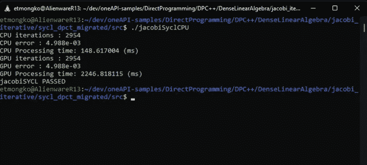
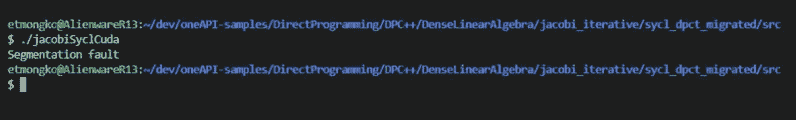

# CUDA、SYCL、Codeplay 和 oneAPI——面向所有人的加速器

> 原文：<https://betterprogramming.pub/cuda-sycl-codeplay-and-oneapi-accelerators-for-everyone-4603fee0421>

## CUDA 和 SYCL——功能测试演练


由 [Pakata Goh](https://unsplash.com/@pakata?utm_source=unsplash&utm_medium=referral&utm_content=creditCopyText) 在 [Unsplash](https://unsplash.com/s/photos/computer-hardware?utm_source=unsplash&utm_medium=referral&utm_content=creditCopyText) 上拍摄的照片

# **简介**

世界上有越来越多的加速器。这就提出了一个问题，各种生态系统将如何进化，以允许程序员利用这些加速器。在更高的抽象层次上，像 Tensorflow 和 PyTorch 这样的领域特定层为底层硬件提供了很好的抽象。然而，对于那些维护没有这种抽象的与硬件对话的代码的开发人员来说，挑战仍然存在。多种底层硬件架构都支持的一种解决方案是 C++和 SYCL。以下是克罗诺斯集团[网页](https://www.khronos.org/sycl/)对 SYCL 的描述:

> SYCL(发音为“镰刀”)是一个免版税的跨平台抽象层，支持使用标准 ISO C++编写异构处理器的代码，应用程序的主机和内核代码包含在同一个源文件中。

这听起来很不错，假设你:

1.  对学习类似 C++的语言感到舒服吗
2.  想要不受底层硬件供应商束缚的灵活性吗
3.  您正在从头开始编写代码

由于在栈的这个层次编程的人已经在使用 C++，可以肯定地说第一个假设是合理的，如果你还在阅读，我也会假设第二个。然而，第三点往往不是这样。在本文的其余部分，我们将讨论如何获取 CUDA 代码，将其迁移到 SYCL，然后在多种类型的硬件上运行，包括 NVIDIA GPU。

为了测试其可行性，我们将使用一系列免费工具，包括 SYCLomatic、oneAPI Base Toolkit 和 Codeplay oneAPI for CUDA compiler。有关这些工具支持的 CUDA 版本的信息，请参阅[英特尔 DPC++兼容性工具发行说明](https://www.intel.com/content/www/us/en/developer/articles/release-notes/release-notes-for-intel-dpcpp-compatibility-tool.html)和 [oneAPI for CUDA 入门指南](https://github.com/intel/llvm/blob/sycl/sycl/doc/GetStartedGuide.md#build-dpc-toolchain-with-support-for-nvidia-cuda)。

作为参考，我使用我个人的英特尔 Alder Lake Core i9–12900 KF 外星人 R13 系统和 3080Ti GPU。我的软件栈是 Windows 11 Pro 系统，我正在利用 Linux 的 Windows 子系统(WSL)在 Ubuntu 20.04 中开发。

# **将 CUDA 迁移到 SYCL**

CUDA 通常用于在 GPU 上进行通用计算编程。缺点是它只能在 NVIDIA GPUs 上运行。为了帮助从 CUDA 迁移到 SYCL，我们将利用[英特尔 DPC++兼容性工具](https://www.intel.com/content/www/us/en/developer/tools/oneapi/dpc-compatibility-tool.html)。请注意，英特尔开源了 DPC++兼容性工具背后的技术，以进一步提升将更多基于 SYCL 的应用移植到 [SYCLomatic](https://github.com/oneapi-src/SYCLomatic) 项目中的能力。

Stackoverflow 和英特尔开发人员专区上已经发布了一篇很好的文章，介绍了如何从 cuda-samples GitHub 存储库中获取 jacobiCudaGraphs 实现并迁移代码，因此我不需要重新键入，只需在此处链接即可。

[](https://www.intel.com/content/www/us/en/developer/articles/technical/cuda-sycl-migration-jacobi-iterative-method.html) [## 将 Jacobi 迭代法从 CUDA 移植到 SYCL

### 这个文档演示了一个用 CUDA*编写的线性代数 Jacobi 迭代方法如何移植到 SYCL*…

www.intel.com](https://www.intel.com/content/www/us/en/developer/articles/technical/cuda-sycl-migration-jacobi-iterative-method.html) 

注意，如果你只是想看看 Codeplay 的 oneAPI for CUDA 编译器如何为 SYCL 代码工作，你可以跳过本教程，在 GitHub 上的 oneAPI-Samples 库中查看最终代码[这里](https://github.com/oneapi-src/oneAPI-samples/tree/master/DirectProgramming/DPC%2B%2B/DenseLinearAlgebra/jacobi_iterative)。

# **在各种硬件上测试 SYCL**

一旦迁移到 SYCL 代码，您应该能够在各种硬件上运行它。让我们来测试一下，好吗？为了更容易地完成本演练，您可以查看 oneAPI-samples 目录，其中已经包含了迁移的代码:

[](https://github.com/oneapi-src/oneAPI-samples) [## GitHub-oneapi-src/oneAPI-Samples:英特尔 oneAPI 工具包示例

### oneAPI 样本库为英特尔 oneAPI 工具包提供代码样本。我们建议查看特定的…

github.com](https://github.com/oneapi-src/oneAPI-samples) 

有一点需要注意，在 oneAPI-samples 中，jacobi.h 的 NROWS 值是 1024，而不是 512。如果您使用的是预装样品，您可能需要手动更新，以便进行比较。

为了便于比较，下面是我按照 [cuda-sample](https://github.com/NVIDIA/cuda-samples/tree/master/Samples/3_CUDA_Features/jacobiCudaGraphs) 指令构建并运行代码时的输出:


# **CPU 上的 SYCL**

英特尔在 oneAPI 基础工具包中提供了一个基于 SYCL 的编译器，可从以下网址获得:

[](https://www.intel.com/content/www/us/en/developer/tools/oneapi/base-toolkit-download.html) [## 下载英特尔 oneAPI 基础工具包

### 选择您的操作系统、分销渠道，然后下载您定制的英特尔 oneAPI 安装。

www.intel.com](https://www.intel.com/content/www/us/en/developer/tools/oneapi/base-toolkit-download.html) 

因为我用的是 Ubuntu，所以我只是按照说明做了一个基于 APT 的安装。确保通过运行以下命令将编译器路径添加到您的工作区:

```
> source /opt/intel/oneapi/setvars.sh
```

然后，我转到 oneAPI-samples/direct programming/dpc++/DenseLinearAlgebra/jacobi _ iterative/SYCL _ dpct _ migrated/src 目录，并使用英特尔 DPC++ SYCL 编译器编译代码:

```
> dpcpp -o jacobiSyclCPU main.cpp jacobi.cpp -I ../Common/
```

请注意，的包含../Common 来自 SYCLomatic 工作流，它创建了一些助手文件来支持我从 CUDA 到 SYCL 的迁移。在这种情况下，我的可执行文件是 jacobiSyclCPU，所以让我们试一试:



查看输出时，需要考虑几个因素:

1.  SYCL 版本的代码是用英特尔的 DPC++编译器编译的，cuda 示例代码是用 GNU 编译器编译的。
2.  迁移后的 SYCL 代码最初是为 GPU 并行化的，现在运行在 CPU 上，比代码的序列化版本要慢。这是因为序列化版本不需要内存缓冲设置和同步。
3.  文本“GPU ***”是不正确的，因为我只是迁移了代码，并没有更改文本来反映我在这种情况下的目标是 CPU。

# **NVIDIA GPU 上的 SYCL**

既然我们已经看到我们可以在 CPU 上运行 SYCL 代码，让我们做一些更有趣的事情，看看我们是否可以在我的 GPU 上运行迁移后的代码。

第一步是从 Codeplay 安装 [oneAPI for CUDA 编译器](https://www.codeplay.com/solutions/oneapi/for-cuda/)。我按照他们的说明安装并构建了编译器，为了方便起见，这里做了内联:

```
git clone [https://github.com/intel/llvm.git](https://github.com/intel/llvm.git) -b sycl
cd llvm
python ./buildbot/configure.py --cuda -t release --cmake-gen “Unix Makefiles”
cd build
make sycl-toolchain -j `nproc`
make install
```

**WSL2 提示**

顺便提一下，在安装的时候，我注意到它运行得非常慢，有一点询问，问题是我是在 Windows 文件系统上运行我的 WSL 编译，而不是 WSL ext4 文件系统。移动到本地文件系统会使速度成倍提高，这是一个很好的技巧。要了解更多细节，请查看这里的一些 WSL 文件系统基准。它有点旧，但似乎仍然相关:

[https://vxlabs.com/2019/12/06/wsl2-io-measurements/](https://vxlabs.com/2019/12/06/wsl2-io-measurements/)

## 【CUDA 的编译和运行

随着我的编译器安装，我准备编译运行在 NVIDIA GPU 上。由于迁移代码是如何生成的，我需要在我的路径中包含来自 oneAPI DPC++编译器和 Codeplay 编译器的文件:

```
> source /opt/intel/oneapi/setvars.sh
> export PATH=/home/etmongko/llvm/build/bin:$PATH
> export LD_LIBRARY_PATH=/home/etmongko/llvm/build/lib:$LD_LIBRARY_PATH
```

现在，我运行 Codeplay 编译器来生成支持 CUDA 的二进制文件:

```
> clang++ -fsycl -fsycl-targets=nvptx64-nvidia-cuda -DSYCL_USE_NATIVE_FP_ATOMICS -o jacobiSyclCuda main.cpp jacobi.cpp -I ../Common/
```

这生成了 jacobiSyclCuda 二进制文件。让我们试一试！



嗯，不好

哎哟！一个分段错误，不是一个好的开始。好消息是，我稍微调试了一下就发现了这个问题。在我的路径中有 oneAPI 和 Codeplay 库，这导致了一些问题。为了解决这个问题，我打开了一个新的终端，然后简单地运行:

```
> export LD_LIBRARY_PATH=/home/etmongko/llvm/build/lib:$LD_LIBRARY_PATH
```

只包含代码库。经过这个简单的调整，SYCL 代码在我的 GPU 上运行没有任何问题。


有用！

耶！我们可以看到，CPU 时间与基准示例相似，GPU 部分明显快于第二个示例中使用 CPU 作为加速器的情况。然而，性能与本地 CUDA 实现不太一样。这并不意外，因为这只是从 CUDA 到 SYCL 的简单迁移，没有任何优化。

# **结论**

带有 SYCL 代码的 C++可以在多个后端编译运行。在这种情况下，我们通过 CPU 和 NVIDIA GPU 的例子，但 SYCL 的好处是它允许我们利用其他后端。作为预告，下周我将使用一台全新的基于英特尔 Arc A370M 的笔记本电脑测试开发人员工作流，因此我们将看到 SYCL 如何支持多个供应商后端。

作为一名开发人员，我认为与硬件无关的解决方案的一致性最终会让我们的生活变得更容易，我们只需要实现这一点。从 CUDA 迁移到 SYCL 并不简单，但是有很多社区支持它，工具也在不断改进。

如果随着新硬件的出现，你可以在它上面运行你的代码，如果它碰巧更快、更节能或更经济的话，那不是很好吗？这是另一个时间和讨论的问题，但这是一个很好的想法。

```
**Want to Connect?**If you want to see what random tech news I’m reading, you can [follow me](https://twitter.com/tonymongkolsmai) on Twitter.Tony is a Software Architect and Technical Evangelist at Intel. He has worked on several software developer tools and most recently led the software engineering team that built the data center platform which enabled Habana’s scalable MLPerf solution.Intel, the Intel logo and other Intel marks are trademarks of Intel Corporation or its subsidiaries. SYCL is a trademark of the Khronos® Group. Other names and brands may be claimed as the property of others.
```