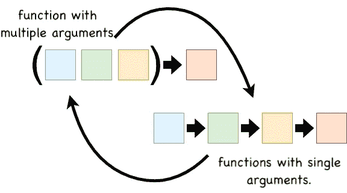
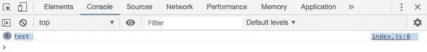
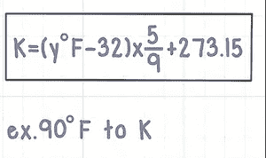

# Currying 和普通 JavaScript

> 原文：<https://betterprogramming.pub/currying-and-vanilla-javascript-39c82395a2d6>

## 包括 DOM 操作在内的 currying 函数示例


*   [源代码](https://github.com/01Clarian/CurryingAndDOMJS)
*   [视频](https://youtu.be/-l5_4dckKfg)

在 JavaScript 中，currying 是将一个具有多个参数的函数重写为一系列函数的合成练习，其中每个函数只接受一个参数。

下面是一个采用多个参数的串联函数的示例:

```
function greetings (greeting, name) {
return greeting + " " + name
}

greetings('Hello','Tatiana'); // returns Hello Tatiana
```

咖喱的版本将如下:

```
function greetings (greeting) { return function (name) {
return greeting + " " + name
}
```

请注意，简化的函数`greetings`只接受一个参数，并返回另一个也接受一个参数的函数，然后返回连接的结果。

在这种新形式中，可以通过用一组目标数据创建一个`currier`实用程序来展示 currying 的强大功能。

例如，如果我们总是希望`greetings`函数以“hello”开头，我们可以创建一个实用程序`currier`来实现，如下所示。

```
var currier = greetings('Hello')currier('Michael') // returns Hello Michael 
```

现在，如果我们有一个名字数组，并且我们希望总是向这些名字发送特定的问候“你好”，我们可以使用`currier`实用程序。

```
namesArray = ['Tom','Suzy','Bob','John']let results = []for(let i = 0; i < namesArray.length; i++) {
results += currier(namesArray[i] + ". ")
}
// returns "hello Tom. hello Suzy. hello Bob. hello John. "
```

我们的函数`currier`将总是触发一个“hello”输入问候，这样当我们多次执行函数时，我们只运行函数的第二部分。非常酷。



带注释的外推示例

了解了用 JavaScript 编写 currying 函数的核心原则后，让我们休息一下，然后开始编写开尔文温度转换器。

# DOM 访问和操作

在下面的例子中，我们将从头开始用普通的 JavaScript 构建一个开尔文到华氏温度的转换器，同时观察和对比 currying 和函数式编程。

让我们首先创建一个`index.html`文件来设置我们的转换器输入、按钮和结果。

正如我们所看到的，我们创建了一个带有 ID`convertKelvin`的`button`，一个用户可以输入的数字的`input`，设置为 0 值，以及一个带有`span`的`p`标签，我们可以在其中显示转换。

我们还链接了一个`index.js`的脚本源，我们将很快创建它。

很简单，让我们在浏览器中启动它，我们应该会看到这些壮观的视觉效果。


很好，让我们继续工作，创建那个`index.js` 文件。

首先，让我们在 DOM 中选择我们希望用 JavaScript 操作的元素，并连接按钮点击事件，以便我们运行一个日志来查看一切正常。

当我们保存并刷新浏览器时，我们现在可以在我们的 DevTools 中看到每次点击都执行日志 ***测试*** 。



我们通过使用`document.querySelector`访问我们在`index.html`文件中设置的每个唯一 Id 属性来选择元素的 Id，从而成功地运行了这个程序。

具体来说，我们将按钮`convertKelvin`的 ID 设置为变量`const convertKelvin`。然后我们触发 onclick 事件，该事件运行一个函数，以便运行*测试*的日志。

现在，让我们构建开尔文到华氏温度的转换函数。

# 开尔文公式和 DOM 实现



开尔文公式示例

开尔文转换有多种公式，因此我们将重点关注以下内容:

```
Formula = ((kelvin — 273.15) * 9 / 5) + 32
```

让我们将这个公式应用到一个新函数中，该函数将转换 300 开尔文的硬编码参数。

我们将`convertKelvinReg`设置为开尔文的自变量(我们称之为 300 的输入)和公式的参数。

然后，我们将上面的开尔文公式硬编码并利用`Math.round` ，以避免用户不需要的温度小数点。

请注意，我们没有将公式设置为一个参数，因为这个例子纯粹是为了查看 currying 的组成差异和对比，而不是纯粹的功能应用，我们将在这篇文章的讨论方面进行更多的讨论。

然后，公式`return`转到从 DOM 中的`p`标签中选择的结果 ID。

最后，我们在按钮的`onclick`事件中调用`convertKelvinReg`函数，这样只有当用户点击按钮时，它才会被更新和转换。

当我们保存并刷新时，我们看到我们成功返回 80 华氏度。然而，这是一个非定制的函数示例，同样，我们也没有为按钮访问设置输入值。

让我们喝几口温暖诱人的黑咖啡，然后写出 currying 转换代码。

# 将开尔文转换为华氏温度

从逻辑上讲，converter 函数的 curried 函数组合版本基本上保持不变。

然而，现在，新函数一次只接受一个参数，并返回一个新函数，最终将逻辑发送到我们的结果 ID 的`p`标签。

`kelvinNumber`的输入 ID 被设置为变量`const kelvinNumber`，允许我们访问该值。然后我们创建一个 currier 实用函数，它总是将输入值作为它的参数。

设置好这个实用程序的值后，我们现在可以简单地在 converter 按钮的`onclick`事件中调用我们的`currier`,这将触发输入，为用户显示一个成功的转换。

当我们保存并刷新浏览器并用值 300 测试输入时，我们现在得到以下成功的返回。


我们的咖喱功能正在发挥作用，我们现在可以在进行快速复习和击掌之前喝点咖啡庆祝一下。

# 结论

就 JavaScript 中的 currying 结构而言，这就差不多了。如果你能想到一些有趣的其他奉承的例子或想法，请在下面的评论中留下，我会去看看的。

请随时查看这篇文章顶部的视频和完整的源代码。同样，我将在底部提供一些其他有用的文章。

感谢您的阅读，希望您能从中受益！

 [## JavaScript 中的 Currying

### Currying 是函数式编程中的一个基本工具，函数式编程是一种编程模式，它试图最小化函数的数量

wsvincent.com](https://wsvincent.com/javascript-currying/) [](https://www.sitepoint.com/currying-in-functional-javascript/) [## 函数式 JavaScript - SitePoint 中 Currying 的初学者指南

### Currying，或部分应用，是一种功能性技术，对于熟悉…

www.sitepoint.com](https://www.sitepoint.com/currying-in-functional-javascript/) [](https://javascript.info/currying-partials) [## Currying

### Currying 是一种使用函数的高级技术。它不仅在 JavaScript 中使用，在其他语言中也使用…

javascript.info](https://javascript.info/currying-partials)