# 在谷歌地图中创建曲线

> 原文：<https://betterprogramming.pub/curved-lines-on-google-maps-2938bbb15f6a>

## 有时候你不想曲折，你想跳跃

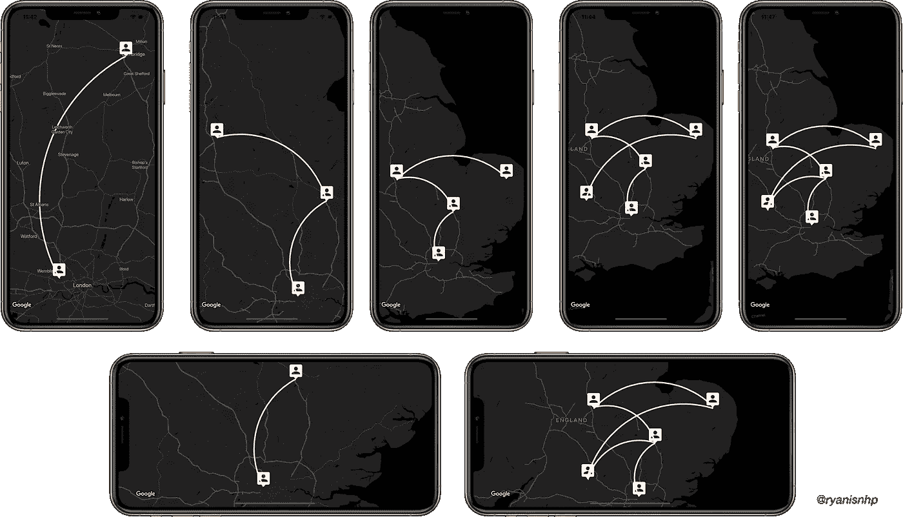

难度:容易| **中等** |困难。

如果你不知道， [Google Maps](https://cloud.google.com/maps-platform/) 现在当你使用[Google Directions API](https://developers.google.com/maps/documentation/directions/start)绘制一条从地点 A 到地点 b 的路线时要花很多钱。

如今，一些公司像优步一样将真实路线转换成直线，或者像 Deliveree 一样转换成曲线。

因此，我认为这篇文章将对你们所有人有所帮助:

*   想要创建一个新的样式来绘制路线。
*   不想赔钱，把它装进谷歌地图的口袋。

# 画一条曲线有什么解决方法？

如果要画一条直线连接 A 点和 B 点，需要知道 A 点坐标和 B 点坐标。

好的。用一条曲线，它结合了很多很多和直线结合的微小点。所以，主要的解决方法是找到曲线上每个点的坐标。

让我们给这些点命名，如下图所示。

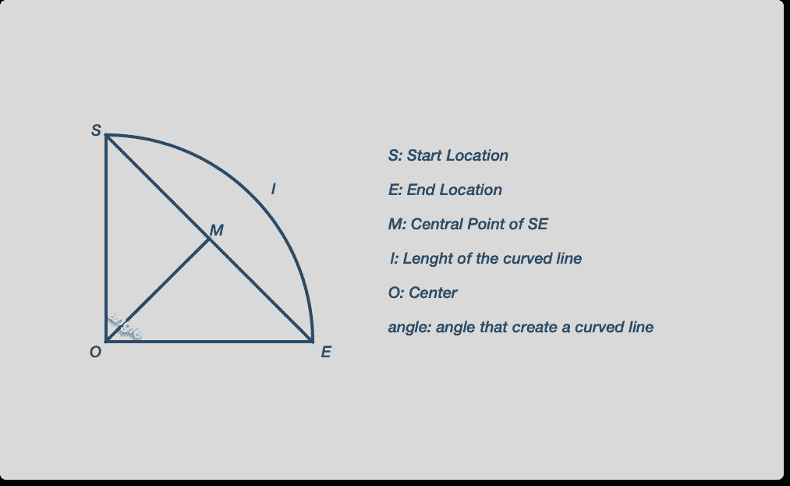

首先，创建一个初始路径:

## 第一步。计算 SE

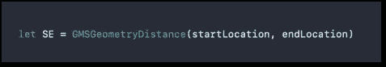

Google Maps 支持我们用`GMSGeometryDistance` 函数得到地图上两点之间的距离(单位是米)。

## 第二步。为角度定义一个合适的数字

我们必须为角度选择一个合适的数字。如果角度太大，O(中心点)可以离 S 或 E 非常远，曲线反而看起来像直线。

我的建议是小于π/2。角度越小，曲线越能弯曲。

## 第三步。计算生产订单

因为我们也必须知道半径，所以我们用公式来计算半径和 MO。

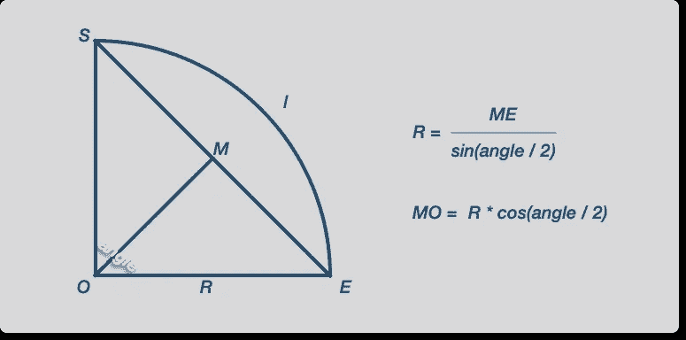

这里有几行代码可以帮助你计算 R 和 MO:

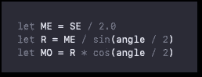

## **第四步。计算 O 的坐标**

谷歌地图支持我们:

`GMSGeometryHeading`

返回到`to`的最短路径上`from`处的初始航向(北顺时针度数)。

返回值在范围[0，360]内。

并且:

`GMSGeometryOffset`

返回从地球上的`from`开始，以`heading`开头，沿着一个大圆弧以米为单位移动`distance`时的目的地坐标。

得到的经度在[-180，180]范围内。

我们将结合`GMSGeometryHeading` 和`GMSGeometryOffset` 来寻找 M 的坐标。

从开始位置到结束位置的方向:

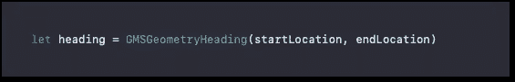

因为 S、M 和 E 在同一直线上，所以我们可以用以下公式求出 M 的坐标:

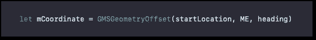

接下来，求 O 的坐标。

O 有两个坐标，如下图所示，我们有蓝色的 O 和红色的 O。为了简化，我们可以选择一个。

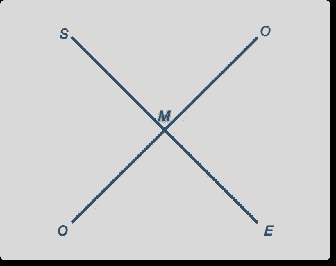

对我来说，我想用基于南纬和东经的公式选择一个方向。

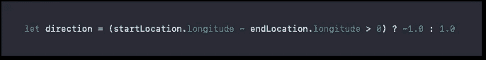

现在，我们有了 O 的坐标:

## **第五步。** *用不同的角度找到曲线上的每个位置(a1，a2，…an)*

这是画曲线的主要部分。你需要把角度拆分成 *n* 更小的角度，然后结合 R-radius 和 O 的坐标，找到曲线上每个点的坐标。

在我的例子中，曲线需要有 100 个主点。

下面是我定义曲线上每个位置的代码。计算每个位置的坐标，并将它们添加到我们上面创建的初始路径中。

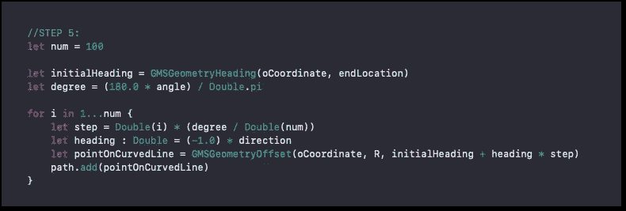

## 第六步。将 GMSMutablePath 转换为 GMSPolyline

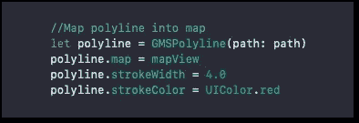

我将`GMSMutablePath`转换为`GMSPolyline` 并添加到地图视图中，以及设置描边宽度和描边颜色。

是的，就这样。现在我们有了绘制曲线所需的所有代码。

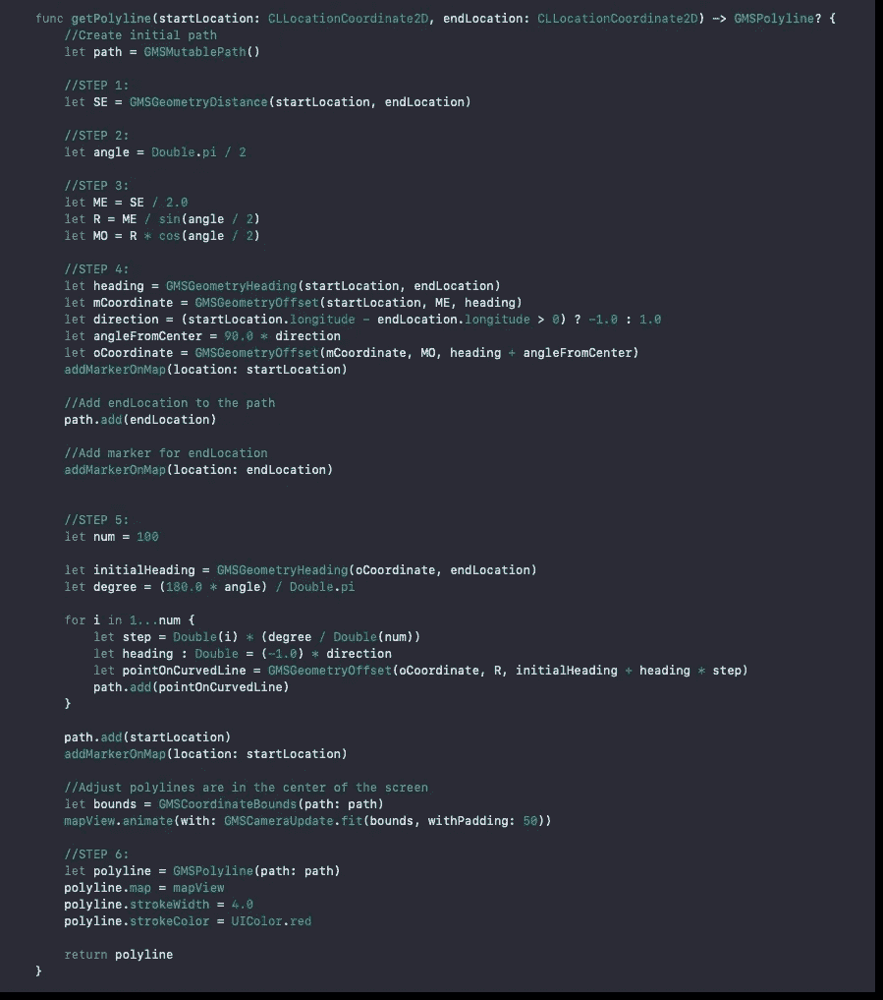

现在，运行它，我试着画一条从伦敦到剑桥的曲线并自定义，看看结果如何。

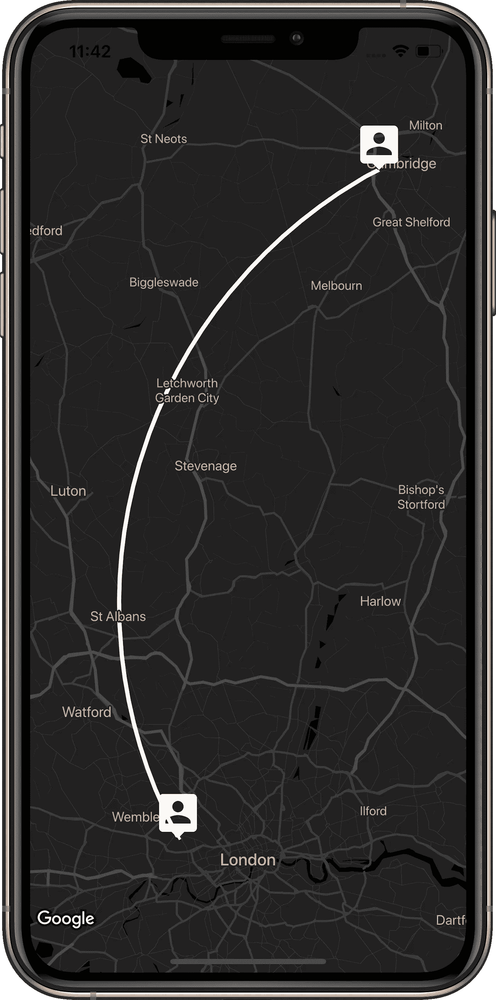

# **总结**

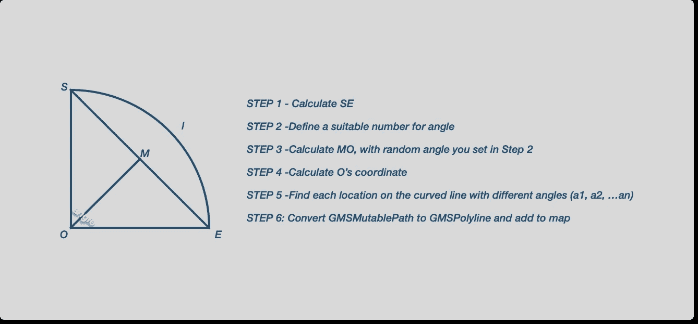

这里是我在 GitHub 上的[回购，大家可以看看！](https://github.com/ryanisnhp/CuvredLine)

和平！