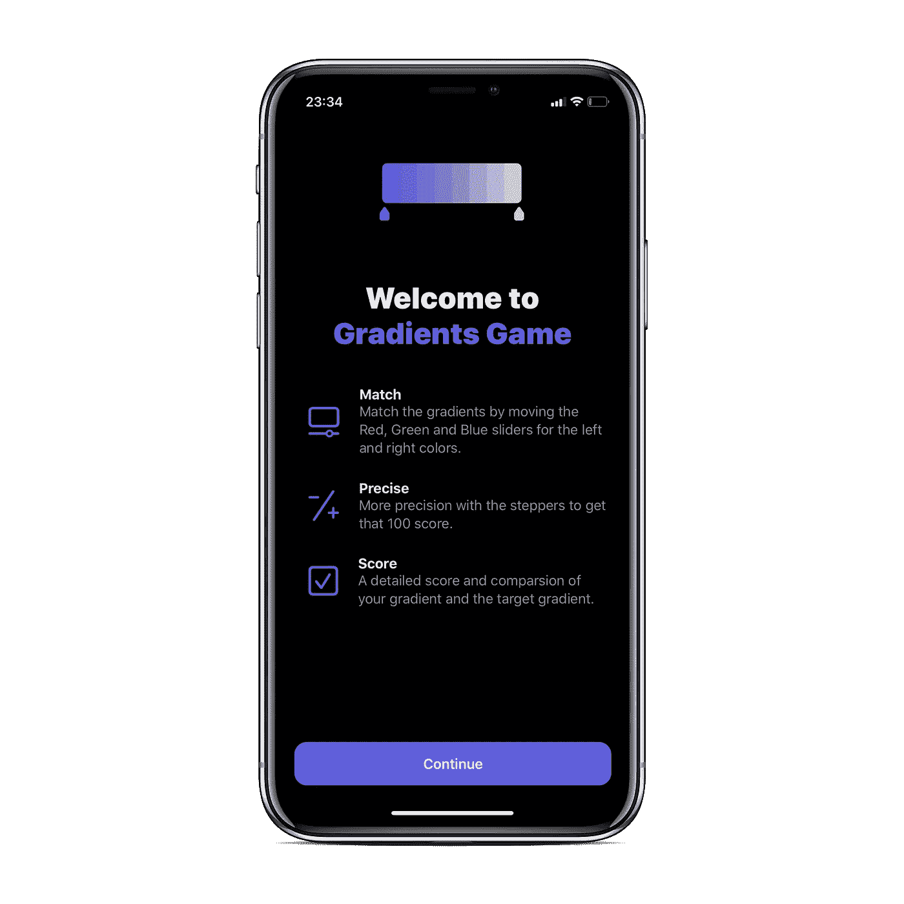
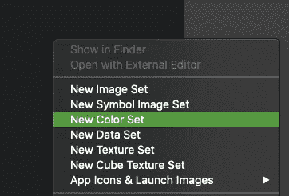
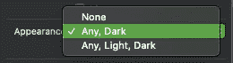
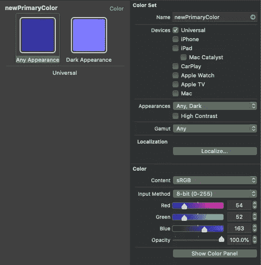
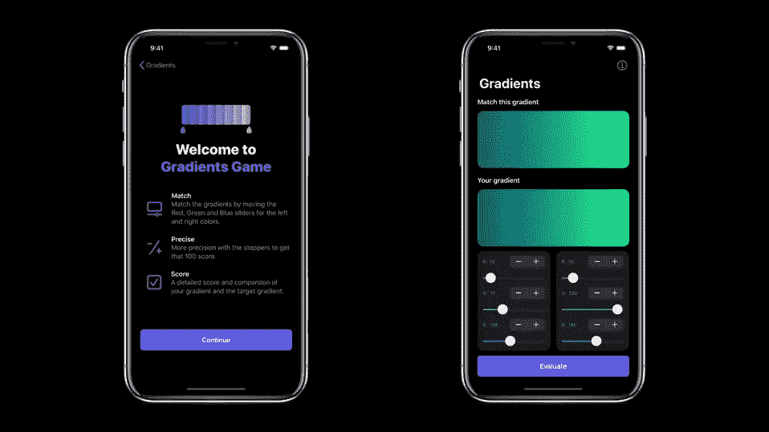

# 如何在 SwiftUI 中使用自定义颜色和修改器

> 原文：<https://betterprogramming.pub/custom-colors-and-modifiers-in-swiftui-a093c243c126>

## 使用颜色集简化颜色处理



渐变游戏(图片来源:作者)

我已经为我的 [SwiftUI 游戏](https://apps.apple.com/us/app/gradients-game/id1479784361?ref=producthunt)工作了几个星期了，这变得很有趣！

# 自定义颜色

我从 UIColor 的 systemIndigo 颜色中获得灵感，改用定制颜色作为品牌。上面的模型使用了 systemIndigo，但是我想在浅色模式下使用更深的颜色，在深色模式下使用更浅的颜色。

为此，您可以在`Assets.xcassets`文件夹中创建一个新的颜色集。



然后勾选所有深色的外观，让它们在深色模式下有不同的颜色，为什么不呢？



提供颜色的值。我用 sRGB 和 0-255 的方法。



使用静态常量创建结构颜色的扩展，从资产目录中获取颜色。

```
extension Color { static let oldPrimaryColor = Color(UIColor.systemIndigo) static let newPrimaryColor = Color(“primaryColor”)}
```

您可以在以下视图中轻松使用它:

```
Text(“Gradients Game”) .fontWeight(.black) .font(.system(size: 36)) .foregroundColor(.newPrimaryColor)
```

# 自定义修改器



如果你看上面的模型，继续和评估按钮有相同的设计。

您可以通过编写自定义修饰符来实现这一点，以便在任何地方重用该设计。

```
struct ButtonModifier: ViewModifier { func body(content: Content) -> some View { content .font(.headline) .foregroundColor(.white) .padding() .frame(width: UIScreen.main.bounds.width — 30, alignment: .center) .background(RoundedRectangle(cornerRadius: 8, style:   .circular).fill(Color.newPrimaryColor)) .padding(.bottom, 8) }}
```

为了使它更容易使用，在视图的扩展中编写一个函数来返回修饰符。

```
extension View { func customButton() -> ModifiedContent<Self, ButtonModifier> { return modifier(ButtonModifier()) }
}
```

现在，您可以轻松地将它用作:

```
Text(“Evaluate”) .customButton()
```