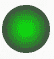
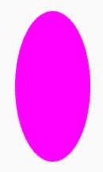
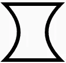
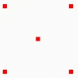
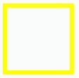
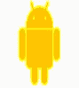

# 使用 Jetpack Compose 构建自定义组件

> 原文：<https://betterprogramming.pub/custom-composable-with-jetpack-compose-912d8c53b810>

## 创建自定义视图


由[和](https://unsplash.com/@andriklangfield?utm_source=medium&utm_medium=referral)在 [Unsplash](https://unsplash.com?utm_source=medium&utm_medium=referral) 上拍摄的照片

Jetpack Compose 已经为我们提供了一个巨大的组件库来创建我们的 UI。但是为了给用户创造一个更加愉快和定制的体验，我们有时需要创建我们自己的体验。

在我的第一篇文章系列中，我想谈谈如何在 Jetpack Compose 中创建定制视图。

在一个带标签的范围滑块的例子中，我们经历了创建一个完全自定义的可组合组件所需的步骤。

我之所以选择这个例子，是因为当前版本的范围滑块只提供了一个浮动范围，并且没有简单的方法来显示步长对齐标签，根据所选的范围来改变它的外观。

这一系列的结果将如下所示


运动中带标签的范围滑块

我们将会看到三个不同的主题被用来创建可组合的，最后我们把它们放在一起。

*   如何在画布上画画(这一部分)
*   [处理触摸交互](https://medium.com/@alex.frank84/touch-interactions-in-jetpack-compose-caf88adcae61)
*   [科特林语境接收者](https://medium.com/@alex.frank84/context-receivers-9265b29a6ff1)(因为它新颖有趣:-D)
*   [绘制带标签的范围滑块](https://medium.com/@alex.frank84/draw-the-labeled-range-slider-3eb96e748e88)
*   [与带标签的范围滑块](https://medium.com/@alex.frank84/make-the-labeled-range-slider-interactive-516bdf6e5c25)互动

随着我们的进展，所有的代码和项目都将发布在 GitHub 上。

# 如何在画布上画画

让我们先来看看如何在一个 Composable 内的画布上绘制东西。

作为简单的第一步，我们画一个基本的形状，像一个圆形。为此，我们

*   创建我们的可组合
*   给它一个最小尺寸
*   添加画布
*   画圆

```
@Composable
fun DrawSimpleCircle(
   color: Color,
   modifier: Modifier = Modifier,
   minSize: DpSize = *DpSize*(32.*dp*, 32.*dp*)
) {
   *Canvas*(modifier = modifier.*size*(minSize)) {
      drawCircle(color)
   }}
```

这个组合的结果将是一个给定颜色的圆，填充整个组合的大小。例如:


一个简单的绿色圆圈

此外，这个 API 允许我们不仅用单一颜色绘制形状，还提供了更灵活的`Brush`变体。有了`Brush`，我们也能实现渐变。该示例显示了两种颜色的渐变，但是如果需要的话，API 允许可变的颜色列表。

```
*...*drawCircle(
   brush = Brush.radialGradient(
      colors = *listOf*(
         centerColor, outerColor
      )
   )
)
```



具有径向渐变的圆

构图中的画布当然不仅可以画圆。它提供了多种不同的绘图方法*。*

这里有一些提供方法的例子和它可能的样子。

`drawRect`:


`drawRoundRect`:


`drawLine`:


`drawOval`:



`drawArc`:


```
...
drawArc(
   color = color,
   startAngle = 180f,  // 0f is at 3 o'clock of the circle
   sweepAngle = 180f,  // go 180° from startAngle
   useCenter = false,  // whether to fill the arc or not
   style = Stroke(width = 2.*dp*.*toPx*())
)
```

`drawPath`:



```
...
val path = *Path*().*apply* {
   lineTo(size.width, 0f)   // line from start to end
   quadraticBezierTo(       // arc from the top to  bottom
      size.width / 2, size.height / 2,
      size.width, size.height
   )
   lineTo(0f, size.height)  // line from end to start
   quadraticBezierTo(       // arc from bottom to top 
      size.width / 2, size.height / 2,
      0f, 0f
   )
   close()                   // link end to start
}drawPath(
   color = color,
   path = path,
   style = Stroke(width = 2.*dp*.*toPx*())
)
```

`drawPoints`:



`drawOutline`:



`drawImage`:



```
...
drawImage(
   image = image,
   dstSize = *IntSize*(size.width.toInt(), size.width.toInt()),
   colorFilter = ColorFilter.lighting(Color.Yellow, Color.Red)
)
```

# 天然画布

Canvas Composable 中没有直接提供的一个有用的绘图功能是绘制文本的能力。但是我们仍然可以通过使用`drawIntoCanvas` 方法来实现这一点。它让我们可以访问本地 Canvas，它提供了一个`drawText`方法。

重要的是要注意:当使用原生的`Canvas`时，你必须求助于`android.graphics` 包，使用它的`Paint`或`Color`类来代替组合变量。

```
*Canvas*(modifier = modifier.*size*(minSize)) {
   val paint = android.graphics.Paint()
   paint.*textSize* = textSize.*toPx*()
   paint.*color* = android.graphics.Color.*BLACK
   drawIntoCanvas* {
      it.*nativeCanvas*.drawText(text, 0f, 0f, paint)
   }
}
```

# 结论

有了画布和本机画布，我们就能够为我们的带标签的范围滑块绘制所需的一切。


我们最终的结果会是什么样子

在下一部分中，我们将看看如何通过对触摸事件做出反应来使我们的自定义可组合交互。[直接进入第 2 部分](https://medium.com/@alex.frank84/touch-interactions-in-jetpack-compose-caf88adcae61)。

这篇文章中创建图片的代码可以在 [GitHub](https://github.com/a-frank/draw-canvas-composable) **上找到。**