# 使用 Jetpack Compose 构建自定义设计系统

> 原文：<https://betterprogramming.pub/custom-design-system-using-jetpack-compose-17a59b1ae38d>

## 让我们用自己的实现替换 Android 的材料包

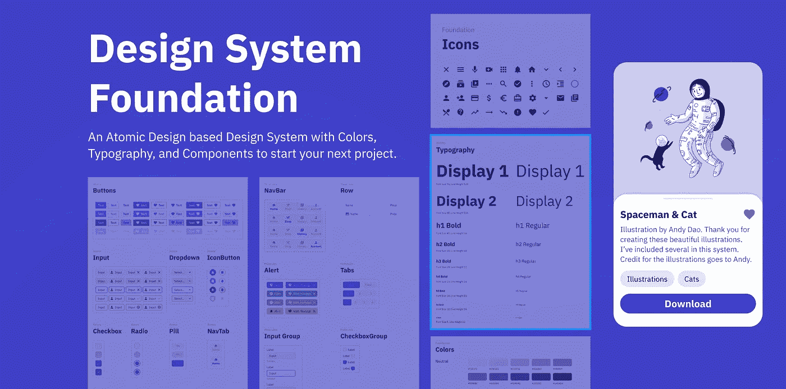

在这篇文章中，你会发现:

*   什么是设计系统
*   Jetpack Compose 中有哪些实现你的设计系统的方法
*   如何实现一个基于基础包的设计系统，将素材库完全排除在你的项目之外。

# 简而言之，设计系统

UI 设计系统是用于设计和编码的标准的集合，它包括根据某些规则创建的一组组件，这些组件创建产品的单个 UI 概念。设计系统可以被看作是指令和一组组件，它们可以用来构建设计的最终版本。

设计系统通常分为几层:

*   原子层:它是一组原子元素，例如，一组颜色、排版规则、组件角部形状、高度和填充。
*   分子层:它是一组基本的 UI 小部件，使用分子进行样式设计，功能最少。分子的一个例子可以是`Text`、`Icon`、`Avatar`、`Border`、`Separator`成分。
*   生物体层:是由一种或几种分子成分组成的成分。
*   屏蔽层:它是由有机体和分子组成的一组组件。

一种设计系统解决了以下问题:

*   管理(设计和开发团队找到共同语言)
*   设计语境中的“真理的唯一源泉”
*   原子层的可变性(通过改变颜色、字体和边角形状的值，可以得到修改的 UI 样式)
*   可扩展性(大型组件构建在较小的/预构建的组件之上)

目前大公司的设计系统实现也不少。最著名的两个是:

*   [来自谷歌的材料设计](https://material.io/)
*   [苹果的人性化设计](https://developer.apple.com/design/human-interface-guidelines/guidelines/overview/)

这些设计系统不仅在公司内部使用，也推荐在为 Android 和 iOS 设备编写的应用程序中实施。这些公司利用用户熟悉这种设计格式的事实来鼓励他们的使用，并且他们设计这些设计系统的方法是经过科学和实验证实的。

其他设计系统的示例:

[](https://uxplanet.org/top-12-design-systems-to-steal-from-and-up-your-design-game-520235d7de76) [## 从你的设计游戏中窃取并升级的 12 大设计系统

### 设计影响着我们所做的一切。

uxplanet.org](https://uxplanet.org/top-12-design-systems-to-steal-from-and-up-your-design-game-520235d7de76) 

出于本文的目的，我从 Figma 社区门户中选择了一个相当原始但结构良好的设计系统。你可以跟随[链接](https://www.figma.com/file/z2BtuZqLwoXw7gnXu8AZAL/Design-System-Foundation-(Community)?node-id=108%3A95)观看它，同时跟随它在[项目](https://github.com/ZadorozhnyiSemen/ComposeDesignSystem)中的实现。

看到这个设计系统的封面后，我决定把它命名为`SpaceTheme`。

# Jetpack Compose 中的设计系统

首先，值得一提的是 *Google* 已经确保其设计系统在代码中实现。因此，开发人员能够获得现成的组件，并根据自己的判断对它们进行配置。

`androidx.compose.material`包在代码中负责这个——在代码中你可以找到很多现成的组件。其描述和规格可在官方[材料设计文件中找到。](https://material.io/components/)

尽管存在现成的组件，但 Google 为项目中设计系统的定制和实现提供了空间。以下是谷歌对此的说法:

> *你可以采取几种方法:
> -*-[用额外的主题值
> -](https://developer.android.com/jetpack/compose/themes/custom#extending-material) [扩展](https://developer.android.com/jetpack/compose/themes/custom#replacing-systems)-替换一个或多个材料系统-`Colors`、`Typography`或`Shapes`-用定制实现，同时保持其他
> - [实现完全定制的设计系统](https://developer.android.com/jetpack/compose/themes/custom#implementing-fully-custom)来替换`MaterialTheme`

根据我使用 Jetpack Compose 的经验和我的一些用它写项目的熟人的意见，前两种方法是开发人员最常用的方法。

在来自 *Tinder* 的一篇新文章中，他们分享了他们在 Compose 集成方面的进展，并表示他们的主题也是建立在材料设计之上的，少数组件是在基础包的基础上编写的。你可以在他们的文章中找到更多信息。

[](https://medium.com/tinder/sparking-jetpack-compose-at-tinder-8f15d77eb4da) [## 火花喷射包组成的火绒

### 作者:塔莎·拉梅什，软件工程师

medium.com](https://medium.com/tinder/sparking-jetpack-compose-at-tinder-8f15d77eb4da) 

那么，‘*基于基础包*是什么意思呢？

Jetpack Compose 在体系结构上是分层构建的:

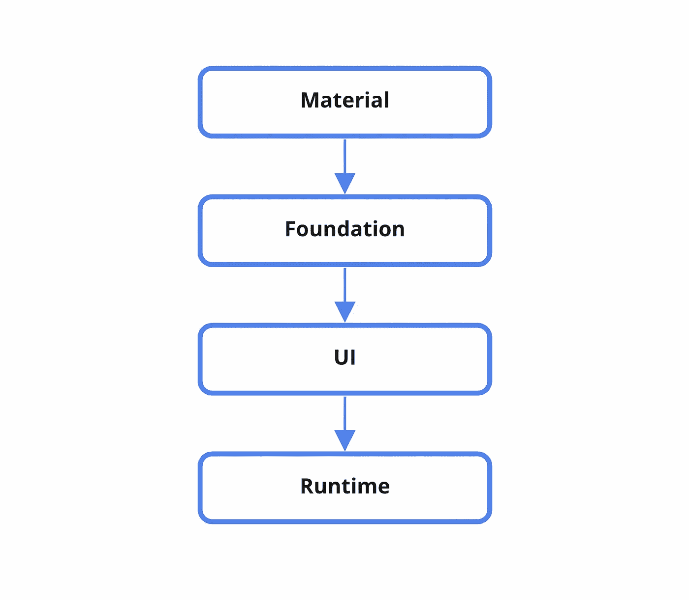

在图的顶部，有实现材料设计的材料包。Jetpack Compose 开发者暗示材料包是完全可选的，可以用你的定制设计系统替换。

我们工作的最终结果将包含以下层:

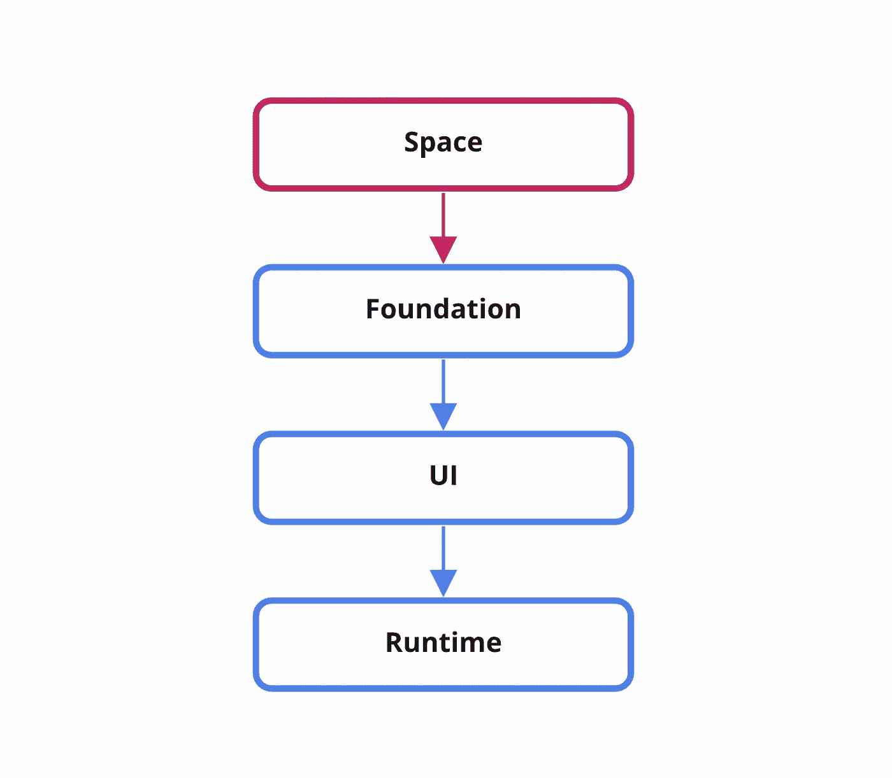

这就是我们将要做的:创建一个新的 Compose 项目，并通过删除材料包进行第一次提交。

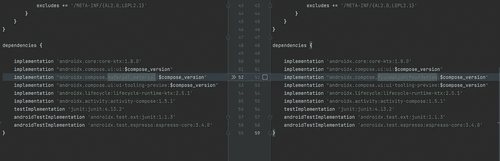

# 设计系统主题的实现

让我们从简单的事情开始。我们需要自己的替代方案来布置屏幕。让我们称它为`SpaceTheme`，下面是它的实现:

这意味着在设计系统中，我们把彩色排版和边角平滑作为原子。

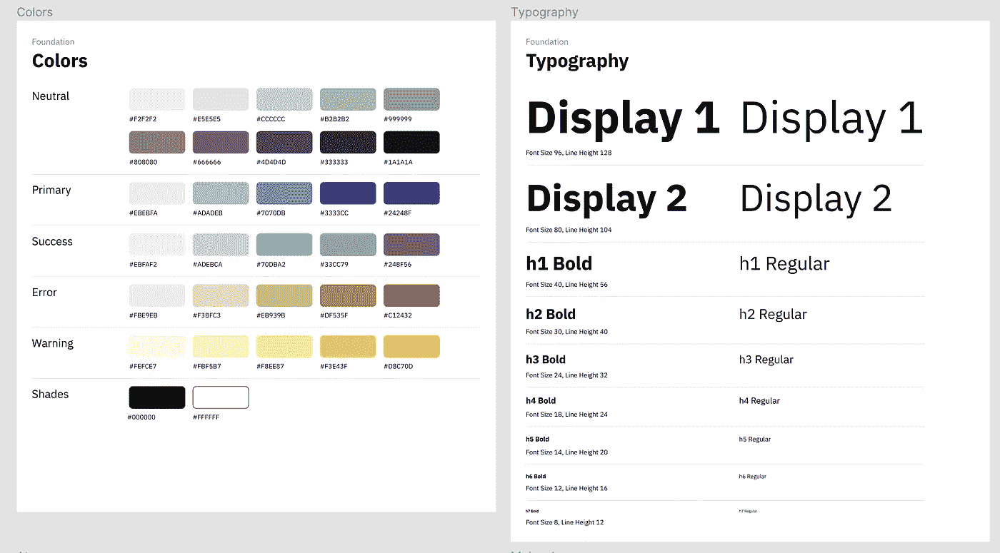

[https://www . fig ma . com/file/z 2 btuzqlwoxw 7 gnxu 8 azal/Design-System-Foundation-(社区)？node-id=2%3A121](https://www.figma.com/file/z2BtuZqLwoXw7gnXu8AZAL/Design-System-Foundation-(Community)?node-id=2%3A121)

尽管在任何地方都没有描述拐角值，但在设计系统中组件的实现中可以清楚地看到这一点。这是设计系统作者的一个小错误，但不是关键错误。

让我们从`SpaceShapes`开始。我们总共有三种类型的弯角——8 度、16 度和 45 度。还有静态合成的`LocalShapes`对象，这样就可以在代码中使用边角了。

下一步是排版，只有 9 种字体和 2 种字体粗细——常规和粗体。 **BM Plex Sans** 用作字体。可以从[谷歌字体](https://fonts.google.com/specimen/IBM+Plex+Sans?query=ibm+ple)下载。在构造函数中，我们为我们的字段设置默认值，并在文件末尾为静态组合`LocalTypography`创建一个字段

颜色是编写这个设计系统最常规的部分，因为，不像定义了 12 种原色的材料，我们的系统有 32 种！以及`lightSpaceColors` / `darkSpaceColors`用于设置明暗主题的默认颜色值。

此外，我们将创建一个`contentColorFor`方法来确定内容在特定背景色上应该是什么颜色(这些颜色的映射是从设计系统的分析中计算出来的)。

最后，我们将创建使用`LocalColors`颜色和内容颜色`LocalContentColor`的作品

所有这些类和完整的实现你可以在 GitHub 的项目包`[com.compose.designsystem.space.theme](https://github.com/ZadorozhnyiSemen/ComposeDesignSystem/tree/main/app/src/main/java/com/compose/designsystem/ui/theme)`中找到

在实现一个定制主题之后，我们可以继续实现基于它的组件。决定不用材料设计后先分析一下自己的能力。

# 我们绕过材料损失了什么成分

在实现这个设计系统的过程中，在我完成了原子的工作后，我立即着手小组件，这是我得到一个大惊喜的地方。

让我们仔细看看设计系统中的链接组件由什么组成。

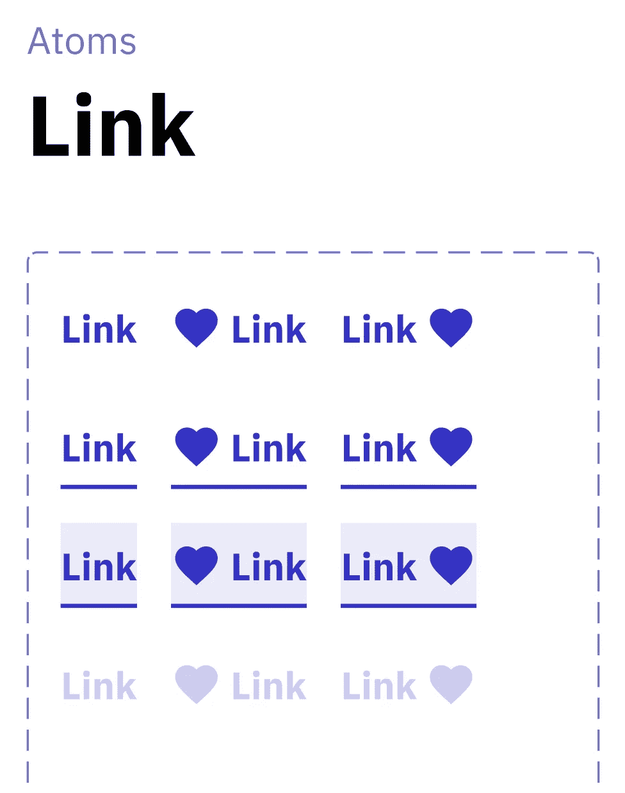

[https://www . fig ma . com/file/z 2 btuzqlwoxw 7 gnxu 8 azal/Design-System-Foundation-(社区)？node-id=3%3A253](https://www.figma.com/file/z2BtuZqLwoXw7gnXu8AZAL/Design-System-Foundation-(Community)?node-id=3%3A253)

`Link`是几个组件的集合。文本在顶部，链接在文本之前或之后有图标，文本下方可以显示小边框，链接的背景可以改变。

如果我们在 Compose 中这样做，就像我们习惯的那样，我们将使用`Surface`作为背景，`Text`、`Icon`和`Border`作为其余组件。不过，有个小问题。所有这些组件都是材料包的一部分，所以我们必须自己实现它们。

```
androidx.compose.material.Text(text = "Link")
androidx.compose.material.Divider()
androidx.compose.material.Icon(painter = .., contentDescription = null)
androidx.compose.material.Surface()
```

不过还好，因为 key @Composable 函数仍然由我们支配，比如`Row`、`Column`、`Box`、`Layout`、`BasicText`、`Spacer`、`Image`以及各种`Modifiers`

# 从上到下的屏幕概述(从有机体到分子)

一个小小的免责声明:我们已经涵盖了创建你自己的主题所需要的一切。下面将描述来自设计系统的组件的实现。这种实现可以有很多变化。我关注的是具体的，而不是最复杂的。我不会完全描述所有的细微差别，但会强调几个组件实现中有趣的地方。

## [交易历史画面](https://github.com/ZadorozhnyiSemen/ComposeDesignSystem/blob/main/app/src/main/java/com/compose/designsystem/application/first/FirstSpaceScreen.kt)

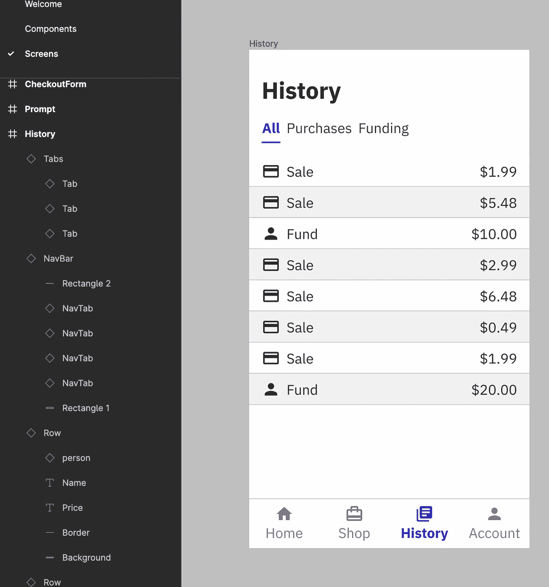

这个需要`Text`、`Border`、`Icon`、`Tabs`、`Tab`、`NavBar`和`NavTab`等部件

让我们从`Text`组件开始:

这里值得注意的是对`takeOrElse`函数的调用顺序，这些函数用于确定文本的颜色。我们优先考虑开发人员设置的颜色。如果是`Undefined`，我们从提供的文本样式中获取颜色。如果来自文本样式的颜色也是`Undefined`，那么我们从静态合成中取值，它总是不未定义的，可以是默认的。在我的项目中它是黑色的。

`LocalContentColor.current`也允许我们改变颜色，例如，如果我们有一个按钮，它覆盖其内容的颜色值，这样的例子可以在下面找到。

为了显示文本，我们从基础包中取出`BasicText`并将信息传递给它。

这里就不涉及`Divider`了，它是材料包里`Divider`的完整拷贝。

我们也不会为`Icon`使用任何额外的东西。简单的`Box`和`toolingGraphicsLayer`与`paint`修改器的组合就足够了。

`Tabs`和`NavBar`生物体包含更小成分的`Row`。下面有一个`Tabs`的实现。`NavBar`也是用类似的方法制成的。

这一部分中的`Surface`成分值得注意。它不在基础包中，本质上，它是一个在`Box`之上的方便的包装器，封装了颜色、形状和语义的设置，以保证框架的可访问性。你也可以在这里找到重新定义内容颜色的例子。放置在这样的`Surface`上，`Text`组件将使用`LocalContentColor.current`来设置文本颜色

`Tab`和`NavTab`组件稍微复杂一点，你可以在这里找到它们的[实现](https://github.com/ZadorozhnyiSemen/ComposeDesignSystem/tree/main/app/src/main/java/com/compose/designsystem/space/atoms)。

现在剩下要做的就是把所有组件放在一个屏幕上。屏幕本身可以在 [GitHub 上找到。](https://github.com/ZadorozhnyiSemen/ComposeDesignSystem/blob/main/app/src/main/java/com/compose/designsystem/application/first/FirstSpaceScreen.kt)

## [带底板的屏幕](https://github.com/ZadorozhnyiSemen/ComposeDesignSystem/blob/main/app/src/main/java/com/compose/designsystem/application/second/SecondSpaceScreen.kt)

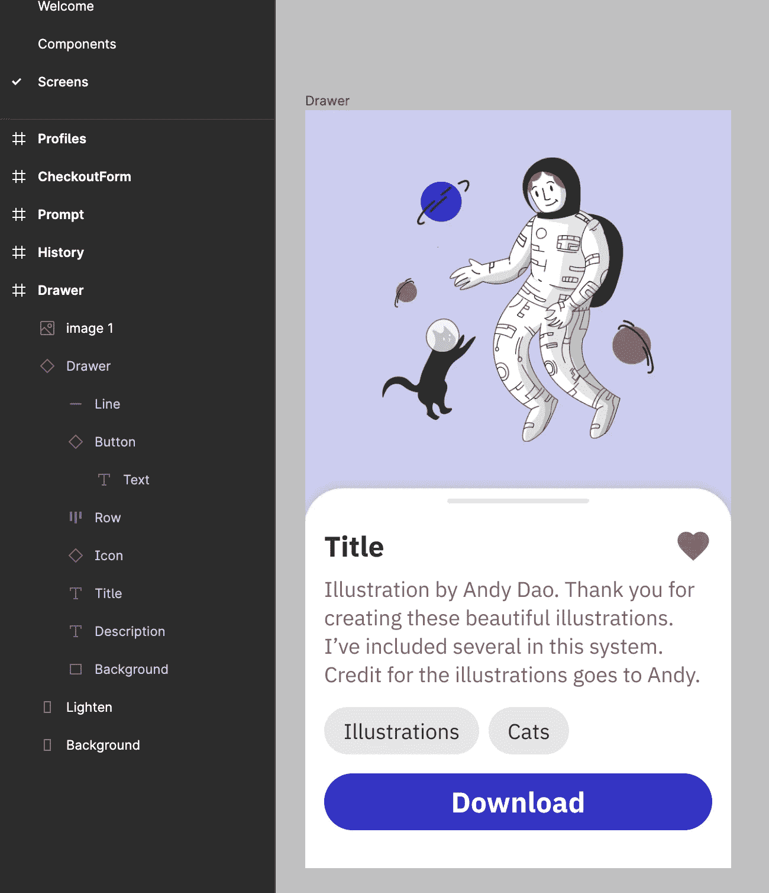

在这里，我们添加了`Button`组件和在部分屏幕上打开`BottomSheet`的功能

让我们从按钮开始:

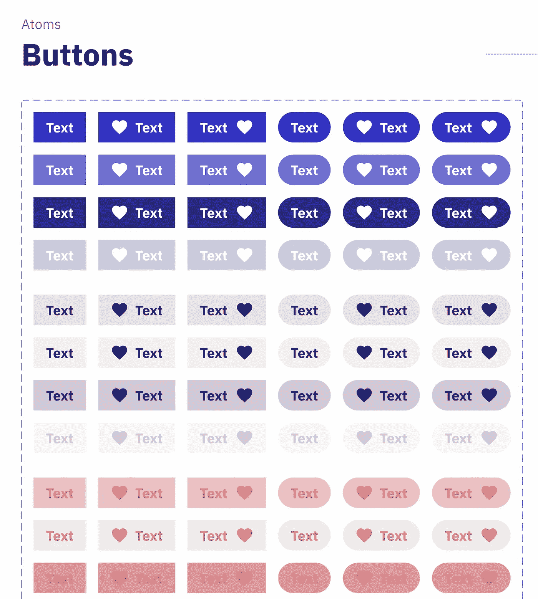

从设计中可以看出，我们必须配置按钮的类型——颜色取决于此。您可以在文本之前和之后向按钮添加图标，以及配置按钮的形状。

我使用了基于插槽的 API，以防我们想要插入文本之外的东西。基于插槽是关于传递一个或多个`@Composable`函数，以便不严重限制组件的实现。

默认情况下，按钮使用`SpaceTheme.typography.h4`版式，只是在`Row`上用很少的填充来布局组件。

之后，您可以编写一个简单的屏幕实现来显示`BottomSheet`:

`BottomSheetScreenStack`在这个例子中负责将不同层次的内容绘制在屏幕上的方式。

这是我们为组件创建`Layout`的地方，内容占据了整个屏幕，而`BottomSheet`被固定在屏幕的底部。

## [提示屏幕](https://github.com/ZadorozhnyiSemen/ComposeDesignSystem/blob/main/app/src/main/java/com/compose/designsystem/application/third/ThirdSpaceScreen.kt)

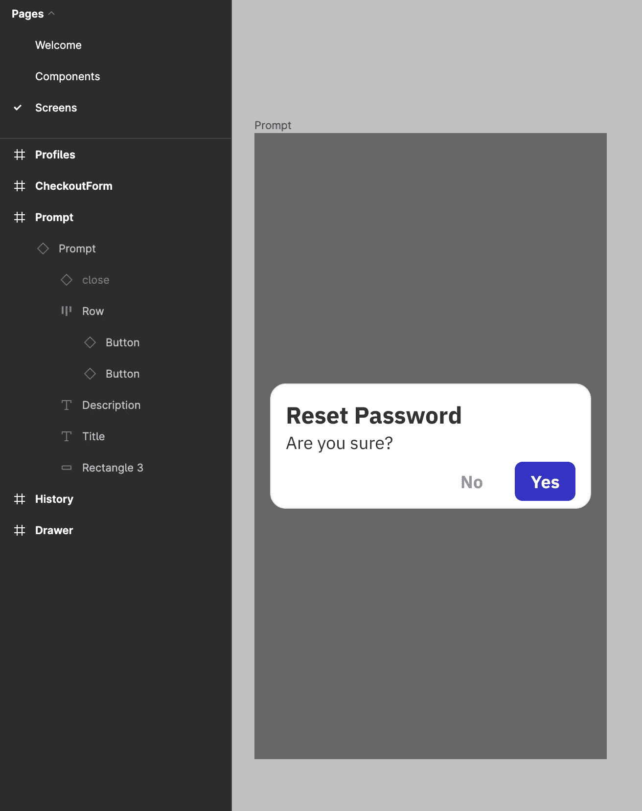

这里最大的挑战是向用户显示对话。材料上用`AlertDialog`处理。基础包为我们提供了`@Composable` `Dialog`，我们只需要将它包装在我们的`Prompt`中，并定义它的样式和内容:

## [结账屏幕](https://github.com/ZadorozhnyiSemen/ComposeDesignSystem/blob/main/app/src/main/java/com/compose/designsystem/application/forth/ForthSpaceScreen.kt)

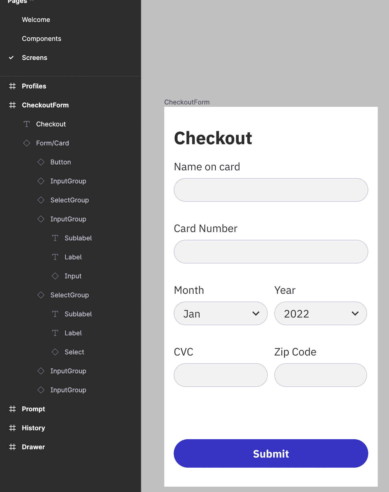

在这里，`Form/Card`有机体是一个值得注意的东西，它本质上包含内容和一个确认按钮

`InputGroup`和`SelectGroup`是包含标题、用于输入或选择选项的字段和副标题的小有机体。

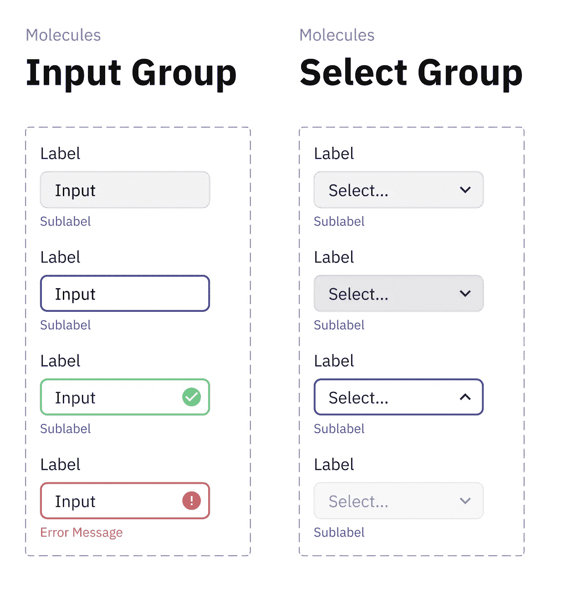

这些组件并没有什么有趣的地方，但是 input field 本身是值得关注的。基础包提供了处理用户输入并显示在屏幕上的`BasicTextField`。对于可视组件，使用了`decorationBox`字段

```
decorationBox: @Composable (innerTextField: @Composable () -> Unit) -> Unit =
        @Composable { innerTextField -> innerTextField() }
```

它是一个@Composable 组件，您可以定义自己并在其中添加一个`innerTextField`。

## [配置文件屏幕](https://github.com/ZadorozhnyiSemen/ComposeDesignSystem/blob/main/app/src/main/java/com/compose/designsystem/application/fifth/FifthSpaceScreen.kt)


这个屏幕基于已经存在的组件，唯一添加的小部件是`Avatar`。使用`Box`很容易实现它，并且没有独特的方法。为了不使它太长，我将不描述它的实现。

# 结论

在本文中，我们讨论了:

*   什么是设计系统，它的用途是什么
*   设计系统是如何在 Jetpack Compose 中实现的，有哪些方法可以实现你自己的主题
*   如何在不使用材料设计的情况下实现你的主题
*   用于创建多个屏幕的定制设计系统上的组件实现示例

我想提醒您，整个实现在项目中是公开可用的:

[](https://github.com/ZadorozhnyiSemen/ComposeDesignSystem) [## GitHub-ZadorozhnyiSemen/ComposeDesignSystem:自定义设计系统

### 此时您不能执行该操作。您已使用另一个标签页或窗口登录。您已在另一个选项卡中注销，或者…

github.com](https://github.com/ZadorozhnyiSemen/ComposeDesignSystem) 

我的主要目标是尝试使用 Jetpack Compose 来绕过 material 包，因为在制作项目中，我习惯于在 material 之上编写所有的设计。

从我个人的经验来看，如果你在项目上已经有了一个很完善的设计系统，而且看起来不像是材料设计，那么自己实现，仅仅以材料上的代码为例，会更好，因为现在 Compose 中的很多东西都是非常具体的，并且是和材料设计的规范捆绑在一起的。例如，如果您需要在`Scaffold`中从屏幕顶部显示`Snackbar`，那么您必须自己实现`Scaffold`。

当我在写测试项目的时候，我花了大部分时间在颜色、排版和一些组件上。在我写完组件之后，布置屏幕就像布置材料组件一样简单。

目前为止，如果您对 Jetpack Compose 的 MVI 感兴趣，您可以通过下面的链接阅读有关该主题的一系列文章:

[](https://szadorozhnyi.medium.com/mvi-for-compose-part-1-ece0654bc25) [## 作曲 MVI(上)

### MVVM 的问题和好处

szadorozhnyi.medium.com](https://szadorozhnyi.medium.com/mvi-for-compose-part-1-ece0654bc25)