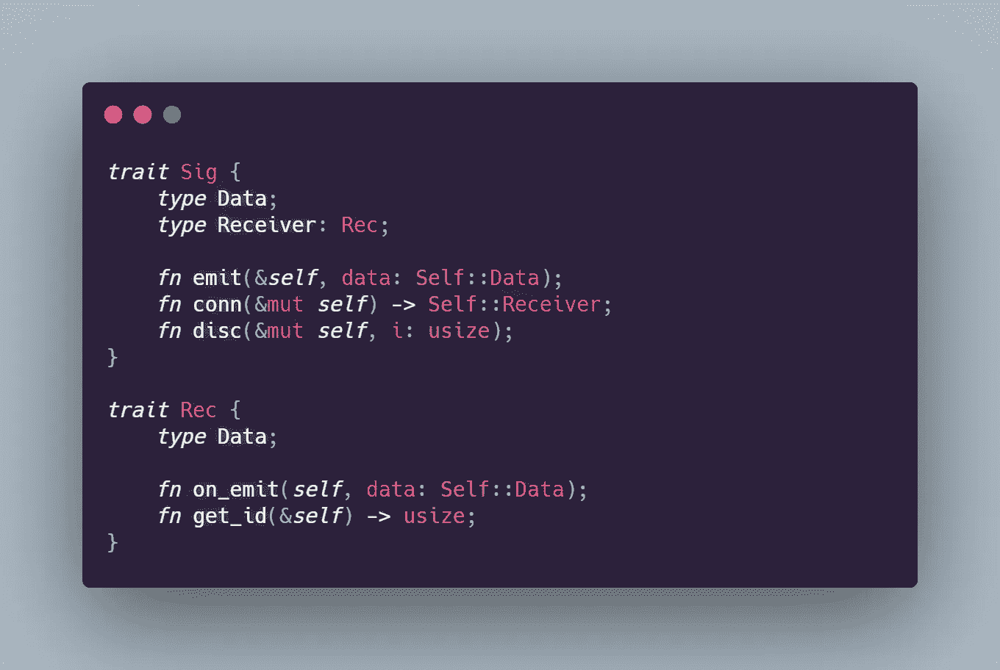
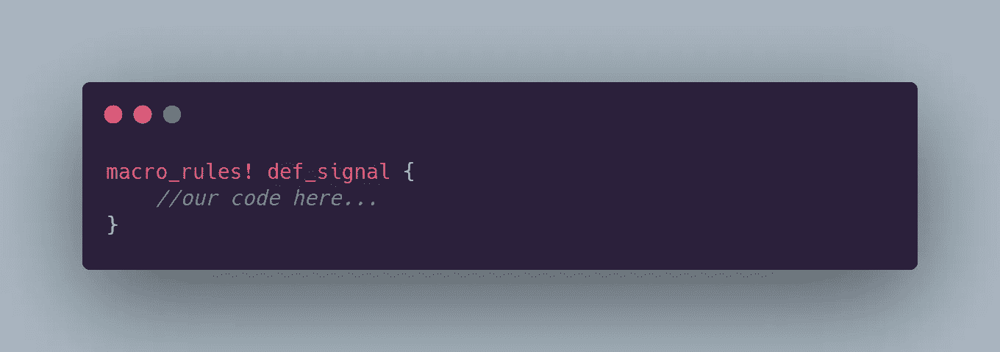
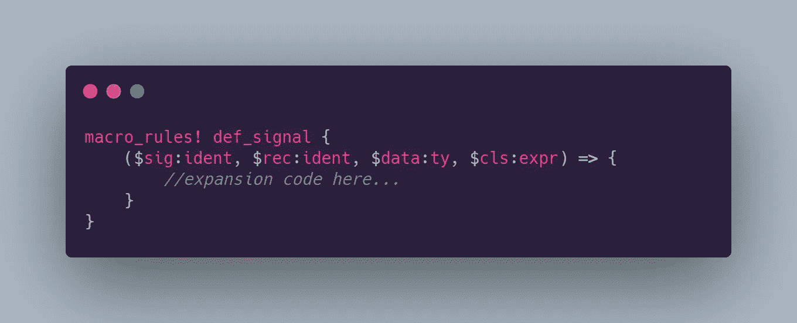
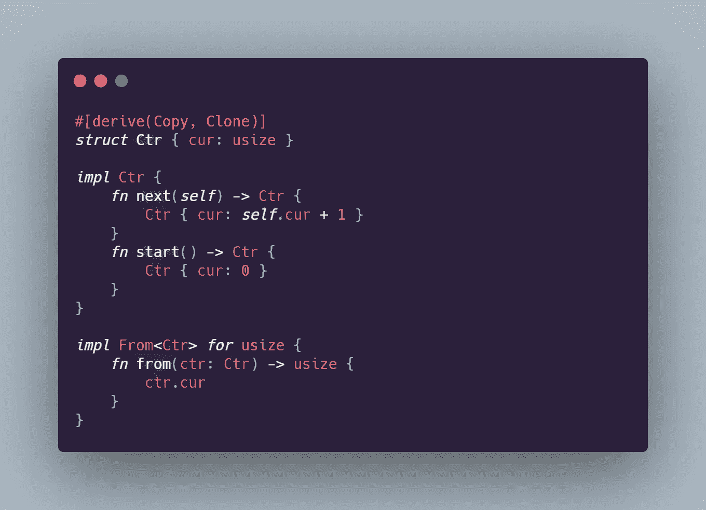
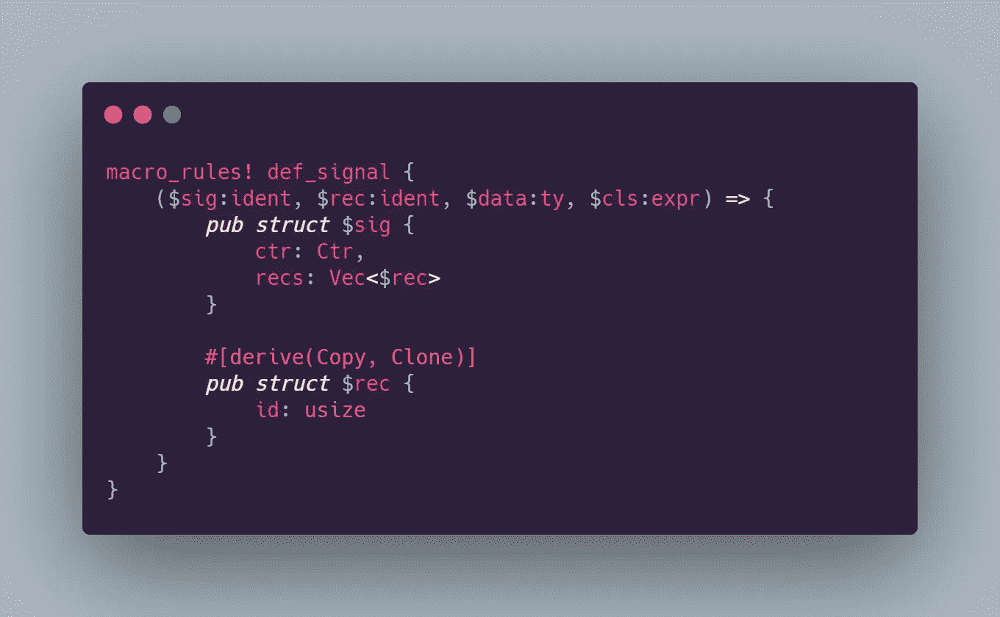
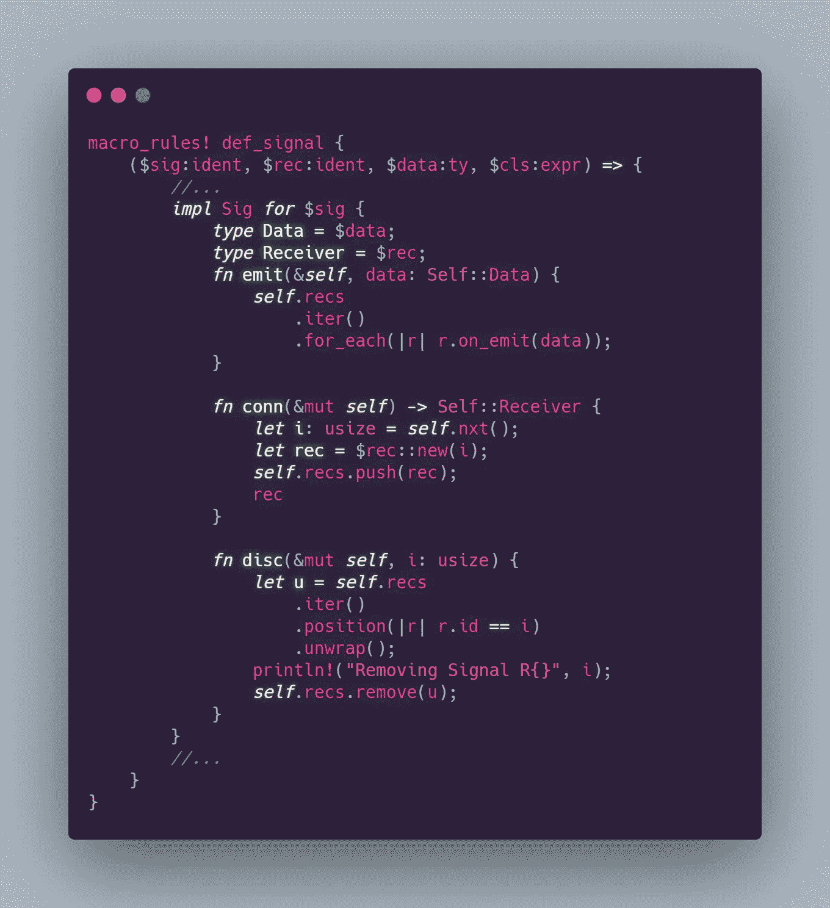
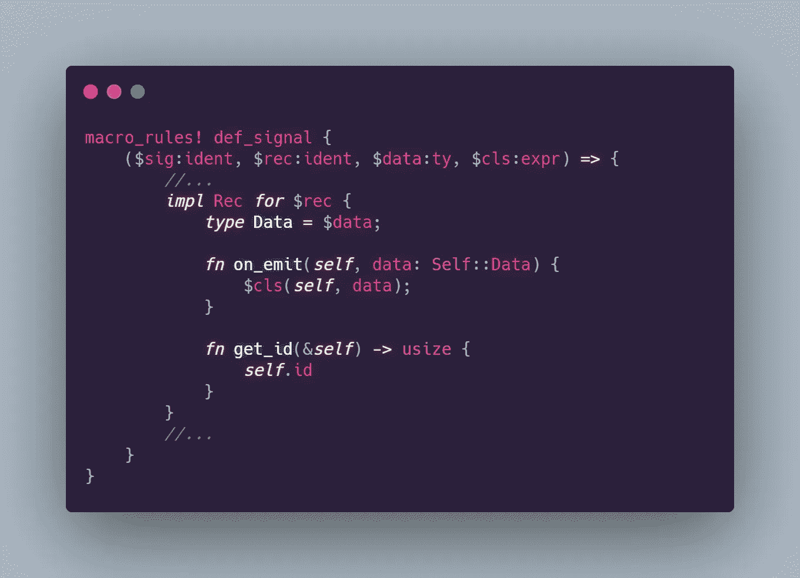
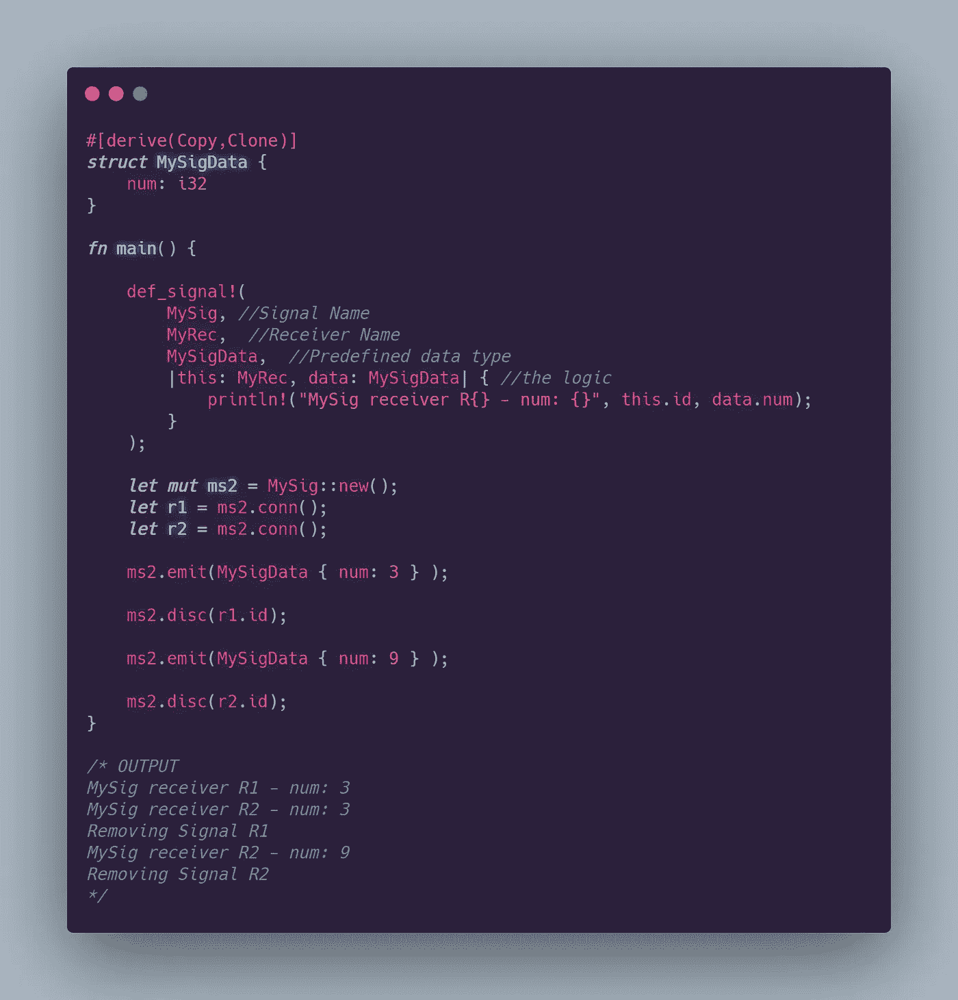

# Rust 中的自定义事件

> 原文：<https://betterprogramming.pub/custom-events-in-rust-c4e534b6b8cb>

## 定义和实现可重用的事件信号

米奇·奥尼尔在 [Unsplash](https://unsplash.com?utm_source=medium&utm_medium=referral) 上拍摄的照片

*(我最近发布了这篇文章* *的升级版* [*，它解释了一个更好的解决方案，但是如果你愿意，请继续按顺序阅读！)*](https://rossketeer.medium.com/rust-events-revisited-926486721e3f)

Rust 是一种年轻而令人兴奋的系统语言，在广泛的应用领域有很大的潜力。Rust 程序可以针对任何平台进行构建。如果人们开始使用 Rust 编写操作系统之类的东西，我不会感到惊讶(而且人们已经在使用 Rust 构建很酷的东西了)。Rust 最不可思议的地方在于它是内存安全的——Rust 中甚至不存在一整类行业瘫痪性的隐伏错误。微软甚至在未来的项目中支持 Rust。也许有一天它甚至会成熟到取代 C 家族语言！不管怎样，Rust 将会继续存在，我感觉在不久的将来它将会是一个主要的玩家，至少在物联网和网络领域。

无论如何，今天我想谈谈我们如何在 Rust 中制作一个事件信号系统。让我们从发出事件的信号和处理事件的接收器的角度来考虑事件。在 Rust 中，我们可以将这些品质翻译成`trait` s。

我们的`Sig`和`Rec`特征具有必须在实现者上声明的相关类型。`Data`和`Receiver`对应的是编译时可以知道的硬类型。这样，内容可以保持大小不变，我们可以利用拷贝和克隆的优势。在`Sig`特性中，我们定义了三个额外的接口函数。`emit`向接收者发送一条数据。`conn`连接一个新的接收器并返回给我们。`disc`通过接收器的`usize` id 断开接收器。`Rec`也有一些功能。`on_emit`是我们的接收者对事件发射的响应。`get_id`只是给我们一些`usize`值，这些值在我们的接收器集合中是唯一的。

`Sig`和`Rec`是我们需要发送和接收事件信号的基本接口。但是由于实现它们需要为每个不同的事件和侦听器做大量的工作，所以我选择了一种不同的方法——我们将在一个可重用的声明性宏中编写所有的实现逻辑。宏会吓到一些人，但是锈宏并不邪恶。恰恰相反，它们实际上是高效和有用的，不仅仅是像 c 中那样替换文本。我们可以用`macro_rules!`定义一个新的声明性宏。

这就产生了一个名为`def_signal`的宏，我们可以像调用函数一样调用它，但是在圆括号前有一个`!`宏展开操作符(`!`在 Rust 中用于宏展开之外时也代表`never`类型)。

Rust 中的声明性宏只是花哨的匹配臂模式。在我们的`def_signal`宏中，我们只需要一个调用签名，所以我们只需要一个匹配臂。

我们可以使用后跟变量名和标记类型的`$`来声明语法标记捕获。我们可以在 Rust 宏中使用许多不同的标记类型，对应于不同的语言语法。我们将在这里使用一些。s 是标识符。在这里，任何合法的标识符都可以，只要它可以用作结构的名称。

我们将使用我们的`ident`作为`Signal`和`Receiver`实现者结构的名称，我们将使用这个宏来一般地定义它们。`$data`捕获是一个`ty`。`ty`对应于某种预先存在的类型。我们将使用这个参数来传递我们计划用作事件数据对象的结构。

最后，我们传入捕获`$cls`，一个`expr`。是有效 Rust 语法的任何表达式。我希望`$cls`是一个闭包，我们将使用它作为事件的回调。

在我们开始研究宏之前，有一件事我们应该做。到目前为止，我们的特征期望我们的实现者拥有惟一的 id。让我们编写一个简单的计数器来生成可以用作 id 的`usize`。

这里我们有一个简单的递增计数器。事实上，对于现实世界来说，这可能太简单了，但对于我们的目的来说，它肯定会起作用。我们可以使用它的当前状态通过 ID 来跟踪我们的`Signal`的接收者。它只是创建一个对象，并在我们请求时创建该对象的增量副本。稍后，我们将详细说明这将如何为我们实现唯一的 id。现在，让我们开始编写宏展开。

如你所见，一个宏可以扩展到几乎任何合法的 Rust 代码。包括命名结构！我们使用我们的`ident`捕获作为`Sig`和`Rec`实现者的结构名。这样我们就可以从宏中选择命名我们的结构。我们也可以使用这些`ident`来进行类型声明，就像在`Vec<$rec>`中一样。查看生成的代码，我们在`Signal`上使用了我们的`Ctr`类型，这样它就可以向它用`conn`生成的任何接收者提供唯一的 id。我们将`$sig`接收器存储在`$rec`结构的`Vec`中。我们的 receiver 结构很简单，只保存自己的 ID。

当然，我们也可以制作`impl`积木:

我们可以直接将实现块添加到我们的`ident`和`$sig`和`$rec`中。我们添加了惯用的`new`构造函数，并在`$sig`上添加了一个助手来从它的`Ctr`中获取下一个值。我们也可以在宏扩展中实现这些特征:

这里，我们在生成的`$sig`结构上为`Sig`写一个`impl`块。这里发生了很多事情，但这将定义每个事件将实现的基本行为。

*   首先，我们定义我们需要的类型。这种做法将允许我们的事件在编译时知道它们的处理程序的大小，这很好。
*   就像我们在 trait 契约中所做的一样，`emit`将遍历连接的接收者列表，并向每个接收者发送一条消息。
*   `conn`从计数器获取一个唯一的 ID，构造一个新的接收者，将新的接收者推送到接收者的`Vec`上，然后返回该接收者。
*   最后，`disc`通过查找接收方的索引来断开连接，并调用`Vec::remove`。

从接收器`Vec`中检查`iter`的功能使用！我们可以通过向`Iterator::position`函数传递一个谓词闭包来获取一个条目的索引。对于一门系统语言来说，非常具有表现力和抽象性！

现在我们应该为我们的接收器结构实现`Rec`:

这个很简单。我们只需要定义我们的数据类型，我们期望通过宏调用得到它，从`on_emit`中调用我们的`$cls`闭包，并定义一个`get_id`，它返回构造这个接收器的`id`。现在我们已经有了样板文件，让我们创建一个测试信号，并对其进行一些处理:

我们必须在宏之外声明一个数据结构。`MySigData`是一个保存 i32 值的简单结构。我们调用我们的`def_signal!`宏，并分别为它提供我们想要的`Signal`和`Receiver`的名称。然后我们传递预定义的数据结构(`MySigData`)。最后，我们有机会用最终的闭包参数在`on_emit`中定义一些逻辑。让我们编写一个简单的测试来证明它是有效的:

好的，看起来很成功。接收者在呼叫`conn`后接收消息。如果`disc`被调用，接收器将停止接收。只要我们恰当地处置了所有的接收器(当我们不再关心它们的订阅时)，我们也就不用担心编译器警告了！

局限性在于，您可能必须使用 enum 数据类型来处理同一个事件的多个接收者。然后，在每个接收者的基础上适当地响应变量，以保持事情的预期大小。否则，宏将生成您需要的一切，以使一个微型事件系统脱离地面。

[**通往铁锈操场的一个链接。**](https://play.rust-lang.org/?version=stable&mode=debug&edition=2018&gist=c791c9ed0f349ba2c2df4758d49b82c8)

我希望你喜欢更多的 Rust 乐趣和实验。

别忘了看看我的其他材料。直到我的生锈之旅的下一章，FP 上，读者们！