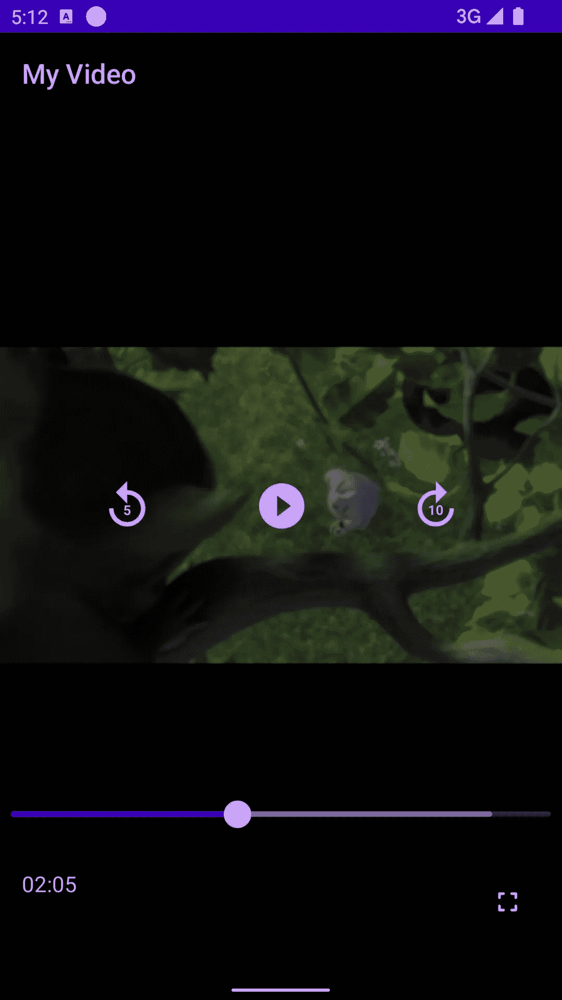
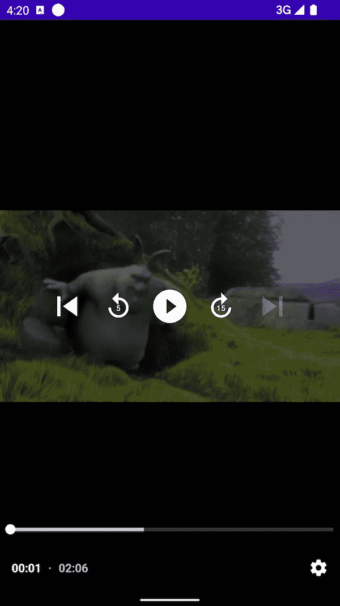
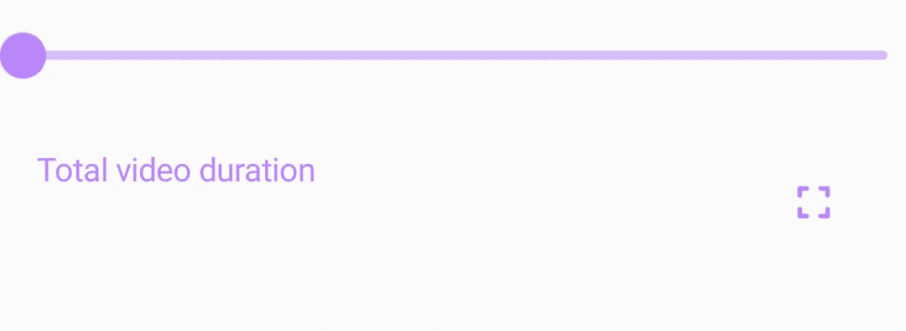

# Jetpack 撰写中的自定义 ExoPlayer 控件

> 原文：<https://betterprogramming.pub/custom-exoplayer-controls-in-jetpack-compose-c4089def0106>

## 为 ExoPlayer 添加自定义控件 UI 覆盖


由[克劳迪奥·施瓦茨](https://unsplash.com/@purzlbaum?utm_source=unsplash&utm_medium=referral&utm_content=creditCopyText)在 [Unsplash](https://unsplash.com/s/photos/video-play-button?utm_source=unsplash&utm_medium=referral&utm_content=creditCopyText) 上拍摄的照片

# 介绍

每当需要播放某种形式的媒体时， [ExoPlayer](https://developer.android.com/guide/topics/media/exoplayer) 通常是首选库。使用这个库有很多好处，因为它是开源的，经过了很好的测试，并且被大多数大型科技公司广泛地证明了。

ExoPlayer UI 视图是传统的 XML，为了在 Jetpack Compose 屏幕中使用它，我们将其包装在一个 [AndroidView](https://developer.android.com/reference/kotlin/androidx/compose/ui/viewinterop/package-summary#AndroidView(kotlin.Function1,androidx.compose.ui.Modifier,kotlin.Function1)) composable 中。如果您想提供自定义控件 UI，可以通过覆盖`exo_styled_player_control_view.xml`来实现。您也可以覆盖此处所述的[可提取内容。](https://exoplayer.dev/doc/reference/com/google/android/exoplayer2/ui/StyledPlayerControlView.html)

如果您是一个写作爱好者，并且想避开 XML 路线，那么就跟着做吧！

# 我们在建造什么？

到本文结束时，我们将拥有一个完整的自定义控件覆盖图，它包含以下内容:

*   视频标题在顶部
*   中央播放器控件
*   带有缓冲百分比、视频持续时间和全屏切换按钮的底部搜索栏



自定义控件覆盖

# 设置用户界面

让我们创建一个简单的占据整个屏幕的玩家视图。

初始设置

默认情况下，控件覆盖如下:



默认控件覆盖

让我们将控件 UI 分为三个部分:

*   顶部控件—标题
*   中央控制—播放/暂停、前进/后退
*   底部控件—搜索栏、全屏切换和视频时间

默认的播放器控件可以通过以下方法禁用:`[player.setUseController(false)](https://exoplayer.dev/doc/reference/com/google/android/exoplayer2/ui/StyledPlayerView.html#setUseController(boolean))`。

# 中央控制

我们可以使用一个简单的[行](https://developer.android.com/reference/kotlin/androidx/compose/foundation/layout/package-summary#Row(androidx.compose.ui.Modifier,androidx.compose.foundation.layout.Arrangement.Horizontal,androidx.compose.ui.Alignment.Vertical,kotlin.Function1))来显示中心控件。

中央控制

预览上面的组合会产生以下结果:


中央控制

如果视频正在播放，我们希望显示暂停图标，一旦暂停，则显示播放图标。此外，正如您所见，每个控件的`onClick`没有做任何事情。让我们添加这些功能。

通过调用 ExoPlayer 的`[seekBack()](https://exoplayer.dev/doc/reference/com/google/android/exoplayer2/Player.html#seekBack())`和`[seekForward()](https://exoplayer.dev/doc/reference/com/google/android/exoplayer2/Player.html#seekForward())`方法可以实现转发和重放。为了让玩家知道寻找后退/前进的持续时间，你必须使用`ExoPlayer.Builder(..)`上的`[setSeekBackIncrementMs(long)](https://exoplayer.dev/doc/reference/com/google/android/exoplayer2/ExoPlayer.Builder.html#setSeekBackIncrementMs(long))`和`[setSeekForwardIncrementMs(long)](https://exoplayer.dev/doc/reference/com/google/android/exoplayer2/ExoPlayer.Builder.html#setSeekForwardIncrementMs(long))`方法来设置它。

中央控制处理

# 底部控制

为了实现搜索栏，我们可以使用`[Slider](https://developer.android.com/reference/kotlin/androidx/compose/material/package-summary#Slider(kotlin.Float,kotlin.Function1,androidx.compose.ui.Modifier,kotlin.Boolean,kotlin.ranges.ClosedFloatingPointRange,kotlin.Int,kotlin.Function0,androidx.compose.foundation.interaction.MutableInteractionSource,androidx.compose.material.SliderColors))`可组合。我们可以将计时器和全屏按钮包装在一个`Row`可组合组件中，最后将所有底部控件包装在一个`[Column](https://developer.android.com/reference/kotlin/androidx/compose/foundation/layout/package-summary#Column(androidx.compose.ui.Modifier,androidx.compose.foundation.layout.Arrangement.Vertical,androidx.compose.ui.Alignment.Horizontal,kotlin.Function1))`可组合组件中。

初始底部控制

预览上面的组合会产生以下结果:



底部控制

我们必须用总视频时间替换“总视频持续时间”文本。要用当前的视频时间更新搜索栏，我们可以借助`[Player.Listener](https://exoplayer.dev/doc/reference/com/google/android/exoplayer2/Player.Listener.html)`接口获取值。这个监听器给出播放器中所有变化的更新。最后，如果用户移动搜索条，我们可以得到`onValueChange` lambda 中的值，并借助`[player.seekTo(long)](https://exoplayer.dev/doc/reference/com/google/android/exoplayer2/Player.html#seekTo(long))`方法将播放器搜索到所需的时间。

如果你还想显示缓冲百分比，你可以使用另一个`Slider`组件，并将搜索栏和缓冲栏包装在一个`[Box](https://developer.android.com/reference/kotlin/androidx/compose/foundation/layout/package-summary#Box(androidx.compose.ui.Modifier,androidx.compose.ui.Alignment,kotlin.Boolean,kotlin.Function1))`组件中。

底部控制处理

ExoPlayer 回调

`[onEvents(...)](https://exoplayer.dev/doc/reference/com/google/android/exoplayer2/Player.Listener.html#onEvents(com.google.android.exoplayer2.Player,com.google.android.exoplayer2.Player.Events))`回调用于获取当前玩家状态。`[player.getDuration()](https://exoplayer.dev/doc/reference/com/google/android/exoplayer2/Player.html#getDuration())`方法以毫秒为单位给出了正在播放的内容的总持续时间，而`[player.getCurrentPosition()](https://exoplayer.dev/doc/reference/com/google/android/exoplayer2/Player.html#getCurrentPosition())`方法以毫秒为单位给出了正在播放的内容的当前位置。最后，`[player.getBufferedPercentage()](https://exoplayer.dev/doc/reference/com/google/android/exoplayer2/Player.html#getBufferedPercentage())`方法给出了数据被缓冲的内容的百分比。

现在我们已经准备好了大部分的控件，我们还有一些事情要做。首先，我们希望只有当用户点击播放器时才显示控件覆盖。为了实现这一点，我们可以简单地将控件包装在一个`[AnimatedVisibility](https://developer.android.com/jetpack/compose/animation#animatedvisibility)`可组合组件中。我们还可以添加一些进入/退出动画，使过渡更加平滑。

动画播放器控件

现在运行代码会产生以下结果:


玩家控制结果

需要注意的重要事项:

*   我们应该观察片段/活动/可组合的生命周期状态。我们希望这样做，因为我们不想继续播放处于停止状态的媒体。
*   GIF 中的视频质量低于实际应用程序。

# 从这里去哪里？

现在您已经完成了，我希望您挑战自我，尝试并实现以下目标:

*   添加下一个/上一个视频控制—播放播放列表中的视频时
*   视频播放时更新当前视频时间
*   全屏切换

你可以从[这里](https://gist.github.com/rubenquadros/f2af69972984b13273edd01825c5695e)获得文章中片段的完整代码。

如果你想看看如何在现实世界的应用程序中使用它，看看这个回购。

[](https://github.com/rubenquadros/Jetpack-Compose-Video-Games-Example) [## GitHub-rubenquadros/Jetpack-Compose-Video-Games-Example:这是一个简单的视频游戏发现…

### 这是一个简单的视频游戏探索应用程序，展示了使用 Jetpack 与干净的架构组成的用户界面，还测试…

github.com](https://github.com/rubenquadros/Jetpack-Compose-Video-Games-Example) 

```
**Want to Connect?**You can also connect with me on [LinkedIn](https://www.linkedin.com/in/ruben-quadros-b87995173/). I would love to see your custom overlays.We at ShareChat are constantly working on making our apps better across all our clients: Android, iOS and Web. If you are interested in building ShareChat/Moj or solving interesting problems, [let us know by applying here](https://sharechat.hire.trakstar.com/)!
```

# 额外资源

*   为了更好地理解所有组件，ExoPlayer 文档
*   [ExoPlayer javadoc](https://exoplayer.dev/doc/reference/) 深入研究不同的类/方法
*   [Android 开发者](https://developer.android.com/jetpack/compose)网站了解更多关于 Jetpack Compose 的信息
*   [Android 开发者](https://developer.android.com/jetpack/compose/performance)网站，了解重要的 Jetpack Compose 性能问题
*   [Medium 文章](https://proandroiddev.com/learn-with-code-jetpack-compose-playing-media-part-3-3792bdfbe1ea)探索使用 ExoPlayer 和 Jetpack Compose 播放媒体的更多信息