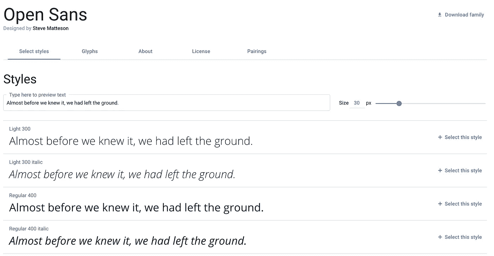
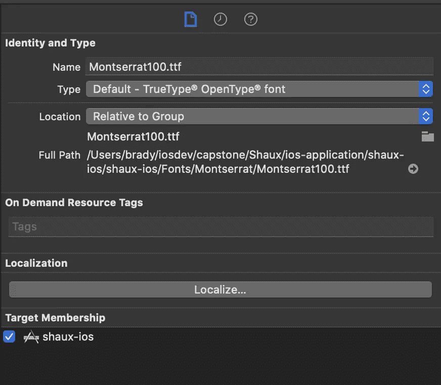

# 如何在 SwiftUI 中添加自定义字体

> 原文：<https://betterprogramming.pub/custom-fonts-in-swiftui-d529de69131d>

## 让你的 iOS 开发更漂亮

亚历山大·安德鲁斯在 [Unsplash](https://unsplash.com/s/photos/font?utm_source=unsplash&utm_medium=referral&utm_content=creditCopyText) 拍摄的照片

如果你在读这篇文章，你在这里有两个原因:

1.  你的设计者给了你一个使用自定义字体的设计，你不知道如何使用它们，因为你本质上是一个后端开发人员，不关心字符之间的间距是否使它更可读，或者
2.  您是一名开发人员，意识到您需要使用自定义字体将您的 UI 提升到一个新的水平，但是您不知道从哪里开始。

这就是我进来的地方！

我有过后端工程的经历，所以我了解这两方面的情况。我已经经历了尝试和错误，使学习如何使用自定义字体尽可能容易。

因此，让我们开始创建自定义字体应用程序，这样您就可以立即将其发布到您的 CI/CD 中！

# 获取字体

在向应用程序添加自定义字体之前，我们需要。ttf(或者。otf，但是我将使用。本文其余部分的 ttf 扩展名)该字体附带的文件。

要找字体，我推荐去[谷歌字体](https://fonts.google.com/)按样式数量过滤(假设你有字体的选择。如果你的设计师已经给了你字体，直接跳到下载字体系列)。

你想拥有多种风格的原因是……好吧，我会让[材料设计](https://material.io/design/typography/understanding-typography.html)的专业人士来给你解释。

一旦选择了字体，只需点击屏幕右上角的*下载系列*。就这样，你的应用程序有了新的字体！

# 导入字体系列

下载字体系列后，您需要打开 Xcode 项目并创建一个名为`fonts`的新文件夹。

我更喜欢在`Fonts` 文件夹中为我使用的每种字体创建一个文件夹，但这取决于你，取决于你是否想在下一次 scrum 会议上被你的经理批评。

包含字体名称子目录的字体文件夹

一旦这样做了，你想把你刚刚下载的所有文件拖到`fonts`文件夹(或字体名称的文件夹)。

确保当对话框弹出时，您选择*在需要时复制文件*。这将把文件复制到应用程序包中，并确保您没有使用指向本地机器上的文件的文件指针。

然后我们想打开右边的工具栏，点击文件标志，并确保为我们的应用程序选择了字体的目标成员。

导入文件后，我们需要将自定义字体的名称添加到`Info.plist`中。为此，我们转到`info.plist`文件并创建一个新的键-值对，其中键是应用程序提供的*字体。*

该值将是一个字符串数组，其中每个字符串将是我们带入应用程序的一个`.ttf` 文件的名称。为了确保我们的应用程序可以使用字体系列中的所有字体，我们需要将每个`.ttf` 文件的名称添加到数组中！

最终结果看起来会像这样:

plist 中应用程序键值提供的字体

唷，那花了很长时间，不是吗？也许将来我会写一个 Python 脚本来为我们处理这个问题。

# 获取字体名称

要在应用程序中使用自定义字体，我们需要做的最后一件事是获取字体的名称。

与普遍的看法相反，字体的名称是*而不是* 文件的名称。

比如上面这张照片，文件名是`Montserrat100.ttf`，但实际字体名称是`Montserrat-Light`。要获得这些字体名称，使用我提供的函数，并在应用程序的根视图中的一个`onAppear` 生命周期方法中调用它。

字体名称生成器

一旦你完成了这些，运行你的应用程序。在终端中，包中的所有字体名称都将被打印出来。

我们只需要我们导入的字体的名称，所以滚动直到找到它们，并将字符串数组复制并粘贴到记事本中以备后用。

# 字体管理器

现在我们有了自定义字体的名称，我们可以在我们的文本视图中使用它们了！

很好，但是让我们更专业一点，不要只是在每次需要的时候把名字复制粘贴到自定义字体修改器中。这种方法在大型项目中会导致大量错误，因此尽早建立良好的 SWE 实践非常重要。

为了处理字体名称的管理，我创建了一个名为`FontNameManager`的结构。这个结构的工作就是简单地管理应用程序中使用的字体名称。

对于我们使用的每一种字体，我们在那个`FontNameManager`结构中创建另一个结构，并放置静态名称常量，这样我们就可以使用它们的值，而无需在应用程序中创建该结构的实例。

你`FontNameManger`看起来会像这样:

FontNameManger 用于在整个应用程序中保持命名的一致性

# 在我们的应用程序中使用自定义字体

现在我们有了字体的名称和控制字体名称使用的`FontNameManager`，我们现在可以在应用程序中使用字样了！

要做到这一点，我们所要做的就是使用 SwiftUI 提供的`Font`结构的自定义字体初始化器。这个初始化器将接受两个参数:名称和大小。

对于名称，您将使用我们刚刚创建的`FontManager`中的一个字体名称。对于尺寸，您将使用您/您的设计师提出的尺寸(例如[草图](https://www.sketch.com/)、 [Adobe XD](https://www.adobe.com/products/xd.html) 中的 pt 尺寸等)。

## 使用自定义字体的示例

如前所述，创建一个名为`FontManager`的结构来管理应用程序中的自定义字体是一个很好的实践。

例如，如果所有的标题都是 Montserrat-SemiBold，大小为 28，那么在一个`FontManager`结构中有一个静态变量来定义这个自定义字体是有意义的。

我将把它作为一个练习留给你去做，但是我保证如果你把抽象用在你的优势上，它将使调试变得容易得多！

众所周知，最糟糕的事情莫过于一个项目中充斥着随机的硬编码字符串和整数。请*帮助你的窥视者，只是抽象那些值。*

# *谢谢你*

*感谢你花时间阅读这篇文章。*