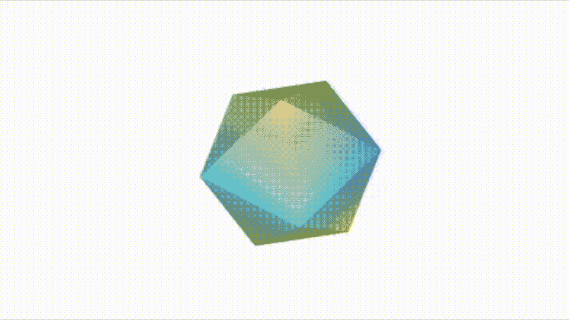
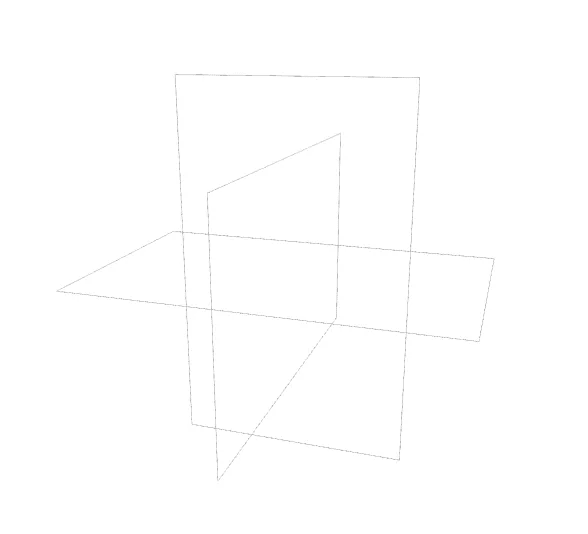
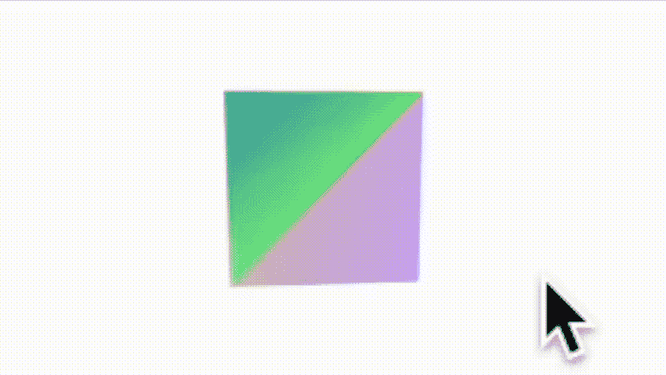
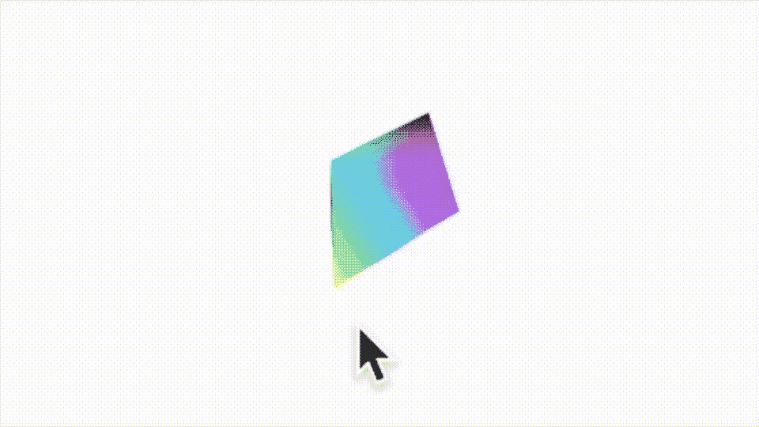
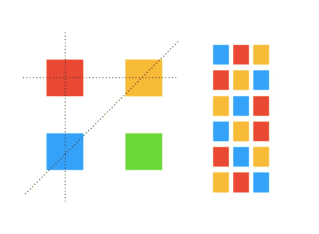
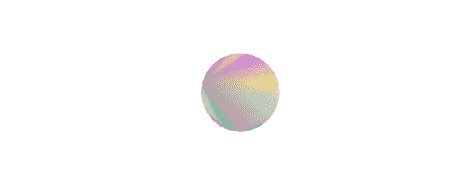

# SwiftUI 下 SceneKit 中的自定义几何体

> 原文：<https://betterprogramming.pub/custom-geometry-in-scenekit-under-swiftui-35a95520e6d9>

## 继续调查 SceneKit



用代码画出的二十面体你可以在这里找到

前几周，我发表了[这篇文章](/3-ways-to-rotate-objects-in-scenekit-86ed8c2f5490)，这是一篇关于 SceneKit 中四元数的文章。在里面，我发表了一小段代码——嗯，几乎可以说是出自 Kernighan & Ritchie 的经典 C 语言指南，我觉得是框架中的一个粗糙的边缘。

很遗憾地说，当您开始在 SceneKit 中使用自定义几何图形时，您可能会发现自己处于相同的位置——实际上更深，因为不仅一些代码模板看起来像是来自计算机科学课程，而且数学也同样令人困惑。

所以让我从苹果应该放入框架的内容开始这个 CS 类代码，我在这里找到了[这个优秀的扩展](https://movingparts.io/gradient-meshes)。

和这个班一起；我们将为您构建一个自定义的几何形状[多边形除外，稍后]。

现在，谈谈细节。

## 变化测量源

bon——正如我过去几周一直在使用的，SceneKit 提供了半打预烘焙的形状，标准的形状，如立方体或球体，你可以在这里找到这些文件。

它们都很好，但是当然，如果你想要更多，你有两个主要的选择；第一种是使用像 Blender 或 Fusion 360 这样的 CAD 应用程序构建的模型，或者使用自定义的几何形状。

现在，构建形状是/可能是一件有点无聊的工作，因为你发现自己在处理坐标或顶点，正如 SceneKit 所说的那样。自定义形状中的顶点是形状的角，即标记两条边交汇处的点。你也会发现自己也在和指数打交道，老实说，有时候这看起来有点像黑色艺术。在大多数情况下，索引决定了连接顶点的顺序。

下面是一个示例，显示了基本自定义形状的盒子的三种线条图。当然，你可以用一个标准的形状来做到这一点，但是让我们保持简单，以便于理解。



SceneKit 中定义为自定义形状的 3 个正方形

可以用这段代码构建的形状。黄金比例被使用，所以不是必要的；在这个例子中它可以是任何值。

我在这里展示了所有三个形状的坐标，尽管为了简洁起见，我在类的最后只声明了其中的一个。此处显示的形状类型是直线。线条是最简单的自定义形状，至少是最宽容的。您可以描述五种类型的自定义绘图，点、线、三角形、`triangleStrip`和多边形。

我介绍的类可以用来构建除多边形之外的任何一种类型，尽管索引并不简单。它们需要被放置的顺序不仅取决于你想要创建的自定义绘图的类型[点、线、三角形…]，而且在某些情况下会相互链接，特别是三角形`triangleStrips`和多边形。

## 颜色

您可以使用每个顶点的颜色值数组为形状添加颜色。如果你想使用不同的色块，唯一真正的选择是使用三角形，因为每个三角形有三个顶点。对于一个`triangleStripe`或多边形，你要么需要用相同的颜色做所有的事情，要么在你的整个形状中以渐变区域结束，因为`triangleStrips`和多边形共享一个顶点。显然，用点和线来担心颜色是没有意义的，尽管这是可能的。



由两个彩色三角形定义的正方形

这是另一个正方形的例子——用两个三角形着色，这是它背后的代码。

注意这里因为我想要三角形，所以我定义了六个坐标，尽管我已经对事实做了一点节约，因为之前列出的方法创建的`geometry2`没有返回一个彩色的正方形。您需要为我列出的第一个方法提供一个颜色列表，并更改返回的对象。这是一个更新版本，使用了我在本文开始时使用的扩展。

那么，你已经看到了直线和三角形——这里还有两个三角形的定义，只有第二个定义是一个`triangleStripe`。

仔细观察使用的数字范围，在第一组中你有一些不同的集合，在第二组中它们都依赖于先前使用的集合。灰色框中显示的代码是调用。

```
**let** polygon **=** Polygon**()
let** geometry **=** polygon.newNode**()** geometry**.firstMaterial?.isDoubleSided = true
let** newNode **= SCNNode(geometry:** geometry**)**
```

构建一些简单形状的代码，如下所示。



使用三角形带，用显示 9 个顶点的环构建的正方形

三角形实际上可以以六种组合中的任何一种连接起来，就像一个部分二进制表。你有 001，010，011，100，101，110 或类似的颜色。



构建三角形的顺序决定了它在场景中的显示方式。使用错误的系列或错误的类型，它不会像你希望的那样工作。前者更灵活，后者更有效率。

如果你有一个三角形，三种组合会给反面上色，三种组合会给正面上色。所以一个顶点看起来像这样。

```
**static let** verticesF**:[SCNVector3] = [
  SCNVector3(0, 4, 0),
  SCNVector3(4, 0, 0),
  SCNVector3(4, 4, 0)]**
```

假设你不把三角形做成双面的，用指数为 0，1，2 或 1，2，0 或 2，0，1 的颜色画，你会看到三角形，使用其他三种可能性，它会给背面着色；所以你需要把它旋转 180 度才能看到。这几乎是有意义的，因为您可以使用这个矩阵用一行代码构建一个前置索引。

```
**static let planeIndicesF:[Int32] = verticesF.indices.map(Int32.init)**
```

在这条线上使用 reverse 会把东西翻过来给下面上色。

这里有一个多边形的例子和一些计算机科学类的代码来完成这篇论文，但不是这个主题。请注意，您可以使用这个" older" `createGeometry`例程来创建五种形状中的任何一种。

注意多边形边数的第一个指数。下图显示了这段代码所创建的内容。



有 24 条边的多边形

所有这些都让我想到了这篇文章的结尾。我希望你喜欢阅读它，并在这里找到一些对未来项目有用的代码/技巧。

感谢阅读。