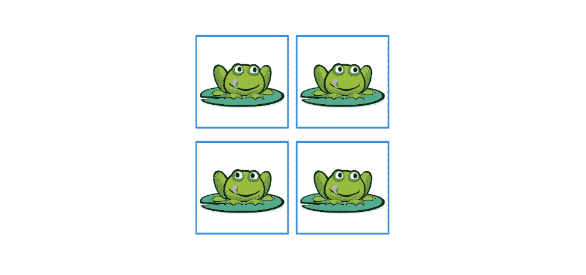
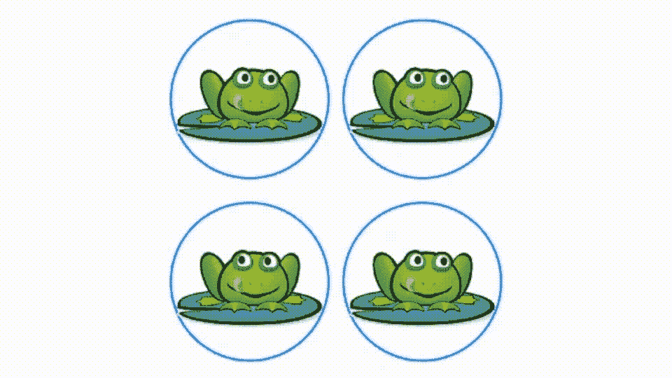

# SwiftUI 2.0 中的自定义手势

> 原文：<https://betterprogramming.pub/custom-gestures-in-swiftui-2-0-132590d66ee7>

## 学习实现非自带的自定义手势

作者 GIF。

作为一个守旧派，当 iPad 第一次出现时，我无法想象为什么会有人想要一个没有键盘的设备。我大错特错了，因为你用 iPad 得到的基于触摸的界面是它的决定性差异。正是这一点让这款产品如此人性化。回想起来，我已经忘记了使用键盘是我的第二天性，但对一般人来说却不一定如此。

在这篇文章中，我想探索 SwiftUI 2.0 中自定义手势的世界，并在一定程度上重写这个优秀的[教程](https://www.raywenderlich.com/1724-uigesturerecognizer-tutorial-creating-custom-recognizers#toc-anchor-006)，这个主题是[迈克尔·卡茨](https://www.raywenderlich.com/u/mkatz)为[raywenderlich.com](https://www.raywenderlich.com/)写的。

这是一个游戏，假设你至少浏览过教程，你会知道我们需要从一个简单的网格开始玩。我们用 Swift 2.0 吧。

这个想法是用一个不同于所有其他生物(还有一些其他生物)的手势把青蛙圈起来。当然，挑战在于 SwiftUI 没有圆形手势。我们需要创造一个。这是让我们开始的代码模板。您可以在这里看到视图的模板。显然，我借用了原始教程中的图片。

在其中，我使用了 Swift2.0 grid 和 Combine 框架，我使用该框架通过`nextSet passthroughSubject`消息管理图像到新集合的刷新。从数组中可以看到，有四种动物:一只青蛙、一只狼、一只熊和一只猫。

很好。现在我们可以专注于手势。在 Swift 2.0 中，您有一些内置的手势。但是，这是我们真正面临挑战的地方。Mike 的教程是基于 UIKit 的触摸手势(SwiftUI 中我们没有的手势)。所以我将尝试通过创造性地使用拖拽手势来达到同样的效果。

然而，在我开始之前，这里有一个我写的关于用 SwiftUI 绘图的另一篇文章的快速参考，我将借用它的一个例程:

 [## 使用 SwiftUI 的带路径的形状第 2 部分

### 使用路径的形状概要

medium.com](https://medium.com/analytics-vidhya/shapes-with-paths-using-swiftui-part2-98760ed0a3d7) 

画多边形的例程:

还有一个管理视图的例程:

 [## 在 SwiftUI 中显示和隐藏视图的 6 种方法

### 探索在 SwiftUI 中显示和隐藏视图的不同方法

levelup.gitconnected.com](https://levelup.gitconnected.com/6-ways-to-show-hide-views-in-swiftui-d55fd3485009) 

我感兴趣的特定方法的代码如下所示:

让我们关注手势——特别是拖拽手势。我将在网格内的每个方框中添加一个。在这一级添加手势有助于我了解它返回的坐标，并让我立即知道他们画了哪个框。

在我浏览这段代码之前，这里是它作为`observedObject`(一个我作为单例引用的对象)引用的类:

在 singleton 中，我保存了代码中`drawPoly`方法引用的坐标的四个副本——一个多维数组。

它的工作方式是拖动手势不断更新四组中的一组，这取决于你画的是哪一个方块。由于集合是已发布的对象，更新会立即被`drawPoly`例程反映出来。这就是我们的结局。注意，我把方框改成了圆形，以帮助我在测试时画圆。这个动画 GIF 是已经完成的应用程序。你需要继续阅读，因为我们还没到那一步。

我试了几个明显不是圈的东西，它忽略了我，尽管它也忽略了一些非常糟糕的圈。

最后，我们需要 Mike 的输入，或者更确切地说，他从 Nikolai Chernov 的 C++实现中找到并改编的例程，该实现将一系列点拟合为一个圆。这种方法被称为陶宾拟合。他的代码可以在一个名为`CircleFit.swift`的函数中找到，因为它是在 Swift 3.0 中，所以我不得不做一些小的调整。现在已经画了圆，当用户完成绘制时，您可以使用它来检查以下细节:

*   如果是圆的话。
*   如果是，如果是正确的。

这几乎把我带到了这篇文章的结尾。我想做得更多，但我认为我已经做得足够多，为你完成工作打下了良好的基础。这是模板的第二个副本，这次包含了我一直在谈论的代码:

这是迈克改编代码的副本。我稍微修改了一下，可以在 Swift 5.0 上运行。抱歉，太长了。不要责备我，我只是个信使。

等等，我还没教你怎么用`CircleFit`。为了使用它，我改变了拖拽手势的`.end`。现在看起来是这样的:

这些代码是做什么的？好吧，如果你选择正确，它播放哔哔声，并移动到下一集。如果你弄错了，它会播放不同的声音，然后给你一个再试的机会。

我希望你能像我写这篇文章一样喜欢阅读。如果你读了雷的文章，你会发现这个圈子里的匹配业务远比我在这里介绍的要多。我会把它作为家庭作业留给你们，作为学习练习融入到这个项目中。点击此链接阅读后续文章。

 [## 使用 SwiftUI2.0 纠正自定义手势的路径

### 寻找不同的方法来改善绘画

medium.com](https://medium.com/codestory/correcting-paths-on-custom-gestures-with-swiftui2-0-7113019684f0) 

保持冷静，继续编码。

*答案:青蛙的眼睛不同，狼缺了一颗牙，熊的帽子上有不同的图案，猫的右耳也不同。*