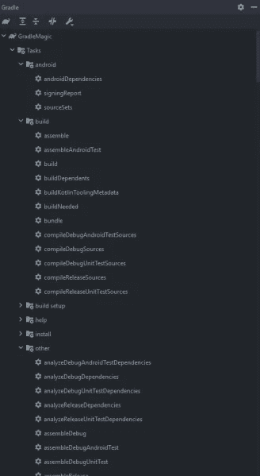
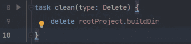

# 自定义梯度任务:建立和发送您的 APK 电报

> 原文：<https://betterprogramming.pub/custom-gradle-tasks-build-and-send-your-apk-to-telegram-42f7741cd27e>

## 使用这个小应用程序节省时间和精力


因此，最近我在开发一个 Android 应用程序，有多个利益相关者参与其中，他们希望测试 APK 并不断提供反馈。最初，我习惯手动构建应用程序，并将其发送给一个电报组。我体内的 dev 不赞成这种劳动密集型的方式。因此，我必须找到一种方法来自动化这个过程。这就是自定义 Gradle 任务发挥作用的地方！

# 梯度任务介绍

如果你曾经接触过 Android 开发，你肯定会遇到 Gradle。

> Gradle 是一个开源的[构建自动化](https://en.wikipedia.org/wiki/Build_automation)工具，其设计足够灵活，可以构建几乎任何类型的软件。

简单来说，Gradle 运行 Android Gradle 插件提供的所有花哨任务。它构建您的项目并将其转换成您需要的可分发包(apk、bundles 等)。).要了解更多 Android 应用构建流程和 Gradle，可以参考这个:[配置你的构建| Android 开发者](https://developer.android.com/studio/build)。

现在，梯度任务，他们是什么？Gradle 由项目和任务组成。每个构建可以有多个项目，每个项目可以有多个任务。让我们来看看 android-gradle 插件为我们提供的一些任务！



我们现在知道什么是 Gradle 任务，所以让我们开始了解海关任务。我们都见过的一个自定义任务是:



该任务存在于项目级`build.gradle`文件中。清理任务是不言自明的。它删除了我们项目的构建目录。

# 编写我们自己的自定义梯度任务

有没有可能不从 hello world 的例子开始？我们去 app 级`build.gradle`文件开始吧。

同样，这是不言自明的。在上面的片段中，只有一件事很突出。为什么我们在`doLast`区块内有`println`？这是因为当 Gradle 配置任务时，函数中的任何代码都会执行。为了避免这种情况，我们将它放在了`doLast`块中，因为这将确保我们的核心功能在 Gradle 配置完任务后发生。

# 自动化的时间到了:构建和交付 APK

下面是我们将如何进行的流程:

1.  构建调试 APK(您也可以签署并构建一个发布 APK，但是为了简单起见，我只构建调试版本)
2.  获得访问 APK 文件的路径和秘密
3.  使用电报机器人 API 来传递文件

## 步骤 0:配置电报机器人

由于我不想偏离主题太多(Gradle 任务)，我不会涵盖机器人的设置。您可以在这里找到设置它所需的一切:[机器人:开发者入门(telegram.org)](https://core.telegram.org/bots)

一旦 bot 设置好了，您就应该访问 Bot 令牌和 ChatID(这个 ID 指的是您想要将消息/文件发送到的通道的 ID)。

因为我们不想泄露这些凭证，所以我们将 bot 令牌和聊天 id 存储在一个`secret.properties`文件中，我们可以将它添加到我们的。gitignore，这样它就不会被推进 VCS。

在根目录下创建一个名为`secret.properties`的新文件，并像这样添加凭证

现在，让我们访问我们的 *build.gradle (app level)* 文件中的这些变量

## 步骤 1:构建调试 apk

让我们创建自定义任务。它必须首先构建调试 APK。负责做这件事的 Gradle 任务叫做`assembleDebug`。我们的职能有赖于此。

`dependsOn`关键字将运行指定的任务，并确保只有在任务成功执行后才向前移动。

## 步骤 2:获取 APK 文件的路径和秘密

凭证是从我们之前创建的`secretProperties`实例中获取的。为了获取文件路径，我们首先获取对`app-debug.apk`文件的引用，然后获取文件的路径。

## 步骤 3:使用电报机器人 API 来传递文件

这就是奇迹发生的地方！

到现在为止，您应该已经观察到我们已经将这个函数的类型指定为`Exec`。这是因为该任务的核心功能是执行命令。我们执行一个`curl`命令，该命令将使用 Telegram Bot REST API 请求上传路径指定的文件，并将其发送到指定的 chat。(关于 API 的更多信息可以在这里找到:[电报机器人 API](https://core.telegram.org/bots/api) )

瞧，我们已经自动化了构建 APK 并将其发送到电报聊天的过程。

以下是完整的`build.gradle`文件供您参考:

希望这篇文章能让你深入了解如何编写定制的 Gradle 任务！尽管我使用了一个自动化构建和发送 APK 到 Telegram 的任务的例子，但是您可以使用 Gradle 任务自动化的事情是无限的。

感谢您的阅读！

```
**Want to Connect?**If there is anything you’d like to discuss, feel free to connect with me on LinkedIn: [Rithik Jain | LinkedIn](https://www.linkedin.com/in/rithik-jain-710b3a199/)
```