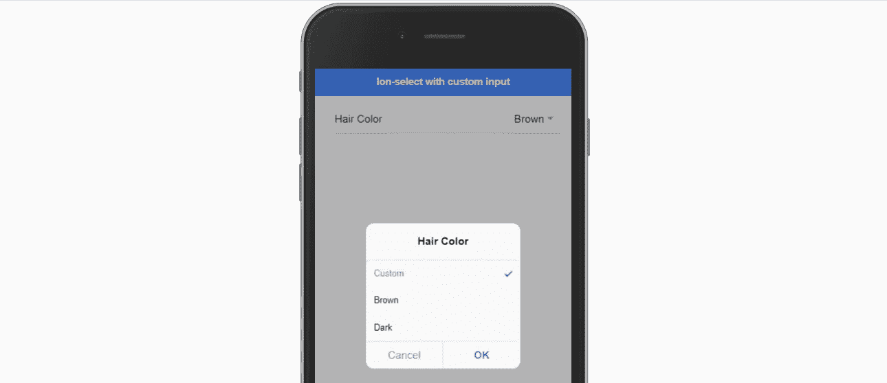
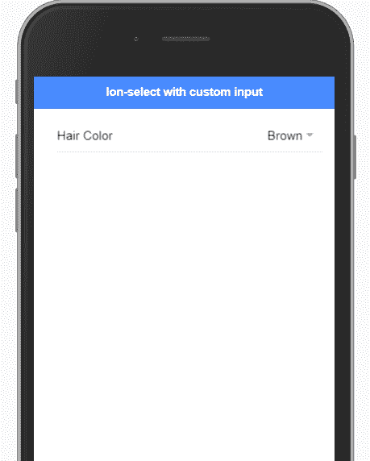

# 为离子选择创建自定义输入

> 原文：<https://betterprogramming.pub/custom-input-in-ion-select-with-ionic-4-angular-8-daafe44c0f55>

## 构建适合您应用的独特产品



自定义离子选择输入

本文介绍了在 Ionic 4/Angular 8 应用程序中为' [ion-select](https://ionicframework.com/docs/api/select) '组件实现自定义输入字段的方法，默认情况下，该组件不允许编辑其中的选项。

```
<ion-item>
  <ion-label>Hair Color</ion-label>
  <ion-select>
    <ion-select-option selected>Custom</ion-select-option>
    <ion-select-option>Brown</ion-select-option>
    <ion-select-option>Dark</ion-select-option>
  </ion-select>
</ion-item>
```

上面的离子选择组件允许从 Ionic 4 应用程序的三个可用选项中选择一个。有一个用例，我们希望用户能够真正输入他们想要的选项。我们将通过为离子选择流添加[警报控制器](https://ionicframework.com/docs/api/alert)来实现平稳的 UX 之旅。

让我们首先介绍一些有助于我们构建方法和定义范围的内容:

1.  首先，允许用户添加他们的自定义值意味着我们的应该在我们的模板中支持 n 个`<ion-select-options>`，所以我们必须使用`*ngFor`指令并将当前的一组值存储在我们的类(ts 文件)中。
2.  我们应该确保用户所做的所有更改都被 Angular 拾取，并适时地呈现在模板中(我们将在警报控制器模式处理中看到这意味着什么)。
3.  如果用户选择了“自定义”选项，但随后取消了新选项的创建，我们应该考虑回退方案。
4.  最后，我们应该理解在这个范围内我们不能提供“删除”自定义选项功能的限制。如果我们需要允许它，我们可能需要另一个 UI 小部件来处理这样的场景，所以这超出了本文的范围。

## 步骤 1: [启动一个新的 Ionic 4 模板](https://stackblitz.com/edit/ionic-4-template)并修改你的`home.page.ts`:

```
import { Component } from '@angular/core'; 
import { AlertController } from '@ionic/angular';[@Component](http://twitter.com/Component)({
  selector: 'app-home',
  templateUrl: 'home.page.html'
})export class HomePage { public colors: Array<string>; public currentColor: string; constructor(public alertController: AlertController) {} ngOnInit() {
    this.colors = ["Custom", "Brown", "Dark"];
    this.currentColor = "Brown";
  };}
```

这里我们导入 AlertController 并通过构造函数注入它，然后声明两个属性及其类型: **colors** 和 **currentColor** 。

然后，在 onInit hook 中，我们为这些属性赋予初始值。

## 步骤 2:我们添加 ion-select，通过*ngFor 添加复制，并在 home.page.html 中添加所有必要的绑定:

```
<ion-header>
 <ion-toolbar color="primary">
  <ion-title>
   Ion-select with custom input
  </ion-title>
 </ion-toolbar>
</ion-header><ion-content padding><ion-item>
    <ion-label>Hair Color</ion-label>
    <ion-select #mySelect [value]="currentColor" [selectedText]="currentColor" (ionChange)="selectChanged(mySelect.value)">
      <ion-select-option *ngFor="let color of colors" [selected]="color === currentColor">{{ color }}</ion-select-option>
    </ion-select>
  </ion-item></ion-content>
```

一些亮点:

*   我们将“value”和“selectedText”属性绑定到同一个 currentColor 属性，以确保呈现的内容和选择的内容一致。
*   我们添加了(ionChange)事件绑定，这样我们就可以处理 home.page.ts 中的所有选项更改。
*   最后，我们利用*ngFor 指令，使用我们拥有的“colors”数组复制颜色选项，并绑定“selected”属性，以确保用户可以看到哪个选项已经被选中。

## 步骤 3:我们在 home.page.ts 中实现方法来支持我们利用 AlertController 的用例:

```
 selectChanged(selectedColor) {
    if (selectedColor === 'Custom') {
      this.inputCustomColorValue()
    } else {
      this.currentColor = selectedColor;
    };
  };
```

我们添加了“selectChanged”方法，它运行在非常简单的逻辑上:

*   从我们的模板代码中接收“selectedColor”。
*   如果我们的用户选择“自定义”颜色，我们希望在另一个方法 inputCustomColorValue()中处理进一步的交互。
*   “else”意味着我们只需更新 currentColor 值，模板中的属性绑定将处理其余部分，向用户显示正确的新值。

然后，我们实现我们的自定义输入法:

```
async inputCustomColorValue() { const inputAlert = await this.alertController.create({
    header: 'Enter your custom color:',
    inputs: [ { type: 'text', placeholder: 'type in' } ],
    buttons: [ { text: 'Cancel' }, { text: 'Ok' } ]
  });inputAlert.onDidDismiss((data) => {
    let customColorName: string = data.data.values[0];
    if (customColorName) {
      let indexFound = this.colors.findIndex(color => color === customColorName)
      if (indexFound === -1) {
        this.colors.push(customColorName);
        this.currentColor = customColorName;
      } else {
        this.currentColor = this.colors[indexFound];
      };
    };      
  }) await inputAlert.present();

};
```

这里，我们使用 AlertController 创建一个简单的文本输入警报，然后在 onDidDismiss 方法中处理用户交互的结果。一些注意事项:

*   我们使用 onDidDismiss vs. button handler，因为我们希望 Angular 拾取数据中的变化。如果这些变化发生在警报控制器组件内部——我们将不得不付出额外的努力来更新我们的组件绑定(触发变化检测，或者在角度区域内显式运行处理程序，等等)。
*   我们利用“indexFound”来检查这样的“颜色”是否已经存在，我们没有将这样的颜色添加到我们的“颜色”数组中，但仍然允许用户选择它。

就是这样。我们已经完全实现了我们想要实现的功能。在这里:[https://ionic-4-template-CB 2 wbk . stack blitz . io](https://ionic-4-template-cb2wbk.stackblitz.io)

