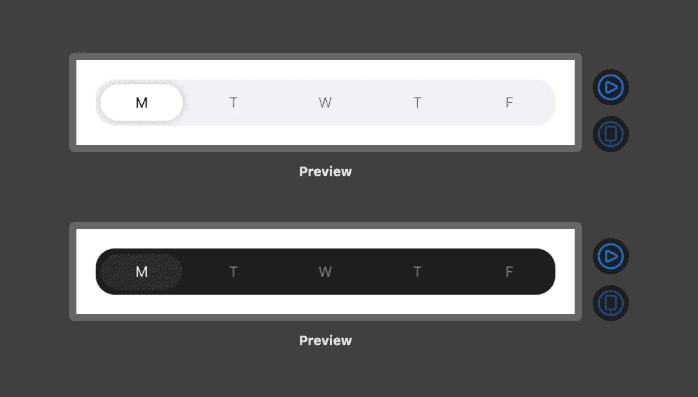
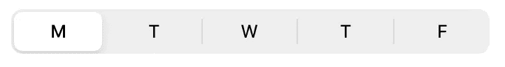
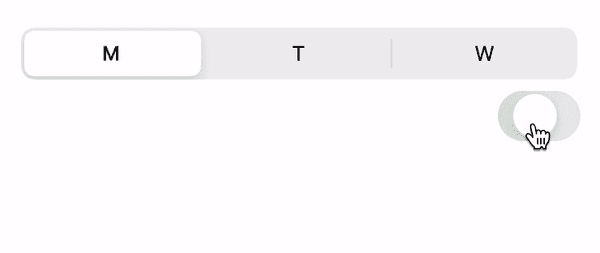
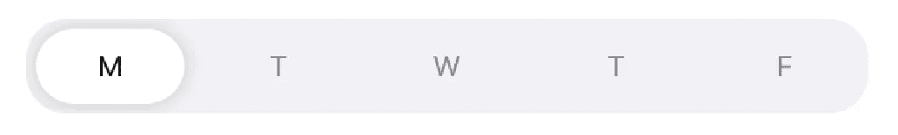
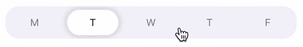

# 使用 SwiftUI 构建自定义 iOS 分段控件

> 原文：<https://betterprogramming.pub/custom-ios-segmented-control-with-swiftui-473b386d0b51>

## 让我们比苹果默认的分段控制更进一步

这就是我们将在本教程中构建的东西(作者拍摄)。

在本文中，我将分享我在 SwiftUI 中自定义`SegmentedPicker`的实现。您可能会问，“为什么要自己经历实现这一点的痛苦？”

嗯，使用带有`.pickerStyle(SegmentedPickerStyle())`的 SwiftUI `picker`是一种获得分段控制功能的本地方式，并且没有太多的开销:

但是有一个巨大的缺点:自带的动画意味着很难在没有一些有趣行为的情况下封装选择变量。例如:

看到那个烦人的闪烁了吗？

定制选择器的外观也几乎是不可能的，所以为了超越这些限制，我决定在 SwiftUI 中实现自己的分段控件。

# 1.概观

所以，这是我们要建造的:

我们可能会尝试这样做:

这实际上只是给当前选中的索引添加了一个白色的`RoundedRectangle`背景。这对于简单的用例很有效，但是不支持选择转换之间的漂亮的滑动动画。

为了使这更优雅，我们有三个分段控件的基本元素:

1.  圆角矩形背景视图
2.  每个项目的文本
3.  表示当前选择的圆角矩形

# 2.创建容器和项目

让我们定义一个简单的视图，该视图仅枚举分段控件的项目:

这是相当多的代码。让我们过一遍:

1.  我总是努力保持视图常量，如填充、字体和文本颜色整洁有序。这允许我调整视图，而无需重新研究视图本身的实现。这些静态常量允许我轻松地查看和编辑次要视图细节。
2.  很像本地 SwiftUI `Picker`的输入，我们需要一些要显示的项目和一个`@Binding`选择属性，以便我们可以将状态更改传播到父视图。
3.  视图本身很简单。它是一个`HStack`，水平放置等宽的项目。对于`items`中的每一项，我们调用一个函数来检索一个`Text`视图元素。
4.  函数`getSegmentView`返回一个`Text`元素，带有指定索引的项目名称。我们在这里应用了一些视图修饰符，并确保检查使用的索引实际上在我们的数组的边界内。值得注意的几点:我们计算当前索引是否被选中，并使用稍微暗一点的文本来表示选择。我们使用`.frame(minWidth: 0, maxWidth: .infinity)`,这样可点击的框架就占据了所有的可用空间，而不是包裹`Text`元素。
5.  我们定义一个`onItemTap`方法。这允许我们在点击文本元素时更改当前选择。

这是我们得到的。还不错！我们只是缺少活动元素指示器，它是一个简单的白色`RoundedRectangle`:

# 3.主动选择指示器

选定元素的背景是一个`RoundedRectangle`。为了显示可用选项后面的矩形，我们将`HStack`包装在`ZStack`中，如下所示:

我们现在在背景中看到一个圆角矩形，但是我们需要根据当前活动的选择来定义矩形的大小及其相对位置。

为了定义大小和偏移量，我们需要以某种方式获取每个项目的大小。为了在 SwiftUI 中做到这一点，我们利用了`PreferenceKey`。

## 3.1 PreferenceKey 键获取项目宽度

[这篇博文](https://swiftwithmajid.com/2020/01/15/the-magic-of-view-preferences-in-swiftui/)回顾了 SwiftUI `PreferenceKeys`。简而言之，我们可以定义一个`PreferenceKey`来将属性从子视图传递给它的子视图。在我们的例子中，我们需要传递每个文本项的大小。我们的`HStack`将每个项目分成相等的宽度，所以我们基本上只需要在`ForEach`循环中创建的一个片段视图的宽度。

让我们定义一个`PreferenceKey`来检索尺寸。然后，我们可以使用一个简单的小技巧，通过在视图的背景上定义一个`GeometryReader`来获得视图的固有大小。然后，我们使用一个定制的`ViewModifier`来封装检索视图大小和更新绑定所需的所有操作:

浏览项目:

1.  这是检索尺寸的`PreferenceKey`。我们将检索到的值的类型定义为一个`CGSize`，它包含宽度和高度信息。
2.  我们定义了一个助手视图(`BackgroundGeometryReader`)，它将作为我们文本项的背景。这使用了我前面提到的技巧——在背景上定义一个`GeometryReader`给我们视图的固有大小。请注意，我们附加了`SizePreferenceKey`，并向其传递了视图大小。
3.  我们定义`SizeAwareViewModifier`来封装所有这些逻辑。它将一个`Binding`作为`viewSize`的输入。这是为了使大小的更新可以在视图层次结构中向上传播。注意，我们附加了背景`BackgroundGeometryReader`，它将`SizePreferenceKey`附加到视图上。然后我们通过调用`onPreferenceChange`来观察`PreferenceKey`值的变化。回调监视`SizePreferenceKey`值的更新，然后相应地更新绑定。

太好了！现在我们只需附上新的`ViewModifier`:

既然我们已经获得了其中一个段的固有大小，我们就可以正确地构建活动选择指示器了。

## 3.2 使用视图大小创建活动选择指示器

概括一下，这就是我们最终产品的样子。活动的选择指示器是与当前选择一起滑动的白色背景:

我们面临两大挑战:

1.  为活动选择指示器定义适当的大小。
2.  根据当前选择确定指示器的正确位置。

之前，我们在一个`ZStack`中定义了一个简单的`RoundedRectangle`作为我们的活动段视图。让我们执行以下操作:

1.  提取视图作为一个变量来保持事物的整洁。
2.  将`ZStack`校准改为`.leading`。这意味着`ZStack`中的所有视图将对齐框架的前沿(而不是中心)。这使得计算活动段的位置变得容易多了！
3.  定义一个叫做`computeActiveSegmentHorizontalOffset`的方法。这为我们提供了活动段指示器的位置。

代码应该相对简单，除了`computeActiveSegmentHorizontalOffset()`。在这种方法中，我们假设我们的`ZStack`与前沿对齐(大多数地区是左沿)。我们知道提货器中每个商品的有效水平宽度是`(self.segmentSize.width + SegmentedPicker.SegmentXPadding / 2)`。因此，从前缘偏移的值就是索引选择乘以此宽度。

就是这样！我们现在看到这个结果:

要获得完整的代码，见这个[要点](https://gist.github.com/frankfka/2784adff55be72a4f044d8c2bcc9fd3f)。编码快乐！