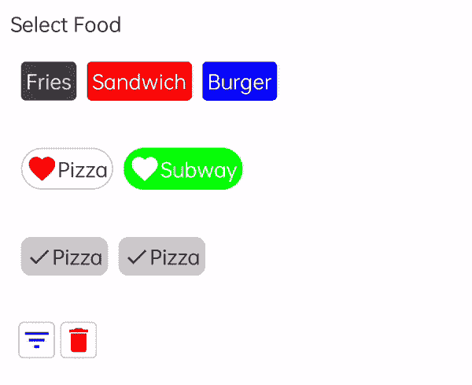

# 创建自定义 Jetpack 合成芯片

> 原文：<https://betterprogramming.pub/custom-jetpack-compose-chips-5609e742c54b>

## 构建漂亮的 Android 用户界面


费德里卡·加利在 [Unsplash](https://unsplash.com?utm_source=medium&utm_medium=referral) 上的照片

在这篇博客中，我们将探讨如何在 Jetpack Compose 中创建芯片。

芯片可以在一个应用程序的许多地方用于不同用例的操作。

所以，下图中有一些可能的用户界面组合，我们将一个接一个地检查这些代码。



# 1.创建一个可组合的文本芯片


# 2.带有图标的可组合文本芯片


# 3.可组合文本芯片图标可见性


# 4.可组合图像芯片


这里是完整的 [GitHub 库](https://github.com/kamydeep00178/ComposeChips)的链接。感谢阅读。

```
**Want to Connect?**Reach me out on [LinkedIn](https://www.linkedin.com/in/kamal-kakkar-13ab2773/).
```