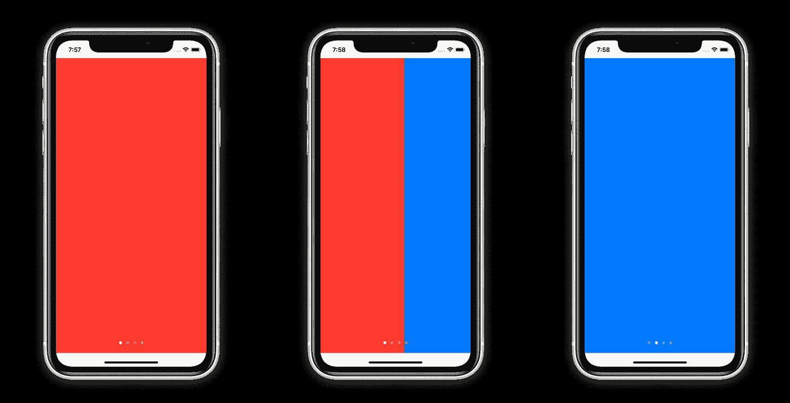
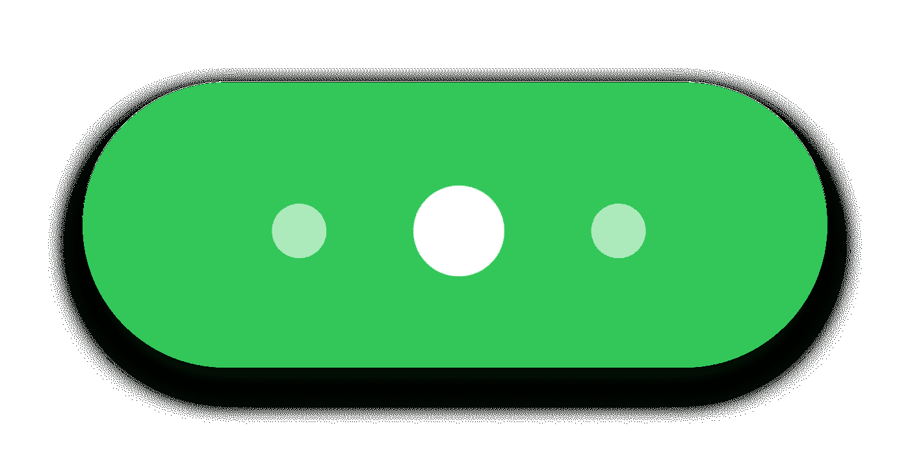

# SwiftUI 中的自定义分页 UI

> 原文：<https://betterprogramming.pub/custom-paging-ui-in-swiftui-13f1347cf529>

## 使用新的 PageTabViewStyle 创建动画索引视图

泰勒·拉斯托维奇在 [Unsplash](https://unsplash.com?utm_source=medium&utm_medium=referral) 上拍摄的照片。

SwiftUI 2 引入了一种叫做`PageTabViewStyle`的新`TabView`样式，使开发人员能够轻松地创建底部带有圆点的水平页面(也称为分页),以向用户显示它们的位置。这相当于 UIKit 中的`UIPageViewController`。

今天，我们将讲述如何为`TabView`使用新的样式，以及如何创建一个定制的`IndexView`组件。

动画集

# 入门指南

使用新的 API 就像设置新的`PageTabViewStyle`一样简单:

在这里，我有一个颜色数组——每种颜色代表一个页面——我还用每个`Color`视图所需的索引来标记它。`TabView`初始化器有一个代表当前页面的`selection`绑定。

有几件事要记住:

1.  分页点是白色半透明的。因此，如果你的背景也是白色的，你就看不到它们(在 iOS/Xcode Beta 3 上测试)。
2.  `TabView`的内容不能在安全区域 insets 上绘制(在 iOS/Xcode Beta 3 上测试)。

# 创建自定义索引视图

现在我们已经了解了基础知识，我们可以快速创建任何自定义组件来表示当前页面，并使用我们的`currentIndex` state 属性相应地更新它。

我们将尝试制作一个更加动态的系统点版本。该索引组件将最多显示三个点，并在您浏览页面时显示插入/移除的动画。

这是相当多的代码，所以让我们一步一步来看:

1.`ForEach`和`shouldShowIndex()` —仅显示三个或更少的点(对于当前页面及其相邻页面)。

2.`.fill()`和`.scale()` —对`Circle`关注的陈列柜应用不同的样式。

3.`.transition()` —用不透明度和比例制作每个`Circle`的插入和移除动画。

4.`.id(index)` —为每个索引创建唯一的`Circle`实例。

# 最后一步

现在我们只需要更新`ContentView`来使用新的`Fancy3DotsIndexView`:

1.  为`currentIndex`绑定发生的每一个变化添加一个隐式动画。
2.  覆盖新的`IndexView`组件并插入必要的属性。

瞧啊。

最终产品

# 结论

在 SwiftUI 中制作动画已经非常容易，现在有了新的`TabView`风格，你可以创建任何类型的索引视图！敬请关注我即将发布的文章！

如果你觉得自己足够勇敢，我鼓励你尝试制作自己的动画！