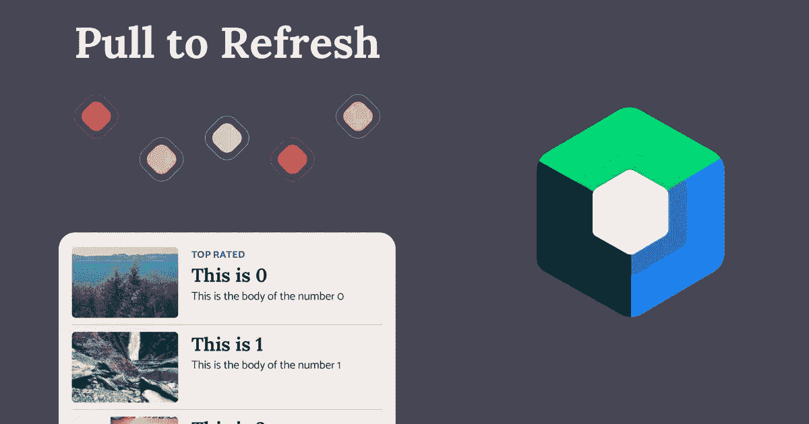
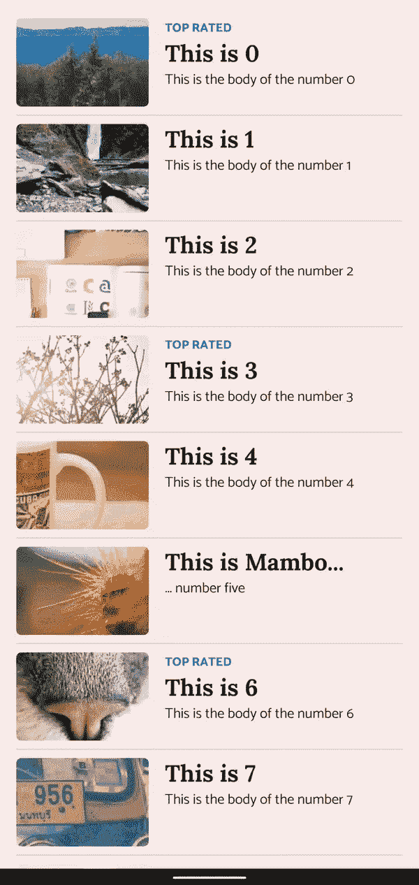

# 在 Jetpack 撰写中自定义提取以刷新

> 原文：<https://betterprogramming.pub/custom-pull-to-refresh-in-jetpack-compose-9abc01472851>

## 构建直观的 Android 用户界面



拉至刷新是一种常见的设计模式，用户使用它来刷新项目列表。在 Jetpack Compose 中，我们可以使用伴奏者库来实现大多数材质设计应用程序中的默认实现。

但是考虑到这种设计模式的交互性，有很多机会可以用动画和反馈来取悦用户。

今天，我们将学习如何在 compose 中实现自定义拉取来刷新动画。


# 基本实现

我们将基于可用的伴奏库[进行构建。](https://google.github.io/accompanist/swiperefresh/)

它确实有默认的实现，但是它也提供了根据我们的喜好进行定制的自由。

```
// Add the library to your project
implementation "com.google.accompanist:accompanist-swiperefresh:0.24.9-beta"
```

接下来，我们将创建一个可组合的包装器，在这里我们将实现我们的自定义逻辑并用一个示例 UI 填充它。

```
CustomPullToRefresh(  
    isRefreshing = isRefreshing,  
    onRefresh = { refresh() }  
) {  
    LazyColumn {  
        items(100) { index ->  
            ListItem(index = index)  
        }  
    }
}
```

在`CustomPullToRefresh` composable 中，我们可以从伴奏库中添加`SwipeRefresh` composable。

在`indicator`参数中，我们可以决定自定义指示器应该是什么样子。

```
[@Composable](http://twitter.com/Composable)  
fun CustomPullToRefresh(  
    modifier: Modifier = Modifier,  
    isRefreshing: Boolean,  
    onRefresh: () -> Unit,  
    content: [@Composable](http://twitter.com/Composable) () -> Unit,  
) {
 ...
 SwipeRefresh(  
     modifier = modifier,  
     state = pullState,  
     onRefresh = onRefresh,  
     refreshTriggerDistance = trigger,  
     indicator = { state, triggerSize ->  
   // Custom indicator logic here
     }  
 ) {
  // List content
 }
}
```

`indicator`参数接受一个可组合的函数，并传递我们可以用来构建自定义指示器的数据。

`state`变量保存用户滑动了多远以及列表是否还在刷新等数据，而`triggerSize`是触发区域有多大。

对于我的自定义实现，我使用三种状态来构建 UI:

*   `isSwiping`(用户当前正在刷卡)
*   `willRefresh`(用户已经刷过了`triggerSize`。此时的释放将触发刷新)
*   `isRefreshing`(正在刷新)

```
val willRefresh = state.indicatorOffset.roundToInt() > triggerPx  

offset = when {  
    willRefresh -> triggerPx.roundToInt() + (state.indicatorOffset.roundToInt() * .1f).roundToInt() // willRefresh
    state.isRefreshing -> triggerPx.roundToInt() // isRefreshing
    else -> state.indicatorOffset.roundToInt()  //isSwiping
}
```

我们可以使用这些状态向用户提供反馈。在这种情况下，我们使用它们来确定指示器的偏移。

如果一个版本将导致刷新，我们可以通过将偏移弹出一点点来告知用户。当达到这一点时，我们还可以添加一些触觉反馈。

当刷新发生时，我们将偏移值保持在触发位置。如果这些都不成立，我们使用`state.indicatorOffset`。

对于测试，我们可以使用这些值来创建一个基本指标:

```
Box(  
    modifier = Modifier  
        .offset { IntOffset(0, -indicatorPx.roundToInt()) }  
        .offset { IntOffset(y = offset, x = 0) }  
        .background(  
            color = when {  
                willRefresh -> Color.Magenta  
                state.isRefreshing -> Color.Green  
                else -> Color.DarkGray  
            },  
        )  
        .size(indicator)  
)
```

这将创建一个正方形，它随着偏移量移动，并根据我们定义的三种状态改变颜色。



# 奇特的实现

基本的实现有助于理解如何扩展`SwipeRefresh`，但是它不应该出现在生产中的应用程序中。

为此，我们将使用这些状态加上一些动画来创建一个我们可以引以为豪的更好的实现。

# 动画显示列表内容

列表占据了屏幕的很大一部分，所以动画可以给用户更多的反馈，告诉他们将要刷新列表。

```
val scale by animateFloatAsState(  
    targetValue = if (willRefresh) .95f else 1f,  
    animationSpec = spring(  
        dampingRatio = Spring.DampingRatioMediumBouncy,  
    )  
)  

Box(modifier = Modifier  
    .scale(scale)  
    .offset { IntOffset(x = 0, y = animatedOffset) }  
    .clip(RoundedCornerShape(topStart = 20.dp, topEnd = 20.dp))  
    .fillMaxSize()  
    .background(MaterialTheme.colors.surface)  
) {  
    content()  
}
```

我们现在使用偏移量来下移列表。这有两个主要目的。

首先，将内容下移，这样我们就可以在上面的空间放置我们的动画了。

第二，当`willRefresh`为真时，我们得到弹出偏移的视觉反馈的好处。

一些其他的添加是当`willRefresh`为真时添加一个缩放动画，并在列表顶部添加圆角。

# 自定义刷新指示器

对于我心目中的指标，我希望它在用户下拉列表时从列表后面显示出来。

出于这个原因，我将该指标添加到列表后面的`SwipeRefresh`内容中。

```
FancyRefreshAnimation(  
    modifier = Modifier  
        .align(Alignment.TopCenter)  
        .fillMaxWidth(),  
    isRefreshing = { pullState.isRefreshing },  
    willRefresh = { offset > triggerPx },  
    offsetProgress = { min(animatedOffset / triggerPx, 1f) }  
)
```

此时，想象力和创造力开始发挥作用，您可以使用 compose 提供的动画工具来制作一些漂亮的东西。

另一个选择是，如果你有一个设计团队或者擅长创作动画，你可以在这里实现一个定制的[洛蒂](https://github.com/airbnb/lottie/blob/master/android-compose.md)动画。

在我的例子中，我只是做了一些圆形的彩色盒子，并在刷新时旋转它们。您可以在这里找到`FancyRefreshAnimation`可组合的以及剩余的[示例项目](https://github.com/sinasamaki/LoadingAnimation)。

感谢阅读，祝你好运！

*原载于*[*https://sinasamaki.com*](https://sinasamaki.com/post/2022-05-26-pull-to-refresh/)*。*