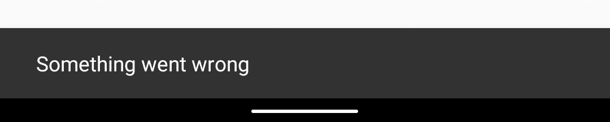
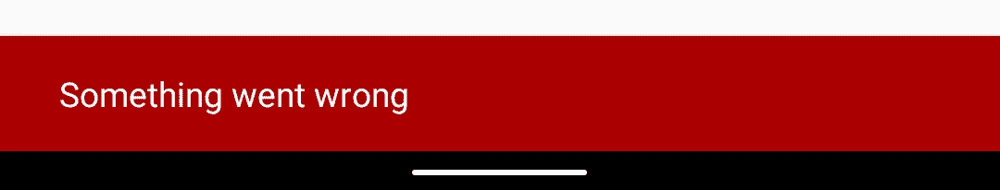
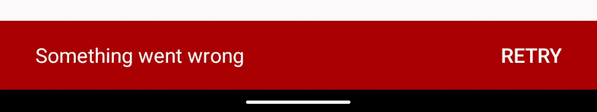
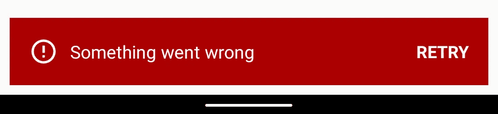
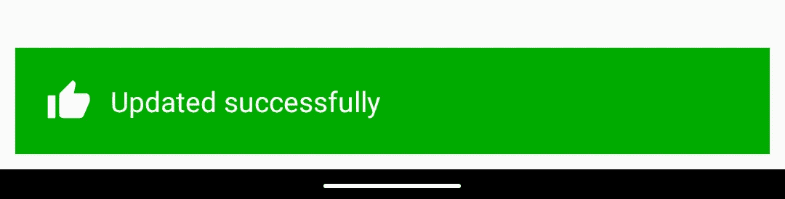

# Android 中的自定义零食条

> 原文：<https://betterprogramming.pub/custom-snackbars-in-android-5cb90af2728e>

## Android 显示浮动信息的新方式


本·赫尔希在 Unsplash[上的照片](https://unsplash.com/s/photos/marquee?utm_source=unsplash&utm_medium=referral&utm_content=creditCopyText)

# 引入和集成

是时候告别 Android 中美好的旧祝酒词了，欢迎被称为 Snackbars 的下一代祝酒词。

Snackbar 是下一代 toast 视图，比您想象的有更多的定制选项。

Snackbar 是在材料设计中引入的。它可通过设计支持库获得。但是，随着 Android 开发从支持库转向 AndroidX，Snackbar 将通过材料设计库提供给我们。

通过在`build.gradle`文件中添加下面一行来集成材料设计库，我们可以在我们的 AndroidX 项目中有一个 Snackbar。

```
implementation 'com.google.android.material:material:1.0.0'
```

# 小吃店的力量

与 toast 消息不同，我们可以让 click listeners 显示 Snackbar 中的视图，通过这些视图我们可以执行定制的操作或关闭 Snackbar。从 UX 的角度来看，Snackbar 进入了协调器布局的下一个层次。除此之外，我们还可以创建定制的 Snackbar。

# 小挫折

但是所有伟大的事情都是有代价的。这里的代价是，我们应该有一个观点来联系小吃店。我们可以在任何需要的地方显示 toast 消息，但要显示 Snackbar，它应该与上下文和活动布局中的一个视图实例相关联。

除此之外，只有当相关视图显示在屏幕上时，Snackbar 才会显示。让我解释清楚:如果您在名为 Activity1 的屏幕上显示 Snackbar 和相关视图，那么如果您取消 Activity1，Snackbar 也会隐藏，即使时间没有结束。我认为这种做法在大多数情况下是合理的。

# 简单的小吃和一些策略

显示 Snackbar 就像显示 toast 消息一样简单。看一看:

简单小吃店



与 toast 视图不同，我们还可以自定义默认 Snackbar 的颜色，如下所示:

带有自定义背景色的默认 Snackbar



现在是时候给 Snackbar 添加一个简单的动作按钮了。看一看:

具有自定义背景和操作按钮的 Snackbar



# 用于错误和成功消息的自定义 Snackbar

假设您需要一个错误图标和红色背景来显示错误消息，需要一个绿色背景的成功图标来显示成功消息。

为此，我们首先需要创建一个 XML 布局文件，以 merge 作为根标签。假设现在我们需要一个图标在左边，消息在中间，动作标签在右边。让我们看看如何创建它。

下一步是创建一个定制的 Snackbar 类，它扩展了约束布局和`ContentViewCallback`来让我们知道 Snackbar 的存在。我们来看看怎么做。

现在，展开自定义视图。我发现通过 XML 来扩展自定义视图更好，这样我可以很容易地自定义它的属性，甚至创建一个样式。

下一步是创建一个扩展`BaseTransientBottomBar`的类来创建 Snackbar equal 行为。如果你看到默认的 Snackbar 类也是由`BaseTransientBottomBa`扩展的。

```
public final class Snackbar extends BaseTransientBottomBar<Snackbar> {
```

现在我们在 companion 对象中创建一个函数，并传递显示`SimpleCustomSnackbar`所需的字段。

这些参数是:

1.  **视图**:当前组件布局中关联 Snackbar 的视图
2.  **消息:**要在 Snackbar 中显示的消息
3.  **持续时间** : Snackbar 有三个默认的持续时间，我们可以在这里使用
4.  **click-listener** :这个参数可以为空，因为我们创建了一个监听器，并且只在需要实现定制功能时才发送函数
5.  图标:你想在消息左边显示的任何图标，如果为空，将不显示任何图标
6.  一个**动作标签**:显示在动作视图消息右侧的标签。
7.  **背景色**:整个 Snackbar 的背景色

现在来看看`SimpleCustomSnackbar`。

这里我们使用了一个 kotlin 扩展函数`findSuitableParent`来查找与 Snackbar 关联的最佳视图，如下所示:

让我们看看它是如何工作的。

用`SimpleCustomSnackbar`显示错误信息，代码如下:

自定义错误 Snackbar



现在让我们看看 Snackbar 将会如何成功。

自定义成功零食条



# 结论

我们在这里做的定制是非常基本的。使用本文中的策略，我们可以根据应用程序的功能创建更加定制化的 Snackbars。例如，我为一个食品配送应用程序创建了一个定制的 snackbar，如下所示。


干杯！

感谢您的阅读。