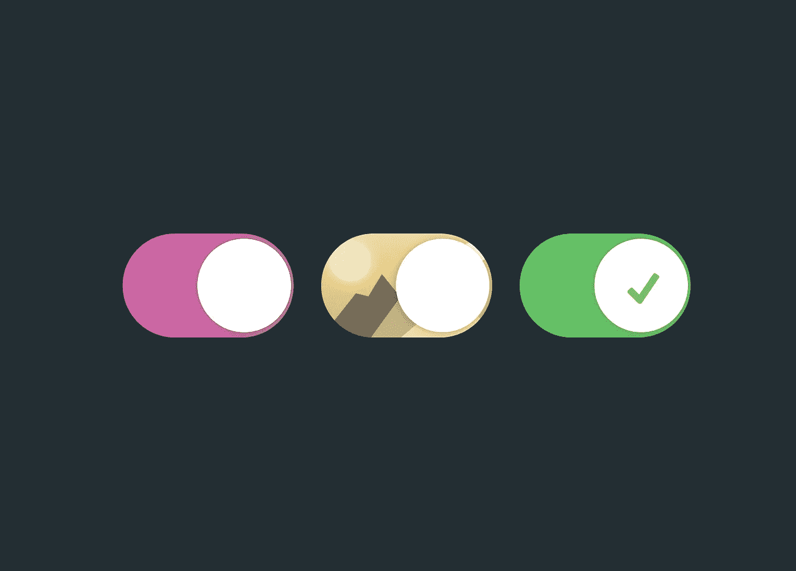
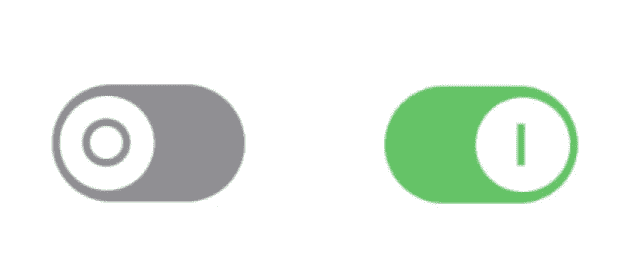
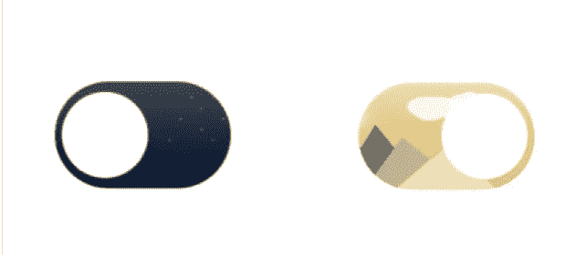

# SwiftUI 中的自定义切换样式

> 原文：<https://betterprogramming.pub/custom-swiftui-toggle-styles-1b41959cf975>

## 失去 iOS 中默认的切换风格。创建你自己的新开关，以适应你的应用程序的用户界面



图片来源:作者

我本周的 SwiftUI 快速技巧包括自定义`Toggle`视图！通过使用`ToggleStyle`协议，您可以轻松地将自己的风格应用到 SwiftUI 切换中。最好的部分是你不需要担心实现`Toggle`的任何后台属性。只需在从`makeBody(configuration:)`函数传递来的`Configuration`实例中切换`isOn`属性。

# 创建自定义`ToggleStyle`

首先创建一个新的结构，并确保从`ToggleStyle`协议继承。然后，执行`makeBody(configuration:)`功能。在这里您将构建您的自定义`View`来代替默认开关显示。

```
import SwiftUI 

struct MyToggleStyle: ToggleStyle {

    func makeBody(configuration: Configuration) -> some View {
    	// Insert custom View code here.
    }

}
```

像这样将代码中的自定义`ToggleStyle`应用到`Toggle`中。就这么简单。

```
Toggle(isOn: $active, label: {
	Text("Active")
})
.toggleStyle(MyToggleStyle())
```

# 例子

这里有几个例子，是我在写这篇教程时编造的。您的风格可以是微妙的变化或重新设计整个切换本身。玩一玩，玩得开心。看看什么最适合你的应用风格。

## `CheckmarkToggleStyle`


## `PowerToggleStyle`



## `ImageToggleStyle`



感谢阅读！请在回复中与我们分享您的成果。