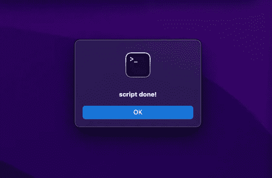

# 使用 Python 发送自定义 Mac 系统通知

> 原文：<https://betterprogramming.pub/custom-system-notifications-from-python-mac-5ff42e71214>

## 从正在运行的脚本添加状态通知警报和语音听写


照片由[布雷特·乔丹](https://unsplash.com/@brett_jordan?utm_source=medium&utm_medium=referral)在 [Unsplash](https://unsplash.com?utm_source=medium&utm_medium=referral) 上拍摄

在编码时，我们可能希望向用户提供进度或脚本终止的更新，这是很常见的。

对于在后台运行的程序来说尤其如此，这些程序在运行过程中可能会被遗忘。我

在本文中，我们讨论了向用户提供更新的三种方法:

*   弹出式系统通知/警报
*   系统发出嘟嘟声或声音
*   指定文本字符串的语音听写

# 苹果脚本提醒

在终端中，我们能够使用`osascript -e`标志执行苹果脚本命令。这允许我们生成一个与应用程序相关联的弹出窗口，并附带一条消息。我们告诉终端仿真器显示“脚本完成”的示例可以由以下内容提供:

```
tell application "Terminal" to display alert "script done!"
```

将这些放在一起意味着完整的命令变成:

```
osascript -e 'tell application "Terminal" to display alert "script done!"'
```



# 播放系统声音

接下来，我们可以播放系统声音，以防用户分心(或离开桌面)。可用的声音可以通过`ls /System/Library/Sounds/`找到，下面列出了一些常见的声音:

```
ls /System/Library/Sounds/Basso.aiff 
Frog.aiff
Hero.aiff 
Pop.aiff
Submarine.aiff
Blow.aiff
Funk.aiff
Morse.aiff 
Purr.aiff 
Tink.aiff
Bottle.aiff 
Glass.aiff 
Ping.aiff 
Sosumi.aiff
```

一旦我们选择了一个声音(如潜艇)，我们可以使用`afplay`播放它:

```
afplay /System/Library/Sounds/Submarine.aiff
```

# 口述信息

苹果电脑也有一个非常简单的语音听写工具，可以从终端使用。例如，在这里，如果我们想要宣布“脚本已经成功执行”，我们可以如下使用`say`命令:

```
say “The script has been executed successfully”
```

# 用 Python 把它们放在一起

最后，我们构建了一个简单的 Python*脚本，能够在系统调用时执行上述命令。

为了确保我们不中断脚本，我们要么需要使用非阻塞系统调用，要么运行苹果脚本，并在后台使用`&`符号说出命令。

同样，为了方便起见，我们将所有的函数包装成一个带有“end”属性的 Alerts 类，允许在程序的最后调用中使用无括号的方法(因为这很可能是最常见的用法)

**注意，这可以通过任何编程语言来完成，但是在撰写本文时，我最需要的是 Python*

## 使用

如何使用该类的示例可以在“usage_example”函数中看到。本质上，我们保存上面的代码，并从导入 Alerts 类开始

```
from mac_notify import Alerts
```

接下来，我们初始化该类，并使用所需的函数:

```
info = Alerts()info.notify('This is a notification')
```

# 结论

我们探索了三种方法来通知用户程序中的检查点(如果他们使用 mac 的话)。接下来，我们创建了一个 python 脚本，可以替换到我们的脚本中。

如果我们的用户使用的是 Linux 机器，那么我们可以查看`libnotify`和`notify-send`来获取通知，查看`gTTS`来获取语音听写。