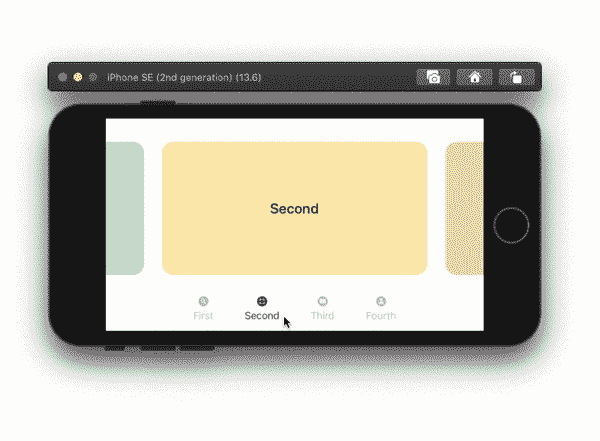
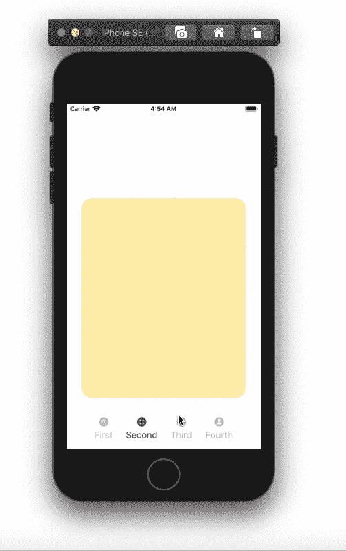

# SwiftUI 中的自定义选项卡视图

> 原文：<https://betterprogramming.pub/custom-tab-views-in-swiftui-6ef06bf2db73>

## 使用@ViewBuilder 构建自定义选项卡视图

# @ViewBuilder

首先，为保存选项卡的容器创建一个结构。该结构将属于视图类型。为了将标签传递给容器，我们需要一个保存标签的参数。这个参数将是内容。它属于符合视图的内容类型。通常，标签会有图标图像，它们可能没有标题。因此，我们可以选择我们的标题。创建一个 init 并确保在内容参数之前有参数属性`[@ViewBuilder](http://twitter.com/ViewBuilder)`。这将允许我们为一些子视图提供一个闭包。

# 内容修饰符

我们将所有的标签放在一个`HStack`中。创建一个`HStack`，并添加我们的内容常量。通过添加`GeometryReader`并使用其几何尺寸宽度值，调整框架以覆盖父视图的整个宽度。给`HStack`以下修饰符:

*   `offset`:用于通过偏移 *x* 在标签之间移动。
*   `animation`:当滑动手势不够有力时，使用交互式弹簧动画使选项卡弹回原位。
*   `gesture`:使用`DragGesture`可以在标签之间滑动。创建手势状态和索引变量。使用`updating`和`onEnded` `DragGesture`修改器获取滑动位置并偏移内容。

如果你想让较弱的滑动手势工作，添加一个`weakGesture`变量，并根据你的喜好调整它的值。然后将其添加到`offset`常量中。

# 选项卡图像和标题

将内容的`HStack`嵌入到`VStack`中的`GeometryReader`中。在我们内容的`HStack`下，为我们的标签按钮添加另一个`HStack`。使用`ForEach`在所有图像之间迭代，并将它们添加到按钮。检查标题是否为空，并将它们添加到`VStack`内的同一个按钮中。使用`Spacer()`添加按钮之间的动态间距。

# 内容视图

在我们的`ContentView`里，可以试试我们的`TabsContainer`。创建标题和图像传递给我们的`TabsContainer`。有一个`ZStack`，将其内容底部对齐。使用颜色添加到`ZStack`。这将确保我们的`ZStack`和我们的父视图一样宽一样高。创建你的标签结构，并将它们添加到我们的容器中。对于本教程，我有四个`RoundedRectangle`形状作为我的内容。

自定义选项卡

全部完成！感谢阅读。