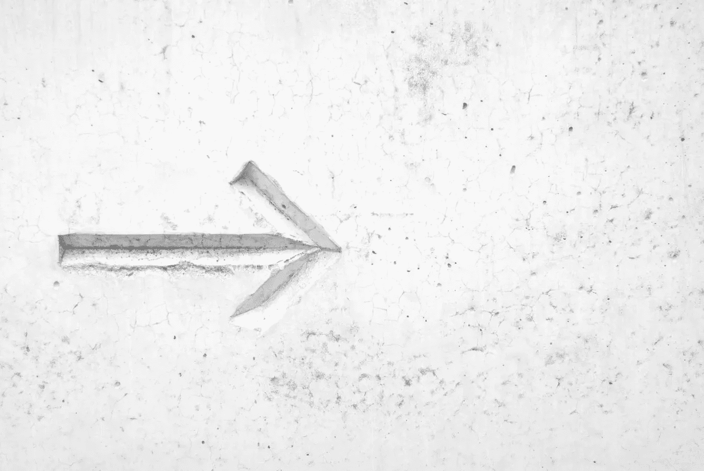
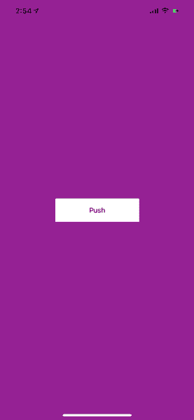

# 为 iOS 构建自定义过渡动画

> 原文：<https://betterprogramming.pub/custom-transition-animation-ios-f1bb57686293>

照片由[你好我是 Nik](https://unsplash.com/@helloimnik) 在 [Unsplash](https://unsplash.com/photos/MAgPyHRO0AA)

我们都想给我们的视图控制器转换添加一些 swwoooosshhhh，对吗？内置的过渡动画工作，但他们看起来很无聊。我妈妈总是告诉我，如果我用心去做，我可以做任何事情，所以现在我告诉你:你可以更好地完成这个转变。

# 入门指南

点击下载启动项目[。](https://www.dropbox.com/s/4n0fbogr1pf0cpw/Custom%20Transition.zip?dl=0)

如果你建造并运行。你会看到一个应用程序，它被创建来反映默认过渡动画的简单优雅。继续点击几次“按压”和“弹出”按钮。我们将通过重新创建默认的 push 和 pop `UINavigationController`动画来做得更好。您可以据此创建自己的精彩过渡动画。

让我给你介绍一下主要玩家…

# UIViewControllerTransitioningDelegate

在 iOS 中，您可以通过实现自定义的`UIViewControllerTransitioningDelegate`来编写视图控制器之间的自定义过渡。首先，我们必须创建一个将实现`UIViewControllerTransitioningDelegate`协议的新对象。

既然提到的协议符合`NSObjectProtocol`，我们的 animator 对象也必须符合它。实现这一点最简单的方法就是简单地从`NSObject`那里继承。`UIViewControllerTransitioningDelegate` 需要两种方法，你可以在上面看到:

1.  `animationController(forPresented presented: …)` :该方法负责演示动画。
2.  `animationController(forDismissed dismissed: …)`:这个方法负责辞退动画。

但是这些函数只是负责转场，而不是动画本身。为此，我们必须实现负责这个自定义动画的自定义类。该课程将让我们定义我们想要的动画(效果)。

这是动画中的幻灯片。我将解释每个步骤:

1.  我们正在设定过渡期的持续时间。
2.  这就是奇迹发生的地方——这就是我们将编写自定义动画的地方。
3.  我们去拿控制器。我们要去(`toViewController`)，而`fromViewController`是我们要去的控制器。
4.  获取屏幕的边界。
5.  将`toViewController`视图添加到上下文`containerView`中。
6.  从上下文中获取过渡的持续时间，这样我们就可以用它来设置动画的持续时间。
7.  通过将`fromViewController`推到窗口的左侧来表演幻灯片动画魔术。
8.  完成过渡。

现在更新`animationController(forPresented presented:…)` 返回`SlidePushAnimation()`。

我们需要对此进行测试，因此将`FirstViewController`中的代码改为以下代码:

现在构建并运行应用程序。

干杯！🍻🍺

好了，现在我们需要制作`POP`动画。我们需要为这个动画创建另一个自定义的`UIViewControllerAnimatedTransitioning`类。

现在更新`animationController(forDismissed dismissed:…)` 返回`PopAnimation()`。

`PopAnimation`类与`SlidePushAnimation`非常相似。唯一的区别是变换动画不同。

# 结论

没那么复杂吧？用一种非常简单的方式，我们创建了一个自定义的“推-放”过渡动画。您可以轻松地调整这一点，并编写更好的自定义过渡动画。

Apple 参考文档:[https://developer . apple . com/library/archive/features ticles/ViewControllerPGforiPhoneOS/customizingthetransitionanimations . html](https://developer.apple.com/library/archive/featuredarticles/ViewControllerPGforiPhoneOS/CustomizingtheTransitionAnimations.html)