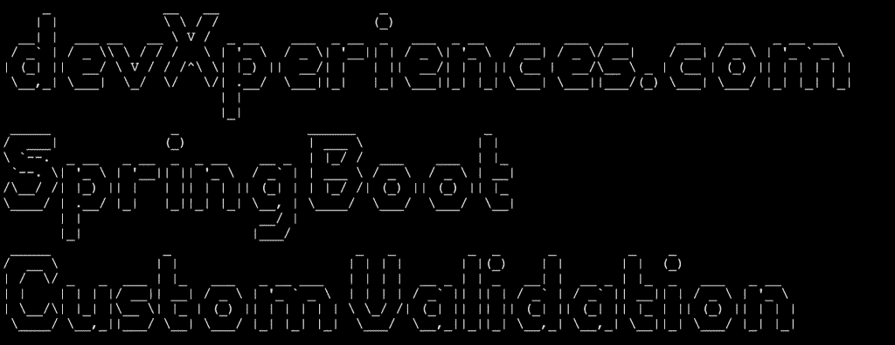
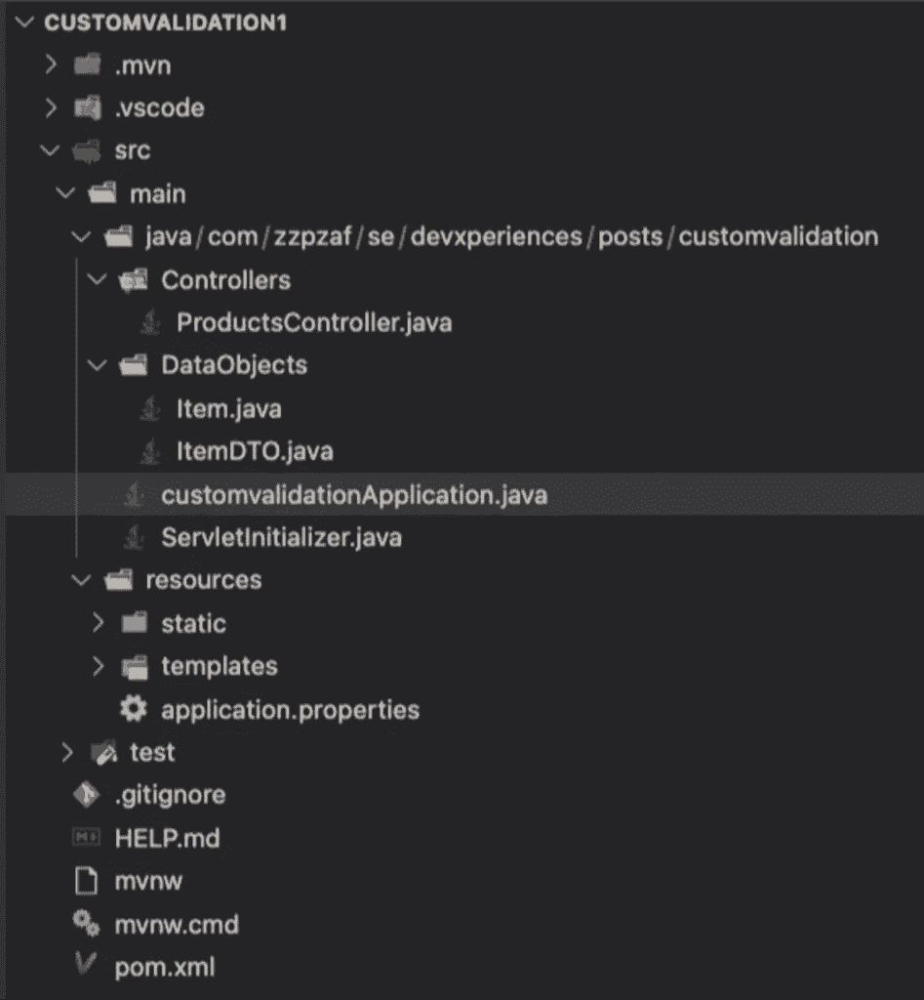
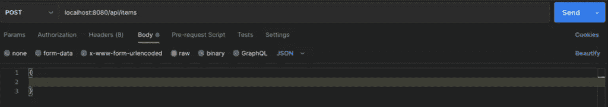
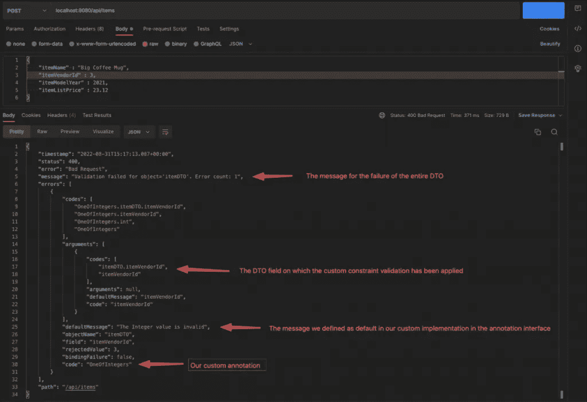
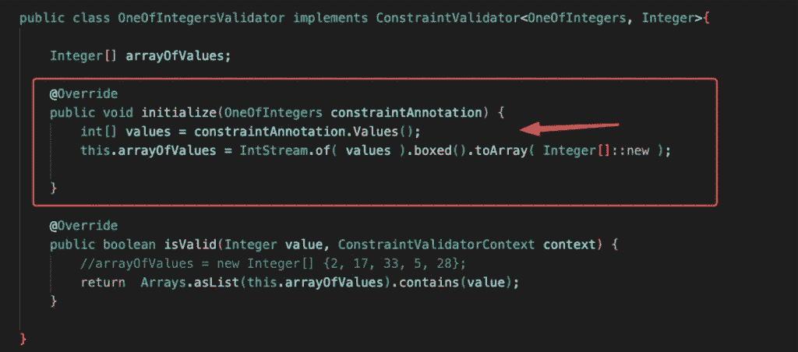
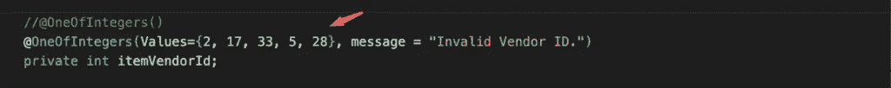
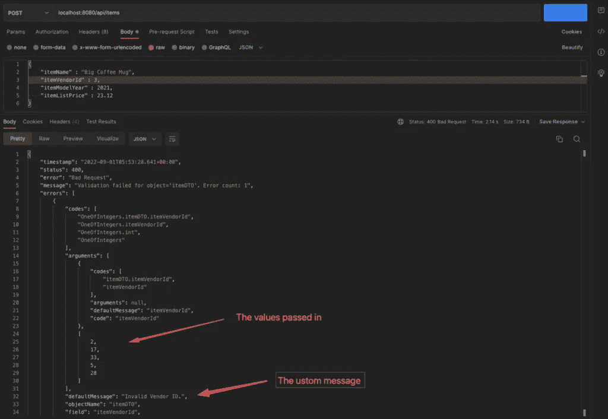
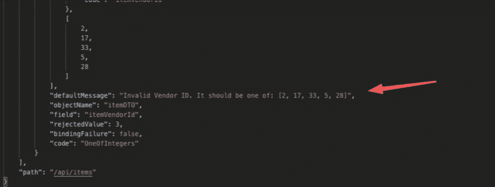

# 通过案例解释 Spring Boot 的自定义验证，第 1 部分

> 原文：<https://betterprogramming.pub/custom-validation-in-spring-boot-best-explained-part-1-1105a8c2711>

## 探索用数组进行验证等等

Ralf Skirr 在 [Unsplash](https://unsplash.com?utm_source=medium&utm_medium=referral) 上拍摄的照片|图像高度改变

# 介绍

[Spring Boot](https://spring.io/projects/spring-boot) 是一个成熟的框架，拥有过多的模块和特性。因此，在 REST API 应用程序中，不能错过 JSON 主体中的数据验证。所提供的可能性超越了丰富的“现成”注释集，允许我们定义自己的验证检查，这些检查也可以涉及字段的组合(JSON 键)。

在本文中，我们关注一个常见的情况——当我们必须检查 post 请求主体中传递的 JSON 字段中的值是否是我们定义的数组中提供的值之一。想象一下，我们必须检查一个 JSON 字段中的城市是否真正属于那个国家的城市数组。如果城市与数组中的任何城市都不匹配，那么它就不属于那个国家，因此请求(例如 POST 请求)应该失败。

类似地，我们可以考虑如何根据产品来验证成分，根据它所属的主要类别来验证特定的子类别，等等。

## 先决条件

您应该熟悉以下内容:

*   [Spring Boot](https://spring.io/guides/gs/spring-boot/) 发展
*   [REST API](https://spring.io/guides/tutorials/rest/)
*   [Maven](https://maven.apache.org/what-is-maven.html) 依赖管理
*   [POM](https://maven.apache.org/guides/introduction/introduction-to-the-pom.html) 文件
*   [JSON](https://www.json.org/json-en.html)
*   弹簧注释
*   DTO
*   [应用属性](https://docs.spring.io/spring-boot/docs/current/reference/html/application-properties.html)
*   如何使用 [JDBC](https://spring.io/guides/gs/relational-data-access/) 、 [JdbcTemplate](https://docs.spring.io/spring-framework/docs/current/javadoc-api/org/springframework/jdbc/core/JdbcTemplate.html) 等连接到数据库。

如果你愿意，你可以访问[这篇文章](https://www.devxperiences.com/pzwp1/2022/05/22/quick-intro-to-rest-api-development-with-spring-boot/#mysql-real-database-restapi)，它提供了关于如何开始使用 Spring Boot、JDBC 和 MariaDB 数据库来构建一个基本的 REST API 的非常基本的介绍。

为了您的方便，我们提供了 GitHub repos。您可以将它们作为本文中每个案例的起点。

# Hibernate 验证程序依赖项

这里我们将使用 [Hibernate Validator engine](https://hibernate.org/validator/documentation/getting-started/) 依赖项(当我们使用[spring-boot-starter-validation](https://mvnrepository.com/artifact/org.springframework.boot/spring-boot-starter-validation)时，它也是一个编译的依赖项)。

因此，在我们的项目`pom.xml`文件中，我们必须包含它，如下所示:

Hibernate validator 为我们提供了一个很长的内置验证约束列表，由 [Jakarta Bean Validation](https://beanvalidation.org/) 规范和其他附加约束定义。这些限制包括以下几类:

*   字段约束
*   属性约束
*   容器元素约束
*   类别约束

特别是对于内置的字段验证约束(所有字段约束都在 Jakarta Bean 验证 API 中指定)，您可以在这里找到完整的列表。

# 准备妥当

## 自定义验证的简短介绍

定义自定义约束验证主要包括为注释和验证器实现类创建一个自定义验证接口，它实际上实现了验证。

## 注释验证接口(约束注释)

使用`@interface`关键字定义注释类型。注释接口的名称定义了注释本身，我们可以用它来进行验证(例如，在字段、bean 或 DTO 中，或者在请求查询参数中)。在注释界面中，我们还可以定义一些其他参数:

*   目标(我们说过，`FIELD`，`PARAMETER`，`CLASS`等)。)
*   保留策略
*   真正的行动——验证类
*   可以/应该与批注一起传递的值
*   验证失败时将返回的默认消息

## 验证器实现类

验证器实现类(按照惯例，通常与接口名同名)应该实现 Jakarta Bean 验证 [ConstraintValidator](https://docs.oracle.com/javaee/7/api/javax/validation/ConstraintValidator.html) 接口。

`ConstraintValidator`接口接受两个参数:注释接口和字段的类型(对象)或者它应该附加的参数。

`ConstraintValidator`接口的实现包括它定义的两个默认方法的实现:应该被覆盖的`[initialize()](https://docs.oracle.com/javaee/7/api/javax/validation/ConstraintValidator.html#initialize-A-)`和`[isValid()](https://docs.oracle.com/javaee/7/api/javax/validation/ConstraintValidator.html#:~:text=boolean-,isValid,-(T%C2%A0value%2C%20ConstraintValidatorContext)`方法。最后一个是做实际工作的，它返回一个布尔值，它应该总是返回:`true`(验证成功)或`false`(验证不成功)。

如果你想更深入地创建自定义约束，你可以访问官方链接[这里](https://docs.jboss.org/hibernate/stable/validator/reference/en-US/html_single/#validator-customconstraints)。

现在是时候继续我们的实现案例了。

在第 1 部分中，我们将看到一个用固定/静态数据创建自定义验证的例子(案例 1)。我们将实际验证一个整数，它应该是一组预定义的整数值中的一个值(在一个整数数组中)。

在下一部分(第 2 部分)，我们将继续一个例子(案例 2)，为两个 JSON 字段(“master-details”)的组(组合)创建一个定制验证。但是这一次，我们将通过一个简单的存储库使用数据库表(MariaDB)提供的“动态数据”。注意，我们将只通过 JdbcTemplate 使用原始 SQL 和 JDBC，而不使用任何 ORM(没有 JPA/Hibernate，等等)。).

# 案例 1:应该匹配给定数组中的一个值的整数自定义验证

## 问题是

假设您想要控制和验证一个特定的整数值，既不使用`@Range`也不使用`@Min` / `@Max`内置的 Hibernate 约束验证器。但是你想要的是只允许一个，可以是数组中的任意整数。例如，您想检查 JSON 字段值中传递的整数是否是数组:`{2, 17, 33, 5, 28}`中的整数之一。

## 项目回购

您可以随时使用您的 Spring Boot 项目，但是为了方便起见，您可以使用我的 GitHub repo。所以，去 GitHub 抓取/克隆我的[开始回购](https://github.com/zzpzaf/customvalidation1)或者下载[。zip](https://github.com/zzpzaf/customvalidation1/archive/f2ba3dfc275999559342a3b8ef9cba7184b1f91d.zip) 文件，然后在这里使用它。

这只不过是一个非常简单的 REST API，公开了一个名为“api/items”的端点，包含所有常用的 CRUD 操作:GET、POST、PUT、DELETE。这个项目只包含一个`Controller`、一个`Item`类和数据传输对象(DTO): `ItemDTO`类。

文件夹结构如下所示:

出于演示的目的，我们在`Controller`中有一个`Item`对象的预定义列表(`ArrayList`)。为了简单起见，我们不使用单独的服务、存储库或持久数据库。

我们将继续使用`ItemDTO`类来验证它的属性/字段，在这种情况下使用我们的自定义验证。

一个`Item`对象由几个属性/字段组成，ItemDTO 拥有除`itemId`之外的所有属性/字段。您可以自己浏览上述类中的简单代码。

正如您在下面看到的，我们已经使用了一些内置的验证约束。

这些是:

`@NotNull`、`@Range`、`@Positive`和`@Digits`分别用于属性`itemName`、`itemModelYear`和`itemListPrice`。注意，Hibernate 为每个注释提供了默认消息。然而在上面，我们用我们自己的。

然后，我们可以在任何请求中使用`@Valid`注释来强制 Spring 验证它们。下面，我们用它来处理`ProductsController`中的一个`POST`请求:

## 测试到目前为止的验证

使用 [Postman](https://learning.postman.com/docs/getting-started/introduction/) ，我们可以尝试发送一个带有空 JSON 主体的 POST 请求，

并查看我们得到的所有错误消息，如下所示:

> 请注意，消息的响应结构是默认提供的，因为我们在这里没有使用任何定制的错误处理。

# 自定义验证的实现

我们还没有使用任何约束验证的唯一属性/字段是`itemVendorId`，正如您所猜测的，这是我们这里自定义验证的目标。

让我们将我们的自定义注释命名为`OneOfIntegers`。因为我们想保持我们的项目结构良好，我们可以创建一个新的项目文件夹/包，命名为"`alidators",`，并在其中创建`OneOfIntegers`注释接口。

`OneOfIntegers`约束标注界面如下:

该接口可以用许多元注释进行注释。下面是我们在这里使用的内容的简短说明:

*   `@Target`元注释定义了注释目标将使用的元素类型。在我们的例子中，这个注释的目的是与字段(例如，dto 的字段或属性)和/或参数(通过端点 URL 传递的字符串查询参数)一起使用。
*   `@Retention`元注释定义了我们的注释将通过反射在运行时可用。
*   `@Documented`元注释定义了我们的注释将包含在用它注释的元素的 JavaDoc 中。
*   并且`@Constraint(validated by…)`元注释定义了应该用来执行验证的实际工作的类。在我们的例子中，这是`OneOfIntegersValidator`类(下面，你会看到它的方法之一是`isValid`布尔方法，它返回`true`或`false`)。

除了上述内容，我们还必须提供以下三个强制属性:

*   `Message`属性返回作为默认错误消息提供的字符串。如您所见，这里的消息是“整数值无效”我们还可以为注释字段提供一个定制消息，它可以像内置约束验证一样应用:`itemName`、`itemModelYear`和`itemListPrice` 字段。(我们稍后会看到)。
*   `Group`属性，如果注释属于一组注释，我们可以定义这个属性。默认应该是一个类型为`Class<?>`的空数组。
*   属性可以用来为我们的约束定义定制的有效负载对象。默认也应该是一个类型为`Class<?>`的空数组。

下面也给出了`OneOfIntegersValidator`约束验证器类:

约束验证器应该实现`ConstraintValidator`接口，并将约束注释接口— `OneOfIntegers`作为参数传递给它。它还将使用这个接口作为将要应用约束的字段或参数的类型(在我们的例子中，这是一个整数)。

我们要做的是覆盖/实现`isValid()`方法，该方法返回一个布尔值，即`true`表示验证成功，或者`false`表示验证不成功。

然后，我们必须使用一个整数数组来保存我们可接受的值，在我们的例子中是`{2, 17, 33, 5, 28}`。最后，我们检查传入的整数值是否包含在该数组中，并返回`true`或`false`。最后，我们准备在我们的 DTO 类(`itemDTO.java`)中注释`itemVendorId`字段:

就是这样！让我们通过邮递员测试一下。这次我们在 POST 请求中使用 JSON body 对象。`vendorId`的值为`3`，因此我们预计验证不会成功。

如你所见，这是不成功的。正如我们所料。

# 丰富

到目前为止，一切顺利。然而，在我们的自定义验证器中使用固定数组并不是一个好方法，因为我们总是针对同一个数组来验证任何 DTO 中的任何其他字段。幸运的是，我们可以尽快修好它。

首先，我们必须通知我们的自定义验证接口，我们将在自定义注释中使用一个整数值数组。我们通过将名为`Values`的属性定义为整数数组来实现这一点。

下面是我们的自定义注释界面的外观:

之后，我们必须将带有值的整数数组放入我们的自定义验证器。为此，我们必须覆盖/实现`ConstraintValidator`接口的 initialize()方法。这个方法将 annotation 接口作为一个参数，这样，我们就可以访问传入的值(整数数组)。

自定义验证程序发生变化，如下所示:

干得好！现在我们可以在`ItemDTO`的`itemVendorId`字段上使用带有自定义注释的示例整数数组(或者我们想要的任何其他数组)。它看起来像下面这样:

之后可以用 Postman 测试一下:

我们可以做的最后一项改进是使用 Hibernate 提供的[消息插值](https://beanvalidation.org/2.0/spec/#validationapi-message)功能，并在我们的自定义消息中显示数组值。它看起来是这样的:

这是我们得到的(通过邮递员):

当您决定使用自定义错误消息处理时，这可能会很有用。

就是这样！你可以在这里下载这个例子[的最终代码。](https://github.com/zzpzaf/customvalidation1/archive/2582faf59bcafe850c2792941f28158e760966f3.zip)

您可以在这里找到第 2 部分:

 [## 通过案例解释 Spring Boot 的自定义验证，第 2 部分

### 案例 2——使用数据库实现“主-细节”验证

better 编程. pub](/custom-validation-in-spring-boot-best-explained-part-2-f99bfb4e66a4)